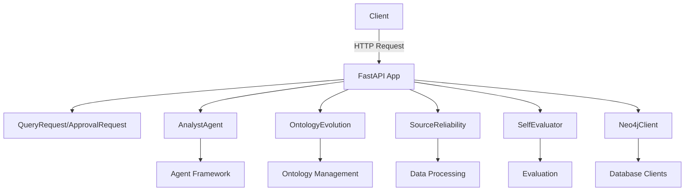

# KRONOS API Layer Documentation

## Overview

The **API Layer** serves as the primary interface for interacting with the KRONOS self-evolving knowledge infrastructure. It exposes RESTful endpoints to query the knowledge graph, manage ontology evolution, assess source reliability, and retrieve system status. The API integrates with multiple subsystems, including the `agent_framework`, `ontology_management`, `memory_systems`, and `evaluation` modules, to provide a unified experience for knowledge retrieval and system management.

This documentation provides a comprehensive guide to the API's architecture, endpoints, and interactions with other modules.

---

## Table of Contents

1. [Architecture](#architecture)
2. [Core Components](#core-components)
3. [Endpoints](#endpoints)
4. [Dependencies](#dependencies)
5. [Data Flow](#data-flow)
6. [Error Handling](#error-handling)
7. [Integration with Other Modules](#integration-with-other-modules)
8. [References](#references)

---

## Architecture

The API Layer is built using **FastAPI**, a modern Python web framework for building APIs. It follows a modular design, with each endpoint encapsulating a specific functionality while delegating complex operations to specialized agents and clients.

### High-Level Architecture Diagram



---

## Core Components

### 1. `api/main.py::ApprovalRequest`

A **Pydantic model** representing the request body for ontology approval/rejection operations.

**Fields:**
- `key` (str): The unique identifier for the ontology proposal.
- `canonical` (str, optional): The canonical form of the relation type.
- `category` (str, optional): The category of the relation type.

**Usage:**
Used in the `/ontology/approve` and `/ontology/reject` endpoints to validate incoming requests.

---

### 2. `api/main.py::QueryRequest`

A **Pydantic model** representing the request body for querying the knowledge graph.

**Fields:**
- `question` (str): The question to ask KRONOS.

**Usage:**
Used in the `/query` endpoint to validate and process user queries.

---

### 3. FastAPI Application (`api/main.py::app`)

The **main FastAPI application** instance, configured with:
- Title: `KRONOS API`
- Description: `Self-evolving knowledge infrastructure`
- Version: `0.1`

**Lifecycle Events:**
- `startup`: Initializes global instances of `AnalystAgent`, `Neo4jClient`, `OntologyEvolution`, `SourceReliability`, and `SelfEvaluator`.
- `shutdown`: Closes connections to `AnalystAgent` and `Neo4jClient`.

---

## Endpoints

### 1. `/query` (POST)

**Description:**
Ask KRONOS a question and receive a hybrid graph + vector answer with sources and conflicts.

**Request Body:**
```json
{
  "question": "What are the latest developments in AI?"
}
```

**Response:**
- Returns the result of the query processed by the `AnalystAgent`.

**Error Handling:**
- Returns `400 Bad Request` if the `question` is empty.

**Dependencies:**
- [`agent_framework::AnalystAgent`](agent_framework.md)

---

### 2. `/status` (GET)

**Description:**
Retrieve a snapshot of the current graph health, including:
- Total entities
- Total relationships
- Average confidence score

**Response:**
```json
{
  "total_entities": 1234,
  "total_relationships": 5678,
  "avg_confidence": 0.95
}
```

**Dependencies:**
- [`database_clients::Neo4jClient`](database_clients.md)

---

### 3. `/digest/latest` (GET)

**Description:**
Retrieve the most recent Curator digest from the `logs/` directory.

**Response:**
```json
{
  "filename": "digest_20231201.md",
  "content": "..."
}
```

**Error Handling:**
- Returns `404 Not Found` if no digests are available.

---

### 4. `/ontology/pending` (GET)

**Description:**
Retrieve relation types awaiting human approval.

**Response:**
```json
[
  {
    "key": "RELATION_TYPE_1",
    "proposal": "..."
  }
]
```

**Dependencies:**
- [`ontology_management::OntologyEvolution`](ontology_management.md)

**Note:**
For the CLI review flow, see `scripts/review_ontology.py`.

---

### 5. `/ontology/approve` (POST)

**Description:**
Approve an ontology proposal.

**Request Body:**
```json
{
  "key": "RELATION_TYPE_1",
  "canonical": "canonical_relation",
  "category": "category_1"
}
```

**Response:**
```json
{
  "status": "approved",
  "key": "RELATION_TYPE_1"
}
```

**Error Handling:**
- Returns `404 Not Found` if the proposal does not exist.

**Dependencies:**
- [`ontology_management::OntologyEvolution`](ontology_management.md)

---

### 6. `/ontology/reject` (POST)

**Description:**
Reject an ontology proposal.

**Request Body:**
```json
{
  "key": "RELATION_TYPE_1"
}
```

**Response:**
```json
{
  "status": "rejected",
  "key": "RELATION_TYPE_1"
}
```

**Error Handling:**
- Returns `404 Not Found` if the proposal does not exist.

**Dependencies:**
- [`ontology_management::OntologyEvolution`](ontology_management.md)

---

### 7. `/conflicts` (GET)

**Description:**
Retrieve all active `CONFLICTS_WITH` edges in the graph.

**Response:**
```json
[
  {
    "entity": "Entity A",
    "type": "Type A",
    "doc1": "source_doc_1",
    "doc2": "source_doc_2"
  }
]
```

**Dependencies:**
- [`database_clients::Neo4jClient`](database_clients.md)

---

### 8. `/sources/reliability` (GET)

**Description:**
Retrieve reliability scores for all source documents, based on contradiction outcomes.

**Response:**
```json
{
  "source_doc_1": 0.95,
  "source_doc_2": 0.87
}
```

**Dependencies:**
- [`data_processing::SourceReliability`](data_processing.md)

---

### 9. `/self-evaluation/recent` (GET)

**Description:**
Retrieve the most recent self-assessment results from KRONOS.

**Query Parameters:**
- `limit` (int, optional): Number of recent assessments to return. Default: `10`.

**Response:**
```json
[
  {
    "document": "doc_1",
    "score": 0.95,
    "feedback": "..."
  }
]
```

**Dependencies:**
- [`evaluation::SelfEvaluator`](evaluation.md)

---

## Dependencies

The API Layer depends on the following modules and components:

| Module | Component | Purpose |
|--------|-----------|---------|
| [`agent_framework`](agent_framework.md) | `AnalystAgent` | Processes user queries and retrieves answers from the knowledge graph. |
| [`ontology_management`](ontology_management.md) | `OntologyEvolution` | Manages ontology evolution and approval workflows. |
| [`data_processing`](data_processing.md) | `SourceReliability` | Tracks and calculates source document reliability. |
| [`evaluation`](evaluation.md) | `SelfEvaluator` | Provides self-assessment results for processed documents. |
| [`database_clients`](database_clients.md) | `Neo4jClient` | Interacts with the Neo4j graph database to retrieve graph stats and conflicts. |

---

## Data Flow

### Query Flow

```mermaid
diagram TD
    A[Client] -->|POST /query| B[FastAPI]
    B --> C[QueryRequest Validation]
    C --> D[AnalystAgent.query()]
    D --> E[Agent Framework]
    E --> F[Knowledge Graph Query]
    F --> G[Neo4jClient]
    G --> H[Return Result]
    H --> B
    B --> I[Client]
```

### Ontology Approval Flow

```mermaid
diagram TD
    A[Client] -->|POST /ontology/approve| B[FastAPI]
    B --> C[ApprovalRequest Validation]
    C --> D[OntologyEvolution.approve()]
    D --> E[Ontology Management]
    E --> F[Update Graph]
    F --> G[Return Success]
    G --> B
    B --> H[Client]
```

---

## Error Handling

The API Layer implements the following error-handling strategies:

1. **Validation Errors:**
   - Uses Pydantic models (`QueryRequest`, `ApprovalRequest`) to validate request bodies.
   - Returns `400 Bad Request` for invalid inputs.

2. **Resource Not Found:**
   - Returns `404 Not Found` for endpoints like `/digest/latest` and `/ontology/approve` when the requested resource does not exist.

3. **Graph Database Errors:**
   - Wrapped in try-catch blocks to ensure graceful failure and logging.

4. **Logging:**
   - Uses Python's `logging` module to log errors and system events.

---

## Integration with Other Modules

### Agent Framework

- **`AnalystAgent`:** Processes user queries and retrieves answers from the knowledge graph.
- **Dependencies:**
  - [`agent_framework::AnalystAgent`](agent_framework.md)

### Ontology Management

- **`OntologyEvolution`:** Manages ontology evolution and approval workflows.
- **Dependencies:**
  - [`ontology_management::OntologyEvolution`](ontology_management.md)

### Data Processing

- **`SourceReliability`:** Tracks and calculates source document reliability.
- **Dependencies:**
  - [`data_processing::SourceReliability`](data_processing.md)

### Evaluation

- **`SelfEvaluator`:** Provides self-assessment results for processed documents.
- **Dependencies:**
  - [`evaluation::SelfEvaluator`](evaluation.md)

### Database Clients

- **`Neo4jClient`:** Interacts with the Neo4j graph database to retrieve graph stats and conflicts.
- **Dependencies:**
  - [`database_clients::Neo4jClient`](database_clients.md)

---

## References

- [Agent Framework Documentation](agent_framework.md)
- [Ontology Management Documentation](ontology_management.md)
- [Data Processing Documentation](data_processing.md)
- [Evaluation Documentation](evaluation.md)
- [Database Clients Documentation](database_clients.md)

---

## Conclusion

The **API Layer** is a critical component of the KRONOS system, providing a unified interface for interacting with the self-evolving knowledge infrastructure. By integrating with specialized agents and clients, it enables users to query the knowledge graph, manage ontology evolution, assess source reliability, and retrieve system status. This documentation provides a comprehensive guide to its architecture, endpoints, and interactions with other modules.

For further details, refer to the linked documentation for each module.