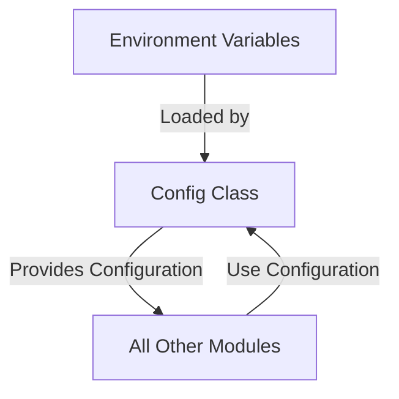
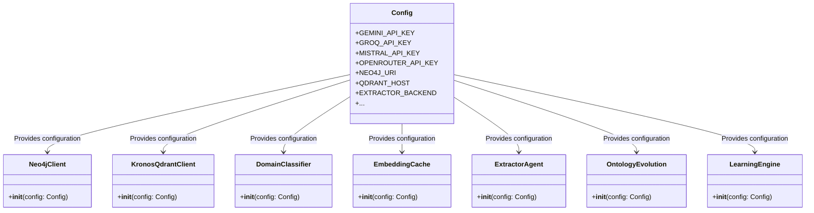

# Configuration Module Documentation

## Overview

The Configuration Module serves as the central hub for managing all system-wide settings, environment variables, and runtime configurations. It provides a unified interface to access configuration parameters across the entire application stack, ensuring consistency and maintainability.

This module is critical for:
- Managing API keys and service endpoints
- Configuring database connections
- Setting model parameters and routing strategies
- Defining file system paths and processing parameters
- Managing rate limits and quotas
- Establishing confidence thresholds for data processing

## Architecture

The Configuration Module follows a simple but effective architecture:



The module consists of a single `Config` class that encapsulates all configuration parameters. This class is instantiated once at application startup and its instance (`config`) is imported by other modules as needed.

## Core Components

### Config Class

The `Config` class in `core/config.py` is the primary component of this module. It provides:

- **Environment Variable Loading**: Uses `python-dotenv` to load configuration from `.env` files
- **Default Values**: Provides sensible defaults for all configuration parameters
- **Type Conversion**: Converts environment variables to appropriate data types
- **Centralized Access**: Single source of truth for all configuration parameters

#### Configuration Categories

The `Config` class organizes parameters into logical categories:

1. **API Keys**: Configuration for external AI service providers
2. **Database Connections**: Settings for Neo4j and Qdrant databases
3. **Local Model**: Configuration for local LLM inference
4. **File System Paths**: Paths for data storage and processing
5. **Model Routing**: Configuration for AI model routing and fallback strategies
6. **Rate Limiting**: API call rate limits and delays
7. **Embedding**: Configuration for text embedding models
8. **Graph Processing**: Parameters for graph-based data processing

## Configuration Parameters

### API Keys

| Parameter | Environment Variable | Default Value | Description |
|-----------|---------------------|---------------|-------------|
| `GEMINI_API_KEY` | `GEMINI_API_KEY` | None | API key for Google's Gemini models |
| `GROQ_API_KEY` | `GROQ_API_KEY` | None | API key for Groq's LLM services |
| `MISTRAL_API_KEY` | `MISTRAL_API_KEY` | None | API key for Mistral's LLM services |
| `OPENROUTER_API_KEY` | `OPENROUTER_API_KEY` | None | API key for OpenRouter's model aggregation service |

### Database Connections

| Parameter | Environment Variable | Default Value | Description |
|-----------|---------------------|---------------|-------------|
| `NEO4J_URI` | `NEO4J_URI` | `bolt://localhost:7687` | URI for Neo4j database connection |
| `NEO4J_USER` | `NEO4J_USER` | `neo4j` | Username for Neo4j authentication |
| `NEO4J_PASSWORD` | `NEO4J_PASSWORD` | `kronos_password` | Password for Neo4j authentication |
| `QDRANT_HOST` | `QDRANT_HOST` | `localhost` | Hostname for Qdrant vector database |
| `QDRANT_PORT` | `QDRANT_PORT` | `6333` | Port for Qdrant vector database |

### Local Model Configuration

| Parameter | Environment Variable | Default Value | Description |
|-----------|---------------------|---------------|-------------|
| `LOCAL_MODEL_URL` | `LOCAL_MODEL_URL` | `http://localhost:1234/v1` | URL for local LLM inference server |
| `LOCAL_MODEL_NAME` | `LOCAL_MODEL_NAME` | `qwen2.5-coder-14b-instruct` | Name of the local model to use |

### File System Paths

| Parameter | Environment Variable | Default Value | Description |
|-----------|---------------------|---------------|-------------|
| `INBOX_PATH` | `INBOX_PATH` | `data/inbox` | Path for incoming data files |
| `PROCESSED_PATH` | `PROCESSED_PATH` | `data/processed` | Path for processed data files |

### Model Routing Configuration

#### Extractor Configuration

| Parameter | Environment Variable | Default Value | Description |
|-----------|---------------------|---------------|-------------|
| `EXTRACTOR_BACKEND` | `EXTRACTOR_BACKEND` | `groq` | Primary backend for document extraction |
| `EXTRACTOR_GEMINI_MODEL` | `EXTRACTOR_GEMINI_MODEL` | `gemini-2.0-flash` | Model name for Gemini backend |
| `EXTRACTOR_GROQ_MODEL` | Hardcoded | `llama-3.3-70b-versatile` | Model name for Groq backend |
| `EXTRACTOR_GROQ_MODEL_FAST` | Hardcoded | `llama-3.1-8b-instant` | Fast model name for Groq backend |
| `EXTRACTOR_FALLBACK_MODEL` | `EXTRACTOR_FALLBACK_MODEL` | `mistral-small-2506` | Fallback model when primary backends are unavailable |
| `EXTRACTOR_LARGE_DOC_BACKEND` | `EXTRACTOR_LARGE_DOC_BACKEND` | `mistral` | Backend for processing large documents |

#### Other Model Configurations

| Parameter | Environment Variable | Default Value | Description |
|-----------|---------------------|---------------|-------------|
| `DOMAIN_MODEL` | `DOMAIN_MODEL` | `mistral-small-2506` | Model for domain classification |
| `ONTOLOGY_MODEL` | `ONTOLOGY_MODEL` | `mistral-small-2506` | Model for ontology management |
| `REFEREE_MODEL` | `REFEREE_MODEL` | `mistral-small-2506` | Model for evaluation tasks |
| `RECONCILER_BACKEND` | `RECONCILER_BACKEND` | `mistral` | Backend for reconciliation tasks |
| `RECONCILER_MODEL` | Hardcoded | `llama-3.3-70b-versatile` | Model for reconciliation tasks |
| `RECONCILER_MISTRAL_MODEL` | `RECONCILER_MISTRAL_MODEL` | `mistral-small-2506` | Mistral model for reconciliation tasks |
| `LIBRARIAN_MODEL` | Hardcoded | `llama-3.1-8b-instant` | Model for librarian tasks |
| `CURATOR_MODEL` | Hardcoded | `mistral-large-latest` | Model for curation tasks |
| `ANALYST_MODEL` | Hardcoded | `gemini-2.0-flash` | Model for analysis tasks |

### Smart Routing Thresholds

| Parameter | Environment Variable | Default Value | Description |
|-----------|---------------------|---------------|-------------|
| `GROQ_MAX_CHUNKS` | `GROQ_MAX_CHUNKS` | `250` | Maximum number of chunks to process with Groq backend |
| `EXTRACTOR_BATCH_SIZE` | `EXTRACTOR_BATCH_SIZE` | `3` | Batch size for document extraction |
| `ESTIMATED_TOKENS_PER_CHUNK` | `ESTIMATED_TOKENS_PER_CHUNK` | `1300` | Estimated tokens per document chunk |

### Rate Limiting

| Parameter | Environment Variable | Default Value | Description |
|-----------|---------------------|---------------|-------------|
| `GEMINI_RATE_LIMIT_DELAY` | `GEMINI_RATE_LIMIT_DELAY` | `1.0` | Delay between Gemini API calls (seconds) |
| `MISTRAL_RATE_LIMIT_DELAY` | `MISTRAL_RATE_LIMIT_DELAY` | `0.2` | Delay between Mistral API calls (seconds) |
| `GROQ_RATE_LIMIT_DELAY` | `GROQ_RATE_LIMIT_DELAY` | `0.0` | Delay between Groq API calls (seconds) |

#### Groq Rate Limits

| Parameter | Environment Variable | Default Value | Description |
|-----------|---------------------|---------------|-------------|
| `GROQ_RPM` | Hardcoded | `30` | Requests per minute for Groq |
| `GROQ_RPM_LARGE` | Hardcoded | `10` | Requests per minute for large documents in Groq |
| `GROQ_RPD` | Hardcoded | `14400` | Requests per day for Groq |

### Embedding Configuration

| Parameter | Environment Variable | Default Value | Description |
|-----------|---------------------|---------------|-------------|
| `EMBEDDING_MODEL` | Hardcoded | `all-MiniLM-L6-v2` | Name of the embedding model |
| `EMBEDDING_DIM` | Hardcoded | `384` | Dimensionality of the embedding vectors |

### Graph Processing Configuration

| Parameter | Environment Variable | Default Value | Description |
|-----------|---------------------|---------------|-------------|
| `CONFIDENCE_DECAY_RATE` | `CONFIDENCE_DECAY_RATE` | `0.05` | Rate at which confidence scores decay over time |
| `MIN_CONFIDENCE_THRESHOLD` | `MIN_CONFIDENCE_THRESHOLD` | `0.3` | Minimum confidence threshold for accepting data |

## Integration with Other Modules

The Configuration Module integrates with all other modules in the system. Here's how it connects with key modules:



### Database Clients

The database clients (`Neo4jClient` and `KronosQdrantClient`) use the configuration module to establish connections to their respective databases. See [database_clients.md](database_clients.md) for more details.

### Agent Framework

All agents in the `agent_framework` module use the configuration module to:
- Select appropriate AI models based on the task
- Configure rate limiting and API call delays
- Access API keys for external services

See [agent_framework.md](agent_framework.md) for more details about the agent framework.

### Data Processing

The data processing modules (`DomainClassifier`, `EmbeddingCache`, `SourceReliability`) use the configuration module to:
- Configure model parameters for their specific tasks
- Access embedding model configuration
- Set rate limits for API calls

See [data_processing.md](data_processing.md) for more details about data processing.

### Ontology Management

The ontology management modules (`OntologyEvolution`, `OntologyResolver`) use the configuration module to:
- Configure model parameters for ontology tasks
- Set confidence thresholds for graph processing

See [ontology_management.md](ontology_management.md) for more details about ontology management.

### Learning System

The learning system (`LearningEngine`) uses the configuration module to:
- Configure model parameters for learning tasks
- Set rate limits for API calls

See [learning_system.md](learning_system.md) for more details about the learning system.

### Memory Systems

The memory systems (`AliasMemory`, `EntityMemory`) use the configuration module to:
- Configure confidence thresholds for memory operations
- Access database connection parameters

See [memory_systems.md](memory_systems.md) for more details about memory systems.

### Evaluation

The evaluation module (`SelfEvaluator`) uses the configuration module to:
- Configure model parameters for evaluation tasks
- Set rate limits for API calls

See [evaluation.md](evaluation.md) for more details about evaluation.

## Usage Examples

### Basic Usage

```python
from core.config import config

# Access API keys
api_key = config.GROQ_API_KEY

# Access database configuration
db_uri = config.NEO4J_URI
db_user = config.NEO4J_USER
db_password = config.NEO4J_PASSWORD

# Access model configuration
extractor_backend = config.EXTRACTOR_BACKEND
embedding_model = config.EMBEDDING_MODEL
```

### Using Configuration in a Custom Class

```python
class MyCustomClass:
    def __init__(self):
        from core.config import config
        
        # Store configuration references
        self.config = config
        
        # Initialize with configuration values
        self.extractor_backend = config.EXTRACTOR_BACKEND
        self.max_chunks = config.GROQ_MAX_CHUNKS
        
    def process_document(self, document):
        # Use configuration values
        if self.extractor_backend == "groq":
            if len(document.chunks) > self.max_chunks:
                # Fallback to mistral for large documents
                self.extractor_backend = "mistral"
```

## Best Practices

1. **Environment Variables**: Always use environment variables for sensitive information like API keys. Never hardcode them in the source code.

2. **Default Values**: Provide sensible default values for all configuration parameters to ensure the system works out-of-the-box.

3. **Type Conversion**: Always convert environment variables to the appropriate data type (e.g., convert `QDRANT_PORT` to an integer).

4. **Centralized Access**: Import the `config` instance directly rather than creating new instances of the `Config` class.

5. **Documentation**: Keep configuration parameter documentation up-to-date as the system evolves.

6. **Validation**: Consider adding validation for critical configuration parameters to catch misconfigurations early.

7. **Modular Configuration**: For large systems, consider breaking the configuration into logical modules (e.g., database config, AI model config) rather than having a single monolithic `Config` class.

## Troubleshooting

### Common Issues

1. **Missing API Keys**: If API calls are failing, check that all required API keys are set in the environment variables.

2. **Database Connection Issues**: Verify that database connection parameters (URI, user, password) are correct and that the databases are running.

3. **Model Configuration Issues**: If models are not performing as expected, check that the correct model names are configured for each task.

4. **Rate Limiting Issues**: If API calls are being rate limited, check the rate limit configuration and adjust as needed.

### Debugging Configuration

```python
from core.config import config

# Print all configuration values
print("Configuration values:")
for attr in dir(config):
    if not attr.startswith('_'):
        print(f"{attr}: {getattr(config, attr)}")

# Check specific configuration values
print(f"\nGroq API Key set: {bool(config.GROQ_API_KEY)}")
print(f"Neo4j URI: {config.NEO4J_URI}")
print(f"Extractor Backend: {config.EXTRACTOR_BACKEND}")
```

## Future Enhancements

1. **Configuration Validation**: Add validation for critical configuration parameters to catch misconfigurations early.

2. **Configuration Hot Reloading**: Implement support for hot reloading configuration changes without restarting the application.

3. **Configuration UI**: Develop a web interface for managing configuration parameters.

4. **Configuration Profiles**: Support for different configuration profiles (e.g., development, staging, production).

5. **Configuration Encryption**: Add support for encrypting sensitive configuration parameters.

6. **Configuration Schema**: Define a schema for configuration parameters to ensure consistency and enable validation.

7. **Configuration Logging**: Add logging for configuration changes to aid in debugging and auditing.

## References

- [Database Clients Module](database_clients.md)
- [Agent Framework Module](agent_framework.md)
- [Data Processing Module](data_processing.md)
- [Ontology Management Module](ontology_management.md)
- [Learning System Module](learning_system.md)
- [Memory Systems Module](memory_systems.md)
- [Evaluation Module](evaluation.md)

## Appendix

### Environment Variables Reference

For convenience, here's a complete list of environment variables used by the system:

```
# API Keys
GEMINI_API_KEY
GROQ_API_KEY
MISTRAL_API_KEY
OPENROUTER_API_KEY

# Database Connections
NEO4J_URI
NEO4J_USER
NEO4J_PASSWORD
QDRANT_HOST
QDRANT_PORT

# Local Model
LOCAL_MODEL_URL
LOCAL_MODEL_NAME

# File System Paths
INBOX_PATH
PROCESSED_PATH

# Model Routing
EXTRACTOR_BACKEND
EXTRACTOR_GEMINI_MODEL
EXTRACTOR_FALLBACK_MODEL
EXTRACTOR_LARGE_DOC_BACKEND
DOMAIN_MODEL
ONTOLOGY_MODEL
REFEREE_MODEL
RECONCILER_BACKEND
RECONCILER_MISTRAL_MODEL

# Smart Routing Thresholds
GROQ_MAX_CHUNKS
EXTRACTOR_BATCH_SIZE
ESTIMATED_TOKENS_PER_CHUNK

# Rate Limiting
GEMINI_RATE_LIMIT_DELAY
MISTRAL_RATE_LIMIT_DELAY
GROQ_RATE_LIMIT_DELAY
```

### Default Model Configuration

| Task | Default Model | Fallback Model |
|------|---------------|----------------|
| Extraction | Groq (llama-3.3-70b-versatile) | Mistral (mistral-small-2506) |
| Domain Classification | Mistral (mistral-small-2506) | - |
| Ontology Management | Mistral (mistral-small-2506) | - |
| Evaluation | Mistral (mistral-small-2506) | - |
| Reconciliation | Mistral (mistral-small-2506) | - |
| Librarian | Llama 3.1 8B Instant | - |
| Curator | Mistral Large Latest | - |
| Analysis | Gemini 2.0 Flash | - |
```