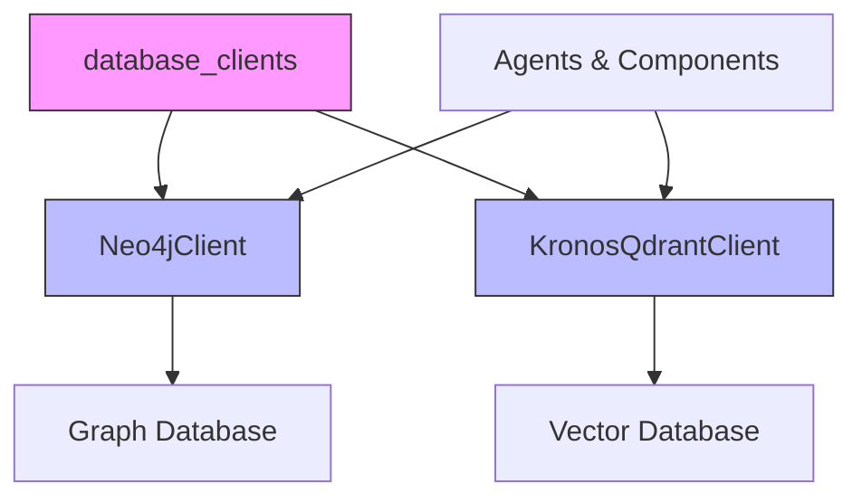
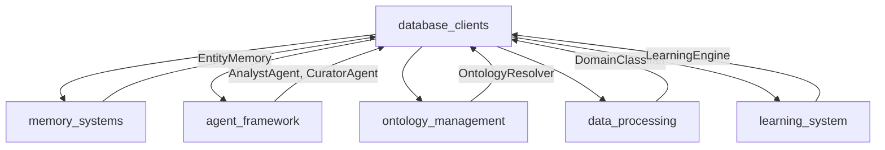

# Database Clients Module

This module provides database client implementations for interacting with Neo4j and Qdrant databases. These clients are essential for storing and retrieving structured data, entities, relationships, and embeddings used throughout the system.

## Overview

The `database_clients` module contains two primary database clients:

1. **Neo4jClient**: A client for interacting with a Neo4j graph database
2. **KronosQdrantClient**: A client for interacting with Qdrant vector database

These clients are used by various agents and components across the system to persist and query data in a structured way.

## Architecture



## Core Components

### Neo4jClient

The Neo4jClient provides an interface to a Neo4j graph database, which is used for storing and querying entities and their relationships.

**Key Features:**
- Entity management (create, update, query)
- Relationship management
- Domain-specific tagging
- Graph statistics
- Conflict detection

**Dependencies:**
- Uses the system configuration for database connection details
- Interacts with evidence_engine for merging and applying reinforcement to evidence

**Documentation:** See [Neo4j Client](database_clients_neo4j.md) for detailed information.

### KronosQdrantClient

The KronosQdrantClient provides an interface to a Qdrant vector database, which is used for storing and querying embeddings and semantic search.

**Key Features:**
- Vector storage and retrieval
- Semantic search with filtering
- Entity embedding storage
- Domain-aware similarity search
- Collection management

**Dependencies:**
- Uses SentenceTransformer for generating embeddings
- Relies on system configuration for database connection and model settings

**Documentation:** See [Qdrant Client](database_clients_qdrant.md) for detailed information.

## Integration with Other Modules

The database_clients module integrates with several other modules in the system:



### Memory Systems Integration
- The Neo4jClient is used by the EntityMemory and AliasMemory components to store and retrieve entities and their relationships.

### Agent Framework Integration
- Various agents (AnalystAgent, CuratorAgent, etc.) use the database clients to store and retrieve data relevant to their operations.

### Ontology Management Integration
- The OntologyResolver uses the database clients to store and query ontology information.

### Data Processing Integration
- Components like DomainClassifier use the vector database for semantic search and classification.

### Learning System Integration
- The LearningEngine may use the vector database to store and retrieve learned patterns.

## Data Flow

```mermaid
dataflow
    component Agents & Components
    component Neo4jClient
    component KronosQdrantClient
    database Graph Database
    database Vector Database
    
    Agents & Components -> Neo4jClient: Store/query entities & relationships
    Agents & Components -> KronosQdrantClient: Store/query embeddings
    Neo4jClient --> Graph Database: Persist data
    KronosQdrantClient --> Vector Database: Persist vectors
```

## Configuration

Both database clients rely on configuration settings defined in the system's configuration module:

- Neo4j connection settings (URI, user, password)
- Qdrant connection settings (host, port)
- Embedding model configuration
- Collection names and parameters

See the [configuration module documentation](configuration.md) for details on these settings.

## Usage Examples

### Using Neo4jClient

```python
from db.neo4j_client import Neo4jClient

# Initialize client
neo4j_client = Neo4jClient()

# Verify connection
if neo4j_client.verify_connection():
    print("Neo4j connection successful")

# Create or update an entity
neo4j_client.create_or_update_entity(
    name="Artificial Intelligence",
    type="Concept",
    source_doc="encyclopedia",
    confidence=0.95,
    properties={"description": "A field of computer science"},
    domain="Computer Science"
)

# Create a relationship
neo4j_client.create_relationship(
    from_name="Artificial Intelligence",
    from_type="Concept",
    to_name="Machine Learning",
    to_type="Concept",
    rel_type="RELATED_TO",
    source_doc="encyclopedia",
    confidence=0.85
)

# Close connection
neo4j_client.close()
```

### Using KronosQdrantClient

```python
from db.qdrant_client import KronosQdrantClient

# Initialize client
qdrant_client = KronosQdrantClient()

# Add chunks with embeddings
chunks = [
    {
        "text": "Artificial intelligence is transforming industries",
        "source_doc": "article1",
        "page": 1,
        "confidence": 0.9,
        "type": "chunk",
        "domain": "Technology"
    }
]
qdrant_client.add_chunks(chunks)

# Perform semantic search
results = qdrant_client.search(
    query="What is AI?",
    top_k=5,
    domain_filter="Technology"
)

# Store entity embedding
embedding = [...]  # Generated using SentenceTransformer
qdrant_client.upsert_entity_embedding(
    name="Artificial Intelligence",
    entity_type="Concept",
    embedding=embedding,
    domain="Technology"
)

# Find similar entities
similar_entity = qdrant_client.find_similar_entity_by_embedding(
    embedding=embedding,
    entity_type="Concept",
    domain="Technology",
    threshold=0.85
)
```

## Performance Considerations

1. **Connection Management**: Both clients manage their own connections and provide methods for proper cleanup.

2. **Batch Operations**: The clients support batch operations for efficient data loading.

3. **Indexing**: The Neo4jClient sets up appropriate indexes for performance-critical queries.

4. **Vector Search**: The KronosQdrantClient uses cosine distance for vector similarity, which is appropriate for most semantic search tasks.

5. **Domain Filtering**: Both clients support domain filtering to scope queries to specific domains, improving performance and relevance.

## Error Handling

Both clients include error handling for common database operations:

- Connection verification
- Schema setup
- Data validation
- Query execution

The clients log appropriate messages for debugging and monitoring purposes.

## Future Enhancements

Potential areas for future development:

1. **Connection Pooling**: Implement connection pooling for better performance under high load.

2. **Caching**: Add caching layers for frequently accessed data.

3. **Replication Support**: Add support for read replicas to improve scalability.

4. **Monitoring**: Enhance monitoring and metrics collection.

5. **Backup/Restore**: Add functionality for database backup and restore operations.

6. **Migration Tools**: Develop tools for schema migration and data migration between environments.