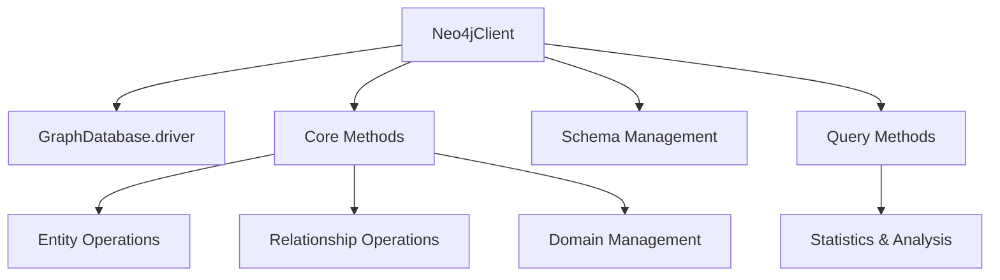
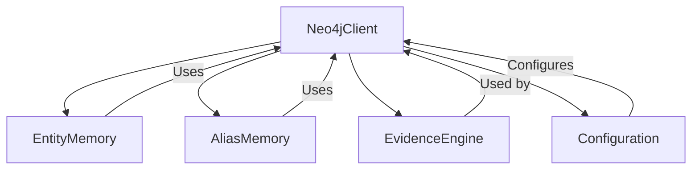
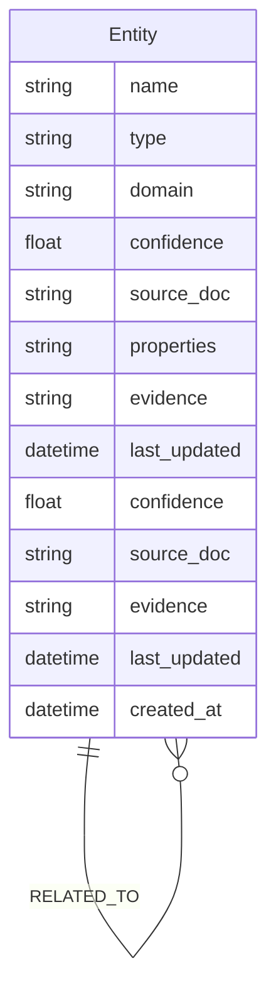

# Neo4j Database Client Module

## Overview

The `database_clients_neo4j` module provides a client interface for interacting with a Neo4j graph database. This module is part of the broader database clients system, which also includes a Qdrant client for vector search capabilities. The Neo4j client is primarily responsible for managing entities, relationships, and graph operations that form the core knowledge graph of the system.

This module is a critical component of the memory systems, particularly the `EntityMemory` and `AliasMemory` components, which rely on the graph database to store and retrieve structured knowledge about entities and their relationships.

## Architecture

The Neo4j client follows a simple architecture with a single main class (`Neo4jClient`) that encapsulates all database operations. The client connects to a Neo4j instance using the official Neo4j Python driver and provides methods for CRUD operations on entities and relationships.



## Core Components

### Neo4jClient

The main class that provides all database operations for the Neo4j graph database.

```python
from neo4j import GraphDatabase
from core.config import config
import logging
import re

logger = logging.getLogger(__name__)

class Neo4jClient:
    def __init__(self):
        self.driver = GraphDatabase.driver(
            config.NEO4J_URI,
            auth=(config.NEO4J_USER, config.NEO4J_PASSWORD)
        )
```

#### Key Features

1. **Connection Management**: Handles connection to the Neo4j database using configuration from the core system.

2. **Schema Management**: Provides methods to set up and maintain the database schema.

3. **Entity Operations**: Methods for creating, updating, and querying entities in the graph.

4. **Relationship Operations**: Methods for creating and managing relationships between entities.

5. **Domain Management**: Support for tagging entities with domains and querying by domain.

6. **Analysis Methods**: Provides statistical and analytical methods for understanding the graph structure.

## Integration with Other Modules

The Neo4j client integrates with several other modules in the system:



### EntityMemory

The `EntityMemory` component (see [memory_systems_entity_memory.md](memory_systems_entity_memory.md)) relies heavily on the Neo4j client for:
- Storing and retrieving entity information
- Managing entity relationships
- Handling entity domain information
- Querying entities based on various criteria

### AliasMemory

The `AliasMemory` component (see [memory_systems_alias_memory.md](memory_systems_alias_memory.md)) uses the Neo4j client for:
- Finding similar entities based on name matching
- Managing entity aliases and alternative names

### EvidenceEngine

The `EvidenceEngine` (part of the agent framework) is used by the Neo4j client for:
- Merging evidence from multiple sources
- Applying confidence reinforcement based on evidence

### Configuration

The Neo4j client uses the core configuration system (see [configuration.md](configuration.md)) for:
- Database connection parameters (URI, username, password)
- Other system-wide settings

## Data Model

The Neo4j client uses a property graph model with the following key elements:

### Entity Nodes

- **Labels**: `Entity` (base label) + domain-specific labels
- **Properties**:
  - `name`: The canonical name of the entity
  - `type`: The type/category of the entity
  - `domain`: The domain the entity belongs to (optional)
  - `confidence`: A confidence score for the entity (0-1)
  - `source_doc`: The source document that provided this entity
  - `properties`: A JSON string containing additional properties
  - `evidence`: A JSON string containing evidence for the entity
  - `last_updated`: Timestamp of the last update

### Relationships

- **Types**: Various relationship types based on the domain
- **Properties**:
  - `source_doc`: The source document that provided this relationship
  - `confidence`: A confidence score for the relationship (0-1)
  - `evidence`: A JSON string containing evidence for the relationship
  - `last_updated`: Timestamp of the last update
  - `created_at`: Timestamp of creation

### Indexes

The client sets up the following indexes for performance:
- `entity_confidence`: For efficient querying by confidence score
- `entity_timestamp`: For efficient querying by update time
- `entity_domain`: For efficient querying by domain



## Key Operations

### Entity Management

#### Creating/Updating Entities

```python
def create_or_update_entity(self, name: str, type: str,
                           source_doc: str, confidence: float,
                           properties: dict = {}, evidence: dict = None,
                           domain: str | None = None):
```

This method handles both creating new entities and updating existing ones. It:
1. Checks if an entity with the same name and type already exists
2. Merges evidence from multiple sources
3. Applies confidence reinforcement based on new evidence
4. Updates the entity with the latest information

#### Finding Similar Entities

```python
def find_similar_entity(self, name: str, type: str) -> dict | None:
```

This method finds entities that might be the same based on name similarity, handling common prefixes like "Dr.", "Prof.", etc.

### Relationship Management

#### Creating Relationships

```python
def create_relationship(self, from_name: str, from_type: str,
                       to_name: str, to_type: str,
                       rel_type: str, source_doc: str,
                       confidence: float, evidence: dict = None,
                       from_domain: str | None = None,
                       to_domain: str | None = None):
```

This method creates relationships between entities, handling:
1. Finding or creating the relationship
2. Merging evidence from multiple sources
3. Applying confidence reinforcement
4. Updating relationship properties

### Domain Management

#### Tagging Entities with Domains

```python
def tag_entity_domain(self, name: str, type: str, domain: str):
```

This method assigns a domain to an entity and creates a domain-specific label.

### Query Operations

#### Getting All Entities

```python
def get_all_entities(self, limit: int = 10000) -> list[dict]:
```

Returns all entities with properties needed to hydrate `EntityMemory`.

#### Finding Conflicting Entities

```python
def find_conflicting_entities(self, name: str, type: str):
```

Finds entities that might be duplicates based on name and type.

#### Getting Stale Entities

```python
def get_stale_entities(self, min_confidence: float):
```

Returns entities with confidence below a threshold, useful for cleanup.

#### Getting Graph Statistics

```python
def get_graph_stats(self):
```

Returns statistics about the graph including:
- Total number of entities
- Average entity confidence
- Total number of relationships

#### Getting Domain Statistics

```python
def get_domain_stats(self):
```

Returns statistics about entities grouped by domain.

## Schema Management

The client provides a method to set up the initial schema:

```python
def setup_schema(self):
```

This method:
1. Drops any existing constraints
2. Creates indexes for performance:
   - `entity_confidence` index on Entity.confidence
   - `entity_timestamp` index on Entity.last_updated
   - `entity_domain` index on Entity.domain

## Error Handling and Best Practices

1. **Connection Management**: The client properly manages database connections using context managers (`with` statements) to ensure connections are closed properly.

2. **Evidence Handling**: The client integrates with the `EvidenceEngine` to properly merge evidence from multiple sources and apply confidence reinforcement.

3. **Domain Handling**: The client provides methods for working with domains, including safe label generation for domain-specific entities.

4. **Performance**: The client uses indexes and efficient Cypher queries to ensure good performance even with large graphs.

## Configuration

The Neo4j client is configured through the core configuration system. The following configuration parameters are used:

- `NEO4J_URI`: The URI of the Neo4j database
- `NEO4J_USER`: The username for authentication
- `NEO4J_PASSWORD`: The password for authentication

See [configuration.md](configuration.md) for more details on configuration.

## Dependencies

The Neo4j client has the following dependencies:

1. **neo4j**: The official Neo4j Python driver
2. **core.config**: For accessing system configuration
3. **agents.evidence_engine**: For merging evidence and applying confidence reinforcement

## Example Usage

```python
from db.neo4j_client import Neo4jClient

# Initialize the client
neo4j_client = Neo4jClient()

# Verify connection
if neo4j_client.verify_connection():
    print("Successfully connected to Neo4j")

# Set up schema
neo4j_client.setup_schema()

# Create or update an entity
neo4j_client.create_or_update_entity(
    name="John Doe",
    type="Person",
    source_doc="document1.pdf",
    confidence=0.95,
    properties={"age": 35, "occupation": "Engineer"},
    evidence={"source": "document1.pdf", "page": 5},
    domain="Technology"
)

# Create a relationship
neo4j_client.create_relationship(
    from_name="John Doe",
    from_type="Person",
    to_name="Acme Corp",
    to_type="Organization",
    rel_type="WORKS_AT",
    source_doc="document1.pdf",
    confidence=0.9,
    evidence={"source": "document1.pdf", "page": 5}
)

# Get all entities
entities = neo4j_client.get_all_entities()

# Close the connection
neo4j_client.close()
```

## Performance Considerations

1. **Batch Operations**: For bulk operations, consider using transaction functions or UNWIND in Cypher for better performance.

2. **Indexing**: The client sets up essential indexes, but additional indexes may be needed based on specific query patterns.

3. **Query Optimization**: Complex queries should be carefully optimized to avoid performance issues with large graphs.

4. **Connection Pooling**: The Neo4j driver manages connection pooling automatically, but pool sizes should be tuned based on expected load.

## Troubleshooting

1. **Connection Issues**: Verify that the Neo4j server is running and accessible from the client machine.

2. **Schema Issues**: If schema setup fails, check for existing constraints that might conflict.

3. **Performance Issues**: Use the `get_graph_stats()` method to monitor graph growth and performance.

4. **Evidence Merging**: If evidence isn't being merged correctly, verify that the `EvidenceEngine` is properly configured.

## Future Enhancements

1. **Transaction Management**: Add explicit transaction support for complex operations.

2. **Batch Processing**: Add methods for efficient batch operations.

3. **Graph Algorithms**: Integrate graph algorithms for more advanced analysis.

4. **Backup/Restore**: Add methods for database backup and restore.

5. **Monitoring**: Add more detailed monitoring and logging of database operations.

## References

- [Neo4j Python Driver Documentation](https://neo4j.com/docs/api/python-driver/current/)
- [memory_systems_entity_memory.md](memory_systems_entity_memory.md)
- [memory_systems_alias_memory.md](memory_systems_alias_memory.md)
- [configuration.md](configuration.md)
- [agents.evidence_engine](agent_framework.md) (see EvidenceEngine section)