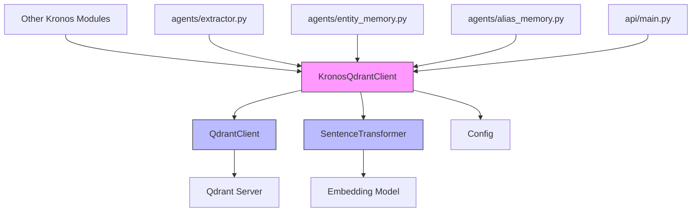
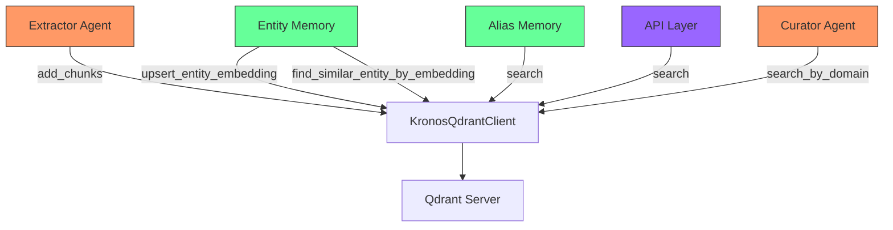
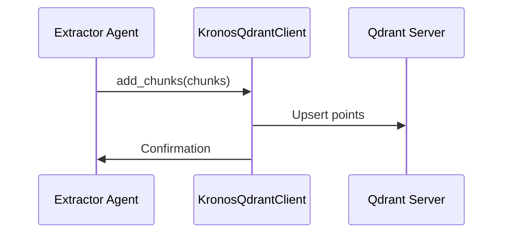
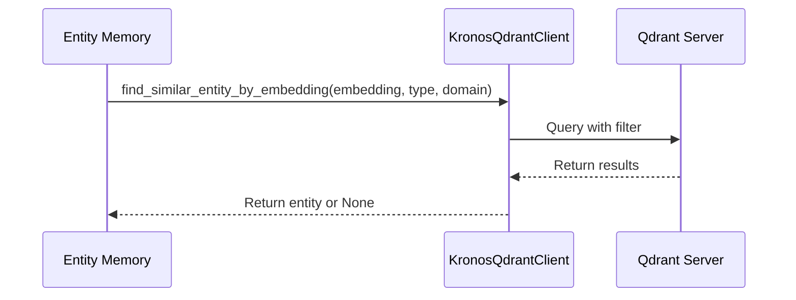
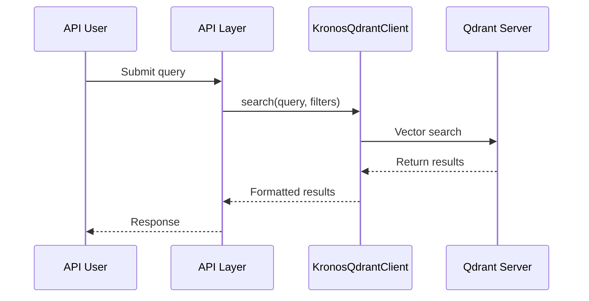

# Kronos Qdrant Client Module Documentation

## Overview

The `database_clients_qdrant` module provides a specialized client for interacting with Qdrant, a vector similarity search engine, within the Kronos system. This module is part of the broader `database_clients` module family, which also includes the `database_clients_neo4j` module for graph database operations.

The Qdrant client is designed to handle:
- Semantic search over document chunks and claims
- Entity embedding storage and similarity search
- Domain-aware filtering for both document and entity searches
- Integration with the Sentence Transformers library for text embeddings

## Module Architecture



## Core Components

### KronosQdrantClient

The primary class in this module that provides all Qdrant database operations.

```python
class KronosQdrantClient:
    COLLECTION_NAME = "kronos_chunks"
    
    def __init__(self):
        # Initializes Qdrant client and SentenceTransformer
        # Sets up collections and indexes
    
    def _setup_collection(self):
        # Creates collections and indexes if they don't exist
    
    # Document/Chunk operations
    def add_chunks(self, chunks: list[dict]):
        # Upserts chunks/claims into kronos_chunks collection
    
    def delete_by_source(self, source_doc: str):
        # Deletes all vectors associated with a source document
    
    def source_exists(self, source_doc: str) -> bool:
        # Checks if a source document exists in the collection
    
    def search(
        self,
        query: str,
        top_k: int = 5,
        source_doc: str = None,
        type_filter: str = None,
        domain_filter: str = None
    ):
        # Performs semantic search with optional filtering
    
    def get_collection_stats(self):
        # Returns statistics about the kronos_chunks collection
    
    # Entity operations
    def upsert_entity_embedding(
        self,
        name: str,
        entity_type: str,
        embedding: list[float],
        domain: str | None = None
    ):
        # Stores or updates an entity's embedding in kronos_entities collection
    
    def find_similar_entity_by_embedding(
        self,
        embedding: list[float],
        entity_type: str,
        domain: str | None = None,
        threshold: float = 0.85
    ) -> dict | None:
        # Finds similar entities with similarity threshold
    
    def find_nearest_entity_candidate(
        self,
        embedding: list[float],
        entity_type: str,
        domain: str | None = None
    ) -> dict | None:
        # Finds nearest entity regardless of similarity threshold
    
    def search_by_domain(
        self,
        query: str,
        domain: str,
        top_k: int = 5,
        type_filter: str = None
    ):
        # Convenience method for domain-scoped search
```

## Data Model

The module manages two primary collections in Qdrant:

### 1. kronos_chunks Collection

Stores document chunks and claims with their vector embeddings.

**Payload Structure:**
```json
{
  "text": "The actual text content of the chunk",
  "source_doc": "Document identifier",
  "page": 0,
  "confidence": 1.0,
  "type": "chunk",
  "domain": "Optional domain classification"
}
```

**Indexes:**
- `source_doc` (keyword)
- `type` (keyword)
- `domain` (keyword)

### 2. kronos_entities Collection

Stores entity name embeddings for similarity search.

**Payload Structure:**
```json
{
  "name": "Entity name",
  "type": "Entity type",
  "domain": "Optional domain classification"
}
```

**Indexes:**
- `type` (keyword)
- `domain` (keyword)

## Integration with Other Modules



### Key Integrations:

1. **Extractor Agent (`agents/extractor.py`)**
   - Uses `add_chunks()` to store processed document chunks
   - Uses `delete_by_source()` to clean up old documents
   - Uses `source_exists()` to check for existing documents

2. **Entity Memory (`agents/entity_memory.py`)**
   - Uses `upsert_entity_embedding()` to store entity embeddings
   - Uses `find_similar_entity_by_embedding()` for entity resolution
   - Uses `find_nearest_entity_candidate()` for typo detection

3. **Alias Memory (`agents/alias_memory.py`)**
   - Uses `search()` for finding relevant chunks based on queries

4. **API Layer (`api/main.py`)**
   - Uses `search()` and `search_by_domain()` for user queries

5. **Curator Agent (`agents/curator.py`)**
   - Uses `search_by_domain()` for domain-specific content curation

## Configuration

The module depends on the following configuration parameters from `core/config.py`:

```python
# Qdrant connection
QDRANT_HOST = os.getenv("QDRANT_HOST", "localhost")
QDRANT_PORT = int(os.getenv("QDRANT_PORT", 6333))

# Embedding model
EMBEDDING_MODEL = "all-MiniLM-L6-v2"
EMBEDDING_DIM = 384
```

## Data Flow Examples

### Document Processing Flow



### Entity Resolution Flow



### User Query Flow



## Performance Considerations

1. **Vector Indexing**: The module creates payload indexes on frequently filtered fields (`source_doc`, `type`, `domain`) to optimize query performance.

2. **Embedding Generation**: Uses SentenceTransformer with the `all-MiniLM-L6-v2` model, which generates 384-dimensional embeddings.

3. **Collection Setup**: The `_setup_collection()` method ensures collections and indexes exist, preventing runtime errors.

4. **Similarity Thresholds**: The `find_similar_entity_by_embedding()` method uses a default threshold of 0.85 for entity similarity, which can be adjusted based on requirements.

## Error Handling

The module includes basic error handling:

1. **Index Creation**: Silently ignores errors when creating indexes that may already exist
2. **Collection Existence**: Checks for existing collections before creating new ones
3. **Vector Search**: Gracefully handles cases where no results are found

## Best Practices

1. **Batch Operations**: Use `add_chunks()` with batches of chunks for efficient bulk operations
2. **Domain Filtering**: Leverage domain filtering when appropriate to improve search relevance
3. **Entity IDs**: Uses UUID5 for entity IDs based on the entity name for consistent hashing
4. **Confidence Tracking**: Stores confidence scores with chunks for downstream filtering

## Related Modules

- **[database_clients_neo4j](database_clients_neo4j.md)**: For graph database operations
- **[agents/entity_memory](agents_entity_memory.md)**: For entity management and resolution
- **[agents/alias_memory](agents_alias_memory.md)**: For alias-based memory operations
- **[api/main](api_main.md)**: For API endpoints that use Qdrant search
- **[core/config](core_config.md)**: For configuration settings

## Deployment Notes

1. Ensure Qdrant server is running and accessible at the configured host and port
2. The module will automatically create required collections and indexes on first run
3. For production, consider:
   - Setting up proper authentication for Qdrant
   - Configuring appropriate memory limits
   - Setting up backup procedures for the Qdrant data

## Monitoring

The module logs important operations:
- Collection creation
- Document deletion by source
- Index creation

These logs can be monitored to track the module's activity and diagnose issues.

## Future Enhancements

Potential improvements for future versions:
1. Add support for batch entity operations
2. Implement caching for frequent queries
3. Add more sophisticated error recovery mechanisms
4. Support for custom embedding models
5. Integration with distributed tracing for performance monitoring