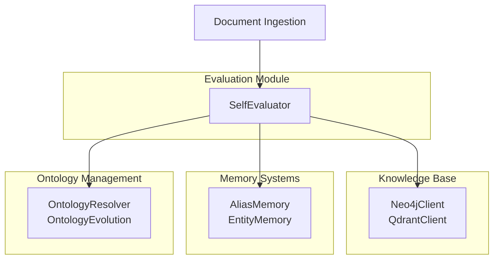
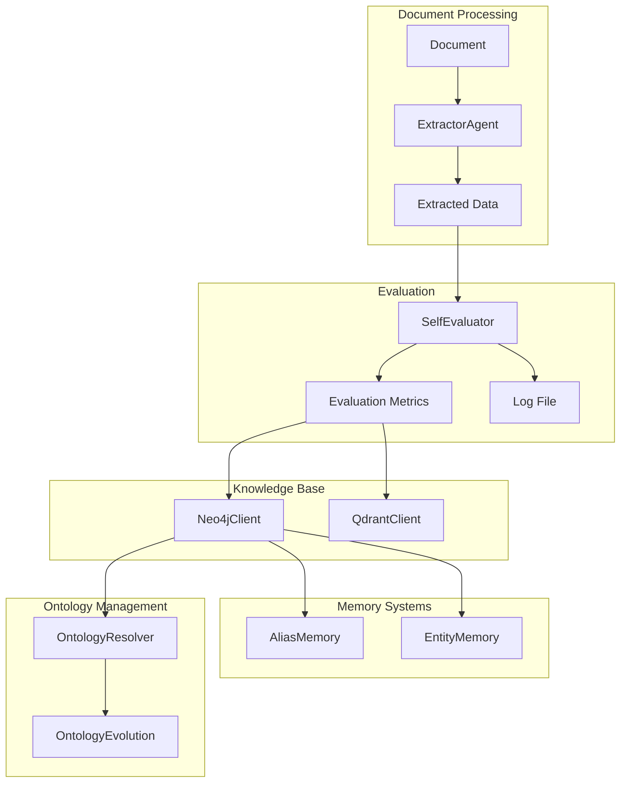
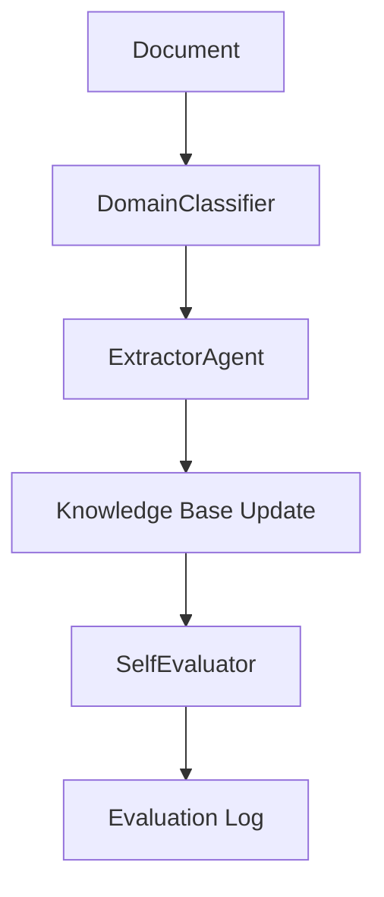
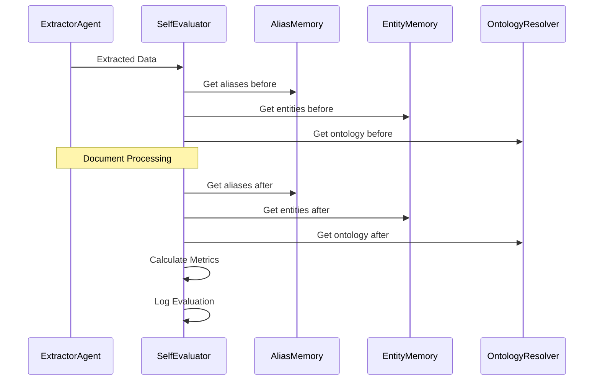

# Evaluation Module Documentation

## Overview

The **Evaluation Module** is a critical component of the KRONOS system, responsible for assessing the performance and quality of document ingestion and knowledge extraction processes. It operates as a self-monitoring mechanism that evaluates the system's efficiency, accuracy, and learning progress after each document processing cycle.

This module is designed to:
- Score KRONOS's performance on ingested documents
- Track quality trends over time
- Measure learning progress (new aliases, ontology mappings)
- Monitor processing efficiency
- Maintain a historical record of evaluations for trend analysis

The Evaluation Module works closely with other components in the system, particularly those involved in document processing, knowledge extraction, and memory management.

## Core Components

### SelfEvaluator (`agents/self_evaluation.py`)

The primary component of the Evaluation Module is the `SelfEvaluator` class, which performs comprehensive evaluations of the system's performance after each document ingestion.

#### Class Overview

```python
class SelfEvaluator:
    """
    Component 17. After every ingestion, KRONOS scores its own
    performance on that document — not just how many things got written,
    but the ratio of what it kept vs. discarded, how much it learned,
    and how long it took. Appended to a running log so quality trends
    are visible over time, not just per-document.
    """
```

#### Key Features

1. **Performance Metrics Collection**:
   - Tracks entities and relationships extracted vs. written/skipped
   - Measures processing time
   - Records quality scores and tier information

2. **Learning Progress Tracking**:
   - Monitors new aliases learned
   - Tracks new ontology mappings discovered

3. **Quality Assessment**:
   - Calculates duplicate rates
   - Evaluates the ratio of kept vs. discarded information

4. **Historical Logging**:
   - Maintains a running log of evaluations in JSONL format
   - Provides methods to retrieve recent evaluations

#### Evaluation Metrics

The `SelfEvaluator` collects and calculates the following metrics:

| Metric | Description |
|--------|-------------|
| `entities_extracted` | Total entities extracted from the document |
| `entities_written` | Entities successfully written to the knowledge base |
| `entities_skipped` | Entities that were extracted but not written |
| `relationships_extracted` | Total relationships extracted from the document |
| `relationships_written` | Relationships successfully written to the knowledge base |
| `relationships_rejected` | Relationships that were extracted but not written |
| `duplicate_rate` | Ratio of entities that were duplicates (1 - entities_written/entities_extracted) |
| `new_aliases_learned` | Number of new aliases discovered during processing |
| `new_ontology_mappings_learned` | Number of new ontology mappings discovered |
| `processing_seconds` | Time taken to process the document |
| `quality_score` | Pre-computed quality score for the document |
| `tier` | Tier/classification of the document |

#### Usage Example

```python
# Initialize the evaluator
evaluator = SelfEvaluator(log_file="self_evaluation.jsonl")

# After processing a document, call evaluate with the results
evaluation = evaluator.evaluate(
    filename="example.pdf",
    extracted=extracted_data,
    ingest_result=ingest_results,
    aliases_before=current_aliases_count,
    aliases_after=new_aliases_count,
    ontology_before=current_ontology_count,
    ontology_after=new_ontology_count,
    processing_seconds=processing_time
)

# Retrieve recent evaluations
recent_evaluations = evaluator.get_recent(limit=10)
```

## Architecture and Component Relationships

### System Context Diagram



### Data Flow Diagram



### Component Dependencies

The Evaluation Module interacts with several other modules in the KRONOS system:

1. **Agent Framework**:
   - Receives extracted data from `ExtractorAgent`
   - Works with other agents for comprehensive evaluation

2. **Memory Systems**:
   - Tracks changes in alias memory (`AliasMemory`)
   - Monitors entity memory updates (`EntityMemory`)

3. **Ontology Management**:
   - Records new ontology mappings discovered
   - Tracks ontology evolution over time

4. **Database Clients**:
   - Relies on `Neo4jClient` for knowledge base operations
   - May use `QdrantClient` for vector embeddings and similarity search

## Integration with Other Modules

### Document Processing Pipeline

The Evaluation Module is typically integrated at the end of the document processing pipeline:



### Data Flow with Memory Systems



## Evaluation Log Analysis

The Evaluation Module maintains a log file (`self_evaluation.jsonl`) that records evaluation results in JSON Lines format. Each line represents a single evaluation event with the following structure:

```json
{
  "filename": "example.pdf",
  "timestamp": "2023-11-15T14:30:45.123456",
  "tier": 1,
  "quality_score": 0.95,
  "entities_extracted": 42,
  "entities_written": 38,
  "entities_skipped": 4,
  "relationships_extracted": 15,
  "relationships_written": 12,
  "relationships_rejected": 3,
  "new_aliases_learned": 5,
  "new_ontology_mappings_learned": 2,
  "duplicate_rate": 0.0952,
  "processing_seconds": 4.23
}
```

### Log Analysis Example

To analyze trends over time, you can process the log file:

```python
import json
from pathlib import Path

def analyze_evaluations(log_file: str = "self_evaluation.jsonl"):
    evaluations = []
    with open(log_file, "r", encoding="utf-8") as f:
        for line in f:
            evaluations.append(json.loads(line))
    
    # Calculate average metrics
    total_processing_time = sum(e["processing_seconds"] for e in evaluations)
    avg_processing_time = total_processing_time / len(evaluations)
    
    total_entities = sum(e["entities_extracted"] for e in evaluations)
    total_written = sum(e["entities_written"] for e in evaluations)
    avg_duplicate_rate = 1 - (total_written / total_entities) if total_entities else 0
    
    print(f"Total evaluations: {len(evaluations)}")
    print(f"Average processing time: {avg_processing_time:.2f}s")
    print(f"Average duplicate rate: {avg_duplicate_rate:.2%}")
```

## Performance Considerations

1. **Log File Management**:
   - The log file grows with each evaluation
   - Consider implementing log rotation or archiving for long-running systems
   - For production systems, consider using a dedicated logging service

2. **Evaluation Overhead**:
   - The evaluation process adds minimal overhead to document processing
   - Metrics calculation is performed in-memory before logging

3. **Memory Usage**:
   - The `get_recent()` method loads recent evaluations into memory
   - For systems with many evaluations, consider implementing pagination

## Best Practices

1. **Log File Location**:
   - Place the log file in a dedicated directory with appropriate permissions
   - Consider using a configuration parameter for the log file path

2. **Error Handling**:
   - Implement error handling for log file operations
   - Consider adding validation for evaluation metrics

3. **Monitoring**:
   - Monitor the evaluation log for trends in quality and performance
   - Set up alerts for abnormal duplicate rates or processing times

4. **Integration**:
   - Integrate evaluation results with dashboarding tools for visualization
   - Consider exposing evaluation metrics through an API endpoint

## References

- [Agent Framework Documentation](agent_framework.md)
- [Memory Systems Documentation](memory_systems.md)
- [Ontology Management Documentation](ontology_management.md)
- [Database Clients Documentation](database_clients.md)

## Future Enhancements

1. **Advanced Analytics**:
   - Implement trend analysis and anomaly detection
   - Add predictive capabilities for document quality

2. **Visualization**:
   - Develop dashboard components for evaluation metrics
   - Create reports for quality assurance teams

3. **Integration**:
   - Expose evaluation metrics through API endpoints
   - Integrate with alerting systems for critical metrics

4. **Enhanced Metrics**:
   - Add more sophisticated quality metrics
   - Implement cross-document consistency checks