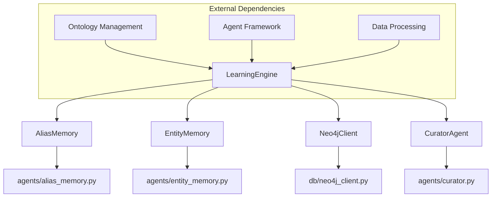
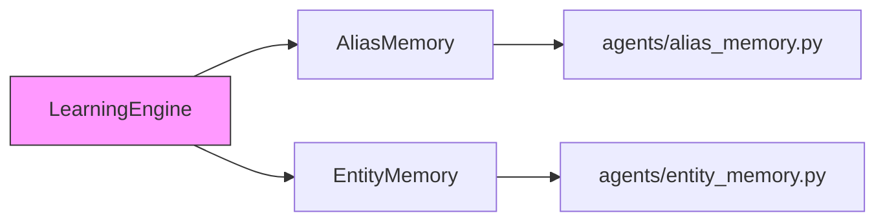
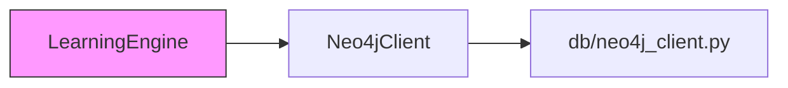
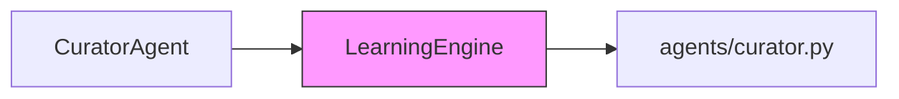
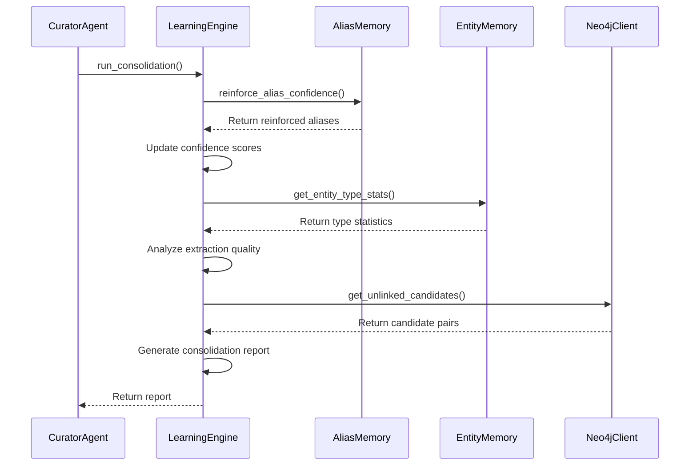
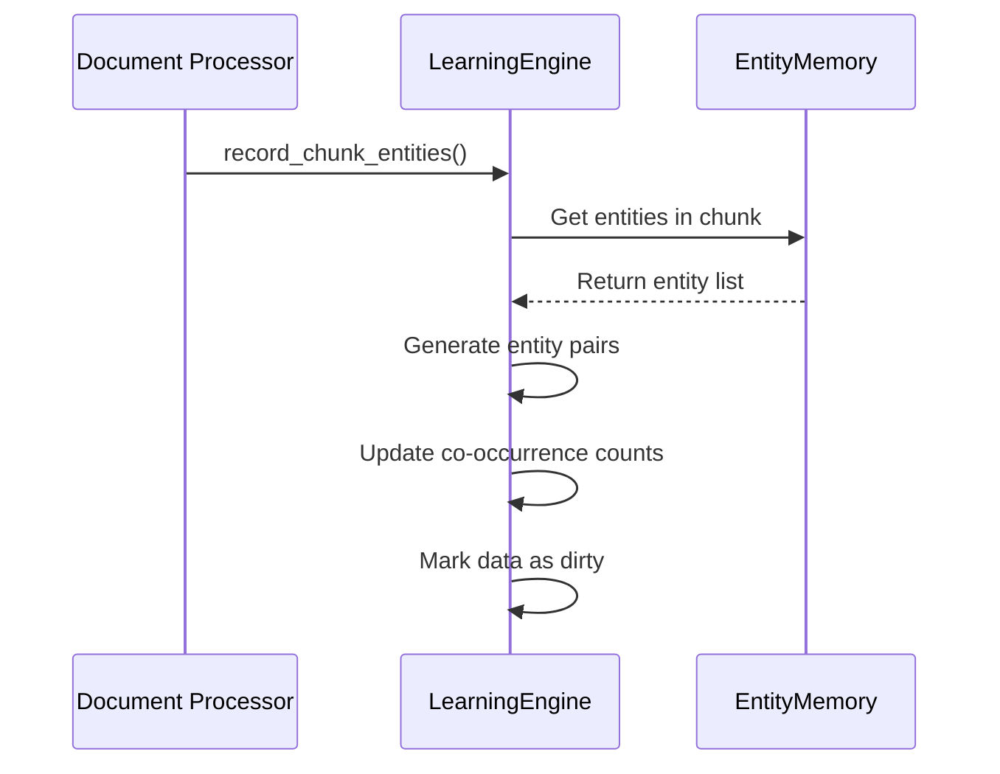

# Learning System Module Documentation

## Overview

The Learning System module is a core component of the Kronos knowledge management platform that focuses on continuous learning and knowledge consolidation. It acts as a consolidation layer that periodically analyzes and reinforces knowledge extracted by other components, ensuring that the system's understanding of entities, aliases, and relationships improves over time.

This module is designed to run periodically (typically alongside the Curator agent) rather than processing every document individually, making it an efficient system for knowledge refinement and quality improvement.

## Module Purpose

The Learning System has two primary responsibilities:

1. **Knowledge Reinforcement**: Strengthens confidence scores for entities and aliases based on repeated observations across multiple documents
2. **Relationship Discovery**: Identifies entity pairs that frequently co-occur but lack explicit relationships in the knowledge graph, surfacing potential missed connections

## Architecture

The Learning System module follows a layered architecture that integrates with several other modules in the system:



## Core Components

### LearningEngine (agents/learning_engine.py)

The central component of the Learning System module that orchestrates the knowledge consolidation process.

#### Key Features

- **Alias Confidence Reinforcement**: Adjusts confidence scores for aliases based on repeated observations
- **Entity Co-occurrence Tracking**: Records and analyzes entity pairs that frequently appear together
- **Relationship Candidate Discovery**: Identifies potential relationships that may be missing from the knowledge graph
- **Entity Type Statistics**: Provides insights into extraction quality by entity type

#### Configuration Parameters

- `REINFORCEMENT_CAP = 0.97`: Maximum confidence that can be achieved through repetition
- `REINFORCEMENT_RATE = 0.08`: Rate at which confidence increases with repeated observations
- `COOCCURRENCE_MIN_COUNT = 4`: Minimum number of co-occurrences before a pair is considered a candidate

#### Methods

| Method | Description |
|--------|-------------|
| `__init__` | Initializes the LearningEngine with co-occurrence tracking |
| `record_chunk_entities` | Records entity pairs that appear in the same document chunk |
| `get_unlinked_candidates` | Returns entity pairs that co-occur frequently but lack relationships |
| `reinforce_alias_confidence` | Adjusts confidence scores for aliases based on repeated observations |
| `get_entity_type_stats` | Provides statistics on extraction confidence by entity type |
| `run_consolidation` | Executes a full consolidation pass across all knowledge sources |
| `flush` | Persists co-occurrence data to disk |

## Integration with Other Modules

### Memory Systems Integration

The Learning System works closely with the Memory Systems module to reinforce and refine extracted knowledge:



- **AliasMemory**: Reinforces confidence scores for aliases based on repeated observations
- **EntityMemory**: Analyzes entity extraction quality and identifies potential improvements

For more details on the Memory Systems module, see [memory_systems.md](memory_systems.md).

### Database Integration

The Learning System interacts with the Neo4j graph database to:

1. Check for existing relationships between entities
2. Identify potential missing relationships
3. Validate knowledge graph consistency



For more details on database integration, see [database_clients.md](database_clients.md).

### Agent Framework Integration

The Learning System is typically triggered by the Curator agent as part of its periodic processing cycle:



For more details on the Agent Framework, see [agent_framework.md](agent_framework.md).

## Data Flow

The Learning System follows a specific data flow pattern:

```mermaid
dataflow
    Input[Document Chunks] -->|Entity Extraction| EntityMemory
    EntityMemory -->|Periodic Analysis| LearningEngine
    
    LearningEngine -->|Reinforcement| AliasMemory
    LearningEngine -->|Relationship Discovery| Neo4jClient
    
    Neo4jClient -->|Knowledge Graph| LearningEngine
    LearningEngine -->|Consolidation Report| CuratorAgent
```

1. **Document Processing**: Entity extraction identifies entities in document chunks
2. **Memory Storage**: Extracted entities are stored in EntityMemory and AliasMemory
3. **Periodic Analysis**: LearningEngine periodically analyzes the stored knowledge
4. **Knowledge Reinforcement**: Confidence scores for aliases are adjusted based on repeated observations
5. **Relationship Discovery**: Entity pairs that frequently co-occur but lack relationships are identified
6. **Reporting**: Consolidation results are reported to the Curator agent for further action

## Process Flows

### Consolidation Process

The consolidation process is triggered periodically (typically nightly) by the Curator agent:



### Entity Co-occurrence Tracking

Entity co-occurrence is tracked during document ingestion:



## Key Algorithms

### Confidence Reinforcement Algorithm

The LearningEngine uses a saturating curve algorithm to adjust confidence scores based on repeated observations:

```python
def _calculate_reinforced_confidence(base_confidence, times_seen):
    reinforced = REINFORCEMENT_CAP - (REINFORCEMENT_CAP - base_confidence) * math.exp(
        -REINFORCEMENT_RATE * max(0, times_seen - 1)
    )
    return round(min(REINFORCEMENT_CAP, reinforced), 4)
```

This algorithm ensures:
- Diminishing returns as observations increase
- Confidence scores never exceed the reinforcement cap
- Strong LLM referee overrides can still override pure repetition

### Co-occurrence Analysis

The system tracks entity pairs that appear together in document chunks and identifies those that:
- Appear together frequently (above COOCCURRENCE_MIN_COUNT threshold)
- Lack explicit relationships in the knowledge graph

These pairs are surfaced as candidates for either:
- A missed relationship that should be added to the knowledge graph
- A missed entity merge where two entities should be combined

## Performance Considerations

1. **Efficient Storage**: Co-occurrence data is stored in a compact JSON format
2. **Periodic Processing**: The system runs periodically rather than on every document
3. **Memory Efficiency**: Only tracks pairs that meet the minimum co-occurrence threshold
4. **Batch Processing**: Processes multiple documents in a single consolidation pass

## Error Handling

The Learning System includes robust error handling for:
- Corrupted co-occurrence data files
- Missing memory attributes
- Database connection issues
- Invalid entity data

## Configuration

The Learning System can be configured through:

1. **Environment Variables**:
   - `COOCCURRENCE_FILE`: Path to the co-occurrence data file
   - `REINFORCEMENT_CAP`: Maximum confidence through repetition
   - `REINFORCEMENT_RATE`: Rate of confidence increase
   - `COOCCURRENCE_MIN_COUNT`: Minimum co-occurrence threshold

2. **Code Constants**:
   - Default values are defined in the LearningEngine class
   - Can be overridden during instantiation

## Best Practices

1. **Periodic Execution**: Run the consolidation process regularly (e.g., nightly)
2. **Monitoring**: Track the number of reinforced aliases and discovered candidates
3. **Validation**: Review discovered relationship candidates before adding to the knowledge graph
4. **Threshold Tuning**: Adjust COOCCURRENCE_MIN_COUNT based on your document volume

## Troubleshooting

### Common Issues

1. **Low Number of Reinforced Aliases**:
   - Check if the system is running frequently enough
   - Verify that alias_memory has the expected structure
   - Ensure documents are being processed correctly

2. **High Number of Unlinked Candidates**:
   - Review the candidates to determine if they represent real relationships
   - Consider lowering COOCCURRENCE_MIN_COUNT if too many candidates are being generated
   - Check for data quality issues in entity extraction

3. **Performance Issues**:
   - Monitor memory usage for the co-occurrence data structure
   - Consider implementing a more efficient storage format for large datasets
   - Review database query performance for relationship checks

## Testing

The Learning System should be tested with:

1. **Unit Tests**:
   - Test confidence reinforcement calculations
   - Test co-occurrence tracking
   - Test relationship candidate identification

2. **Integration Tests**:
   - Test interaction with AliasMemory and EntityMemory
   - Test database integration
   - Test agent framework integration

3. **End-to-End Tests**:
   - Test the full consolidation process
   - Test error handling scenarios
   - Test performance with large datasets

## Future Enhancements

Potential improvements to the Learning System:

1. **Machine Learning Integration**: Use ML models to better predict relationship candidates
2. **Temporal Analysis**: Track how entity relationships evolve over time
3. **Cross-Document Context**: Analyze entity relationships across document collections
4. **Automated Relationship Creation**: Automatically create relationships for high-confidence candidates
5. **Confidence Calibration**: Adjust confidence scores based on source reliability

## References

- [Memory Systems Module](memory_systems.md)
- [Agent Framework Module](agent_framework.md)
- [Database Clients Module](database_clients.md)
- [Ontology Management Module](ontology_management.md)
- [Data Processing Module](data_processing.md)