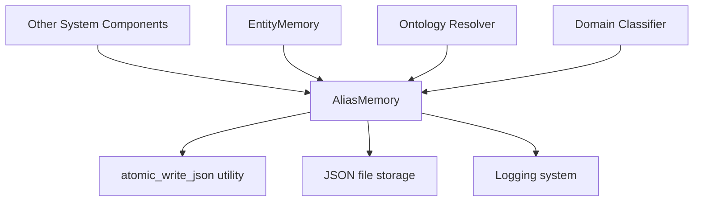

# Memory Systems: Alias Memory Module

## Overview

The `memory_systems_alias_memory` module provides persistent alias resolution capabilities for entity name normalization in the Kronos system. It implements a continuously learned alias table that maps various entity name variations to their canonical forms, enabling consistent entity resolution across documents and queries.

This module is part of the broader memory systems architecture, which also includes [memory_systems_entity_memory](memory_systems_entity_memory.md) for storing detailed entity information.

## Purpose and Core Functionality

The primary purpose of the AliasMemory module is to:

1. **Resolve entity name variations**: Map different aliases (e.g., "GPU", "Graphics Processing Unit", "graphics card") to a single canonical name
2. **Persist learned aliases**: Store resolved aliases between system runs to maintain consistency
3. **Reinforce frequently used aliases**: Increase confidence in aliases that are used repeatedly
4. **Handle conflicts**: Manage cases where the same alias maps to different canonical names
5. **Provide audit capabilities**: Allow manual correction of incorrect aliases

### Key Features

- **Confidence-based persistence**: Only aliases with high confidence (>= 0.93) are permanently stored
- **Atomic writes**: Ensures data integrity even during system failures
- **Conflict resolution**: Handles cases where the same alias maps to different canonical names
- **Reinforcement learning**: Gradually increases confidence for frequently used aliases
- **Audit capabilities**: Allows manual removal of incorrect aliases

## Architecture and Component Relationships

### Module Dependencies



### Integration with Other Modules

The AliasMemory module interacts with several other components in the system:

1. **EntityMemory**: Uses resolved aliases to maintain consistent entity representations
2. **Ontology Resolver**: Provides canonical names for ontology-based entity resolution
3. **Domain Classifier**: Uses aliases to improve domain-specific entity recognition
4. **Learning Engine**: May use alias patterns to improve entity resolution models

### Data Flow

```mermaid
data-flow[Data Flow Diagram]
    direction TB
    A[Raw Text/Entity] --> B[AliasMemory.get()]
    B --> C{Found in memory?}
    C -->|Yes| D[Return canonical name + confidence]
    C -->|No| E[Resolve via other methods]
    E --> F[AliasMemory.record()]
    F --> G{Confidence >= threshold?}
    G -->|Yes| H[Persist to memory]
    G -->|No| I[Use for current entity only]
    D --> J[Entity Resolution Complete]
    H --> J
```

## Core Components

### AliasMemory Class

The primary class in this module, providing the core alias resolution functionality.

#### Class Structure

```python
class AliasMemory:
    def __init__(self, memory_file: str = "alias_memory.json")
    def _load(self)
    def _save(self)
    def get(self, name: str) -> tuple[str | None, float]
    def record(self, name: str, canonical: str, confidence: float, source: str = "unknown")
    def flag_bad_entry(self, name: str, reason: str = "manually flagged") -> bool
```

#### Key Methods

1. **`get(name: str)`**: Looks up an alias and returns the canonical name with confidence
   - Increases confidence and usage count on successful lookups
   - Returns `(None, 0.0)` if alias is not found

2. **`record(name: str, canonical: str, confidence: float, source: str)`**: Records or reinforces an alias
   - Only persists aliases with confidence >= ALIAS_COMMIT_THRESHOLD (0.93)
   - Handles conflicts by keeping the higher-confidence mapping
   - Logs all operations for auditability

3. **`flag_bad_entry(name: str, reason: str)`**: Removes a bad alias entry
   - Used by audit tools or manual review to correct mistakes
   - Returns True if entry was found and removed

#### Configuration Constants

- `REUSE_REINFORCEMENT = 0.01`: Amount to increase confidence on each alias reuse
- `MAX_CONFIDENCE = 1.0`: Maximum possible confidence value
- `ALIAS_COMMIT_THRESHOLD = 0.93`: Minimum confidence required to persist an alias

### Data Structure

Alias entries are stored in a dictionary with the following structure:

```json
{
  "alias_name": {
    "canonical": "Canonical Name",
    "confidence": 0.99,
    "times_seen": 72,
    "source": "embedding"
  }
}
```

- **canonical**: The preferred name for this entity
- **confidence**: Confidence score (0.0-1.0) in this mapping
- **times_seen**: Number of times this alias has been used
- **source**: Method used to resolve this alias (e.g., "embedding", "fuzzy", "llm")

## Usage Examples

### Basic Usage

```python
from agents.alias_memory import AliasMemory

# Initialize memory
alias_memory = AliasMemory("my_alias_memory.json")

# Record a new alias
alias_memory.record("GPU", "Graphics Processing Unit", 0.98, "embedding")

# Look up an alias
canonical, confidence = alias_memory.get("gpu")
# Returns: ("Graphics Processing Unit", 0.99)

# Record a conflicting alias (lower confidence)
alias_memory.record("GPU", "Graphics Processor Unit", 0.85, "fuzzy")
# This won't overwrite the existing high-confidence entry

# Record a conflicting alias (higher confidence)
alias_memory.record("GPU", "Graphics Processor Unit", 0.99, "llm")
# This will overwrite the existing entry
```

### Integration with Entity Resolution

```python
# In an entity resolution pipeline
def resolve_entity(entity_name: str, source: str) -> str:
    # First try to find in alias memory
    canonical, confidence = alias_memory.get(entity_name)
    
    if canonical:
        return canonical
    
    # If not found, resolve using other methods...
    resolved_name = resolve_via_embeddings(entity_name)
    
    # Record the new alias if confidence is high enough
    if confidence >= 0.8:  # Temporary threshold for current use
        alias_memory.record(entity_name, resolved_name, confidence, source)
    
    return resolved_name
```

## Performance Considerations

1. **Memory Usage**: The alias memory is loaded into memory for fast access, with periodic saves to disk
2. **Persistence**: Uses atomic writes to ensure data integrity
3. **Lookup Performance**: Dictionary-based lookups provide O(1) complexity
4. **Conflict Resolution**: Higher-confidence mappings always win, preventing gradual degradation

## Error Handling and Edge Cases

1. **File I/O Errors**: Handled by the atomic write mechanism
2. **Conflicting Aliases**: Resolved by keeping the higher-confidence mapping
3. **Low-Confidence Matches**: Not persisted to prevent corruption of the alias memory
4. **Case Sensitivity**: All aliases are normalized to lowercase for consistent matching

## Testing and Validation

The module should be tested for:

1. **Basic functionality**: Alias recording and retrieval
2. **Conflict resolution**: Handling of competing aliases
3. **Persistence**: Proper loading and saving of alias memory
4. **Atomicity**: Ensuring data integrity during failures
5. **Performance**: Memory usage and lookup times with large alias sets

## Related Documentation

- [memory_systems_entity_memory](memory_systems_entity_memory.md) - For detailed entity information storage
- [ontology_management_ontology_resolver](ontology_management_ontology_resolver.md) - For ontology-based entity resolution
- [data_processing_domain_classifier](data_processing_domain_classifier.md) - For domain-specific entity classification

## Future Enhancements

Potential improvements to consider:

1. **Batch operations**: Add methods for bulk loading and saving aliases
2. **Export/Import**: Support for sharing alias memories between systems
3. **Versioning**: Track changes to alias memories over time
4. **Statistics**: Add methods to analyze alias usage patterns
5. **Integration with learning**: Use alias patterns to improve entity resolution models