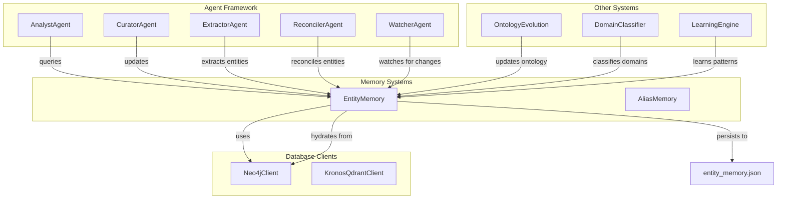
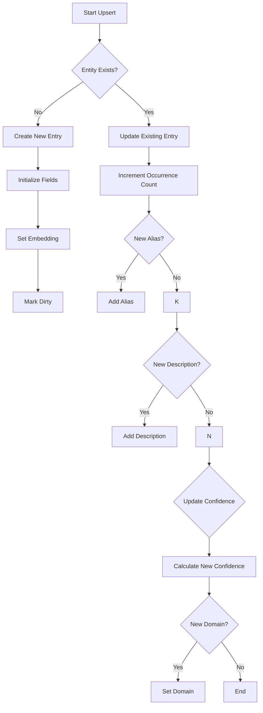
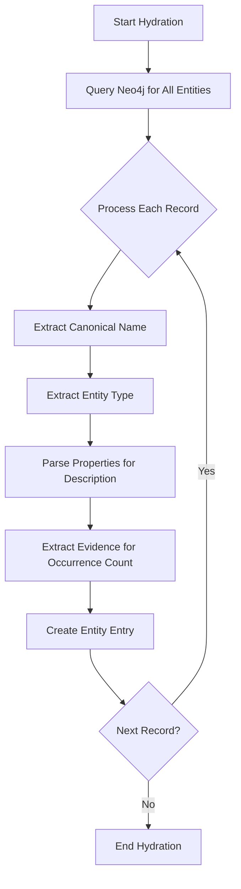
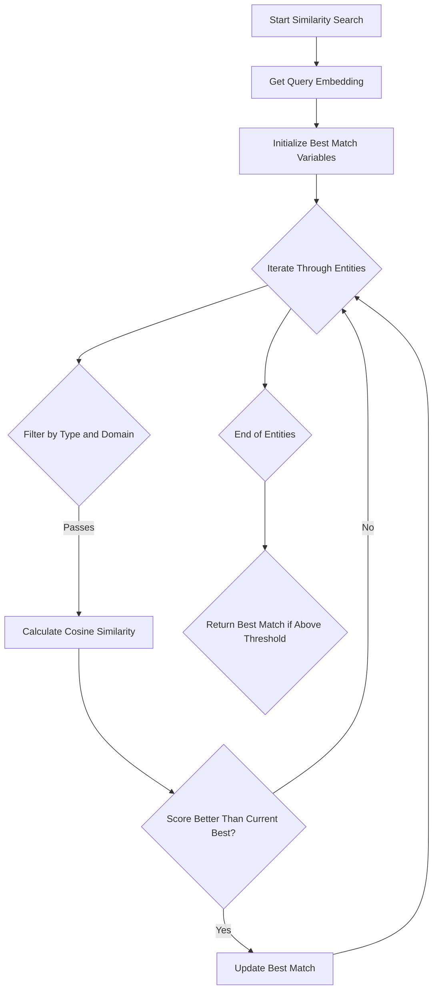

# Entity Memory System

## Overview

The `memory_systems_entity_memory` module provides persistent storage and retrieval of entity information with semantic search capabilities. It serves as a critical component in the memory systems architecture, enabling agents to maintain and query knowledge about entities (people, organizations, concepts, etc.) across the system.

This module is part of the broader `memory_systems` package, which handles different aspects of memory management in the system. The EntityMemory class is designed to work with both local JSON storage and a Neo4j graph database as a source of truth.

## Core Functionality

The EntityMemory class provides the following key capabilities:

1. **Entity Persistence**: Stores and retrieves entity information with attributes like canonical name, type, domain, aliases, descriptions, and confidence scores.

2. **Semantic Search**: Implements vector-based similarity search to find entities based on embeddings.

3. **Relationship Tracking**: Records and maintains relationship counts between entities.

4. **Data Synchronization**: Can hydrate from Neo4j when local storage is empty, ensuring data consistency.

5. **Atomic Operations**: Uses atomic writes to prevent data corruption during updates.

## Architecture

The following diagram illustrates the EntityMemory component within the broader system architecture:



## Component Relationships

### Dependencies

The EntityMemory class has the following dependencies:

1. **Neo4jClient**: Used for hydrating entity data when local storage is empty and as a potential source of truth.
2. **KronosQdrantClient**: Used for vector embeddings storage and retrieval (implied by the embedding handling).
3. **Atomic JSON Utilities**: For safe persistence operations.

### Integration with Other Modules

EntityMemory interacts with several other modules in the system:

1. **Agent Framework**: Various agents (AnalystAgent, CuratorAgent, etc.) query and update entity information.

2. **Ontology Management**: The OntologyEvolution agent may update entity types and domains.

3. **Data Processing**: The DomainClassifier helps categorize entities by domain.

4. **Learning System**: The LearningEngine may use entity relationships to improve its models.

## Data Model

The EntityMemory stores entities with the following structure:

```json
{
  "<entity_type>::<canonical_name>": {
    "canonical": "Entity Name",
    "type": "Entity Type",
    "domain": "Domain Category",
    "aliases": ["Alias 1", "Alias 2"],
    "descriptions": ["Description 1", "Description 2"],
    "occurrence_count": 5,
    "confidence": 0.85,
    "relationship_count": 3
  }
}
```

Key attributes:
- `canonical`: The primary name of the entity
- `type`: The category of entity (person, organization, concept, etc.)
- `domain`: The domain or context the entity belongs to
- `aliases`: Alternative names for the entity
- `descriptions`: Descriptive information about the entity
- `occurrence_count`: How often this entity has been encountered
- `confidence`: A score representing the reliability of this entity's information
- `relationship_count`: Number of relationships this entity has with other entities

## Key Processes

### Entity Upsertion

The `upsert` method handles both new entity creation and updates to existing entities:



### Entity Hydration from Neo4j

When local storage is empty, EntityMemory can hydrate from Neo4j:



### Semantic Search

The `find_similar` method performs vector-based similarity search:



## API Reference

### EntityMemory Class

#### Constructor

```python
EntityMemory(memory_file: str = "entity_memory.json", neo4j_client=None)
```

Parameters:
- `memory_file`: Path to the JSON file for local storage
- `neo4j_client`: Neo4j client for data synchronization

#### Methods

**`upsert(canonical_name, entity_type, embedding, description="", alias=None, confidence=1.0, domain=None)`**

Updates or creates an entity entry with the given information.

Parameters:
- `canonical_name`: The primary name of the entity
- `entity_type`: The category of entity
- `embedding`: Vector embedding for semantic search
- `description`: Optional description of the entity
- `alias`: Optional alternative name
- `confidence`: Confidence score for this entity (0-1)
- `domain`: Optional domain/category for the entity

**`find_similar(embedding, entity_type, threshold=0.85, domain=None)`**

Finds entities similar to the given embedding.

Parameters:
- `embedding`: Query vector for similarity search
- `entity_type`: Filter by entity type
- `threshold`: Minimum similarity score to return a result
- `domain`: Optional domain filter

Returns:
- Dictionary with entity information if a match is found, None otherwise

**`record_relationship(canonical_name, entity_type)`**

Records a relationship between entities.

Parameters:
- `canonical_name`: Name of the entity
- `entity_type`: Type of the entity

**`flush()`**

Persists the current state to disk if there are pending changes.

## Configuration

The EntityMemory module doesn't require extensive configuration as it primarily works with the provided memory file path and Neo4j client. Configuration for related systems (like Neo4j connection details) should be handled in their respective modules.

## Error Handling

The module includes several error handling mechanisms:

1. **JSON Loading**: Gracefully handles corrupted or missing JSON files
2. **Neo4j Hydration**: Logs warnings if Neo4j hydration fails
3. **Embedding Operations**: Handles zero vectors in cosine similarity calculations
4. **Atomic Writes**: Uses atomic operations to prevent data corruption

## Performance Considerations

1. **Memory Usage**: The in-memory cache of entities can grow large; consider memory limits for very large knowledge bases.

2. **Vector Operations**: Cosine similarity calculations can be expensive for large numbers of entities.

3. **Persistence**: The `flush()` method should be called periodically to persist changes, but not too frequently to avoid I/O overhead.

## Integration Examples

### Basic Usage

```python
from agents.entity_memory import EntityMemory
from db.neo4j_client import Neo4jClient

# Initialize with Neo4j client for data synchronization
neo4j_client = Neo4jClient()
entity_memory = EntityMemory(neo4j_client=neo4j_client)

# Add a new entity
embedding = [0.1, 0.2, 0.3, ...]  # Vector embedding
entity_memory.upsert(
    canonical_name="John Doe",
    entity_type="person",
    embedding=embedding,
    description="A software engineer specializing in AI",
    confidence=0.95
)

# Find similar entities
similar = entity_memory.find_similar(
    embedding=embedding,
    entity_type="person",
    threshold=0.8
)

# Record a relationship
entity_memory.record_relationship("John Doe", "person")

# Persist changes
entity_memory.flush()
```

### Agent Integration

```python
from agent_framework.agents.analyst import AnalystAgent
from memory_systems.entity_memory import EntityMemory

class EntityAwareAnalyst(AnalystAgent):
    def __init__(self, *args, **kwargs):
        super().__init__(*args, **kwargs)
        self.entity_memory = EntityMemory()
    
    def analyze(self, text):
        # Extract entities from text
        entities = self.extract_entities(text)
        
        # Update entity memory
        for entity in entities:
            self.entity_memory.upsert(
                canonical_name=entity.name,
                entity_type=entity.type,
                embedding=entity.embedding,
                description=entity.description,
                confidence=entity.confidence
            )
        
        # Use entity memory for analysis
        similar_entities = self.entity_memory.find_similar(
            embedding=self.current_embedding,
            entity_type="concept"
        )
        
        return self.process_analysis(entities, similar_entities)
```

## Related Modules

For more information about related modules, see:

- [memory_systems_alias_memory](memory_systems_alias_memory.md) - For handling entity aliases
- [database_clients](database_clients.md) - For database connection details
- [agent_framework](agent_framework.md) - For agent implementations that use EntityMemory
- [ontology_management](ontology_management.md) - For managing entity types and relationships

## Future Enhancements

Potential improvements to the EntityMemory system:

1. **Vector Database Integration**: Direct integration with vector databases like Qdrant for better performance
2. **Batch Operations**: Support for batch upserts and queries
3. **Entity Resolution**: Improved deduplication and merging of entity information
4. **Temporal Memory**: Tracking of entity information over time
5. **Confidence Calibration**: More sophisticated confidence scoring based on evidence

## Troubleshooting

**Issue: EntityMemory not loading from Neo4j**
- Check Neo4j client connection
- Verify Neo4j schema matches expected format
- Check logs for specific error messages

**Issue: Poor similarity search results**
- Verify embedding quality and dimensionality
- Adjust similarity threshold
- Check for proper entity type filtering

**Issue: High memory usage**
- Consider implementing entity pruning based on usage
- Evaluate need for all entities to be in memory
- Implement lazy loading for less frequently accessed entities