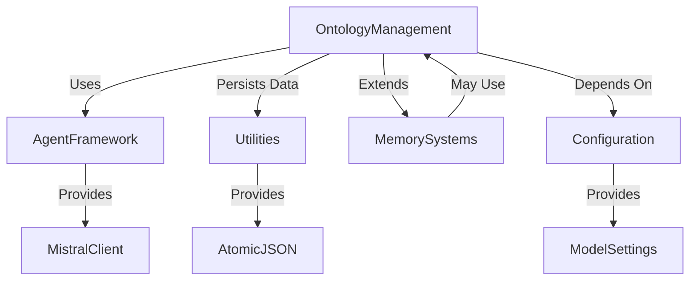

# Ontology Management Module

## Overview

The Ontology Management module is responsible for maintaining and evolving a knowledge graph's relation ontology. It provides functionality to:

1. Resolve arbitrary relation strings into canonical relation types
2. Track and propose new relation types when existing ones don't fit observed patterns
3. Maintain a growing and evolving ontology that adapts to new patterns in the data

The module operates in two main modes:
- **Resolution mode**: Quickly maps input relations to canonical types
- **Evolution mode**: Silently tracks patterns that don't fit the current ontology and proposes expansions

This dual approach ensures that the system continues to function while also improving over time as new patterns emerge.

## Architecture

```mermaid
graph TD
    A[Raw Relation String] --> B[OntologyResolver.resolve()]
    B --> C{Exact Match?}
    C -->|Yes| D[Return canonical type]
    C -->|No| E{Synonym?}
    E -->|Yes| F[Return mapped canonical type]
    E -->|No| G{Learned Mapping?}
    G -->|Yes| H[Return cached result]
    G -->|No| I[LLM Classification]
    I --> J{Valid Classification?}
    J -->|Yes| K[Cache result, return canonical type]
    J -->|No| L[Fallback to RELATED_TO]
    
    M[Friction Patterns] --> N[OntologyEvolution.record_friction()]
    N --> O{Threshold Reached?}
    O -->|Yes| P[Propose new type via LLM]
    O -->|No| Q[Continue collecting evidence]
    
    R[Human Review] --> S[Approve/Reject]
    S -->|Approve| T[Add to ontology_extensions.json]
    S -->|Reject| U[Keep existing mapping]
    
    V[ontology_extensions.json] --> W[OntologyResolver._apply_extensions()]
    W --> X[Update valid types and synonyms]
```

### Core Components

The module consists of two main components:

1. **[Ontology Evolution](ontology_management_evolution.md)**: Tracks relation types that keep failing to fit the existing ontology cleanly. Once a pattern has enough repeated evidence, it proposes genuinely new canonical relation types.

2. **[Ontology Resolver](ontology_management_resolver.md)**: Resolves arbitrary relation strings into canonical relation types using a multi-stage process that includes exact matches, synonyms, learned mappings, LLM classification, and fallback.

### Data Flow

```mermaid
dataflow
    RawRelation --> Normalization --> ExactMatchCheck --> SynonymCheck
    --> LearnedMappingCheck --> LLMClassification --> Fallback
    
    FrictionPatterns --> EvidenceCollection --> ProposalGeneration --> HumanReview
    --> ExtensionUpdate --> ResolverReload
```

### Dependencies

The Ontology Management module depends on:

1. **Mistral Client**: For LLM-based classification and proposal generation
2. **Atomic JSON Utilities**: For safe persistence of learned mappings
3. **Logging System**: For tracking operations and debugging
4. **Path Utilities**: For file system operations

For more details on these dependencies, see the respective module documentation:
- [Agent Framework](agent_framework.md) (for Mistral client)
- [Utilities](utilities.md) (for atomic JSON and logging)

## Integration with Other Modules

The Ontology Management module integrates with several other modules in the system:



### Key Integration Points

1. **Agent Framework**: The Ontology Management module uses the Mistral client from the Agent Framework for LLM operations.

2. **Utilities**: Uses atomic JSON utilities for safe persistence of learned mappings and ontology extensions.

3. **Memory Systems**: The ontology extensions can be used by memory systems to improve relation resolution in stored memories.

4. **Configuration**: The module uses configuration settings for model selection and file paths.

## Configuration

The module uses the following configuration parameters:

- `model`: The LLM model to use for classification and proposal generation (default: "mistral-small-2506")
- `memory_file`: Path to the file storing learned mappings (default: "ontology_memory.json")
- `extensions_file`: Path to the file storing approved ontology extensions (default: "ontology_extensions.json")
- `pending_file`: Path to the file storing pending ontology proposals (default: "pending_ontology.json")

These can be configured through the system's central configuration module.

## Usage Examples

### Basic Resolution

```python
resolver = OntologyResolver(mistral_client)
result = resolver.resolve("developed by")
# Returns: {
#   "canonical": "DEVELOPED_BY",
#   "category": "AUTHORSHIP",
#   "status": "exact",
#   "confidence": 1.0
# }
```

### Resolution with Context

```python
result = resolver.resolve("developed by", {
    "from": "project_x",
    "to": "john_doe",
    "description": "John Doe developed project X",
    "source_doc": "project_x_report.pdf"
})
```

### Getting Pending Proposals

```python
evolution = resolver.evolution
pending = evolution.get_pending_review()
# Returns list of proposals awaiting human review
```

### Approving a Proposal

```python
evolution.approve("new_relation_type")
# Adds the new type to ontology_extensions.json
```

## Performance Considerations

1. **Caching**: The module caches LLM classifications to avoid repeated calls for the same relation.

2. **Batch Processing**: For bulk operations, consider processing relations in batches to minimize LLM calls.

3. **Fallback Strategy**: The module has a robust fallback strategy that ensures it never fails to resolve a relation.

4. **Memory Usage**: The learned mappings are stored in memory and persisted to disk, which could grow over time.

## Error Handling

The module includes comprehensive error handling:

1. **File Operations**: Gracefully handles file read/write errors
2. **LLM Operations**: Retries on rate limits and handles other LLM errors
3. **Data Validation**: Validates input data and provides appropriate responses
4. **Fallback Mechanisms**: Always provides a fallback relation type if no better match is found

## Future Enhancements

Potential areas for future development:

1. **Batch Processing**: Add support for batch resolution of multiple relations
2. **Ontology Visualization**: Tools to visualize the current ontology structure
3. **Collaborative Review**: Multi-user review system for ontology proposals
4. **Performance Optimization**: Caching strategies for frequently used relations
5. **Validation Rules**: Additional validation for proposed new relation types

## Related Documentation

- [Ontology Evolution Sub-module](ontology_management_evolution.md)
- [Ontology Resolver Sub-module](ontology_management_resolver.md)
- [Agent Framework](agent_framework.md) (for Mistral client)
- [Utilities](utilities.md) (for atomic JSON and logging)
- [Memory Systems](memory_systems.md) (potential consumer of this module)