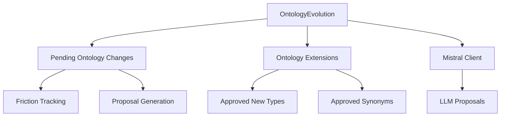
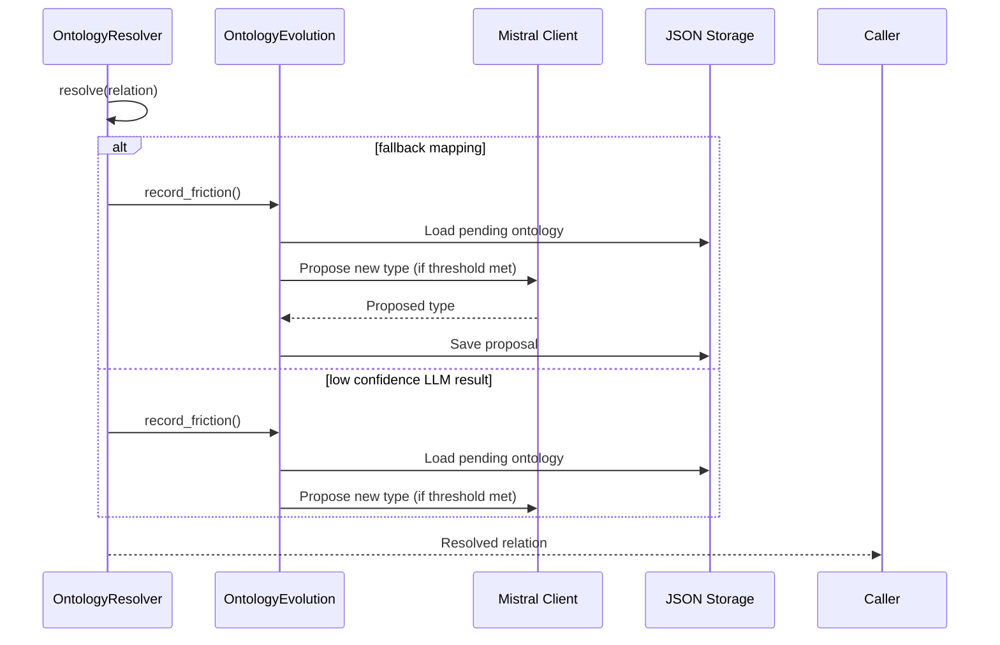

# Ontology Management Evolution Module

## Overview

The `ontology_management_evolution` module is a core component of the ontology management system that handles the dynamic evolution of the knowledge graph's relation vocabulary. It tracks patterns that don't fit cleanly into the existing ontology and proposes new relation types when sufficient evidence accumulates.

This module works in conjunction with the [ontology_management_resolver](ontology_management_resolver.md) module, which handles the actual resolution of relations using the evolving ontology.

## Purpose

The primary purpose of this module is to:

1. **Identify Ontology Friction**: Detect relation patterns that consistently fail to map cleanly to existing ontology types
2. **Accumulate Evidence**: Collect multiple occurrences of problematic patterns to distinguish noise from genuine patterns
3. **Propose New Types**: When sufficient evidence exists, use LLM to propose genuinely new canonical relation types
4. **Handle Approval Process**: Manage the review and approval/rejection of proposed new types
5. **Maintain Extensions**: Persist approved new types and synonyms for use by the resolver

## Architecture

The module follows a simple but effective architecture:



### Core Components

#### OntologyEvolution Class

The main class in this module that implements all the functionality for tracking, proposing, and managing ontology evolution.

**Key Methods:**

- `record_friction()`: Records evidence of ontology friction and triggers proposals when thresholds are met
- `_propose_expansion()`: Uses LLM to propose new relation types based on accumulated evidence
- `approve()`/`reject()`: Handles the review process for proposed types
- `get_pending_review()`: Returns currently pending proposals
- `get_summary()`: Provides statistics about the current state of ontology evolution

### Data Flow

```mermaid
dataflow
Ontology Resolver -->|Falls back to 'fallback'| OntologyEvolution:record_friction
Ontology Resolver -->|Low confidence LLM result| OntologyEvolution:record_friction
OntologyEvolution -->|Sufficient evidence| OntologyEvolution:_propose_expansion
OntologyEvolution:_propose_expansion -->|LLM response| OntologyEvolution
Human Reviewer -->|Approval/Rejection| OntologyEvolution:approve/reject
OntologyEvolution:approve -->|Updates| Ontology Extensions
```

## Integration with Other Modules

### Dependencies

The module depends on:

1. **Mistral Client**: For LLM interactions when proposing new relation types
   - See [agent_framework](agent_framework.md) for agent implementations
   - The Mistral client is typically initialized in the main application

2. **Ontology Extensions Storage**: JSON files for persisting approved changes
   - `pending_ontology.json`: Tracks patterns under review
   - `ontology_extensions.json`: Stores approved new types and synonyms

3. **Configuration**: For file paths and system parameters
   - See [configuration](configuration.md) for configuration management

### Relationship with Ontology Resolver

The `ontology_management_evolution` module works closely with the [ontology_management_resolver](ontology_management_resolver.md) module:



## Key Features

### Friction Tracking

The module tracks two types of ontology friction:

1. **Fallback Mappings**: When a relation can't be mapped to any existing type
2. **Low Confidence LLM Results**: When the LLM picks an existing type but with low confidence (< 0.65)

Friction is only considered significant after repeated occurrences (FRICTION_MIN_COUNT = 4).

### Evidence Collection

For each friction pattern, the module collects:

- Raw examples of the problematic relation
- Context information (source, target, description)
- Confidence scores from LLM results
- Timestamps for first and last occurrence

### Proposal Generation

When sufficient evidence accumulates, the module:

1. Formats the evidence into a structured prompt
2. Uses LLM to propose a new canonical relation type
3. Categorizes the new type (STRUCTURAL, AUTHORSHIP, FUNCTIONAL, REFERENTIAL, or SEMANTIC)
4. Stores the proposal for human review

### Review Process

The review process is managed through:

- `get_pending_review()`: Lists all proposals awaiting review
- `approve()`: Adds the new type to ontology extensions
- `reject()`: Marks the proposal as rejected

Approved types are immediately available to the resolver.

## Configuration

The module uses several configuration parameters:

```python
FRICTION_MIN_COUNT = 4  # Minimum occurrences before proposing a new type
LOW_CONFIDENCE_THRESHOLD = 0.65  # Confidence below this triggers friction tracking
MAX_EVIDENCE_PER_ENTRY = 5  # Maximum evidence items stored per pattern
MAX_RAW_EXAMPLES = 5  # Maximum raw examples stored per pattern
```

File paths for persistence can be configured:

```python
pending_file: str = "pending_ontology.json"
extensions_file: str = "ontology_extensions.json"
```

## Usage Examples

### Initialization

```python
from ontology_management.agents.ontology_evolution import OntologyEvolution

# Initialize with Mistral client and model name
evolution = OntologyEvolution(
    mistral_client=mistral_client,
    model="mistral-tiny"
)
```

### Recording Friction

```python
# When ontology resolver falls back to a generic mapping
context = {
    "from": "document",
    "to": "author",
    "description": "The document was authored by...",
    "source_doc": "doc123.txt"
}

result = {
    "canonical": "AUTHORED_BY",
    "confidence": 0.4  # Low confidence
}

evolution.record_friction(
    raw="was written by",
    cleaned="written_by",
    result=result,
    context=context
)
```

### Reviewing Proposals

```python
# Get all pending proposals
pending = evolution.get_pending_review()

# Approve a proposal
if pending:
    first_proposal = pending[0]
    evolution.approve(
        key=first_proposal["key"],
        canonical="DOCUMENTED_BY",
        category="AUTHORSHIP"
    )
```

## Monitoring and Maintenance

The module provides several methods for monitoring its operation:

```python
# Get summary statistics
summary = evolution.get_summary()

# Collecting: Patterns still gathering evidence
# Pending review: Proposals awaiting human review
# Approved: Successfully approved new types
# Rejected: Proposals that were rejected
```

## Error Handling

The module includes robust error handling for:

- File I/O operations (JSON loading/saving)
- LLM interaction failures
- Malformed responses from LLM

Failed operations are logged with appropriate warnings.

## Performance Considerations

- Evidence collection is bounded (MAX_EVIDENCE_PER_ENTRY, MAX_RAW_EXAMPLES)
- Proposals are only generated after sufficient evidence (FRICTION_MIN_COUNT)
- File operations are minimized (only when changes occur)
- LLM interactions are rate-limited by the client

## Future Enhancements

Potential improvements to this module could include:

1. **Automated Review**: Integration with a review system that can automatically approve certain types of proposals
2. **Priority Scoring**: More sophisticated scoring of proposals based on frequency and impact
3. **Batch Processing**: Ability to process multiple proposals at once
4. **Versioning**: Support for ontology versioning and change tracking
5. **Validation**: Automated validation of proposed types against existing ontology

## References

- [Ontology Management Resolver](ontology_management_resolver.md) - The companion module that uses the evolved ontology
- [Agent Framework](agent_framework.md) - Contains the Mistral client and other agents
- [Configuration](configuration.md) - For system configuration parameters
- [Data Processing](data_processing.md) - For domain classification and embedding cache