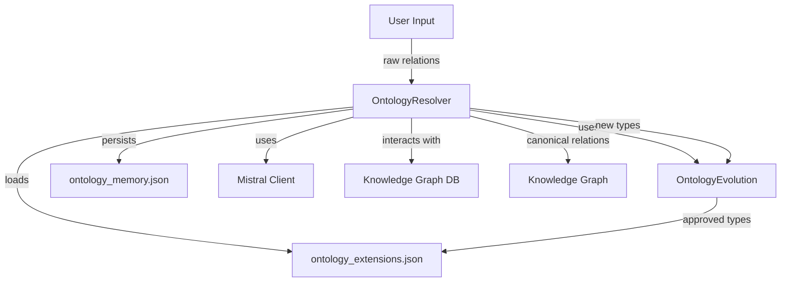

# Ontology Management Resolver Module

## Introduction

The Ontology Management Resolver module is a core component of the knowledge graph system that specializes in resolving arbitrary relation strings into canonical relation types. It serves as a bridge between raw, unstructured relationship data and the structured ontology used throughout the system.

This module is part of the broader `ontology_management` system, which also includes the `ontology_evolution` component that handles the dynamic evolution of the ontology based on usage patterns and new relationship types.

## Purpose and Core Functionality

The OntologyResolver class provides the following key capabilities:

1. **Relation Normalization**: Converts raw relationship strings into a standardized format
2. **Canonical Type Resolution**: Maps various forms of relationship expressions to canonical types
3. **Ontology Evolution Tracking**: Identifies patterns that suggest new relationship types
4. **Context-Aware Classification**: Uses additional context to improve relationship classification
5. **Persistence**: Maintains learned mappings between raw and canonical relationship types

The resolver follows a multi-stage resolution process:
1. Exact match against known canonical types (including approved extensions)
2. Synonym mapping to existing canonical types
3. Memory-based lookup of previously classified relationships
4. LLM-based classification for new relationships
5. Fallback to a default relationship type when classification fails

## Architecture and Component Relationships

The Ontology Management Resolver module interacts with several other components in the system:



### Key Dependencies

1. **OntologyEvolution**: The sibling component that tracks relationships that don't fit existing patterns and proposes new canonical types
2. **Mistral Client**: Used for LLM-based classification of unknown relationships
3. **Knowledge Graph Database**: Stores the canonical relationships and ontology structure
4. **Atomic JSON Utilities**: Ensures safe persistence of learned relationship mappings

## Core Components

### OntologyResolver Class

The primary class in this module, responsible for resolving relationship strings into canonical types.

#### Key Methods

- `resolve(raw: str, context: dict | None = None)`: The main entry point that resolves a relationship string
- `_llm_classify(raw: str, context: dict)`: Uses the Mistral LLM to classify unknown relationships
- `_normalize(raw: str)`: Normalizes relationship strings to a standard format
- `_load()` / `_save()`: Persistence methods for learned relationship mappings
- `_apply_extensions()`: Loads approved ontology extensions

#### Resolution Process

```mermaid
diagram TD
    A[Raw Relationship String] --> B{Is empty?}
    B -->|Yes| C[Invalid Result]
    B -->|No| D{Is already canonical?}
    D -->|Yes| E[Exact Match Result]
    D -->|No| F{Is a synonym?}
    F -->|Yes| G[Synonym Result]
    F -->|No| H{In memory?}
    H -->|Yes| I[Memory Result]
    H -->|No| J{LLM Classification}
    J -->|Success| K[LLM Result]
    J -->|Failure| L[Fallback Result]
```

### OntologyEvolution Class

While not directly part of this module, the OntologyResolver works closely with the OntologyEvolution component to track relationships that don't fit existing patterns and propose new canonical types.

## Data Flow

The following diagram illustrates the data flow through the Ontology Management Resolver:

```mermaid
dataflow
    User Input[Raw Relationship String] -> Normalization[Normalize String]
    Normalization -> Exact Match Check[Check Canonical Types]
    Exact Match Check ->|Match| Exact Result[Exact Match Result]
    Exact Match Check ->|No Match| Synonym Check[Check Synonym Map]
    Synonym Check ->|Match| Synonym Result[Synonym Result]
    Synonym Check ->|No Match| Memory Check[Check Memory]
    Memory Check ->|Match| Memory Result[Memory Result]
    Memory Check ->|No Match| LLM Classification[LLM Classification]
    LLM Classification ->|Success| LLM Result[LLM Result]
    LLM Classification ->|Failure| Fallback Result[Fallback Result]
    
    LLM Result ->|Low Confidence| Track Friction[Track for Evolution]
    Fallback Result ->|Always| Track Friction
    
    Track Friction -> OntologyEvolution[Propose New Type]
    OntologyEvolution -> Approved Extensions[Approved Extensions]
    Approved Extensions -> Resolver[Loaded at Startup]
```

## Configuration

The OntologyResolver is configured through several parameters:

- `memory_file`: Path to the JSON file storing learned relationship mappings
- `model`: The Mistral model to use for LLM classification
- `extensions_file`: Path to the JSON file storing approved ontology extensions
- `pending_file`: Path to the JSON file storing pending ontology changes

## Integration with Other Modules

### Agent Framework

The OntologyResolver integrates with various agents in the system that need to classify relationships:
- **ExtractorAgent**: Uses the resolver to classify relationships extracted from documents
- **CuratorAgent**: Uses the resolver to standardize relationships in curated knowledge
- **ReconcilerAgent**: Uses the resolver to match relationships across different knowledge sources

### Memory Systems

The resolver works with memory systems to store and retrieve relationship mappings:
- **EntityMemory**: Stores canonical relationships between entities
- **AliasMemory**: May use the resolver to standardize relationship aliases

### Data Processing

- **DomainClassifier**: May use the resolver to classify domain-specific relationships
- **EmbeddingCache**: Uses canonical relationship types for consistent embeddings

### API Layer

The resolver is used by API endpoints that accept relationship queries:
- **QueryRequest**: Uses the resolver to classify relationships in user queries
- **ApprovalRequest**: Uses the resolver to standardize relationships in approval workflows

## Error Handling and Fallbacks

The OntologyResolver implements several fallback mechanisms:

1. **Invalid Input Handling**: Returns an invalid result for empty or unprocessable input
2. **Fallback Relationship**: Uses "RELATED_TO" as a default relationship type when classification fails
3. **Rate Limiting**: Implements retry logic for LLM rate limits
4. **Low Confidence Tracking**: Tracks relationships with low classification confidence for potential evolution

## Performance Considerations

1. **Caching**: Learned relationship mappings are cached in memory and persisted to disk
2. **LLM Usage**: LLM classification is rate-limited and retried with exponential backoff
3. **Atomic Writes**: Relationship memory is written atomically to prevent corruption
4. **Batch Processing**: The resolver is designed to handle individual relationships efficiently

## Security Considerations

1. **Input Sanitization**: Relationship strings are normalized to prevent injection attacks
2. **Context Validation**: Context data is validated before being used in LLM prompts
3. **JSON Safety**: Atomic JSON writes prevent file corruption from partial writes

## Testing and Validation

The OntologyResolver should be tested with:

1. **Exact Matches**: Known canonical relationship types
2. **Synonyms**: Various forms of the same relationship
3. **Unknown Relationships**: New relationship types that require LLM classification
4. **Invalid Inputs**: Empty strings, special characters, etc.
5. **Context Variations**: Different context data affecting classification
6. **Persistence**: Verifying learned mappings are saved and loaded correctly

## Future Enhancements

Potential improvements to the Ontology Management Resolver:

1. **Batch Classification**: Support for classifying multiple relationships at once
2. **Relationship Validation**: Verify relationships against domain constraints
3. **Confidence Thresholds**: Configurable thresholds for different use cases
4. **Relationship Weighting**: Support for weighted relationships with confidence scores
5. **Graph Traversal**: Integration with graph algorithms for relationship inference

## References

- [Ontology Evolution Module](ontology_management_evolution.md) - For details on how new relationship types are proposed and approved
- [Agent Framework Documentation](agent_framework.md) - For information about agents that use the OntologyResolver
- [Knowledge Graph System Overview](knowledge_graph_system.md) - For the broader context of how relationships are used in the system
- [Mistral Client Documentation](mistral_client.md) - For details about the LLM client used for classification