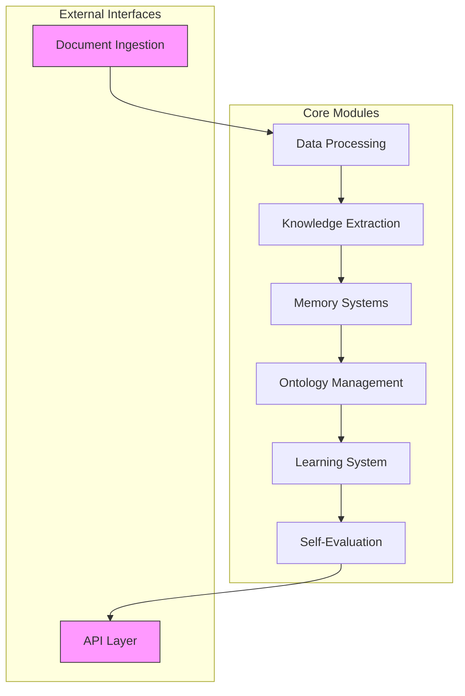
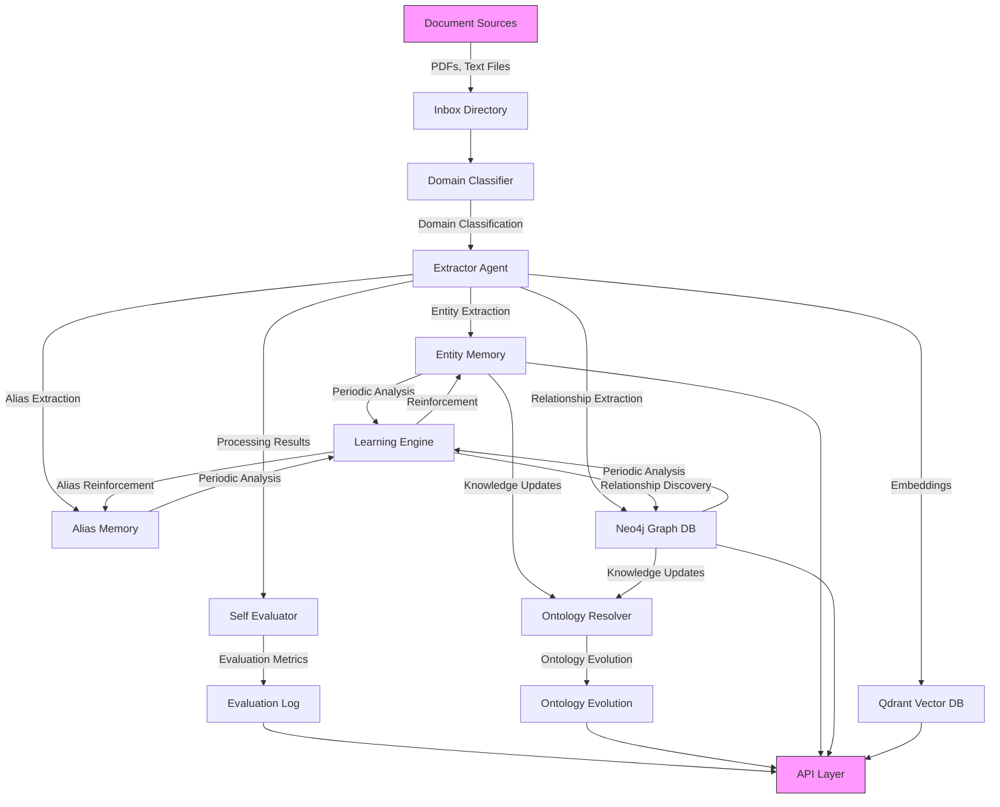
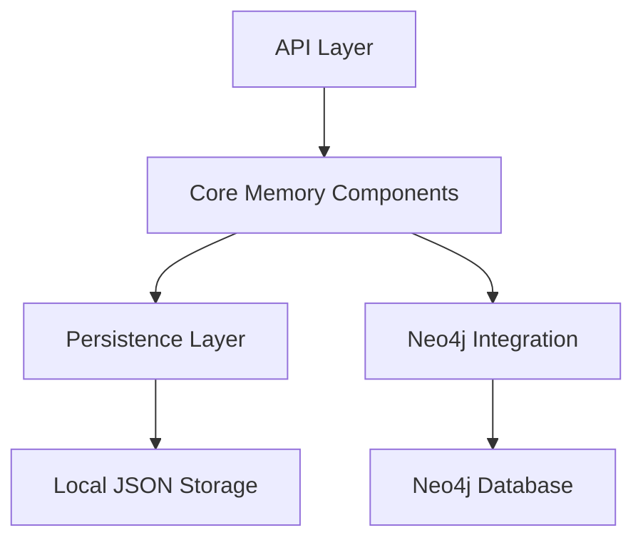
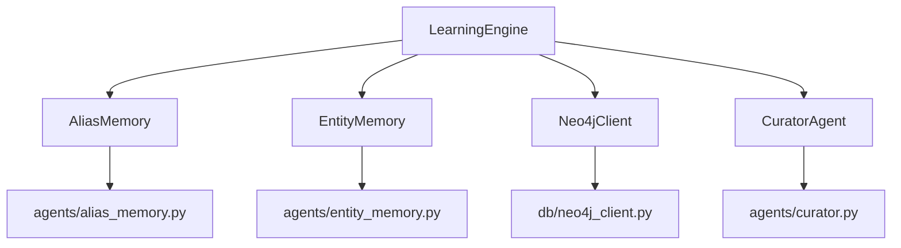
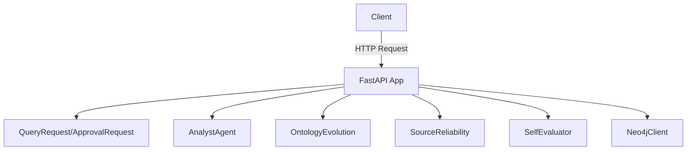
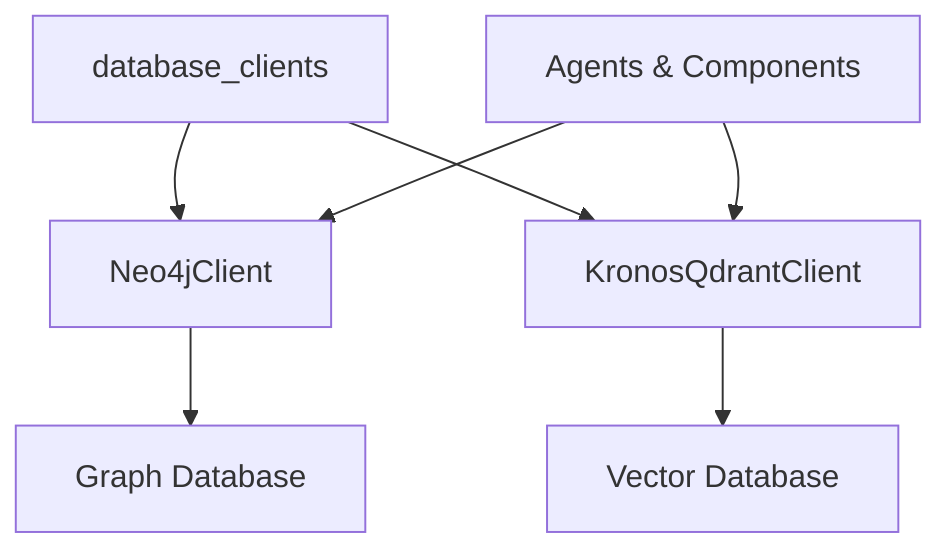
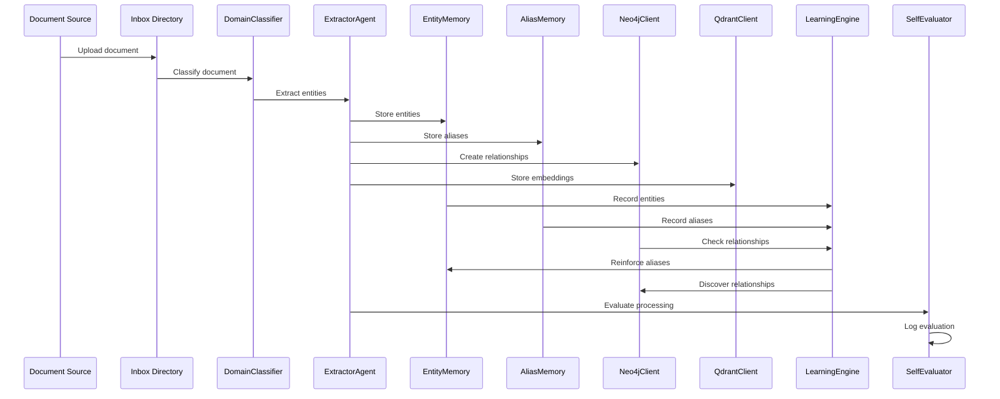
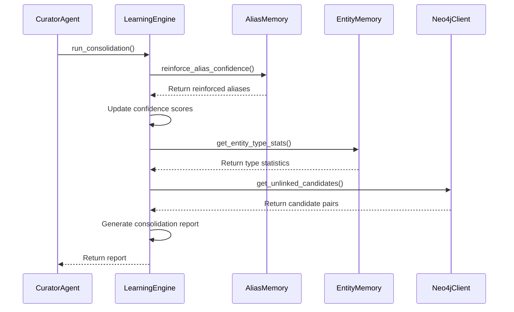
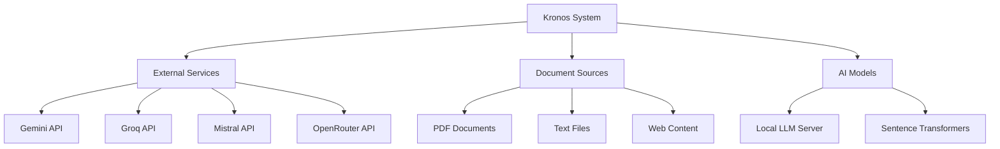
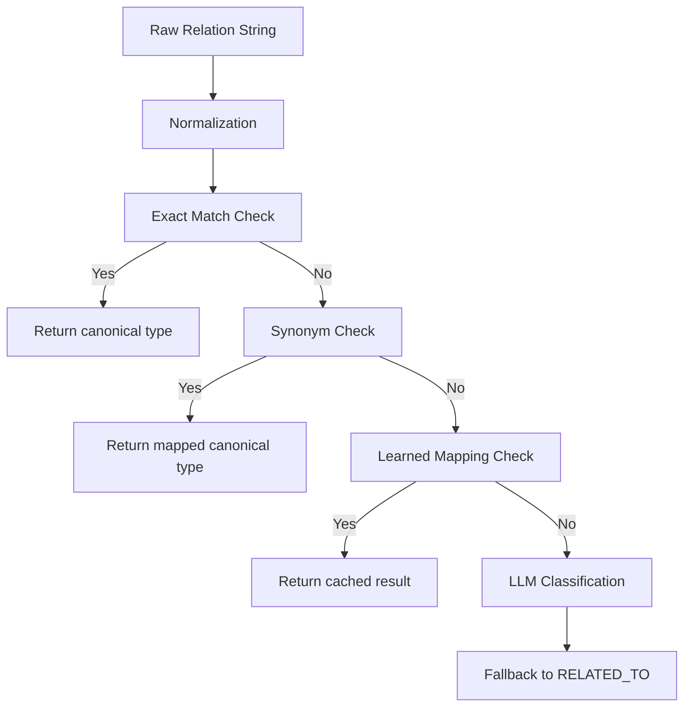

```markdown
# Kronos Repository Overview

## Purpose

The **Kronos** repository represents a self-evolving knowledge infrastructure that continuously learns and adapts from processed documents. It's designed to extract, store, and analyze knowledge from various sources, building a comprehensive knowledge graph that improves over time through machine learning and human feedback.

Kronos operates as an autonomous knowledge management system with the following core capabilities:

- **Document Ingestion**: Processes documents from multiple sources (PDFs, text files, etc.)
- **Entity Extraction**: Identifies and extracts entities, relationships, and aliases
- **Knowledge Storage**: Maintains persistent storage of entities, relationships, and embeddings
- **Ontology Management**: Evolves and refines the relationship ontology based on observed patterns
- **Self-Evaluation**: Continuously assesses its own performance and learning progress
- **API Access**: Provides RESTful endpoints for querying and managing the knowledge graph

The system is designed to run autonomously, periodically consolidating knowledge, identifying gaps, and proposing new relationship types based on observed patterns in the data.

## End-to-End Architecture

The Kronos system follows a modular architecture with clear separation of concerns between different functional areas:



### Detailed Architecture



## Core Modules Overview

### 1. Memory Systems (`agents/alias_memory.py`, `agents/entity_memory.py`)

**Purpose**: Manages persistent storage and retrieval of entity information, aliases, and relationships.

**Key Components**:
- `AliasMemory`: Stores and manages entity aliases with confidence-based persistence
- `EntityMemory`: Manages entity information including canonical names, types, descriptions, and embeddings

**Architecture**:


**Documentation**: [memory_systems.md](memory_systems.md)

---

### 2. Agent Framework (`agents/analyst.py`, `agents/codex.py`, etc.)

**Purpose**: Provides specialized agents for different knowledge processing tasks.

**Key Components**:
- `AnalystAgent`: Processes user queries and retrieves answers from the knowledge graph
- `ExtractorAgent`: Extracts entities, relationships, and aliases from documents
- `CuratorAgent`: Manages periodic knowledge consolidation and learning
- `CodexAgent`: Handles code-related knowledge extraction and analysis
- `ReconcilerAgent`: Resolves entity conflicts and merges duplicate entities
- `WatcherAgent`: Monitors document sources for new content

**Documentation**: [agent_framework.md](agent_framework.md)

---

### 3. Ontology Management (`agents/ontology_evolution.py`, `agents/ontology_resolver.py`)

**Purpose**: Maintains and evolves the knowledge graph's relationship ontology.

**Key Components**:
- `OntologyResolver`: Maps raw relation strings to canonical types
- `OntologyEvolution`: Tracks patterns that don't fit existing ontology and proposes expansions

**Architecture**:
```mermaid
graph TD
    A[Raw Relation String] --> B[OntologyResolver.resolve()]
    B --> C{Exact Match?}
    C -->|Yes| D[Return canonical type]
    C -->|No| E{Synonym?}
    E -->|Yes| F[Return mapped canonical type]
    E -->|No| G{Learned Mapping?}
    G -->|Yes| H[Return cached result]
    G -->|No| I[LLM Classification]
```

**Documentation**: [ontology_management.md](ontology_management.md)

---

### 4. Data Processing (`agents/domain_classifier.py`, `agents/embedding_cache.py`, etc.)

**Purpose**: Handles specialized data processing tasks for knowledge extraction.

**Key Components**:
- `DomainClassifier`: Classifies documents into domains (technology, finance, etc.)
- `EmbeddingCache`: Manages text embeddings for semantic search
- `SourceReliability`: Tracks and calculates source document reliability scores

**Documentation**: [data_processing.md](data_processing.md)

---

### 5. Learning System (`agents/learning_engine.py`)

**Purpose**: Performs continuous learning and knowledge consolidation.

**Key Features**:
- Reinforces confidence scores for entities and aliases based on repeated observations
- Identifies entity pairs that frequently co-occur but lack explicit relationships
- Provides entity type statistics for extraction quality analysis

**Architecture**:


**Documentation**: [learning_system.md](learning_system.md)

---

### 6. Evaluation (`agents/self_evaluation.py`)

**Purpose**: Provides self-monitoring and quality assessment capabilities.

**Key Features**:
- Scores system performance on each processed document
- Tracks quality trends over time
- Measures learning progress (new aliases, ontology mappings)
- Monitors processing efficiency

**Data Structure**:
```json
{
  "filename": "example.pdf",
  "timestamp": "2023-11-15T14:30:45.123456",
  "tier": 1,
  "quality_score": 0.95,
  "entities_extracted": 42,
  "entities_written": 38,
  "new_aliases_learned": 5,
  "processing_seconds": 4.23
}
```

**Documentation**: [evaluation.md](evaluation.md)

---

### 7. API Layer (`api/main.py`)

**Purpose**: Provides RESTful endpoints for interacting with the knowledge graph.

**Key Endpoints**:
- `/query`: Ask questions and receive answers from the knowledge graph
- `/status`: Retrieve graph health metrics
- `/ontology/pending`: List ontology proposals awaiting approval
- `/ontology/approve`: Approve ontology proposals
- `/ontology/reject`: Reject ontology proposals
- `/conflicts`: Retrieve active conflicts in the knowledge graph
- `/sources/reliability`: Get source document reliability scores
- `/self-evaluation/recent`: Retrieve recent self-assessment results

**Architecture**:


**Documentation**: [api_layer.md](api_layer.md)

---

### 8. Configuration (`core/config.py`)

**Purpose**: Centralized configuration management for the entire system.

**Key Features**:
- Manages API keys and service endpoints
- Configures database connections
- Sets model parameters and routing strategies
- Defines file system paths and processing parameters
- Manages rate limits and quotas

**Configuration Categories**:
- API Keys (Gemini, Groq, Mistral, OpenRouter)
- Database Connections (Neo4j, Qdrant)
- Local Model Configuration
- File System Paths
- Model Routing Configuration
- Rate Limiting Parameters
- Embedding Configuration
- Graph Processing Parameters

**Documentation**: [configuration.md](configuration.md)

---

### 9. Database Clients (`db/neo4j_client.py`, `db/qdrant_client.py`)

**Purpose**: Provides database client implementations for Neo4j and Qdrant.

**Key Components**:
- `Neo4jClient`: Graph database client for entities and relationships
- `KronosQdrantClient`: Vector database client for embeddings and semantic search

**Architecture**:


**Documentation**: [database_clients.md](database_clients.md)

---

### 10. Utilities (`utils/quota.py`, `utils/retry.py`)

**Purpose**: Provides utility functions and classes used across the system.

**Key Components**:
- `QuotaTracker`: Manages API quotas and rate limits
- `DailyQuotaExceeded`: Exception for handling rate limiting scenarios

## Data Flow Patterns

### Document Processing Flow



### Knowledge Consolidation Flow



## Integration Points

The Kronos system integrates with several external services and components:



## Key Algorithms and Techniques

### 1. Confidence Reinforcement Algorithm

The LearningEngine uses a saturating curve algorithm to adjust confidence scores:

```python
def _calculate_reinforced_confidence(base_confidence, times_seen):
    reinforced = REINFORCEMENT_CAP - (REINFORCEMENT_CAP - base_confidence) * math.exp(
        -REINFORCEMENT_RATE * max(0, times_seen - 1)
    )
    return round(min(REINFORCEMENT_CAP, reinforced), 4)
```

### 2. Ontology Resolution Algorithm

The OntologyResolver uses a multi-stage process:



### 3. Smart Routing Algorithm

The system uses smart routing to select the optimal AI model backend:

```python
if document_size > GROQ_MAX_CHUNKS:
    backend = config.EXTRACTOR_LARGE_DOC_BACKEND
elif config.EXTRACTOR_BACKEND == "groq" and api_quota_available:
    backend = "groq"
else:
    backend = config.EXTRACTOR_FALLBACK_MODEL
```

## Performance Considerations

1. **Memory Usage**: Entity and alias memories are stored in memory for fast access with periodic flushing to disk
2. **Embedding Storage**: Entity embeddings are stored in Qdrant for efficient similarity search
3. **Relationship Queries**: Complex relationship queries are delegated to Neo4j for optimal performance
4. **Atomic Operations**: All file operations use atomic writes to prevent data corruption
5. **Batch Processing**: Document processing uses batch operations for efficiency
6. **Caching**: The system caches LLM classifications and learned mappings to avoid repeated calls

## Error Handling Strategies

1. **Graceful Degradation**: If Neo4j is unavailable, entity memory falls back to local JSON storage
2. **Conflict Resolution**: Conflicting aliases are resolved based on confidence scores
3. **Quota Management**: API quotas are tracked and respected with appropriate delays
4. **Fallback Mechanisms**: The ontology resolver always provides a fallback relation type
5. **Data Validation**: Input data is validated before storage or processing

## Configuration Management

The system uses a centralized configuration approach with the following features:

- Environment variable loading from `.env` files
- Sensible default values for all parameters
- Type conversion for configuration values
- Single source of truth for all configuration parameters
- Modular organization by functional area

## Testing Strategy

The Kronos system should be tested at multiple levels:

1. **Unit Tests**: Individual components and classes
2. **Integration Tests**: Interactions between modules
3. **End-to-End Tests**: Complete document processing workflows
4. **Performance Tests**: System performance under load
5. **Regression Tests**: Ensure new features don't break existing functionality

## Deployment Considerations

1. **Environment Setup**: Configure all required API keys and database connections
2. **Database Initialization**: Set up Neo4j and Qdrant databases with appropriate schemas
3. **Document Sources**: Configure inbox directories and document processing schedules
4. **Monitoring**: Set up logging and monitoring for system health
5. **Scaling**: Consider horizontal scaling for high-volume deployments

## Future Enhancements

1. **Distributed Caching**: Implement distributed caching for large-scale deployments
2. **Memory Compression**: Add compression for memory files to reduce storage requirements
3. **Incremental Updates**: Support for incremental updates to reduce I/O operations
4. **Memory Analytics**: Add analytics capabilities to track memory usage patterns
5. **Versioning**: Implement versioning for memory entries to support rollback
6. **Automated Relationship Creation**: Automatically create relationships for high-confidence candidates
7. **Temporal Analysis**: Track how entity relationships evolve over time
8. **Cross-Document Context**: Analyze entity relationships across document collections

## References

- [memory_systems.md](memory_systems.md) - Detailed documentation for memory systems
- [agent_framework.md](agent_framework.md) - Documentation for the agent framework
- [ontology_management.md](ontology_management.md) - Documentation for ontology management
- [data_processing.md](data_processing.md) - Documentation for data processing modules
- [learning_system.md](learning_system.md) - Documentation for the learning system
- [evaluation.md](evaluation.md) - Documentation for the evaluation module
- [api_layer.md](api_layer.md) - Documentation for the API layer
- [configuration.md](configuration.md) - Documentation for configuration management
- [database_clients.md](database_clients.md) - Documentation for database clients
```