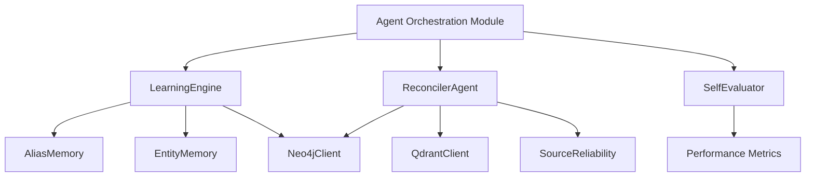

# Agent Orchestration Module

## Overview

The `agent_orchestration` module is responsible for coordinating and managing the various agents that handle knowledge processing, memory management, and system evaluation within the KRONOS system. This module serves as the orchestration layer that ensures different agents work together efficiently to maintain and improve the knowledge graph.

The module consists of three core components:
1. **LearningEngine**: Reinforces learning from repeated observations and tracks entity co-occurrences
2. **ReconcilerAgent**: Resolves conflicts between entity descriptions from different sources
3. **SelfEvaluator**: Evaluates system performance after each ingestion

## Architecture Overview



## Core Components

### LearningEngine

The LearningEngine component is responsible for two main functions:

1. **Alias Reinforcement**: Increases confidence in aliases based on repeated observations
2. **Entity Co-occurrence Tracking**: Identifies entities that frequently appear together but have no relationship in the knowledge graph

Key features:
- Uses a saturating curve for confidence reinforcement to avoid overconfidence
- Tracks co-occurrences to surface potential missing relationships
- Periodically runs consolidation passes rather than processing every document
- Persists co-occurrence counts separately from other memory components

For detailed documentation, see [agent_orchestration_learning_engine.md](agent_orchestration_learning_engine.md).

### ReconcilerAgent

The ReconcilerAgent handles conflict detection and resolution between different sources of information about the same entity. It uses a sophisticated LLM-based approach to determine whether two sources represent a real contradiction or complementary information.

Key features:
- Detects both direct contradictions and updates/corrections
- Uses source reliability scores to inform resolution decisions
- Creates conflict edges in the knowledge graph for flagged issues
- Supports multiple LLM backends (Groq and Mistral)

For detailed documentation, see [agent_orchestration_reconciler.md](agent_orchestration_reconciler.md).

### SelfEvaluator

The SelfEvaluator component provides a feedback loop for the system by evaluating its own performance after each ingestion. It tracks metrics such as entity retention rates, relationship extraction success, and learning progress.

Key features:
- Calculates quality scores for each ingestion
- Tracks duplicate rates and learning progress
- Maintains a running log of performance metrics
- Provides insights into system efficiency and accuracy

For detailed documentation, see [agent_orchestration_self_evaluator.md](agent_orchestration_self_evaluator.md).

## Integration with Other Modules

The agent_orchestration module integrates with several other modules in the system:

1. **Memory Module** (`memory/`):
   - LearningEngine depends on AliasMemory and EntityMemory for reinforcement learning
   - See [memory.md](memory.md) for details

2. **Knowledge Processing Module** (`knowledge_processing/`):
   - The ReconcilerAgent works with extracted entities and relationships
   - See [knowledge_processing.md](knowledge_processing.md) for details

3. **Ontology Module** (`ontology/`):
   - LearningEngine provides statistics on entity types that may indicate extraction issues
   - See [ontology.md](ontology.md) for details

4. **Utility Agents** (`utility_agents/`):
   - ReconcilerAgent uses SourceReliability for conflict resolution
   - See [utility_agents.md](utility_agents.md) for details

5. **Database Module** (`database/`):
   - Both LearningEngine and ReconcilerAgent interact with Neo4jClient
   - ReconcilerAgent also uses QdrantClient for claim similarity
   - See [database.md](database.md) for details

## Data Flow

```mermaid
data-flow[Data Flow Diagram]
    direction LR
    A[Document Ingestion] --> B[Extraction Agents]
    B --> C[Knowledge Graph Update]
    C --> D[LearningEngine]
    C --> E[ReconcilerAgent]
    D --> F[Alias/Entity Memory Update]
    E --> G[Conflict Resolution]
    E --> H[Source Reliability Update]
    F --> I[SelfEvaluator]
    G --> I
    H --> I
    I --> J[Performance Log]
```

## Configuration

The agent_orchestration module is configured through the following environment variables:

- `RECONCILER_BACKEND`: Specifies which LLM backend to use ("groq" or "mistral")
- `RECONCILER_MODEL`: Specifies the model to use for Groq backend
- `RECONCILER_MISTRAL_MODEL`: Specifies the model to use for Mistral backend

## Performance Considerations

1. **LearningEngine**:
   - Runs periodically rather than on every document to avoid performance overhead
   - Uses efficient data structures for tracking co-occurrences
   - Persists data to disk to maintain state between runs

2. **ReconcilerAgent**:
   - Encodes claims once per document to avoid repeated encoding
   - Uses cosine similarity for efficient claim ranking
   - Implements quota tracking to prevent API abuse

3. **SelfEvaluator**:
   - Appends to a log file rather than maintaining in-memory state
   - Provides efficient retrieval of recent evaluations

## Error Handling

The module includes several error handling mechanisms:

1. **LearningEngine**:
   - Gracefully handles missing or corrupted co-occurrence data
   - Logs warnings for issues rather than failing

2. **ReconcilerAgent**:
   - Falls back to simpler resolution strategies when LLM calls fail
   - Creates conflict edges for unverified issues
   - Implements quota tracking to prevent API rate limits

3. **SelfEvaluator**:
   - Handles missing log files gracefully
   - Provides default values for missing metrics

## Future Enhancements

Potential improvements for the agent_orchestration module:

1. Add support for additional LLM backends
2. Implement more sophisticated conflict resolution strategies
3. Add real-time performance monitoring and alerting
4. Improve the learning algorithms for better alias reinforcement
5. Add support for batch processing of documents

## API Reference

The agent_orchestration module does not expose a direct API but provides functionality through:

1. The LearningEngine class with methods like:
   - `run_consolidation()`: Run a full learning pass
   - `reinforce_alias_confidence()`: Reinforce alias confidence based on observations
   - `get_unlinked_candidates()`: Get entity pairs that co-occur but have no relationship

2. The ReconcilerAgent class with methods like:
   - `reconcile()`: Resolve conflicts between entity descriptions

3. The SelfEvaluator class with methods like:
   - `evaluate()`: Evaluate system performance after ingestion
   - `get_recent()`: Get recent performance evaluations