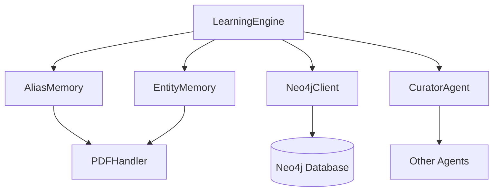

# Agent Orchestration Learning Engine

## Overview

The **Agent Orchestration Learning Engine** is a core component of the agent orchestration system that focuses on continuous learning and knowledge consolidation. It operates as part of the agent orchestration layer, working alongside the Curator agent to improve the system's knowledge base over time.

This module is responsible for:
- Reinforcing entity and alias confidence scores based on repeated observations
- Identifying potential missing relationships between entities through co-occurrence analysis
- Providing statistical insights about entity extraction quality across different entity types
- Consolidating knowledge from multiple sources to improve overall system accuracy

The Learning Engine runs periodically (typically during the Curator's nightly cycle) rather than processing every document individually, making it an efficient component for long-term knowledge improvement.

## Architecture

The Learning Engine integrates with several other components in the system:



### Core Components

1. **LearningEngine** (`agents/learning_engine.py`)
   - Main class that orchestrates the learning process
   - Tracks entity co-occurrences across documents
   - Reinforces confidence scores for aliases and entities
   - Provides statistical analysis of entity extraction quality

2. **Memory Components**
   - **AliasMemory**: Tracks aliases for entities and their confidence scores
   - **EntityMemory**: Stores extracted entities and their attributes
   - **EmbeddingCache**: Caches entity embeddings for efficient processing

3. **Database Components**
   - **Neo4jClient**: Graph database client for storing and querying entity relationships

4. **Utility Components**
   - **CuratorAgent**: Uses Learning Engine outputs to improve knowledge base
   - **PDFHandler**: Provides document content for entity extraction

## Data Flow

The Learning Engine follows this data flow pattern:

```mermaid
dataflow
    Document --> PDFHandler --> Entity Extractor --> EntityMemory
    EntityMemory --> LearningEngine
    LearningEngine --> Neo4jClient
    LearningEngine --> AliasMemory
    LearningEngine --> CuratorAgent
```

1. Documents are processed by the PDFHandler
2. Entities are extracted and stored in EntityMemory
3. LearningEngine periodically analyzes the accumulated data
4. Insights are used to:
   - Reinforce confidence in frequently seen entities/aliases
   - Identify potential missing relationships
   - Provide quality metrics to the Curator

## Detailed Component Documentation

### LearningEngine

The `LearningEngine` class in `agents/learning_engine.py` is the core of this module. It implements several key learning mechanisms:

#### Reinforcement Learning

The engine implements a reinforcement mechanism that increases confidence scores for entities and aliases based on repeated observations. The reinforcement follows a saturating curve with diminishing returns:

```python
REINFORCEMENT_CAP = 0.97  # Maximum confidence that can be achieved through repetition
REINFORCEMENT_RATE = 0.08  # How quickly confidence approaches the cap
```

This ensures that:
- Frequently seen entities gain higher confidence scores
- The system doesn't become overconfident in any single observation
- Strong LLM referee overrides can still override pure repetition

#### Co-occurrence Analysis

The engine tracks how often different entities appear together in the same document chunks:

```python
COOCCURRENCE_MIN_COUNT = 4  # Minimum co-occurrences before surfacing as a candidate
```

This helps identify:
- Potential missing relationships between entities
- Entities that might need to be merged
- Patterns in entity relationships that weren't captured during initial extraction

#### Statistical Analysis

The engine provides several statistical insights:

1. **Entity Type Statistics**: Average confidence scores per entity type
   - Helps identify extraction quality issues for specific entity types
   - Example: If "ORG" entities consistently have low confidence, the extraction prompt might need adjustment

2. **Unlinked Candidate Pairs**: Entity pairs that co-occur frequently but have no relationship in the graph
   - These are surfaced for the Curator to review
   - Not automatically created to avoid introducing incorrect relationships

### Integration Points

#### With AliasMemory

The LearningEngine reinforces confidence scores for aliases based on repeated observations:

```python
def reinforce_alias_confidence(self, alias_memory) -> int:
    """
    Bump confidence on aliases based on accumulated times_seen.
    """
```

This helps the system:
- Trust aliases that have been independently confirmed multiple times
- Maintain appropriate confidence levels even for frequently seen entities

#### With EntityMemory

The engine analyzes entity extraction quality:

```python
def get_entity_type_stats(self, entity_memory) -> dict:
    """
    Confidence statistics per entity type.
    """
```

This provides insights into:
- Which entity types are consistently extracted with high/low confidence
- Potential issues with extraction prompts for specific entity types
- Areas where the extraction model might need improvement

#### With Neo4jClient

The engine queries the graph database to identify potential missing relationships:

```python
def get_unlinked_candidates(self, neo4j_client, min_count: int = COOCCURRENCE_MIN_COUNT) -> list[dict]:
    """
    Returns entity pairs that co-occur frequently but have NO
    relationship edge between them in Neo4j yet.
    """
```

This helps the Curator identify:
- Potential missing relationships that should be added
- Entities that might need to be merged
- Patterns in entity relationships that weren't captured during initial processing

## Configuration

The LearningEngine can be configured through:

1. **Code Constants**:
   - `REINFORCEMENT_CAP`: Maximum confidence that can be achieved through repetition
   - `REINFORCEMENT_RATE`: How quickly confidence approaches the cap
   - `COOCCURRENCE_MIN_COUNT`: Minimum co-occurrences before surfacing as a candidate

2. **File Storage**:
   - Co-occurrence data is stored in `cooccurrence_memory.json`
   - This file persists between runs to maintain state

## Usage Examples

### Basic Usage

```python
from agents.learning_engine import LearningEngine
from agents.alias_memory import AliasMemory
from agents.entity_memory import EntityMemory
from db.neo4j_client import Neo4jClient

# Initialize components
learning_engine = LearningEngine()
alias_memory = AliasMemory()
entity_memory = EntityMemory()
neo4j_client = Neo4jClient()

# Record entities from a document chunk
entities_in_chunk = [
    {"name": "Apple Inc.", "type": "ORG"},
    {"name": "Tim Cook", "type": "PERSON"}
]
learning_engine.record_chunk_entities(entities_in_chunk, "document123.pdf")

# Run consolidation periodically
report = learning_engine.run_consolidation(entity_memory, alias_memory, neo4j_client)
print(f"Reinforced {report['aliases_reinforced']} aliases")
print(f"Found {report['total_unlinked_candidates']} potential missing relationships")
```

### Integration with Curator

The LearningEngine is designed to work with the Curator agent:

```python
# In the Curator's nightly cycle
learning_engine = LearningEngine()
report = learning_engine.run_consolidation(entity_memory, alias_memory, neo4j_client)

# Use the report to improve the knowledge base
if report['aliases_reinforced'] > 0:
    print(f"Reinforced {report['aliases_reinforced']} aliases")

if report['total_unlinked_candidates'] > 0:
    print(f"Found {report['total_unlinked_candidates']} potential missing relationships")
    # These would be reviewed by the Curator
    curator.process_unlinked_candidates(report['unlinked_candidate_pairs'])
```

## Performance Considerations

1. **Periodic Operation**: The LearningEngine is designed to run periodically rather than on every document, making it efficient for long-term knowledge improvement.

2. **Memory Efficiency**: Co-occurrence data is stored in memory and only persisted when changes occur.

3. **Graph Database Queries**: The engine minimizes expensive graph database queries by:
   - Only checking for relationships when needed
   - Using efficient queries to count relationships

4. **Diminishing Returns**: The reinforcement algorithm is designed with diminishing returns to prevent overconfidence in any single observation.

## Error Handling

The LearningEngine includes several error handling mechanisms:

1. **File Loading**: Gracefully handles corrupted or missing co-occurrence memory files
2. **Missing Attributes**: Checks for required attributes before processing
3. **Database Errors**: Handles potential database connection issues during relationship checks

## Related Modules

For more information about related modules:

- [alias_memory](alias_memory.md) - Memory component for tracking entity aliases
- [entity_memory](entity_memory.md) - Memory component for storing extracted entities
- [curator](curator.md) - Agent responsible for processing LearningEngine outputs
- [neo4j_client](neo4j_client.md) - Graph database client
- [extractor](extractor.md) - Component responsible for entity extraction

## Future Enhancements

Potential improvements to the LearningEngine:

1. **Adaptive Reinforcement**: Adjust reinforcement parameters based on entity type
2. **Temporal Analysis**: Track how entity relationships evolve over time
3. **Cross-Document Analysis**: Identify patterns across multiple documents
4. **Confidence Calibration**: Better calibration of confidence scores based on extraction quality
5. **Active Learning**: Identify uncertain entities for human review

## Conclusion

The Agent Orchestration Learning Engine is a critical component for continuous knowledge improvement in the agent system. By reinforcing confidence in frequently observed entities, identifying potential missing relationships, and providing statistical insights, it helps the system evolve and improve over time while maintaining appropriate levels of caution through its reinforcement algorithms.

The periodic operation and efficient design make it suitable for long-term deployment in production environments where knowledge bases need to continuously improve without requiring constant human intervention.