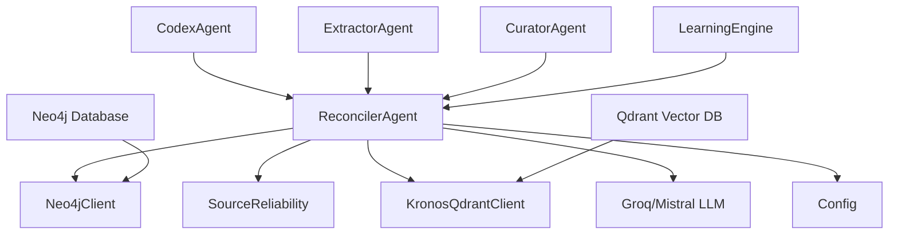
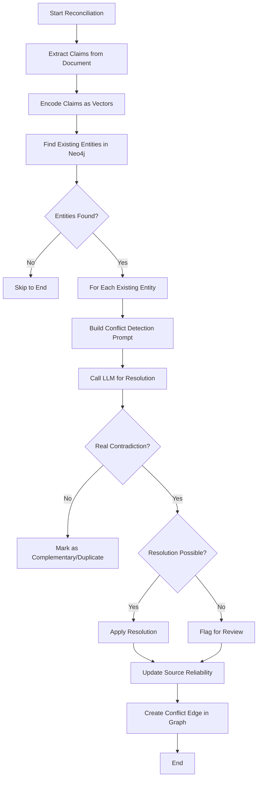

# Agent Orchestration Reconciler Module

## Overview

The `agent_orchestration_reconciler` module is a critical component of the KRONOS knowledge management system responsible for detecting, analyzing, and resolving contradictions between different sources of information about the same entities. It serves as the system's knowledge reconciliation engine, ensuring data consistency across the knowledge graph.

This module operates within the broader `agent_orchestration` subsystem, which is part of the core agent architecture that coordinates various specialized agents for knowledge processing, memory management, and ontology operations.

## Purpose and Core Functionality

The ReconcilerAgent's primary responsibilities include:

1. **Conflict Detection**: Identifying potential contradictions between different sources describing the same entity
2. **Intelligent Resolution**: Using LLM-based reasoning to determine if contradictions are real or complementary information
3. **Knowledge Graph Maintenance**: Updating the Neo4j graph database with resolution outcomes
4. **Source Reliability Tracking**: Recording which sources are more reliable based on resolution outcomes
5. **Flagging for Review**: Identifying unresolved conflicts that require human judgment

### Key Features

- **Cross-Domain Reconciliation**: Works across any domain (people, organizations, products, financial figures, legal terms, etc.)
- **Attribute-Level Analysis**: Focuses on specific attributes rather than general descriptions
- **Temporal Awareness**: Recognizes explicit revision/correction signals as strong indicators of contradictions
- **Batch Processing**: Efficiently handles multiple entities and documents
- **Uncertainty Handling**: Flags cases where LLM analysis fails or is inconclusive

## Architecture and Component Relationships

The ReconcilerAgent operates within a larger system architecture that includes:



### Component Dependencies

| Component | Purpose | Relationship |
|-----------|---------|--------------|
| `ReconcilerAgent` | Core reconciliation logic | Main component |
| `Neo4jClient` | Graph database operations | Stores entity relationships and conflict edges |
| `SourceReliability` | Tracks source credibility | Records resolution outcomes |
| `KronosQdrantClient` | Vector embeddings | Provides semantic search for claims |
| `Groq/Mistral` | LLM backend | Performs natural language reasoning |
| `Config` | System configuration | Provides model and API keys |

### Data Flow

```mermaid
dataflow
    Input[Extracted Document] --> ReconcilerAgent
    ReconcilerAgent --> Neo4jClient: Query existing entities
    ReconcilerAgent --> KronosQdrantClient: Retrieve claims
    ReconcilerAgent --> LLM: Analyze conflicts
    LLM --> ReconcilerAgent: Resolution decision
    ReconcilerAgent --> Neo4jClient: Update graph
    ReconcilerAgent --> SourceReliability: Record outcome
    Output[Reconciliation Report] --> Downstream agents
```

## Core Components

### ReconcilerAgent

The primary class that implements the reconciliation logic.

**Location**: `agents/reconciler.py`

**Key Methods**:

- `reconcile()`: Main entry point that processes an extracted document
- `_detect_conflict()`: Identifies potential conflicts between entities
- `_resolve_conflict()`: Uses LLM to analyze and resolve conflicts
- `_apply_resolution()`: Updates the knowledge graph based on resolution
- `_create_conflict_edge()`: Records conflicts in the graph database

**Configuration**:
- `RECONCILER_BACKEND`: Either "groq" or "mistral" (default: "groq")
- `RECONCILER_MODEL`: Model name for Groq backend
- `RECONCILER_MISTRAL_MODEL`: Model name for Mistral backend

## Detailed Process Flow

### Reconciliation Process



### Conflict Resolution Logic

The reconciliation process follows these steps:

1. **Input Processing**:
   - Receive extracted document with entities and claims
   - Encode all claims as vectors for efficient similarity search

2. **Entity Matching**:
   - Query Neo4j for existing entities with similar names/types
   - Filter out entities from the same source document

3. **Conflict Detection**:
   - For each matched entity pair, build a comparison prompt
   - The prompt includes:
     - Entity name and type
     - Descriptions from both sources
     - Relevant claims from both sources

4. **LLM Analysis**:
   - Send prompt to LLM backend (Groq or Mistral)
   - LLM responds with structured JSON containing:
     - `is_contradiction`: Boolean indicating if real contradiction exists
     - `conflict_type`: Type of conflict (CONTRADICTION, UPDATE, COMPLEMENTARY, DUPLICATE)
     - `contradicting_attribute`: Specific attribute in conflict
     - `confidence`: Confidence score (0.0-1.0)
     - `resolution`: How to resolve (KEEP_DOC1, KEEP_DOC2, KEEP_BOTH, FLAG_FOR_REVIEW, MERGE)
     - `reason`: Detailed explanation of the decision

5. **Resolution Application**:
   - For real contradictions:
     - Update knowledge graph with resolution outcome
     - Record source reliability based on which source was kept
   - For complementary information:
     - Mark as non-conflicting
   - For unresolved cases:
     - Create conflict edge for human review

## Integration with Other Modules

### Memory Subsystem

The reconciler interacts with the memory subsystem through the knowledge graph:
- Stores entity relationships and conflict edges
- Maintains confidence scores based on resolution outcomes
- Flags entities for review when conflicts can't be automatically resolved

**See also**: [alias_memory.md](alias_memory.md), [entity_memory.md](entity_memory.md)

### Knowledge Processing Subsystem

The reconciler receives input from:
- **ExtractorAgent**: Provides entities and claims extracted from documents
- **CuratorAgent**: May provide curated entities for reconciliation
- **AnalystAgent**: May provide analytical context for resolution decisions

**See also**: [extractor.md](extractor.md), [curator.md](curator.md), [analyst.md](analyst.md)

### Ontology Subsystem

The reconciler maintains the ontology by:
- Updating entity types and relationships
- Recording superseded entities when newer information replaces older
- Flagging entities that need ontology updates

**See also**: [ontology_evolution.md](ontology_evolution.md), [ontology_resolver.md](ontology_resolver.md)

### Agent Orchestration Subsystem

The reconciler interacts with:
- **LearningEngine**: May receive feedback on resolution patterns
- **SelfEvaluator**: May be evaluated on reconciliation accuracy

**See also**: [learning_engine.md](learning_engine.md), [self_evaluation.md](self_evaluation.md)

## Data Model

### Neo4j Graph Structure

The reconciler maintains these key relationships:

```cypher
// Entity nodes
(:Entity {
  name: string,
  type: string,
  description: string,
  source_doc: string,
  confidence: float,
  flagged: boolean,
  superseded_by: string
})

// Conflict relationships
(:Entity)-[:CONFLICTS_WITH {
  source_doc: string,
  confidence: float,
  resolution: string,
  resolution_date: datetime
}]->(:Entity)
```

### Claim Representation in Qdrant

Claims are stored as vectors with metadata:

```json
{
  "id": "unique_identifier",
  "text": "The claim text",
  "entity_name": "related_entity_name",
  "source_doc": "document_source",
  "vector": [0.1, 0.2, ...],
  "type": "claim"
}
```

## Configuration

The reconciler is configured through the system configuration:

```python
# config.py
RECONCILER_BACKEND = "groq"  # or "mistral"
RECONCILER_MODEL = "llama3-70b-8192"  # Groq model
RECONCILER_MISTRAL_MODEL = "mistral-large-latest"  # Mistral model
```

## Error Handling and Edge Cases

The reconciler handles several edge cases:

1. **LLM Call Failures**: When the LLM backend fails, the conflict is flagged for review
2. **Missing Claims**: When claims aren't available, the system falls back to descriptions
3. **No Existing Entities**: When no matching entities are found, the document is processed normally
4. **Unverifiable Conflicts**: When the system can't verify a conflict, it's flagged for later review
5. **Temporal Conflicts**: Explicit revision/correction signals are treated as strong indicators of contradictions

## Performance Considerations

1. **Batch Encoding**: Claims are encoded once per document, not per entity comparison
2. **Vector Similarity**: Uses cosine similarity for efficient claim ranking
3. **Caching**: Maintains connections to database and LLM clients
4. **Quota Management**: Respects API rate limits through quota tracking

## Monitoring and Metrics

The reconciler tracks these metrics:
- Number of conflicts found
- Number of conflicts resolved
- Number of conflicts flagged for review
- Source reliability scores
- Confidence scores for resolution decisions

## Example Usage

```python
from agents.reconciler import ReconcilerAgent

# Initialize the reconciler
reconciler = ReconcilerAgent()

# Process an extracted document
extracted_data = {
    "filename": "document.pdf",
    "entities": [
        {
            "name": "John Doe",
            "type": "Person",
            "description": "Researcher with 42 papers",
            "claims": [
                {"text": "Has published 42 papers"}
            ]
        }
    ]
}

# Reconcile the document
result = reconciler.reconcile(extracted_data)

# Output:
# {
#   "filename": "document.pdf",
#   "conflicts_found": 1,
#   "conflicts_resolved": 1,
#   "conflicts_flagged": 0,
#   "unverified_count": 0,
#   "details": [...]
# }
```

## Troubleshooting

### Common Issues

1. **High Flagged Count**: Indicates many conflicts can't be automatically resolved
   - Solution: Review flagged conflicts manually or improve LLM prompts

2. **Low Confidence Scores**: LLM is uncertain about resolution decisions
   - Solution: Adjust temperature parameter or use more specific prompts

3. **Performance Issues**: Reconciliation is slow
   - Solution: Check vector database indexing or reduce top_k parameters

4. **API Rate Limits**: LLM calls are being throttled
   - Solution: Check quota tracking or switch to a different backend

## Future Enhancements

1. **Multi-Document Context**: Consider relationships between multiple documents when resolving conflicts
2. **Temporal Analysis**: Better handling of time-based contradictions and updates
3. **Domain-Specific Rules**: Incorporate domain knowledge for more accurate reconciliation
4. **Human-in-the-Loop**: More sophisticated workflows for flagged conflicts
5. **Explainability**: Better explanations for resolution decisions

## References

- [Neo4j Client Documentation](neo4j_client.md)
- [Source Reliability Documentation](source_reliability.md)
- [Qdrant Client Documentation](qdrant_client.md)
- [Learning Engine Documentation](learning_engine.md)
- [Self Evaluator Documentation](self_evaluation.md)
- [Extractor Agent Documentation](extractor.md)
- [Curator Agent Documentation](curator.md)