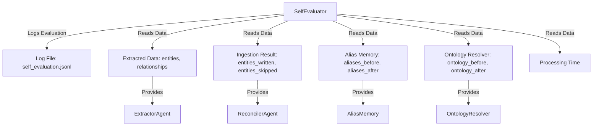
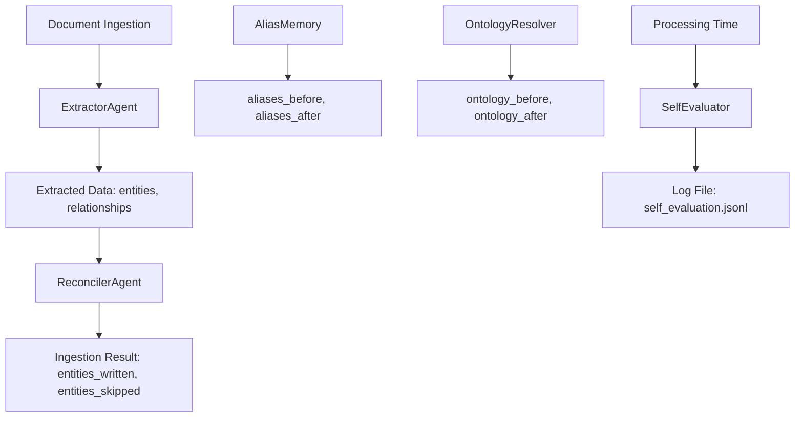
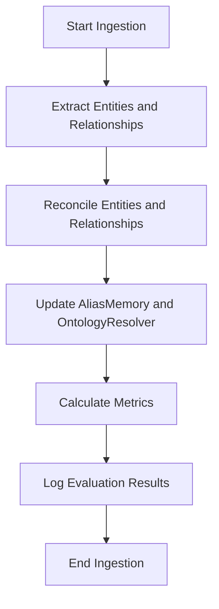

# Agent Orchestration Self-Evaluator Module

## Overview

The **Agent Orchestration Self-Evaluator** module is a critical component of the **Agent Orchestration** subsystem within the KRONOS system. It is responsible for evaluating the performance of the system after each document ingestion. This evaluation includes metrics such as the ratio of entities and relationships kept versus discarded, the number of new aliases and ontology mappings learned, and the processing time. The results are logged for trend analysis and quality monitoring over time.

This module is part of the broader **Agent Orchestration** system, which orchestrates various agents to process and ingest data efficiently. The self-evaluation mechanism ensures continuous improvement and accountability in the system's performance.

---

## Core Components

### 1. `SelfEvaluator`

**File:** `agents/self_evaluation.py`

**Purpose:**
The `SelfEvaluator` class is the primary component of this module. It evaluates the performance of the KRONOS system after each document ingestion and logs the results for future analysis.

**Key Features:**
- **Performance Metrics:** Tracks the number of entities and relationships extracted, written, skipped, or rejected.
- **Quality Metrics:** Calculates the duplicate rate and quality score of the extracted data.
- **Learning Metrics:** Measures the number of new aliases and ontology mappings learned during the ingestion process.
- **Efficiency Metrics:** Records the processing time for each document.
- **Logging:** Appends evaluation results to a log file (`self_evaluation.jsonl`) for trend analysis.

**Dependencies:**
- **`agents/self_evaluation.py`:** The `SelfEvaluator` class is the only component in this module.
- **External Dependencies:**
  - `json`: For serializing evaluation records.
  - `logging`: For logging evaluation results.
  - `pathlib.Path`: For handling file paths.
  - `datetime`: For timestamping evaluations.

**Methods:**

| Method | Description |
|--------|-------------|
| `__init__(self, log_file: str = "self_evaluation.jsonl")` | Initializes the `SelfEvaluator` with a log file path. |
| `evaluate(self, filename: str, extracted: dict, ingest_result: dict, aliases_before: int, aliases_after: int, ontology_before: int, ontology_after: int, processing_seconds: float) -> dict` | Evaluates the ingestion process and returns a dictionary of metrics. |
| `_append(self, record: dict)` | Appends an evaluation record to the log file. |
| `get_recent(self, limit: int = 10) -> list[dict]` | Retrieves the most recent evaluation records from the log file. |

**Example Usage:**
```python
from agents.self_evaluation import SelfEvaluator

# Initialize the evaluator
evaluator = SelfEvaluator(log_file="self_evaluation.jsonl")

# Example evaluation data
extracted = {
    "entities": ["entity1", "entity2"],
    "relationships": ["rel1"],
    "tier": 1,
    "quality_score": 0.95
}

ingest_result = {
    "entities_written": 2,
    "entities_skipped": 0,
    "relationships_written": 1,
    "relationships_rejected": 0
}

# Perform evaluation
evaluation = evaluator.evaluate(
    filename="example.pdf",
    extracted=extracted,
    ingest_result=ingest_result,
    aliases_before=10,
    aliases_after=12,
    ontology_before=5,
    ontology_after=7,
    processing_seconds=2.5
)

print(evaluation)
```

---

## Architecture

### Module Structure

The **Agent Orchestration Self-Evaluator** module is a standalone component within the **Agent Orchestration** subsystem. It does not have child modules but interacts with other components in the system to gather evaluation data.

### Component Relationships

The following diagram illustrates the relationships between the `SelfEvaluator` and other components in the system:



---

## Data Flow

The `SelfEvaluator` component receives data from various sources in the system and logs the evaluation results. The following diagram illustrates the data flow:



---

## Integration with Other Modules

The **Agent Orchestration Self-Evaluator** module integrates with the following modules:

1. **ExtractorAgent (`agents/extractor.py`):**
   - Provides extracted entities and relationships for evaluation.

2. **ReconcilerAgent (`agents/reconciler.py`):**
   - Provides ingestion results, including entities and relationships written or skipped.

3. **AliasMemory (`agents/alias_memory.py`):**
   - Provides the count of aliases before and after ingestion.

4. **OntologyResolver (`agents/ontology_resolver.py`):**
   - Provides the count of ontology mappings before and after ingestion.

5. **LearningEngine (`agents/learning_engine.py`):**
   - Uses evaluation data to improve the system's performance over time.

---

## Process Flows

### Evaluation Process

The following diagram illustrates the process flow for evaluating a document ingestion:



---

## Logging and Monitoring

The `SelfEvaluator` logs evaluation results to a file (`self_evaluation.jsonl`) in JSON Lines format. Each line in the log file represents a single evaluation record. The log file can be analyzed to identify trends in the system's performance over time.

### Log File Format

Each evaluation record contains the following fields:

| Field | Type | Description |
|-------|------|-------------|
| `filename` | str | The name of the ingested file. |
| `timestamp` | str | The ISO format timestamp of the evaluation. |
| `tier` | int | The tier of the extracted data. |
| `quality_score` | float | The quality score of the extracted data. |
| `entities_extracted` | int | The total number of entities extracted. |
| `entities_written` | int | The number of entities written to the database. |
| `entities_skipped` | int | The number of entities skipped during ingestion. |
| `relationships_extracted` | int | The total number of relationships extracted. |
| `relationships_written` | int | The number of relationships written to the database. |
| `relationships_rejected` | int | The number of relationships rejected during ingestion. |
| `new_aliases_learned` | int | The number of new aliases learned during ingestion. |
| `new_ontology_mappings_learned` | int | The number of new ontology mappings learned during ingestion. |
| `duplicate_rate` | float | The rate of duplicate entities or relationships. |
| `processing_seconds` | float | The time taken to process the document. |

---

## Error Handling

The `SelfEvaluator` component does not explicitly handle errors, as it primarily logs evaluation results. However, it relies on the following components to provide accurate data:

- **ExtractorAgent:** Must provide accurate extracted entities and relationships.
- **ReconcilerAgent:** Must provide accurate ingestion results.
- **AliasMemory:** Must provide accurate alias counts.
- **OntologyResolver:** Must provide accurate ontology mapping counts.

If any of these components fail to provide accurate data, the evaluation results may be incorrect.

---

## Performance Considerations

- **Log File Size:** The log file (`self_evaluation.jsonl`) can grow large over time. It is recommended to implement a log rotation strategy to manage file size.
- **Processing Time:** The `SelfEvaluator` adds minimal overhead to the ingestion process, as it primarily logs data provided by other components.

---

## Future Enhancements

1. **Real-Time Monitoring:** Implement a real-time dashboard to visualize evaluation trends.
2. **Alerting:** Add alerting for significant deviations in performance metrics.
3. **Automated Analysis:** Use machine learning to identify patterns and anomalies in evaluation data.

---

## References

- [Agent Orchestration Module](agent_orchestration.md)
- [ExtractorAgent](knowledge_processing.md)
- [ReconcilerAgent](agent_orchestration.md)
- [AliasMemory](memory.md)
- [OntologyResolver](ontology.md)
- [LearningEngine](agent_orchestration_learning_engine.md)