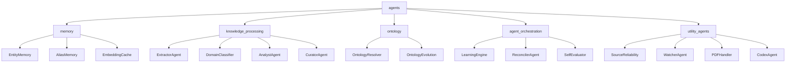
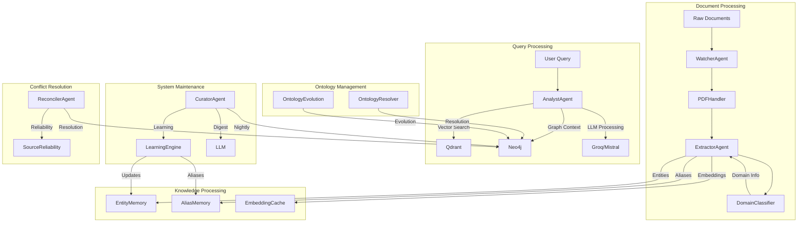

# Agents Module Overview

## Purpose
The `agents` module is a core component of the KRONOS system that provides specialized AI agents for knowledge processing, memory management, ontology operations, and system orchestration. These agents work together to extract, process, maintain, and evolve structured knowledge from raw data, serving as the intelligent backbone of the knowledge graph system.

The module is organized into four main submodules:
1. **Memory**: Tracks entity relationships, aliases, and embeddings
2. **Knowledge Processing**: Analyzes, synthesizes, and maintains structured knowledge
3. **Ontology**: Manages and evolves the knowledge graph structure
4. **Agent Orchestration**: Coordinates agent activities and system learning
5. **Utility Agents**: Provides supporting functionality for document processing and reliability assessment

## Architecture

### Core Submodules

#### 1. Memory Module
**Purpose**: Tracks entity relationships, aliases, and embeddings to maintain a coherent knowledge base.

**Components**:
- **EntityMemory**: Tracks entity relationships and confidence scores
- **AliasMemory**: Manages entity aliases and alternative names
- **EmbeddingCache**: Caches vector embeddings for performance optimization

#### 2. Knowledge Processing Module
**Purpose**: Analyzes, synthesizes, and maintains structured knowledge from raw data.

**Components**:
- **ExtractorAgent**: Processes documents to extract entities and relationships
- **DomainClassifier**: Classifies documents and entities into domains
- **AnalystAgent**: Handles user queries by combining vector search with knowledge graph context
- **CuratorAgent**: Performs nightly maintenance on the knowledge base

#### 3. Ontology Module
**Purpose**: Manages and evolves the knowledge graph structure.

**Components**:
- **OntologyResolver**: Resolves entities and relationships in the knowledge graph
- **OntologyEvolution**: Manages the evolution of the knowledge graph structure

#### 4. Agent Orchestration Module
**Purpose**: Coordinates agent activities and system learning processes.

**Components**:
- **LearningEngine**: Reinforces learning from repeated observations and tracks entity co-occurrences
- **ReconcilerAgent**: Resolves conflicts between entity descriptions from different sources
- **SelfEvaluator**: Evaluates system performance after each ingestion

#### 5. Utility Agents Module
**Purpose**: Provides supporting functionality for document processing and reliability assessment.

**Components**:
- **SourceReliability**: Assesses the reliability of information sources
- **WatcherAgent**: Monitors document changes and triggers processing
- **PDFHandler**: Processes PDF documents for knowledge extraction
- **CodexAgent**: Provides code analysis and generation capabilities

## Data Flow Architecture

## Core Components Documentation

### Memory Components
- **[EntityMemory](agents/entity_memory.py::EntityMemory)**: Tracks entity relationships and confidence scores
- **[AliasMemory](agents/alias_memory.py::AliasMemory)**: Manages entity aliases and alternative names
- **[EmbeddingCache](agents/embedding_cache.py::EmbeddingCache)**: Caches vector embeddings for performance

### Knowledge Processing Components
- **[ExtractorAgent](agents/extractor.py::ExtractorAgent)**: Processes documents to extract entities and relationships
- **[DomainClassifier](agents/domain_classifier.py::DomainClassifier)**: Classifies documents and entities into domains
- **[AnalystAgent](agents/analyst.py::AnalystAgent)**: Handles user queries by combining vector search with knowledge graph context
- **[CuratorAgent](agents/curator.py::CuratorAgent)**: Performs nightly maintenance on the knowledge base

### Ontology Components
- **[OntologyResolver](agents/ontology_resolver.py::OntologyResolver)**: Resolves entities and relationships in the knowledge graph
- **[OntologyEvolution](agents/ontology_evolution.py::OntologyEvolution)**: Manages the evolution of the knowledge graph structure

### Agent Orchestration Components
- **[LearningEngine](agents/learning_engine.py::LearningEngine)**: Reinforces learning from repeated observations
- **[ReconcilerAgent](agents/reconciler.py::ReconcilerAgent)**: Resolves conflicts between entity descriptions
- **[SelfEvaluator](agents/self_evaluation.py::SelfEvaluator)**: Evaluates system performance after each ingestion

### Utility Agents Components
- **[SourceReliability](agents/source_reliability.py::SourceReliability)**: Assesses the reliability of information sources
- **[WatcherAgent](agents/watcher.py::WatcherAgent)**: Monitors document changes and triggers processing
- **[PDFHandler](agents/watcher.py::PDFHandler)**: Processes PDF documents for knowledge extraction
- **[CodexAgent](agents/codex.py::CodexAgent)**: Provides code analysis and generation capabilities

## Integration Points

The agents module interacts with several other modules in the system:

1. **Database Module** (`database/`):
   - Interacts with Neo4jClient and QdrantClient for knowledge storage and retrieval
   - See [database.md](database.md) for details

2. **Core Module** (`core/`):
   - Relies on Config for system-wide settings
   - See [core.md](core.md) for details

3. **Utility Module** (`utils/`):
   - Uses QuotaTracker for API usage management
   - See [utils.md](utils.md) for details

4. **API Module** (`api/`):
   - Provides endpoints for user queries and approval requests
   - See [api.md](api.md) for details

## Key Features

- **Multi-agent Architecture**: Specialized agents handle different aspects of knowledge processing
- **Knowledge Maintenance**: Automated curation with confidence decay and conflict detection
- **Scalable Processing**: Handles both real-time queries and batch maintenance operations
- **Conflict Resolution**: Manages entity resolution and relationship conflicts
- **Learning Capabilities**: Identifies patterns and suggests improvements to the knowledge base
- **Document Processing**: Handles PDF and other document formats for knowledge extraction
- **Source Reliability**: Assesses and tracks the reliability of information sources
- **Performance Monitoring**: Evaluates system performance after each ingestion

## Performance Considerations

- **Query Processing**: AnalystAgent combines vector search with graph queries, requiring efficient database access
- **Maintenance Operations**: CuratorAgent performs comprehensive analysis of the entire knowledge base
- **Memory Usage**: Agents maintain connections to multiple services and databases
- **LLM Dependencies**: Processing relies on external LLM services for synthesis and analysis
- **Document Processing**: PDFHandler and WatcherAgent handle large document processing efficiently
- **Conflict Resolution**: ReconcilerAgent uses sophisticated LLM-based approaches for resolution

## Error Handling

- **Database Failures**: Connection errors trigger retry mechanisms
- **LLM Processing**: Fallback to alternative models when primary models fail
- **Memory Limits**: Quota tracking ensures fair usage across agents
- **Conflict Resolution**: Automated strategies for handling entity conflicts
- **Document Processing**: Graceful handling of malformed documents
- **Source Reliability**: Fallback mechanisms when reliability assessment fails

## Configuration

The module relies on configuration from the core config module, including:
- API keys for LLM services
- Database connection parameters
- Confidence thresholds and decay rates
- Model selection for different tasks
- Maintenance schedule parameters
- Quota limits for API usage

## Future Enhancements

- Enhanced real-time knowledge base updates
- Automated entity resolution suggestions
- Integration with additional data sources
- Multi-modal query support
- Advanced conflict resolution strategies
- Improved document processing capabilities
- Enhanced learning algorithms for better knowledge evolution