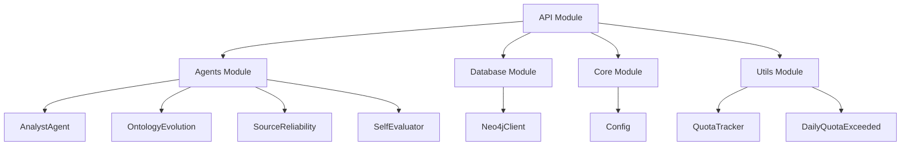
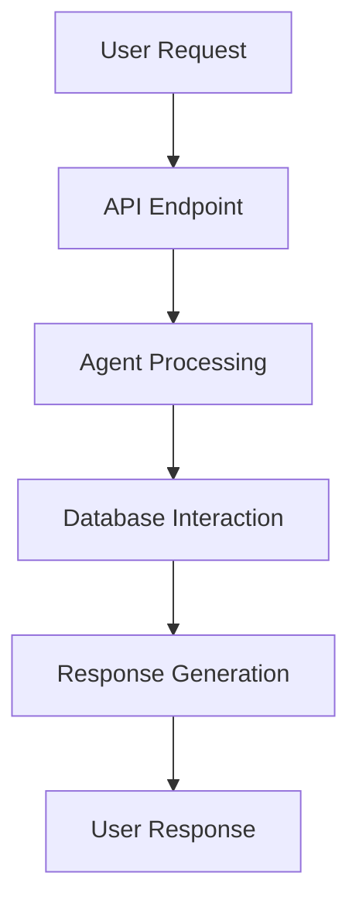
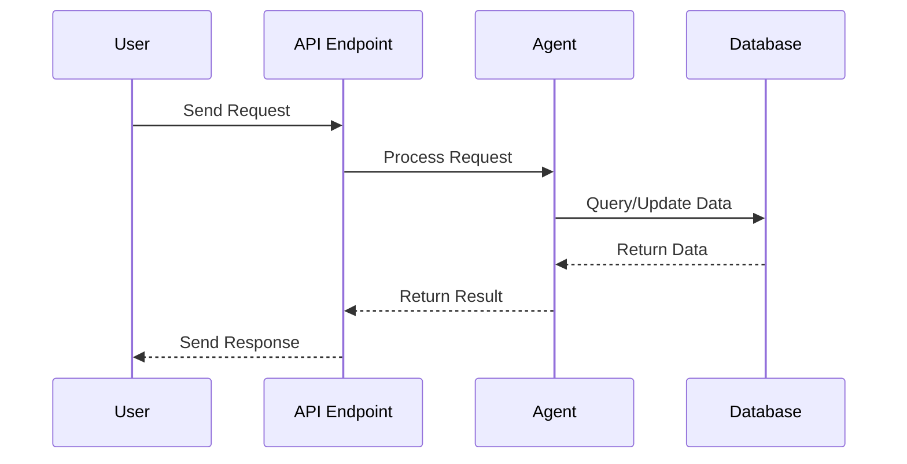

# KRONOS API Module Documentation

## Overview

The **KRONOS API** module serves as the primary interface for interacting with the KRONOS self-evolving knowledge infrastructure. It provides RESTful endpoints to query knowledge, manage ontology evolution, assess source reliability, and retrieve system status and insights. The API integrates with multiple agents, databases, and utility components to deliver a cohesive experience for users and developers.

This documentation provides a comprehensive guide to the API's architecture, components, and interactions with other modules in the system.

---

## Table of Contents

1. [Module Purpose](#module-purpose)
2. [Architecture](#architecture)
3. [Core Components](#core-components)
4. [API Endpoints](#api-endpoints)
5. [Dependencies](#dependencies)
6. [Data Flow](#data-flow)
7. [Component Interactions](#component-interactions)
8. [Error Handling](#error-handling)
9. [References](#references)

---

## Module Purpose

The KRONOS API module enables users to:

- **Query Knowledge**: Ask questions and receive hybrid answers combining graph and vector data, along with sources and conflict resolution.
- **Manage Ontology**: Approve or reject proposed ontology changes, and review pending proposals.
- **Monitor System Health**: Retrieve statistics about the knowledge graph, such as the number of entities, relationships, and average confidence scores.
- **Access Insights**: Fetch the latest digest of system insights, reliability scores for sources, and self-evaluations of processed documents.
- **Resolve Conflicts**: Identify and review conflicts in the knowledge graph.

The API acts as a bridge between the user interface and the underlying agents, databases, and utility components, ensuring seamless communication and data flow.

---

## Architecture

The KRONOS API follows a modular architecture, integrating multiple components from different modules. Below is a high-level overview of the architecture:



### Key Components

- **API Module**: The main entry point for user interactions, implemented using FastAPI.
- **Agents Module**: Provides specialized agents for querying, ontology evolution, source reliability, and self-evaluation.
- **Database Module**: Interfaces with Neo4j for graph data storage and retrieval.
- **Core Module**: Provides configuration settings for the API.
- **Utils Module**: Includes utility components for quota tracking and retry mechanisms.

---

## Core Components

### API Module (`api/main.py`)

The API module is implemented in `api/main.py` and includes the following core components:

#### `ApprovalRequest`

A Pydantic model representing a request to approve or reject an ontology change.

**Fields:**
- `key`: The unique identifier for the ontology change proposal.
- `canonical`: The canonical form of the proposed change (optional).
- `category`: The category of the proposed change (optional).

#### `QueryRequest`

A Pydantic model representing a user's query to the KRONOS system.

**Fields:**
- `question`: The question asked by the user.

#### FastAPI Application

The main FastAPI application instance, configured with the title "KRONOS API", description "Self-evolving knowledge infrastructure", and version "0.1".

#### Agent Instances

- **`analyst`**: An instance of `AnalystAgent` for processing user queries.
- **`ontology_evolution`**: An instance of `OntologyEvolution` for managing ontology changes.
- **`source_reliability_tracker`**: An instance of `SourceReliability` for tracking source reliability.
- **`self_evaluator`**: An instance of `SelfEvaluator` for assessing system performance.

#### Database Instances

- **`neo4j`**: An instance of `Neo4jClient` for interacting with the Neo4j graph database.

---

## API Endpoints

The API provides the following endpoints:

| Endpoint | Method | Description |
|----------|--------|-------------|
| `/query` | POST | Ask KRONOS a question and receive a hybrid graph + vector answer with sources and conflicts. |
| `/status` | GET | Retrieve a snapshot of the current graph health, including total entities, relationships, and average confidence. |
| `/digest/latest` | GET | Fetch the most recent Curator digest. |
| `/ontology/pending` | GET | Retrieve relation types awaiting human approval. |
| `/ontology/approve` | POST | Approve an ontology change proposal. |
| `/ontology/reject` | POST | Reject an ontology change proposal. |
| `/conflicts` | GET | Retrieve all active `CONFLICTS_WITH` edges in the graph. |
| `/sources/reliability` | GET | Retrieve reliability scores for source documents. |
| `/self-evaluation/recent` | GET | Retrieve the most recent self-evaluations of processed documents. |

### Detailed Endpoint Descriptions

#### `POST /query`

**Request Body:**
```json
{
  "question": "What is the capital of France?"
}
```

**Response:**
A hybrid answer combining graph and vector data, along with sources and conflict resolution.

**Error Responses:**
- `400 Bad Request`: If the `question` field is empty.

---

#### `GET /status`

**Response:**
```json
{
  "total_entities": 1000,
  "total_relationships": 5000,
  "avg_confidence": 0.95
}
```

---

#### `GET /digest/latest`

**Response:**
```json
{
  "filename": "digest_20231001.md",
  "content": "..."
}
```

**Error Responses:**
- `404 Not Found`: If no digests are available.

---

#### `GET /ontology/pending`

**Response:**
A list of relation types awaiting human approval.

---

#### `POST /ontology/approve`

**Request Body:**
```json
{
  "key": "relation_type_123",
  "canonical": "canonical_form",
  "category": "category_type"
}
```

**Response:**
```json
{
  "status": "approved",
  "key": "relation_type_123"
}
```

**Error Responses:**
- `404 Not Found`: If no pending proposal is found for the given `key`.

---

#### `POST /ontology/reject`

**Request Body:**
```json
{
  "key": "relation_type_123"
}
```

**Response:**
```json
{
  "status": "rejected",
  "key": "relation_type_123"
}
```

**Error Responses:**
- `404 Not Found`: If no pending proposal is found for the given `key`.

---

#### `GET /conflicts`

**Response:**
A list of active `CONFLICTS_WITH` edges in the graph, including entity names, types, and source documents.

---

#### `GET /sources/reliability`

**Response:**
A list of reliability scores for source documents, based on how often they win vs. lose contradictions.

---

#### `GET /self-evaluation/recent`

**Query Parameters:**
- `limit`: The number of recent self-evaluations to retrieve (default: 10).

**Response:**
A list of the most recent self-evaluations of processed documents.

---

## Dependencies

The API module depends on the following components from other modules:

### Agents Module

- **[AnalystAgent](agents.md#analystagent)**: Processes user queries and returns hybrid answers.
- **[OntologyEvolution](agents.md#ontologyevolution)**: Manages ontology changes and approvals.
- **[SourceReliability](agents.md#sourcereliability)**: Tracks the reliability of source documents.
- **[SelfEvaluator](agents.md#selfevaluator)**: Provides self-assessment of processed documents.

### Database Module

- **[Neo4jClient](database.md#neo4jclient)**: Interfaces with the Neo4j graph database for data storage and retrieval.

### Core Module

- **[Config](core.md#config)**: Provides configuration settings for the API.

### Utils Module

- **[QuotaTracker](utils.md#quotatracker)**: Tracks API usage quotas.
- **[DailyQuotaExceeded](utils.md#dailyquotaexceeded)**: Handles quota-related errors.

---

## Data Flow

The following diagram illustrates the data flow within the API module:



### Detailed Data Flow

1. **User Request**: A user sends a request to one of the API endpoints.
2. **API Endpoint**: The request is routed to the appropriate endpoint handler.
3. **Agent Processing**: The endpoint handler interacts with the relevant agent (e.g., `AnalystAgent`, `OntologyEvolution`) to process the request.
4. **Database Interaction**: The agent may interact with the `Neo4jClient` to retrieve or store data in the graph database.
5. **Response Generation**: The endpoint handler generates a response based on the processed data.
6. **User Response**: The response is returned to the user.

---

## Component Interactions

The following diagram illustrates the interactions between the core components of the API module:



### Example Interactions

#### Querying Knowledge

1. The user sends a `POST /query` request with a question.
2. The API endpoint handler calls the `AnalystAgent.query()` method.
3. The `AnalystAgent` processes the question and retrieves relevant data from the Neo4j graph database using the `Neo4jClient`.
4. The `AnalystAgent` returns a hybrid answer with sources and conflict resolution.
5. The API endpoint handler returns the answer to the user.

#### Managing Ontology Changes

1. The user sends a `POST /ontology/approve` request with a key and optional canonical form and category.
2. The API endpoint handler calls the `OntologyEvolution.approve()` method.
3. The `OntologyEvolution` agent approves the change and updates the ontology.
4. The API endpoint handler returns a success response to the user.

---

## Error Handling

The API module includes robust error handling to ensure a smooth user experience. Common error scenarios and their handling are described below:

### HTTP Exceptions

- **400 Bad Request**: Returned when the `question` field in a `QueryRequest` is empty.
- **404 Not Found**: Returned when no digests are available or no pending ontology proposal is found for a given key.

### Agent and Database Errors

- Errors from agents (e.g., `AnalystAgent`, `OntologyEvolution`) or the `Neo4jClient` are caught and converted to appropriate HTTP exceptions.
- The API logs errors using the `logging` module to aid in debugging and monitoring.

---

## References

For more detailed information about the components referenced in this documentation, see the following module documentation:

- **[Agents Module](agents.md)**: Detailed documentation for agents like `AnalystAgent`, `OntologyEvolution`, `SourceReliability`, and `SelfEvaluator`.
- **[Database Module](database.md)**: Documentation for `Neo4jClient` and other database-related components.
- **[Core Module](core.md)**: Documentation for `Config` and other core components.
- **[Utils Module](utils.md)**: Documentation for `QuotaTracker` and `DailyQuotaExceeded`.

---

## Conclusion

The KRONOS API module provides a comprehensive interface for interacting with the self-evolving knowledge infrastructure. By integrating multiple agents, databases, and utility components, the API delivers a cohesive experience for users and developers. This documentation serves as a guide to understanding the API's architecture, components, and interactions, enabling efficient development, maintenance, and usage.