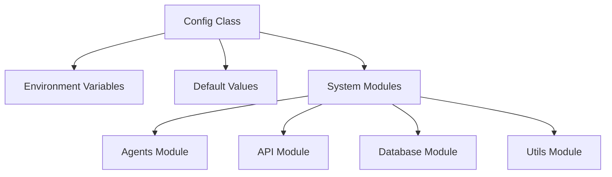
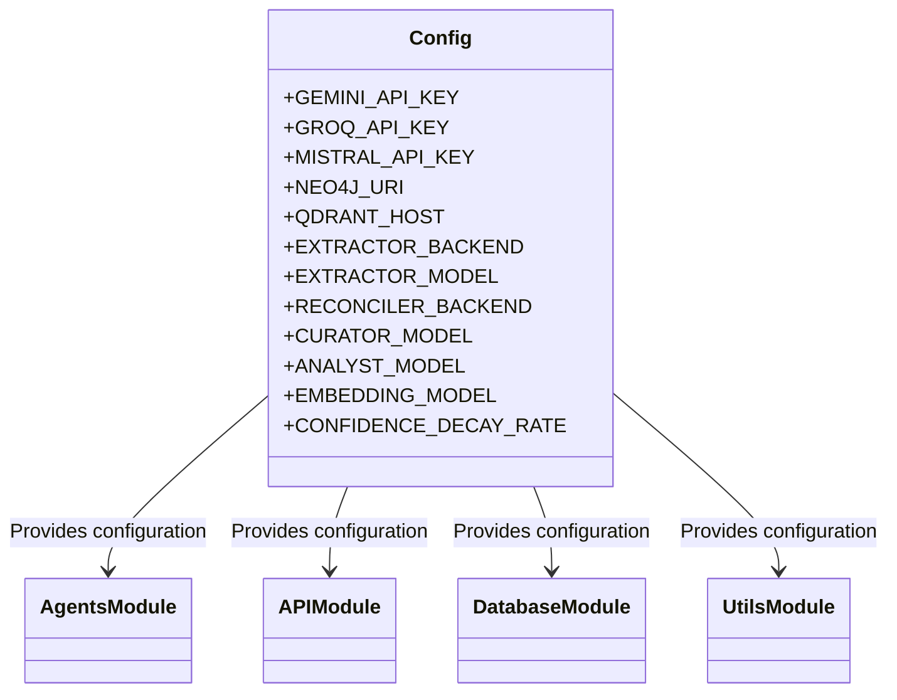
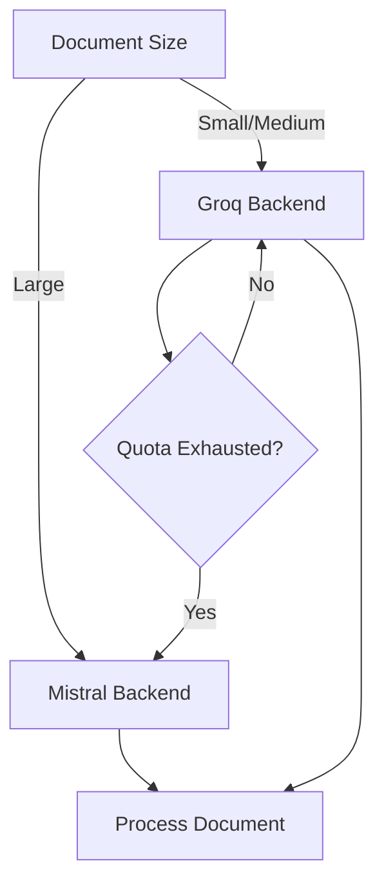
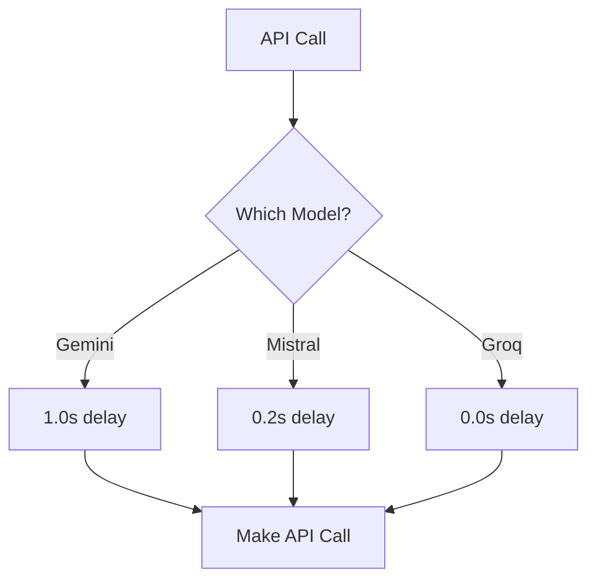

# Core Module Documentation

## Overview

The Core module serves as the central configuration hub for the Kronos system, providing environment-based configuration management for all other modules. It acts as a single source of truth for API keys, model configurations, database connections, and system-wide settings.

This module is essential for:
- Centralizing configuration management
- Enabling environment-specific deployments
- Providing consistent access to system parameters
- Supporting multi-model routing strategies

## Architecture

The Core module follows a simple but powerful architecture:



## Core Components

### Config Class

The primary component of the Core module is the `Config` class defined in `core/config.py`. This class:

1. Loads environment variables using `python-dotenv`
2. Provides default values for all configuration parameters
3. Organizes configuration into logical groups:
   - API Keys
   - Database connections
   - Model configurations
   - Path configurations
   - Rate limiting settings
   - Embedding configurations
   - Graph processing parameters

#### Configuration Groups

##### API Keys
```python
GEMINI_API_KEY = os.getenv("GEMINI_API_KEY")
GROQ_API_KEY = os.getenv("GROQ_API_KEY")
MISTRAL_API_KEY = os.getenv("MISTRAL_API_KEY")
OPENROUTER_API_KEY = os.getenv("OPENROUTER_API_KEY")
```

These keys are used across various agents and services for external API access.

##### Database Connections
```python
NEO4J_URI = os.getenv("NEO4J_URI", "bolt://localhost:7687")
NEO4J_USER = os.getenv("NEO4J_USER", "neo4j")
NEO4J_PASSWORD = os.getenv("NEO4J_PASSWORD", "kronos_password")

QDRANT_HOST = os.getenv("QDRANT_HOST", "localhost")
QDRANT_PORT = int(os.getenv("QDRANT_PORT", 6333))
```

Configures connections to both the graph database (Neo4j) and vector database (Qdrant).

##### Model Configurations

The module supports multiple AI model backends with smart routing strategies:

```python
# Local model
LOCAL_MODEL_URL = os.getenv("LOCAL_MODEL_URL", "http://localhost:1234/v1")
LOCAL_MODEL_NAME = os.getenv("LOCAL_MODEL_NAME", "qwen2.5-coder-14b-instruct")

# Extractor models
EXTRACTOR_BACKEND = os.getenv("EXTRACTOR_BACKEND", "groq")
EXTRACTOR_GEMINI_MODEL = os.getenv("EXTRACTOR_GEMINI_MODEL", "gemini-2.0-flash")
EXTRACTOR_GROQ_MODEL = "llama-3.3-70b-versatile"
EXTRACTOR_GROQ_MODEL_FAST = "llama-3.1-8b-instant"
EXTRACTOR_FALLBACK_MODEL = os.getenv("EXTRACTOR_FALLBACK_MODEL", "mistral-small-2506")
EXTRACTOR_LARGE_DOC_BACKEND = os.getenv("EXTRACTOR_LARGE_DOC_BACKEND", "mistral")
```

The system implements a sophisticated model routing strategy:
- **Primary routes**: Groq for small/medium documents, Mistral for large documents
- **Fallback mechanism**: Automatically switches to Mistral when Groq's daily quota is exhausted
- **Specialized models**: Different models for different tasks (extraction, domain classification, ontology resolution, etc.)

##### Path Configurations
```python
INBOX_PATH = os.getenv("INBOX_PATH", "data/inbox")
PROCESSED_PATH = os.getenv("PROCESSED_PATH", "data/processed")
```

Defines file system paths for document processing workflows.

##### Rate Limiting
```python
GEMINI_RATE_LIMIT_DELAY = float(os.getenv("GEMINI_RATE_LIMIT_DELAY", "1.0"))
MISTRAL_RATE_LIMIT_DELAY = float(os.getenv("MISTRAL_RATE_LIMIT_DELAY", "0.2"))
GROQ_RATE_LIMIT_DELAY = float(os.getenv("GROQ_RATE_LIMIT_DELAY", "0.0"))

# Groq rate limits
GROQ_RPM = 30
GROQ_RPM_LARGE = 10
GROQ_RPD = 14400
```

Implements rate limiting to comply with API provider restrictions and prevent quota exhaustion.

##### Embedding Configuration
```python
EMBEDDING_MODEL = "all-MiniLM-L6-v2"
EMBEDDING_DIM = 384
```

Configures the embedding model used for vector representations in the Qdrant vector database.

##### Graph Processing Parameters
```python
CONFIDENCE_DECAY_RATE = 0.05
MIN_CONFIDENCE_THRESHOLD = 0.3
```

Defines parameters for the graph-based knowledge representation system.

## Integration with Other Modules

The Core module integrates with all other modules in the system:



### Agents Module Integration

The Core module provides configuration for all agent types:
- **Extractor Agents**: Model selection and routing strategies
- **Curator Agents**: Model selection for information curation
- **Analyst Agents**: Model selection for analysis tasks
- **Ontology Agents**: Model selection for ontology operations
- **Utility Agents**: Various model configurations

For more details, see the [Agents Module Documentation](agents.md).

### API Module Integration

The API module uses Core configurations for:
- API key management
- Rate limiting
- Model selection for API endpoints

For more details, see the [API Module Documentation](api.md).

### Database Module Integration

The Core module configures connections to:
- Neo4j graph database
- Qdrant vector database

For more details, see the [Database Module Documentation](database.md).

### Utils Module Integration

The Utils module uses Core configurations for:
- Rate limiting
- Embedding configurations
- Path configurations

For more details, see the [Utils Module Documentation](utils.md).

## Configuration Management

### Environment Variables

The Config class uses environment variables for all configurable parameters, with sensible defaults provided for local development. This approach enables:

1. **Environment-specific deployments**: Different configurations for development, staging, and production
2. **Security**: Sensitive information like API keys are not hardcoded
3. **Flexibility**: Easy to change configurations without modifying code

### Smart Model Routing

The Core module implements sophisticated model routing strategies:



This strategy optimizes for:
- **Cost efficiency**: Using smaller/faster models when appropriate
- **Quality**: Using larger/better models for complex tasks
- **Reliability**: Automatic fallback when primary models reach quota limits

### Rate Limiting Strategy

The system implements comprehensive rate limiting to comply with API provider restrictions:



## Usage Examples

### Basic Usage

```python
from core.config import config

# Access configuration values
api_key = config.GROQ_API_KEY
graph_uri = config.NEO4J_URI

# Use in your application
if config.EXTRACTOR_BACKEND == "groq":
    model = config.EXTRACTOR_GROQ_MODEL
else:
    model = config.EXTRACTOR_FALLBACK_MODEL
```

### Environment-Specific Configuration

Create a `.env` file for different environments:

```env
# Development environment
GEMINI_API_KEY=your_dev_key
groq_API_KEY=your_dev_key
MISTRAL_API_KEY=your_dev_key
NEO4J_URI=bolt://dev-neo4j:7687
QDRANT_HOST=dev-qdrant
EXTRACTOR_BACKEND=groq
```

```env
# Production environment
GEMINI_API_KEY=your_prod_key
groq_API_KEY=your_prod_key
MISTRAL_API_KEY=your_prod_key
NEO4J_URI=bolt://prod-neo4j:7687
QDRANT_HOST=prod-qdrant
EXTRACTOR_BACKEND=mistral
```

## Best Practices

1. **Never commit API keys**: Always use environment variables for sensitive information
2. **Use appropriate models**: Select models based on task complexity and document size
3. **Monitor quotas**: Implement monitoring for API quota usage
4. **Test configurations**: Verify configurations in a staging environment before production deployment
5. **Document changes**: Keep documentation updated when changing configurations

## Troubleshooting

### Common Issues

1. **API quota exhaustion**: Check rate limiting settings and consider switching to fallback models
2. **Connection failures**: Verify database connection strings and credentials
3. **Model routing issues**: Check backend configurations and model availability
4. **Path issues**: Ensure configured paths exist and are accessible

### Debugging Tips

1. Print configuration values during startup to verify they're loaded correctly
2. Use environment variable overrides to test different configurations
3. Check logs for rate limiting warnings or quota exhaustion messages

## Future Enhancements

1. **Dynamic configuration reload**: Implement hot-reloading of configuration changes
2. **Configuration validation**: Add validation for configuration values
3. **Configuration UI**: Web interface for managing configurations
4. **Configuration history**: Track changes to configurations over time
5. **Configuration templates**: Pre-configured templates for different use cases

## References

- [Agents Module Documentation](agents.md)
- [API Module Documentation](api.md)
- [Database Module Documentation](database.md)
- [Utils Module Documentation](utils.md)
- [python-dotenv Documentation](https://github.com/theskumar/python-dotenv)
- [Environment Variables Best Practices](https://12factor.net/config)