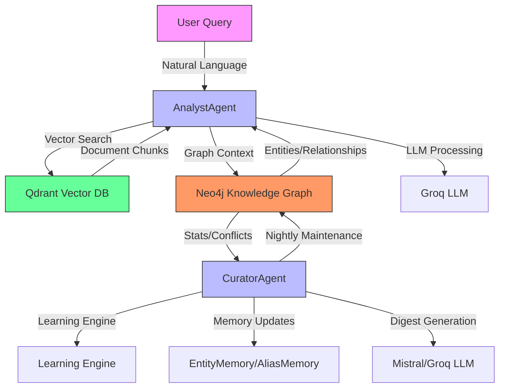
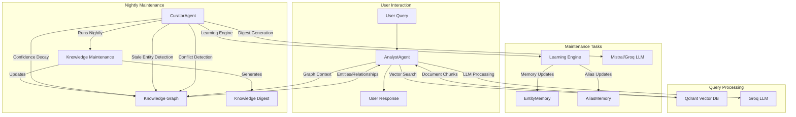

# Information Processing Module

## Overview

The `information_processing` module is a critical component of the KRONOS system responsible for analyzing, synthesizing, and maintaining the knowledge base. It serves as the bridge between raw data extraction and the structured knowledge graph, ensuring that information is properly organized, validated, and made accessible for querying.

This module contains two primary agents:
1. **AnalystAgent**: Processes user queries by synthesizing information from both vector search results and the knowledge graph
2. **CuratorAgent**: Maintains the health and quality of the knowledge base through regular curation cycles

## Architecture Overview

The information processing module operates within the broader KRONOS architecture, interacting with multiple subsystems:

## Module Components

### Core Components

The information processing module consists of two main agents:

1. **[Analyst Agent](information_processing_analyst.md)**: The AnalystAgent handles user queries by combining information from vector search and the knowledge graph, then synthesizing it into coherent answers.

2. **[Curator Agent](information_processing_curator.md)**: The CuratorAgent performs nightly maintenance on the knowledge base, including confidence decay, conflict detection, and generating health reports.

### Dependencies

The information processing module depends on several other modules:

- **[memory](memory.md)**: Provides EntityMemory and AliasMemory for tracking entity relationships and aliases
- **[knowledge_processing](knowledge_processing.md)**: The parent module that contains information processing
- **[ontology](ontology.md)**: Provides the structured knowledge graph for context
- **[agent_orchestration](agent_orchestration.md)**: Contains the LearningEngine used by CuratorAgent
- **[utility_agents](utility_agents.md)**: Provides PDF handling and other utility functions

### Data Flow

## Integration with Other Modules

### With Memory Module
The information processing module heavily relies on the memory subsystem for:
- Tracking entity relationships and aliases
- Maintaining entity confidence scores
- Managing co-occurrence patterns for learning

### With Ontology Module
The ontology module provides the structured knowledge graph that:
- Stores entities and their relationships
- Maintains conflict relationships between entities
- Provides graph-based context for queries

### With Agent Orchestration
The agent orchestration module provides the LearningEngine that:
- Identifies patterns in entity relationships
- Suggests potential aliases and relationships
- Helps maintain knowledge base quality

## Usage Patterns

### Query Processing Flow
1. User submits a natural language query
2. AnalystAgent performs vector search in Qdrant for relevant document chunks
3. AnalystAgent queries Neo4j for relevant entities and relationships
4. AnalystAgent checks for conflicts in the knowledge graph
5. AnalystAgent synthesizes all information using Groq LLM
6. User receives a structured answer with citations and confidence scores

### Maintenance Flow
1. CuratorAgent runs on a nightly schedule
2. Confidence scores are decayed for stale entities
3. Stale and low-confidence entities are identified
4. LearningEngine identifies potential aliases and relationships
5. Knowledge digest is generated and saved
6. System administrator reviews the digest for quality assurance

## Performance Considerations

- **Query Processing**: AnalystAgent queries both vector and graph databases, then uses an LLM for synthesis. Performance depends on database response times and LLM latency.
- **Maintenance**: CuratorAgent performs comprehensive analysis of the entire knowledge base, which can be resource-intensive. It's designed to run during off-peak hours.
- **Memory Usage**: Both agents maintain connections to multiple services and should properly close resources when done.

## Error Handling

- **Query Failures**: If LLM processing fails, the system falls back to alternative models
- **Database Issues**: Connection errors are logged and may trigger retry mechanisms
- **Memory Limits**: Quota tracking ensures fair usage across agents

## Configuration

The module relies on configuration from the core config module, including:
- API keys for Groq and Mistral LLMs
- Database connection parameters
- Confidence thresholds and decay rates
- Model selection for different tasks

## Future Enhancements

- Enhanced conflict resolution strategies
- Automated entity resolution suggestions
- Integration with additional data sources
- Real-time knowledge base updates
- Multi-modal query support