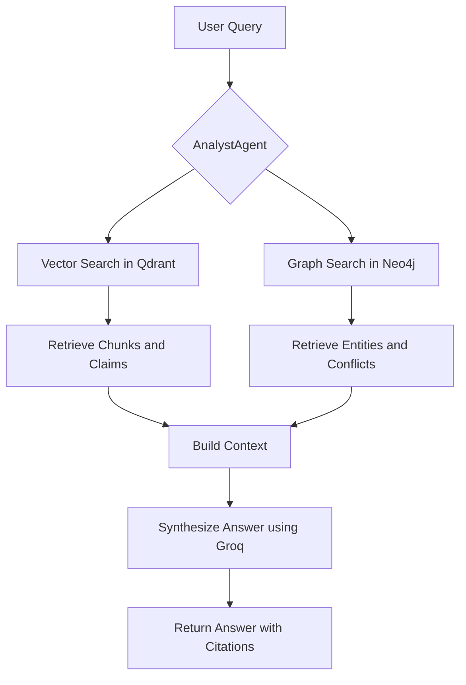
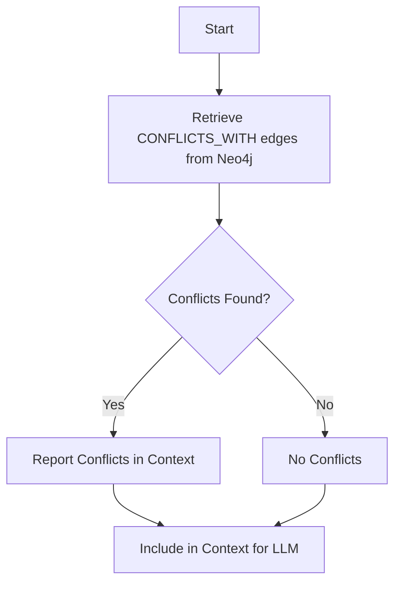

# Information Processing Analyst Module

## Overview

The **Information Processing Analyst** module is a submodule of the **Knowledge Processing** domain within the **Agents** system. It is designed to analyze and synthesize information from structured and unstructured data sources, leveraging both vector search and knowledge graph contexts. This module is primarily responsible for answering user queries by retrieving and processing relevant information from documents and knowledge graphs, ensuring accuracy, resolving conflicts, and providing well-cited responses.

The module is built around the **AnalystAgent**, which integrates with external services like Groq for natural language processing, Neo4j for graph-based data retrieval, and Qdrant for vector similarity search. It plays a critical role in the **KRONOS** system by ensuring that responses are grounded in verified data and explicitly citing sources.

---

## Purpose and Core Functionality

### Primary Objectives
1. **Query Processing**: Answer user queries using only the provided context from documents and knowledge graphs.
2. **Source Citation**: Always cite sources (document names and pages) to ensure transparency and traceability.
3. **Conflict Resolution**: Explicitly surface contradictions in the knowledge base and handle them appropriately.
4. **Confidence Assessment**: Provide confidence levels (HIGH, MEDIUM, LOW) for answers based on the quality and relevance of the retrieved context.
5. **Knowledge Integration**: Combine insights from vector search (document chunks and claims) and graph context (entities and relationships) to provide comprehensive answers.

### Key Features
- **Multi-Source Retrieval**: Combines results from vector search (Qdrant) and graph queries (Neo4j) to gather relevant context.
- **Conflict Detection**: Identifies and reports conflicts in the knowledge base using graph traversal.
- **Structured Output**: Formats answers in a standardized structure with citations, confidence levels, and conflict reports.
- **Quota Management**: Integrates with a quota system to manage API usage and prevent overuse.

---

## Architecture and Component Relationships

### High-Level Architecture
The Information Processing Analyst module is part of a larger system architecture that includes:
- **Agents**: Autonomous entities responsible for specific tasks (e.g., AnalystAgent, CuratorAgent).
- **Memory**: Components for storing and retrieving structured and unstructured data (e.g., EntityMemory, EmbeddingCache).
- **Knowledge Processing**: Modules for extracting, analyzing, and curating information (e.g., ExtractorAgent, DomainClassifier).
- **Ontology**: Components for managing and evolving the knowledge graph (e.g., OntologyEvolution, OntologyResolver).
- **Agent Orchestration**: Tools for managing and reconciling agent interactions (e.g., LearningEngine, ReconcilerAgent).
- **Utility Agents**: Supporting agents for tasks like source reliability assessment and document handling (e.g., SourceReliability, PDFHandler).

### Component Dependencies
The Information Processing Analyst module depends on the following components:

| Component | Purpose | Dependency Type |
|-----------|---------|-----------------|
| **AnalystAgent** | Core agent for processing queries and synthesizing answers | Internal |
| **Neo4jClient** | Graph database client for retrieving entities and relationships | External (Database) |
| **KronosQdrantClient** | Vector search client for retrieving document chunks and claims | External (Database) |
| **Groq** | External API for natural language processing and answer synthesis | External (API) |
| **Config** | Configuration management for API keys and model settings | External (Core) |
| **QuotaTracker** | Manages API usage quotas to prevent overuse | External (Utility) |

### Data Flow
The following diagram illustrates the data flow within the Information Processing Analyst module:

```mermaid
data-flow-diagram
    %% Define the nodes
    node "User Query" as query
    node "AnalystAgent" as analyst
    node "Qdrant (Vector Search)" as qdrant
    node "Neo4j (Graph Search)" as neo4j
    node "Groq (LLM)" as groq
    node "QuotaTracker" as quota
    node "Answer" as answer

    %% Define the edges
    query --> analyst : Input
    analyst --> qdrant : Search for chunks and claims
    analyst --> neo4j : Search for entities and conflicts
    qdrant --> analyst : Return chunks and claims
    neo4j --> analyst : Return entities and conflicts
    analyst --> quota : Acquire quota
    quota --> groq : Allow LLM call
    analyst --> groq : Send context and query
    groq --> analyst : Return synthesized answer
    analyst --> answer : Output
```

---

## Module Components

### AnalystAgent
The **AnalystAgent** is the core component of this module. It is responsible for processing user queries and synthesizing answers using a combination of vector search and graph context.

#### Key Methods
| Method | Description |
|--------|-------------|
| `__init__` | Initializes the AnalystAgent with Groq, Neo4j, and Qdrant clients. |
| `query` | Processes a user query and returns an answer with citations and confidence levels. |
| `_graph_search` | Retrieves relevant entities from the Neo4j knowledge graph. |
| `_get_conflicts` | Identifies conflicts in the knowledge base. |
| `_build_context` | Constructs a context string for the LLM using retrieved chunks, claims, entities, and conflicts. |
| `_synthesize` | Uses Groq to generate a synthesized answer based on the provided context. |
| `close` | Closes the Neo4j connection. |

#### Example Usage
```python
analyst = AnalystAgent()
result = analyst.query("What are the key claims about climate change in the IPCC report?")
print(result)
```

---

## Integration with Other Modules

### Dependencies on Other Modules
1. **Database Module**:
   - **Neo4jClient**: Used for graph-based data retrieval and conflict detection.
   - **KronosQdrantClient**: Used for vector similarity search to retrieve relevant document chunks and claims.

2. **Core Module**:
   - **Config**: Provides configuration settings such as API keys and model names.

3. **Utility Module**:
   - **QuotaTracker**: Manages API usage quotas to prevent overuse of external services like Groq.

### Referenced Modules
- [Knowledge Processing Curator](information_processing_curator.md)
- [Extractor Agent](extractor_agent.md)
- [Domain Classifier](domain_classifier.md)
- [Ontology Evolution](ontology_evolution.md)
- [Ontology Resolver](ontology_resolver.md)

---

## Process Flows

### Query Processing Flow
The following diagram illustrates the process flow for handling a user query:



### Conflict Detection Flow
The following diagram illustrates how conflicts are detected and reported:



---

## Configuration

The AnalystAgent relies on the following configuration settings, which are managed by the **Config** component:

| Setting | Description |
|---------|-------------|
| `GROQ_API_KEY` | API key for accessing the Groq service. |
| `RECONCILER_MODEL` | The model name to use for answer synthesis. |

---

## Error Handling and Edge Cases

### Handling Missing Information
- If the answer cannot be found in the provided context, the AnalystAgent will respond with: `"I don't have enough information about this in the knowledge base."`

### Conflict Resolution
- If conflicting information is found in the knowledge base, the AnalystAgent will explicitly surface the conflict in the answer.

### Low Confidence
- If the confidence in the retrieved context is low, the AnalystAgent will indicate this in the response.

---

## Performance Considerations

### Latency
- The performance of the AnalystAgent depends on the latency of the Groq API, Neo4j queries, and Qdrant searches.
- Vector search and graph queries are performed in parallel to minimize latency.

### Scalability
- The module is designed to handle multiple concurrent queries by managing API quotas and optimizing database queries.

---

## Security and Compliance

### Data Privacy
- The AnalystAgent only uses data that is explicitly provided in the context. It does not access external knowledge or proprietary data.

### Source Reliability
- The module relies on the **SourceReliability** utility agent to assess the reliability of sources. For more details, see [Source Reliability](source_reliability.md).

---

## Future Enhancements

1. **Improved Conflict Resolution**: Implement more sophisticated conflict resolution strategies, such as weighted voting or consensus-based approaches.
2. **Dynamic Context Building**: Allow the AnalystAgent to dynamically adjust the context based on user feedback.
3. **Multi-Modal Queries**: Extend the module to handle multi-modal queries (e.g., images, audio).
4. **Real-Time Updates**: Integrate with the **WatcherAgent** to process real-time document updates and ensure the knowledge base is up-to-date.

---

## References

- [Knowledge Processing Curator](information_processing_curator.md)
- [Extractor Agent](extractor_agent.md)
- [Domain Classifier](domain_classifier.md)
- [Ontology Evolution](ontology_evolution.md)
- [Ontology Resolver](ontology_resolver.md)
- [Source Reliability](source_reliability.md)
- [Neo4jClient](database_module.md)
- [KronosQdrantClient](database_module.md)
- [Config](core_module.md)
- [QuotaTracker](utils_module.md)