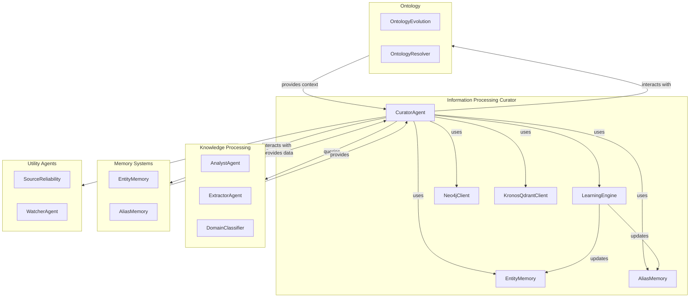
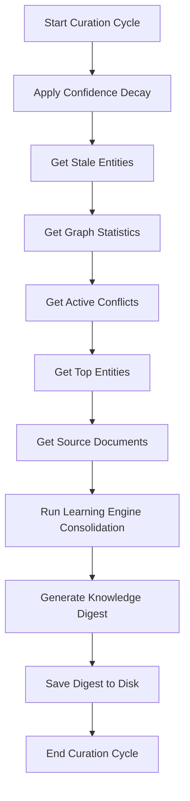

# Information Processing Curator Module

## Overview

The **Information Processing Curator** module is a critical component of the KRONOS knowledge management system, responsible for maintaining the health and quality of the knowledge graph. It acts as a nightly health monitor and curator, ensuring that the knowledge base remains accurate, up-to-date, and free from conflicts or stale information.

This module is part of the broader **Knowledge Processing** subsystem within the KRONOS agent ecosystem, specifically under the **information_processing_curator** submodule. It works closely with other components such as the Learning Engine, Entity Memory, and Alias Memory to perform its duties.

## Purpose and Core Functionality

The CuratorAgent's primary responsibilities include:

1. **Knowledge Base Health Assessment**:
   - Evaluating the overall health of the knowledge graph
   - Identifying stale or low-confidence knowledge
   - Detecting active conflicts between entities

2. **Knowledge Consolidation and Reinforcement**:
   - Running the Learning Engine's consolidation pass to reinforce aliases
   - Identifying unlinked entity pairs that frequently co-occur
   - Updating memory systems with new insights

3. **Digest Generation and Reporting**:
   - Generating a comprehensive Knowledge Digest report
   - Saving the digest for system administrators
   - Providing actionable recommendations for improving knowledge quality

4. **Confidence Management**:
   - Applying confidence decay to stale entities
   - Tracking and reporting on entity confidence levels

## Architecture and Component Relationships

The CuratorAgent operates within a complex ecosystem of interconnected components. Below is a high-level architecture diagram showing its relationships with other modules:

### Component Dependencies

1. **LearningEngine**: Used for running consolidation passes to reinforce aliases and identify unlinked entity pairs.
2. **EntityMemory**: Used for batching and flushing entity updates.
3. **AliasMemory**: Used for immediate alias reinforcement.
4. **Neo4jClient**: The primary graph database client for querying and updating the knowledge graph.
5. **KronosQdrantClient**: Used for vector similarity searches and embeddings.

## Data Flow and Process Overview

The CuratorAgent follows a well-defined process flow during its nightly execution:

### Detailed Process Flow

1. **Initialization**:
   - The CuratorAgent initializes with connections to Groq and Mistral APIs, Neo4j, and Qdrant clients.
   - It also initializes the LearningEngine component.

2. **Confidence Decay**:
   - Applies a decay factor to the confidence scores of entities that haven't been updated recently.
   - This ensures that stale information gradually loses its influence in the knowledge graph.

3. **Stale Entity Identification**:
   - Queries the Neo4j database for entities with confidence scores below a configurable threshold.

4. **Graph Statistics Collection**:
   - Gathers overall statistics about the knowledge graph (total entities, relationships, average confidence, etc.).

5. **Conflict Detection**:
   - Identifies entities that have conflicting information from different sources.

6. **Top Entity Selection**:
   - Retrieves the highest-confidence entities for reporting.

7. **Source Analysis**:
   - Analyzes which source documents contribute the most entities to the knowledge graph.

8. **Learning Engine Consolidation**:
   - Runs the Learning Engine's consolidation pass to:
     - Reinforce aliases between entities
     - Identify unlinked entity pairs that frequently co-occur
   - Updates EntityMemory and AliasMemory with new insights

9. **Digest Generation**:
   - Compiles all collected data into a comprehensive Knowledge Digest report.
   - Uses Mistral AI (with Groq fallback) to generate a human-readable report.

10. **Digest Persistence**:
    - Saves the generated digest to disk for review by system administrators.

11. **Cleanup**:
    - Closes connections to dependent components.

## Core Components

### CuratorAgent

The primary class in this module, responsible for executing the nightly curation cycle.

#### Key Methods

- **`run()`**: Executes the full curation cycle, returning a summary of actions taken.
- **`_decay_confidence()`**: Applies confidence decay to stale entities.
- **`_get_conflicts()`**: Queries for active conflicts in the knowledge graph.
- **`_get_top_entities()`**: Retrieves the highest-confidence entities.
- **`_get_sources()`**: Analyzes source document contributions.
- **`_generate_digest()`**: Compiles and formats the Knowledge Digest report.
- **`_save_digest()`**: Persists the digest to disk.
- **`close()`**: Cleans up resources.

#### Configuration

The CuratorAgent relies on several configuration parameters from the system config:

- `GROQ_API_KEY`: API key for Groq fallback service
- `MISTRAL_API_KEY`: API key for Mistral AI service
- `MIN_CONFIDENCE_THRESHOLD`: Minimum confidence score for an entity to be considered active
- `CONFIDENCE_DECAY_RATE`: Rate at which confidence decays for stale entities
- `CURATOR_MODEL`: Model to use for digest generation
- `RECONCILER_MODEL`: Fallback model for digest generation

## Integration with Other Modules

### LearningEngine

The CuratorAgent works closely with the LearningEngine to:

1. Run consolidation passes to reinforce aliases between entities
2. Identify unlinked entity pairs that frequently co-occur but lack explicit relationships
3. Update memory systems with new insights

For more details, see the [LearningEngine module documentation](learning_engine.md).

### EntityMemory and AliasMemory

These memory systems are updated during the curation process:

- **EntityMemory**: Used for batching and flushing entity updates
- **AliasMemory**: Used for immediate alias reinforcement

For more details, see the [Memory Systems documentation](memory_systems.md).

### Neo4jClient and KronosQdrantClient

The CuratorAgent interacts with these database clients to:

- Query and update the knowledge graph
- Retrieve graph statistics
- Identify stale entities and conflicts
- Apply confidence decay

For more details, see the [Database Clients documentation](database_clients.md).

## Error Handling and Fallbacks

The CuratorAgent implements robust error handling:

1. **API Fallback**: If Mistral AI fails to generate the digest, it falls back to Groq.
2. **Quota Management**: Uses the QuotaTracker to manage API usage and prevent quota exhaustion.
3. **Logging**: Comprehensive logging of all operations and decisions.

## Performance Considerations

1. **Batch Processing**: The CuratorAgent is designed to run as a nightly batch process to minimize impact on system performance.
2. **Memory Efficiency**: Uses batching for EntityMemory updates to reduce memory overhead.
3. **Database Optimization**: Queries are optimized to minimize database load during the curation cycle.

## Security Considerations

1. **API Keys**: Sensitive API keys are managed through the system configuration.
2. **Data Integrity**: The curation process maintains data integrity by using transactions where appropriate.
3. **Access Control**: Digest reports are saved to a dedicated logs directory with appropriate file permissions.

## Future Enhancements

Potential areas for future improvement:

1. **Automated Resolution**: Automatically resolve simple conflicts based on confidence scores.
2. **Interactive Dashboard**: Provide a web-based interface for reviewing curation reports.
3. **Customizable Thresholds**: Allow administrators to configure curation parameters dynamically.
4. **Performance Metrics**: Track and report on curation process performance over time.

## References

- [LearningEngine Module Documentation](learning_engine.md)
- [Memory Systems Documentation](memory_systems.md)
- [Database Clients Documentation](database_clients.md)
- [Configuration Management Documentation](config_management.md)
- [API Usage and Quota Management](api_quota_management.md)