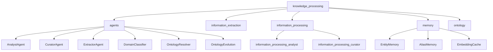
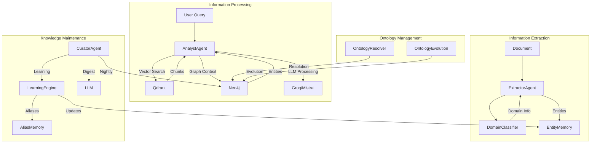

# Knowledge Processing Module Overview

## Purpose
The `knowledge_processing` module is a core component of the KRONOS system responsible for analyzing, synthesizing, and maintaining structured knowledge from raw data. It serves as the bridge between raw data extraction (handled by extractor agents) and the structured knowledge graph, ensuring information is properly organized, validated, and made accessible for querying.

The module encompasses several specialized agents that handle different aspects of knowledge processing:
- **Information Extraction**: Domain classification and entity extraction from documents
- **Information Processing**: Analysis and synthesis of extracted information
- **Memory Management**: Tracking entity relationships and aliases
- **Ontology Management**: Maintaining and evolving the knowledge graph structure
- **Knowledge Curation**: Ensuring knowledge base quality through maintenance cycles

## Architecture

The module follows a hierarchical architecture with these key components:

### Core Submodules

1. **Information Extraction** (`agents/extractor.py`, `agents/domain_classifier.py`)
   - Processes raw documents to extract entities and classify domains
   - Handles both structured and unstructured data sources

2. **Information Processing** (`agents/analyst.py`, `agents/curator.py`)
   - **AnalystAgent**: Synthesizes information for user queries using vector search and knowledge graph context
   - **CuratorAgent**: Performs nightly maintenance to ensure knowledge base quality

3. **Memory Management** (`agents/entity_memory.py`, `agents/alias_memory.py`, `agents/embedding_cache.py`)
   - Tracks entity relationships, aliases, and embeddings
   - Maintains confidence scores and co-occurrence patterns

4. **Ontology Management** (`agents/ontology_resolver.py`, `agents/ontology_evolution.py`)
   - Maintains and evolves the knowledge graph structure
   - Handles entity resolution and relationship conflicts

## Core Components Documentation

### Information Extraction Components
- **[ExtractorAgent](agents/extractor.py::ExtractorAgent)**: Processes documents to extract entities and relationships
- **[DomainClassifier](agents/domain_classifier.py::DomainClassifier)**: Classifies documents and entities into domains

### Information Processing Components
- **[AnalystAgent](agents/analyst.py::AnalystAgent)**:
  - Handles user queries by combining vector search results with knowledge graph context
  - Synthesizes information using LLMs to generate coherent answers
  - [Detailed Documentation](agents/analyst.md)

- **[CuratorAgent](agents/curator.py::CuratorAgent)**:
  - Performs nightly maintenance on the knowledge base
  - Handles confidence decay, conflict detection, and digest generation
  - [Detailed Documentation](agents/curator.md)

### Memory Components
- **[EntityMemory](agents/entity_memory.py::EntityMemory)**: Tracks entity relationships and confidence scores
- **[AliasMemory](agents/alias_memory.py::AliasMemory)**: Manages entity aliases and alternative names
- **[EmbeddingCache](agents/embedding_cache.py::EmbeddingCache)**: Caches vector embeddings for performance

### Ontology Components
- **[OntologyResolver](agents/ontology_resolver.py::OntologyResolver)**: Resolves entities and relationships in the knowledge graph
- **[OntologyEvolution](agents/ontology_evolution.py::OntologyEvolution)**: Manages the evolution of the knowledge graph structure

## Data Flow Architecture

## Integration Points

The knowledge_processing module interacts with several other modules:

1. **Memory Module**: For entity tracking and relationship management
2. **Ontology Module**: For structured knowledge graph operations
3. **Agent Orchestration**: For learning and maintenance operations
4. **Utility Agents**: For document processing and reliability assessment
5. **Database Layer**: Qdrant (vector DB) and Neo4j (graph DB)

## Key Features

- **Multi-source Integration**: Combines information from documents, vector search, and knowledge graph
- **Quality Maintenance**: Automated curation with confidence decay and conflict detection
- **Scalable Processing**: Handles both real-time queries and batch maintenance operations
- **Conflict Resolution**: Manages entity resolution and relationship conflicts
- **Learning Capabilities**: Identifies patterns and suggests improvements to the knowledge base

## Performance Considerations

- **Query Processing**: AnalystAgent combines vector search with graph queries, requiring efficient database access
- **Maintenance Operations**: CuratorAgent performs comprehensive analysis of the entire knowledge base
- **Memory Usage**: Agents maintain connections to multiple services and databases
- **LLM Dependencies**: Processing relies on external LLM services for synthesis and analysis

## Error Handling

- **Database Failures**: Connection errors trigger retry mechanisms
- **LLM Processing**: Fallback to alternative models when primary models fail
- **Memory Limits**: Quota tracking ensures fair usage across agents
- **Conflict Resolution**: Automated strategies for handling entity conflicts

## Configuration

The module relies on configuration from the core config module, including:
- API keys for LLM services
- Database connection parameters
- Confidence thresholds and decay rates
- Model selection for different tasks
- Maintenance schedule parameters

## Future Enhancements

- Enhanced real-time knowledge base updates
- Automated entity resolution suggestions
- Integration with additional data sources
- Multi-modal query support
- Advanced conflict resolution strategies