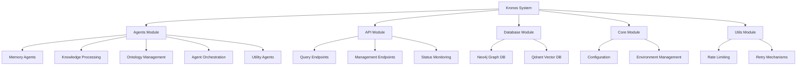
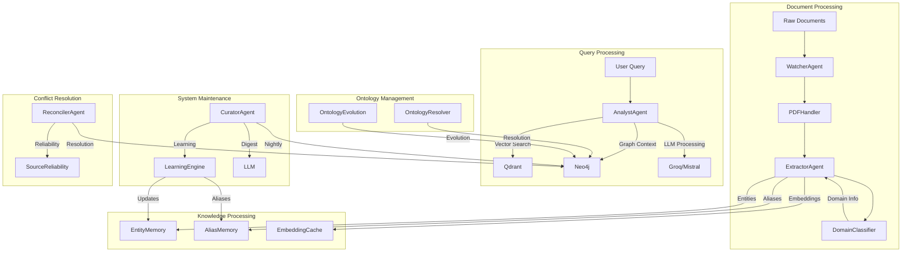
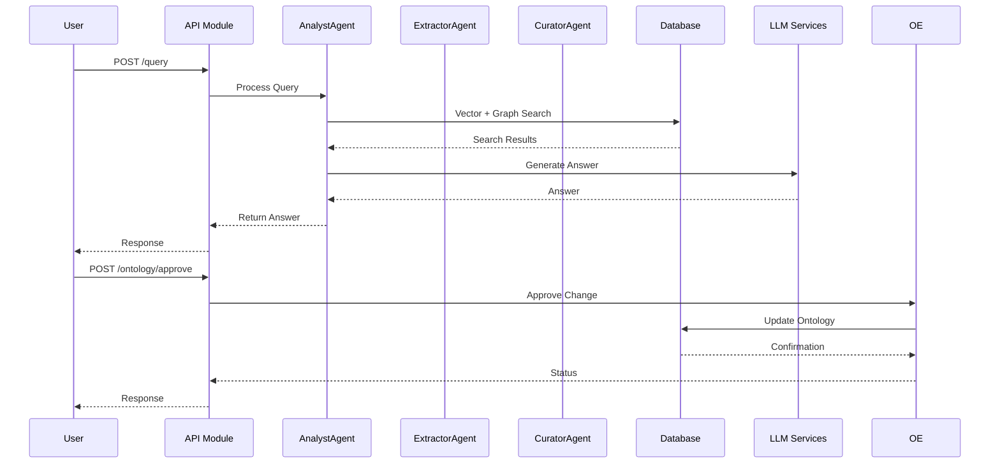
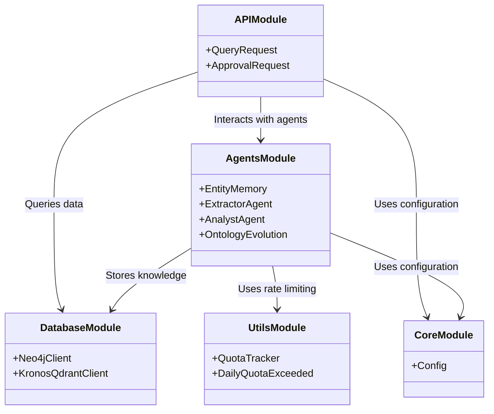

# Kronos Repository Overview

## Purpose

The **Kronos** repository implements a self-evolving knowledge infrastructure that processes documents, extracts structured knowledge, maintains a knowledge graph, and provides intelligent query capabilities. The system combines multiple AI agents, databases, and utility components to create a dynamic knowledge management platform.

Kronos is designed to:
- Extract entities and relationships from documents
- Maintain a knowledge graph with confidence scores
- Handle user queries using hybrid search (vector + graph)
- Evolve its knowledge base through automated learning
- Resolve conflicts and manage source reliability
- Provide RESTful API access for integration

## Architecture Overview

The system follows a modular microservices architecture with clear separation of concerns:



## End-to-End Architecture

### Data Flow Architecture



### Component Interactions



## Core Modules Documentation

### 1. Agents Module

**Purpose**: Provides specialized AI agents for knowledge processing, memory management, ontology operations, and system orchestration.

**Key Components**:
- **Memory Agents**: `EntityMemory`, `AliasMemory`, `EmbeddingCache`
- **Knowledge Processing**: `ExtractorAgent`, `DomainClassifier`, `AnalystAgent`, `CuratorAgent`
- **Ontology Management**: `OntologyResolver`, `OntologyEvolution`
- **Agent Orchestration**: `LearningEngine`, `ReconcilerAgent`, `SelfEvaluator`
- **Utility Agents**: `SourceReliability`, `WatcherAgent`, `PDFHandler`, `CodexAgent`

**Documentation**: [agents.md](agents.md)

### 2. API Module

**Purpose**: Provides RESTful endpoints for interacting with the knowledge infrastructure.

**Key Endpoints**:
- `POST /query` - Process user queries with hybrid answers
- `GET /status` - Retrieve system health metrics
- `GET /digest/latest` - Fetch latest system digest
- `GET /ontology/pending` - List pending ontology changes
- `POST /ontology/approve` - Approve ontology changes
- `POST /ontology/reject` - Reject ontology changes
- `GET /conflicts` - List knowledge conflicts
- `GET /sources/reliability` - Get source reliability scores
- `GET /self-evaluation/recent` - Retrieve recent self-evaluations

**Documentation**: [api.md](api.md)

### 3. Database Module

**Purpose**: Provides database connectivity and operations for the knowledge graph and vector storage.

**Key Components**:
- **Neo4jClient**: Graph database operations
- **KronosQdrantClient**: Vector database operations

**Documentation**: [database.md](database.md)

### 4. Core Module

**Purpose**: Central configuration hub for the entire system.

**Key Features**:
- Environment-based configuration management
- API key management
- Model routing strategies
- Rate limiting configuration
- Database connection settings

**Documentation**: [core.md](core.md)

### 5. Utils Module

**Purpose**: Provides utility functions for rate limiting and retry mechanisms.

**Key Components**:
- **QuotaTracker**: Manages API rate limits
- **DailyQuotaExceeded**: Handles quota exhaustion
- **Retry Decorators**: Exponential backoff for transient failures

**Documentation**: [utils.md](utils.md)

## Integration Points

The system integrates multiple components:



## Key Features

1. **Multi-Agent Architecture**: Specialized agents handle different aspects of knowledge processing
2. **Hybrid Query Processing**: Combines vector search with graph context for better answers
3. **Knowledge Maintenance**: Automated curation with confidence decay and conflict detection
4. **Ontology Evolution**: Dynamic evolution of the knowledge graph structure
5. **Source Reliability**: Assessment of information source credibility
6. **Conflict Resolution**: Management of entity and relationship conflicts
7. **Learning Capabilities**: Identification of patterns and suggestions for knowledge base improvements
8. **Document Processing**: Handling of PDF and other document formats
9. **Performance Monitoring**: System self-evaluation after each ingestion
10. **RESTful API**: Comprehensive API for integration and interaction

## Performance Considerations

- **Query Processing**: AnalystAgent combines vector search with graph queries
- **Maintenance Operations**: CuratorAgent performs comprehensive analysis of the entire knowledge base
- **Memory Usage**: Agents maintain connections to multiple services and databases
- **LLM Dependencies**: Processing relies on external LLM services
- **Document Processing**: PDFHandler and WatcherAgent handle large document processing
- **Conflict Resolution**: Uses sophisticated LLM-based approaches

## Error Handling

- **Database Failures**: Connection errors trigger retry mechanisms
- **LLM Processing**: Fallback to alternative models when primary models fail
- **Memory Limits**: Quota tracking ensures fair usage across agents
- **Conflict Resolution**: Automated strategies for handling entity conflicts
- **Document Processing**: Graceful handling of malformed documents
- **Source Reliability**: Fallback mechanisms when reliability assessment fails

## Configuration

The system uses environment-based configuration with sensible defaults:

```python
# Example configuration
NEO4J_URI="bolt://localhost:7687"
GROQ_API_KEY="your_api_key"
EXTRACTOR_BACKEND="groq"
EMBEDDING_MODEL="all-MiniLM-L6-v2"
CONFIDENCE_DECAY_RATE=0.05
```

## Future Enhancements

1. Enhanced real-time knowledge base updates
2. Automated entity resolution suggestions
3. Integration with additional data sources
4. Multi-modal query support
5. Advanced conflict resolution strategies
6. Improved document processing capabilities
7. Enhanced learning algorithms for better knowledge evolution
8. Distributed deployment support
9. Enhanced monitoring and alerting
10. Graphical interface for knowledge exploration

## Getting Started

1. Clone the repository
2. Set up environment variables in `.env` file
3. Install dependencies: `pip install -r requirements.txt`
4. Start the system components
5. Access the API at `http://localhost:8000`

## References

- [Agents Module Documentation](agents.md)
- [API Module Documentation](api.md)
- [Database Module Documentation](database.md)
- [Core Module Documentation](core.md)
- [Utils Module Documentation](utils.md)