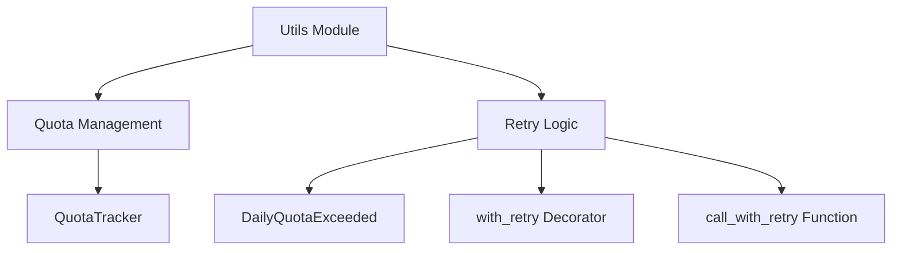
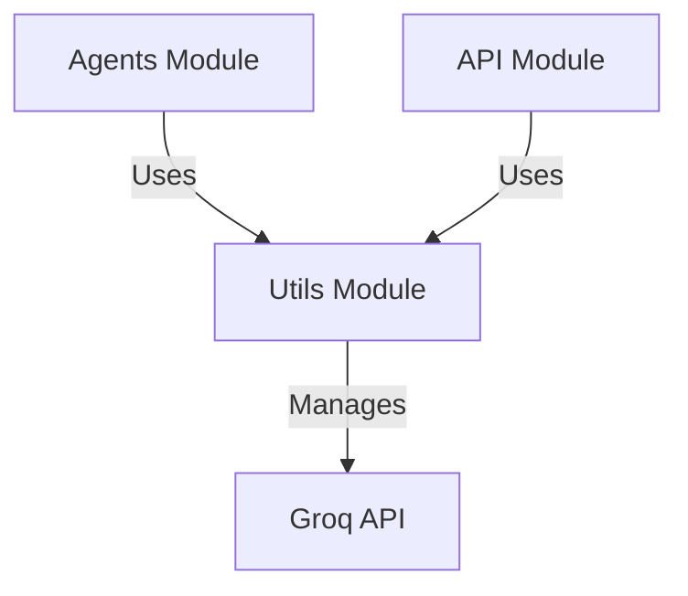

# Utils Module Documentation

## Overview

The `utils` module provides essential utility functions and classes for the system, focusing on rate limiting and retry mechanisms. These utilities help manage API quotas and handle transient failures gracefully.

## Architecture



## Core Components

### 1. Quota Management (`utils/quota.py`)

The quota management system enforces rate limits at the system level across all agents, particularly for Groq API calls.

#### Key Features:
- Thread-safe shared quota tracking
- Enforces both per-minute and daily rate limits
- Tracks usage statistics and wait times
- Implements safety margins to prevent hitting actual limits

#### Main Class:
- **`QuotaTracker`**: Manages Groq API rate limits with thread-safe operations

#### Dependencies:
- Uses Python's `threading` and `logging` modules
- Implements `QuotaExhaustedError` for error handling

#### Detailed Documentation:
For more information, see [utils_quota.md](utils_quota.md)

---

### 2. Retry Logic (`utils/retry.py`)

The retry system provides exponential backoff for handling transient failures while quickly failing for permanent issues like daily quota exhaustion.

#### Key Features:
- Exponential backoff retry mechanism
- Error classification to determine retry strategy
- Fast failure for daily quota exhaustion
- Decorator and function-based interfaces

#### Main Components:
- **`DailyQuotaExceeded`**: Exception raised when daily quota is exhausted
- **`with_retry`**: Decorator for adding retry logic to functions
- **`call_with_retry`**: Function-based retry mechanism

#### Error Classification:
The system classifies errors into:
- `daily_quota`: Permanent failure requiring fallback
- `rate_limit`: Temporary failure requiring backoff
- `network`: Temporary failure requiring backoff
- `unknown`: Generic failure requiring backoff

#### Dependencies:
- Uses Python's `time` and `logging` modules
- Works with `QuotaTracker` for rate limit management

#### Detailed Documentation:
For more information, see [utils_retry.md](utils_retry.md)

## Integration with Other Modules



### Agents Module Integration
The `agents` module heavily relies on the utils module for:
- Rate limiting Groq API calls through `QuotaTracker`
- Retry mechanisms for transient failures through `with_retry` and `call_with_retry`

Key agent components that use utils:
- `AnalystAgent` for information processing
- `ExtractorAgent` for information extraction
- `CuratorAgent` for knowledge curation
- All agents making Groq API calls

### API Module Integration
The `api` module uses utils for:
- Managing API request quotas
- Implementing retry logic for API calls
- Handling rate limit responses appropriately

## Usage Examples

### Using QuotaTracker
```python
from utils.quota import groq_quota

# Block until a Groq request slot is available
can_proceed = groq_quota.acquire(agent_name="analyst", large_model=False)
if can_proceed:
    # Make API call
    response = make_groq_api_call()
```

### Using Retry Decorator
```python
from utils.retry import with_retry

@with_retry(max_attempts=5, base_delay=2.0)
def call_groq_api(prompt):
    # API call implementation
    return response

try:
    response = call_groq_api("Analyze this data")
except DailyQuotaExceeded:
    # Fall back to alternative provider
    response = call_alternative_api("Analyze this data")
```

### Using Retry Function
```python
from utils.retry import call_with_retry

def process_data(data):
    # Processing implementation
    return result

try:
    result = call_with_retry(process_data, data, max_attempts=3)
except DailyQuotaExceeded:
    # Handle quota exhaustion
    handle_quota_exhaustion()
```

## Configuration

The utils module uses the following configuration constants:

### Groq API Limits
```python
GROQ_RPM = 30           # 8B models requests per minute
GROQ_RPM_LARGE = 10     # 70B models requests per minute
GROQ_RPD = 14400        # Total requests per day
SAFETY_MARGIN = 0.85    # Safety margin to prevent hitting actual limits
```

### Retry Configuration
```python
max_attempts = 5        # Default maximum retry attempts
base_delay = 2.0        # Default base delay in seconds
```

## Error Handling

### QuotaExhaustedError
Raised when the daily quota limit is reached. This is a permanent failure that requires waiting until the next day or switching to a different provider.

### DailyQuotaExceeded
Raised by the retry system when an error indicates daily quota exhaustion. This allows callers to quickly fail and implement fallback strategies.

## Performance Considerations

1. **Thread Safety**: The `QuotaTracker` uses threading.Lock to ensure thread-safe operations.
2. **Memory Usage**: The system maintains minimal state (only recent request timestamps).
3. **CPU Usage**: Error classification is lightweight and fast.
4. **Wait Time Calculation**: Uses exponential backoff for rate limits and linear backoff for network errors.

## Monitoring and Metrics

The `QuotaTracker` provides detailed statistics through the `get_stats()` method:
- Requests in the current minute
- Requests today and remaining daily quota
- Total calls and wait times

Example usage:
```python
stats = groq_quota.get_stats()
print(f"Requests this minute: {stats['requests_this_minute']}")
print(f"Daily usage: {stats['requests_today']}/{stats['daily_limit']}")
```

## Best Practices

1. Always use the `QuotaTracker` when making API calls to Groq
2. Implement fallback strategies when `DailyQuotaExceeded` is raised
3. Use the retry decorators for transient operations
4. Monitor quota usage through the provided statistics
5. Adjust retry parameters based on your specific needs

## Future Enhancements

1. Support for additional API providers beyond Groq
2. Dynamic quota limit configuration
3. Distributed quota tracking for multi-process environments
4. Integration with monitoring systems for quota alerts
5. More sophisticated error classification and handling