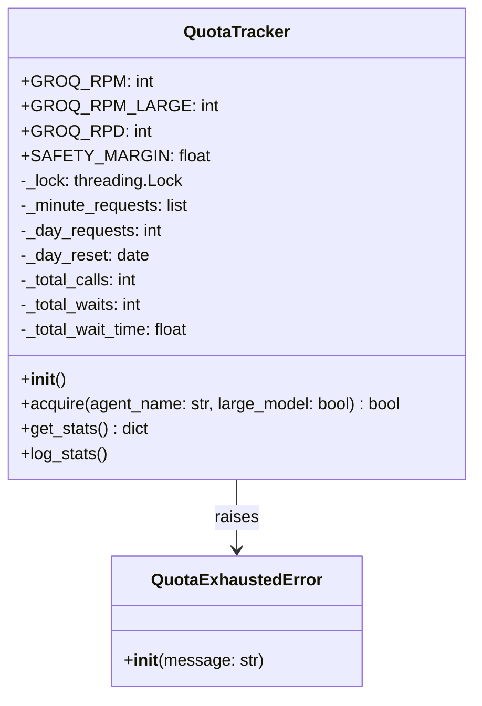
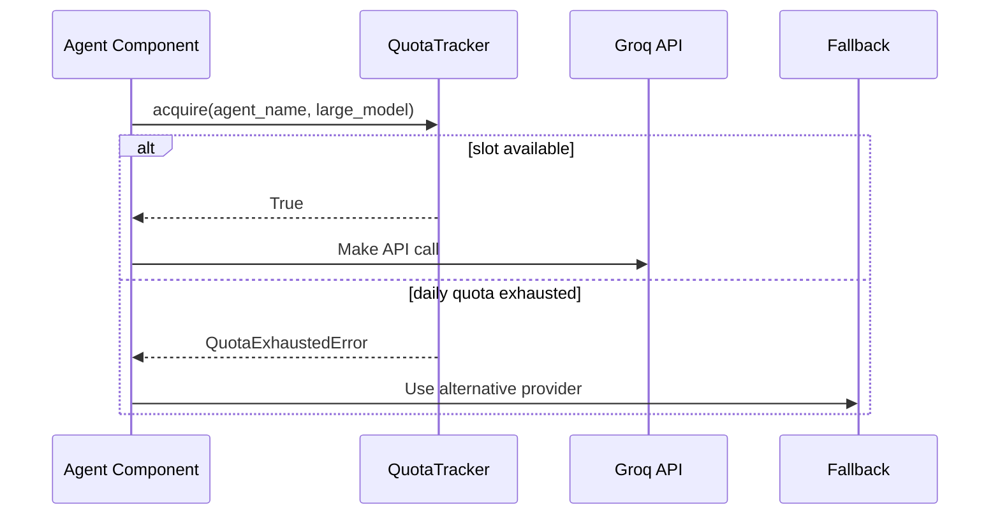

# Utils Quota Module Documentation

## Overview

The `utils/quota.py` module provides a thread-safe shared quota tracker for managing API rate limits, particularly for Groq API calls. It enforces both per-minute and daily rate limits while tracking usage statistics.

## Architecture



## Core Components

### QuotaTracker Class

The main class for managing API rate limits with thread-safe operations.

#### Class Variables
- `GROQ_RPM = 30`: Requests per minute limit for 8B models
- `GROQ_RPM_LARGE = 10`: Requests per minute limit for 70B models
- `GROQ_RPD = 14400`: Total requests per day limit
- `SAFETY_MARGIN = 0.85`: Safety margin to prevent hitting actual limits

#### Instance Variables
- `_lock`: Threading lock for thread-safe operations
- `_minute_requests`: List of timestamps for recent requests
- `_day_requests`: Counter for requests today
- `_day_reset`: Date when the daily counter resets
- `_total_calls`: Total number of API calls made
- `_total_waits`: Total number of wait periods
- `_total_wait_time`: Total time spent waiting

#### Methods

##### `__init__(self)`
Initializes the quota tracker with default values.

##### `acquire(self, agent_name: str = "unknown", large_model: bool = False) -> bool`
Blocks until a Groq request slot is available.

Parameters:
- `agent_name`: Name of the agent making the request (for logging)
- `large_model`: Whether to use the stricter 70B model limit

Returns:
- `True` when safe to proceed with the API call

Raises:
- `QuotaExhaustedError` when daily quota is exhausted

##### `get_stats(self) -> dict`
Returns current usage statistics.

Returns a dictionary with:
- `requests_this_minute`: Number of requests in the current minute
- `requests_today`: Number of requests today
- `daily_limit`: Daily limit with safety margin applied
- `daily_remaining`: Remaining daily quota
- `total_calls`: Total number of API calls made
- `total_waits`: Total number of wait periods
- `total_wait_time_seconds`: Total time spent waiting in seconds

##### `log_stats(self)`
Logs current usage statistics using the logger.

#### Usage Example

```python
from utils.quota import QuotaTracker, groq_quota

# Using the global instance
can_proceed = groq_quota.acquire(agent_name="analyst", large_model=False)
if can_proceed:
    # Make API call
    response = make_groq_api_call()

# Or create a custom instance
custom_quota = QuotaTracker()
can_proceed = custom_quota.acquire(agent_name="custom_agent", large_model=True)
```

## Error Handling

### QuotaExhaustedError

Exception raised when the daily quota limit is reached. This is a permanent failure that requires waiting until the next day or switching to a different provider.

Example handling:
```python
from utils.quota import QuotaTracker, groq_quota, QuotaExhaustedError

try:
    can_proceed = groq_quota.acquire(agent_name="analyst")
except QuotaExhaustedError as e:
    # Handle quota exhaustion
    print(f"Daily quota exhausted: {e}")
    # Implement fallback strategy
```

## Integration with Other Components



### Agent Module Integration

All agent components that make Groq API calls should use the `QuotaTracker`:
- `AnalystAgent` for information processing
- `ExtractorAgent` for information extraction
- `CuratorAgent` for knowledge curation
- Any other agent making Groq API calls

### API Module Integration

The API module uses the `QuotaTracker` to:
- Enforce rate limits for all API requests
- Track usage statistics
- Implement proper error responses when quotas are exhausted

## Performance Considerations

1. **Thread Safety**: Uses `threading.Lock` to ensure thread-safe operations
2. **Memory Usage**: Maintains minimal state (only recent request timestamps)
3. **CPU Usage**: Operations are lightweight and fast
4. **Wait Time Calculation**: Uses precise timing for wait period calculations

## Monitoring and Metrics

The `QuotaTracker` provides detailed statistics through the `get_stats()` method. This information can be used for:
- Monitoring current usage
- Alerting when approaching limits
- Analyzing usage patterns
- Optimizing API call scheduling

Example monitoring integration:
```python
import time
from utils.quota import groq_quota

# Monitor quota usage
while True:
    stats = groq_quota.get_stats()
    print(f"Current usage: {stats['requests_this_minute']}/min, {stats['requests_today']}/day")
    time.sleep(60)
```

## Configuration

The `QuotaTracker` uses the following configuration constants:

```python
GROQ_RPM = 30           # 8B models requests per minute
GROQ_RPM_LARGE = 10     # 70B models requests per minute
GROQ_RPD = 14400        # Total requests per day
SAFETY_MARGIN = 0.85    # Safety margin to prevent hitting actual limits
```

These constants can be adjusted based on:
- Changes in API provider limits
- Safety requirements
- Expected usage patterns

## Best Practices

1. Always use the `QuotaTracker` when making API calls to Groq
2. Provide meaningful `agent_name` values for better logging
3. Monitor usage statistics regularly
4. Implement proper error handling for `QuotaExhaustedError`
5. Consider implementing fallback strategies when quotas are exhausted
6. Use the global `groq_quota` instance for most use cases
7. Create custom instances only when needed for specific rate limiting requirements

## Future Enhancements

1. Support for additional API providers beyond Groq
2. Dynamic quota limit configuration
3. Distributed quota tracking for multi-process environments
4. Integration with monitoring systems for quota alerts
5. More detailed usage analytics and reporting
6. Support for different rate limiting strategies