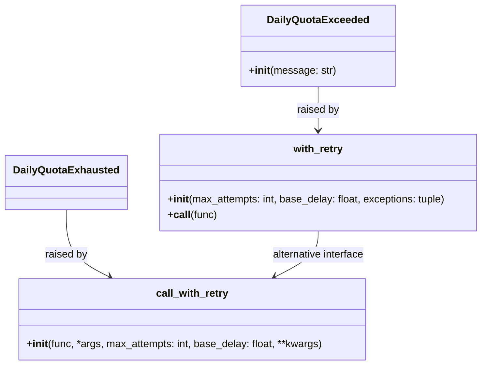
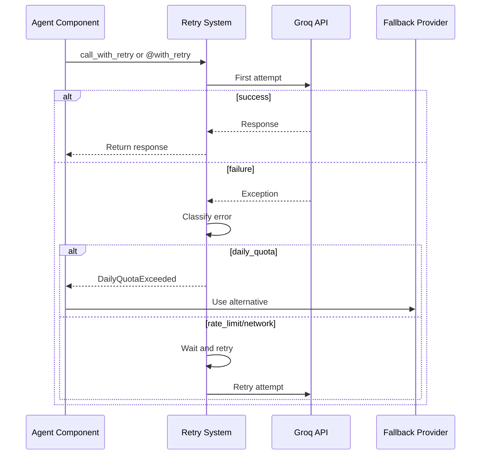

# Utils Retry Module Documentation

## Overview

The `utils/retry.py` module provides retry mechanisms with exponential backoff for handling transient failures while quickly failing for permanent issues like daily quota exhaustion. It includes both decorator and function-based interfaces.

## Architecture



## Core Components

### DailyQuotaExceeded Exception

Exception raised when an error indicates a daily token/request quota is exhausted. This is a permanent failure that requires switching to a different provider rather than retrying.

#### Definition
```python
class DailyQuotaExceeded(Exception):
    """
    Raised when an error indicates a DAILY token/request quota is exhausted
    (not a per-minute/per-second rate limit). Retrying within the same call
    cannot fix this — the caller should fall back to a different
    provider/model instead of burning retry attempts and time.
    """
```

#### Usage Example
```python
from utils.retry import DailyQuotaExceeded

try:
    # API call that might raise DailyQuotaExceeded
    response = make_api_call()
except DailyQuotaExceeded as e:
    # Implement fallback strategy
    response = make_fallback_call()
```

### with_retry Decorator

Decorator that adds exponential backoff retry logic to functions.

#### Definition
```python
def with_retry(max_attempts: int = 5, base_delay: float = 2.0,
               exceptions: tuple = (Exception,)):
    """
    Decorator for exponential backoff retry logic.
    Handles rate limits and transient failures.

    Fails FAST (raises DailyQuotaExceeded, no retries) if the error looks
    like a daily quota being exhausted — backoff cannot fix that within
    the same run.
    """
```

#### Parameters
- `max_attempts`: Maximum number of retry attempts (default: 5)
- `base_delay`: Base delay in seconds for exponential backoff (default: 2.0)
- `exceptions`: Tuple of exception types to catch and retry (default: (Exception,))

#### Usage Example
```python
from utils.retry import with_retry

@with_retry(max_attempts=3, base_delay=1.0)
def call_groq_api(prompt):
    # API call implementation
    return response

try:
    response = call_groq_api("Analyze this data")
except DailyQuotaExceeded:
    # Fall back to alternative provider
    response = call_alternative_api("Analyze this data")
```

### call_with_retry Function

Function-based interface for retry logic that doesn't require decorators.

#### Definition
```python
def call_with_retry(func, *args, max_attempts: int = 5, base_delay: float = 2.0, **kwargs):
    """
    Non-decorator version for inline use.

    Fails FAST (raises DailyQuotaExceeded, no retries) if the error looks
    like a daily quota being exhausted — callers can catch this specifically
    to fall back to a different provider instead of retrying pointlessly.
    """
```

#### Parameters
- `func`: Function to call with retry logic
- `*args`: Positional arguments to pass to the function
- `max_attempts`: Maximum number of retry attempts (default: 5)
- `base_delay`: Base delay in seconds for exponential backoff (default: 2.0)
- `**kwargs`: Keyword arguments to pass to the function

#### Usage Example
```python
from utils.retry import call_with_retry, DailyQuotaExceeded

def process_data(data):
    # Processing implementation
    return result

try:
    result = call_with_retry(process_data, data, max_attempts=3)
except DailyQuotaExceeded:
    # Handle quota exhaustion
    handle_quota_exhaustion()
```

### Error Classification

The retry system classifies errors to determine the appropriate retry strategy:

```python
_ classify_error(error_str: str) -> str:
    """
    Returns one of: "daily_quota", "rate_limit", "network", "unknown"
    """
```

Error types:
- **daily_quota**: Permanent failure requiring fallback (e.g., "tokens per day exceeded")
- **rate_limit**: Temporary failure requiring backoff (e.g., HTTP 429)
- **network**: Temporary failure requiring backoff (e.g., connection errors)
- **unknown**: Generic failure requiring backoff

## Integration with Other Components



### Agent Module Integration

All agent components that make API calls should use the retry system:
- `AnalystAgent` for information processing
- `ExtractorAgent` for information extraction
- `CuratorAgent` for knowledge curation
- Any other agent making API calls

### API Module Integration

The API module uses the retry system to:
- Implement robust error handling for API calls
- Provide consistent retry behavior across all API interactions
- Handle rate limits and transient failures gracefully

## Usage Patterns

### Basic Usage
```python
from utils.retry import with_retry

@with_retry()
def make_api_call(endpoint, data):
    # API call implementation
    return response
```

### Custom Retry Parameters
```python
from utils.retry import with_retry

@with_retry(max_attempts=3, base_delay=1.0)
def make_api_call(endpoint, data):
    # API call implementation
    return response
```

### Function-based Usage
```python
from utils.retry import call_with_retry

def process_data(data):
    # Processing implementation
    return result

result = call_with_retry(process_data, data, max_attempts=5)
```

### Handling Quota Exhaustion
```python
from utils.retry import with_retry, DailyQuotaExceeded

@with_retry()
def call_groq_api(prompt):
    # API call implementation
    return response

try:
    response = call_groq_api("Analyze this data")
except DailyQuotaExceeded:
    # Implement fallback strategy
    response = call_alternative_api("Analyze this data")
```

## Configuration

The retry system uses the following default configuration:

```python
max_attempts = 5        # Default maximum retry attempts
base_delay = 2.0        # Default base delay in seconds
```

These parameters can be adjusted based on:
- Expected API reliability
- Performance requirements
- Error handling needs

## Error Handling

### DailyQuotaExceeded

Raised when an error indicates daily quota exhaustion. This is a permanent failure that requires switching to a different provider.

Example handling:
```python
from utils.retry import with_retry, DailyQuotaExceeded

@with_retry()
def make_api_call():
    # API call implementation
    pass

try:
    make_api_call()
except DailyQuotaExceeded as e:
    # Implement fallback strategy
    print(f"Daily quota exhausted: {e}")
    fallback_result = make_fallback_call()
```

### Other Exceptions

All other exceptions are caught and retried according to the configured parameters.

## Performance Considerations

1. **Error Classification**: Lightweight and fast classification of error strings
2. **Wait Time Calculation**: Uses exponential backoff for rate limits and linear backoff for network errors
3. **Retry Logic**: Minimal overhead for successful operations
4. **Memory Usage**: No significant memory overhead

## Monitoring and Metrics

The retry system logs important events at different levels:
- `INFO`: Successful operations, wait periods
- `WARNING`: Rate limit hits, network errors
- `ERROR`: Final failure after all retry attempts

Example log output:
```
INFO: RetryDecorator: Rate limit hit on make_api_call, attempt 2/5. Waiting 4.0s
WARNING: RetryDecorator: Error on make_api_call attempt 3/5: Connection timeout. Waiting 6.0s
ERROR: make_api_call failed after 5 attempts. Last error: Connection timeout
```

## Best Practices

1. Always use retry mechanisms for API calls
2. Implement proper error handling for `DailyQuotaExceeded`
3. Choose appropriate retry parameters based on your needs
4. Monitor retry statistics and adjust parameters as needed
5. Use the decorator interface for most cases
6. Use the function-based interface when decorators aren't practical
7. Provide meaningful error messages for better debugging

## Future Enhancements

1. Support for custom error classification
2. Integration with monitoring systems for retry statistics
3. More sophisticated backoff algorithms
4. Support for circuit breakers
5. Retry hooks for custom logic (e.g., logging, metrics)
6. Support for async/await functions
7. More detailed retry statistics and reporting