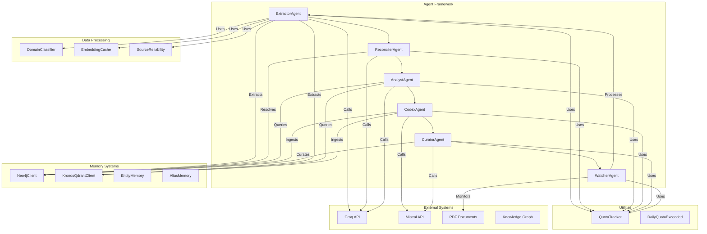
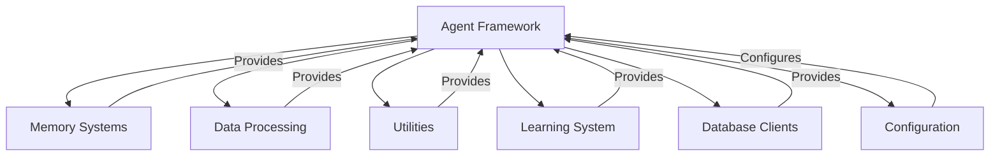
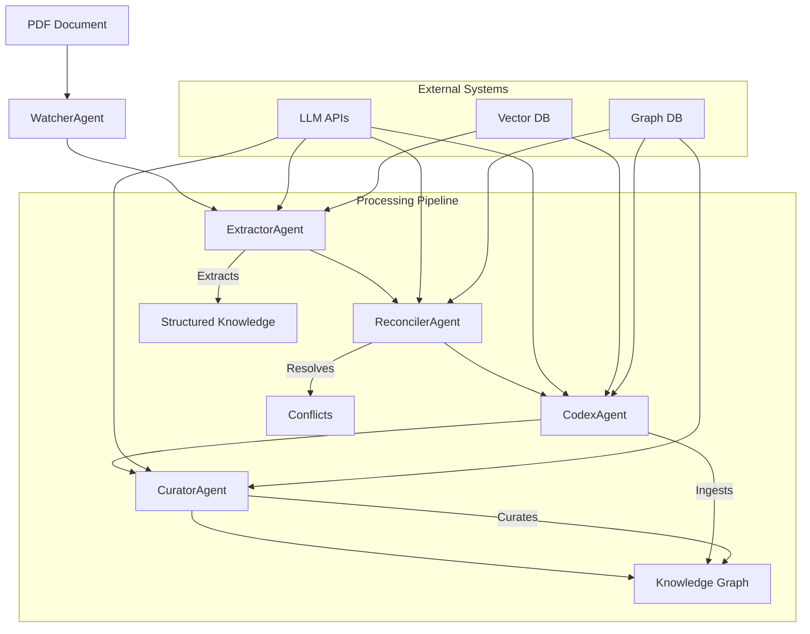

# Agent Framework Module Overview

## Purpose

The `agent_framework` module is the core intelligence layer of the KRONOS knowledge management system. It provides a comprehensive framework for knowledge processing, analysis, and synthesis through specialized AI agents that work together to extract, reconcile, analyze, and maintain structured knowledge from unstructured documents.

This module serves as the orchestration layer that coordinates multiple specialized agents, each responsible for different aspects of the knowledge lifecycle:

- **Extraction**: Processing documents to extract entities, relationships, and claims
- **Reconciliation**: Resolving conflicts between different sources of information
- **Analysis**: Synthesizing information to answer complex queries
- **Ingestion**: Integrating processed knowledge into the knowledge graph
- **Curation**: Maintaining the health and quality of the knowledge base

## Architecture

The agent framework follows a modular, layered architecture with clear separation of concerns and well-defined interfaces between components:



### Component Relationships

The agent framework integrates with several other modules in the KRONOS system:



## Core Components

The agent framework consists of six primary agents, each with specialized responsibilities:

### 1. ExtractorAgent
**Location:** `agents/extractor.py::ExtractorAgent`

**Purpose:** Processes PDF documents to extract structured knowledge including entities, relationships, claims, and summaries.

**Key Responsibilities:**
- Document parsing and text extraction
- Domain classification
- Intelligent chunking based on document complexity
- Multi-backend AI processing (Groq, Mistral, local models)
- Confidence scoring and quality assessment
- Fallback mechanisms for error handling

**Integration Points:**
- Uses `DomainClassifier` for document categorization
- Implements `QuotaTracker` for API management
- Stores extracted data in Neo4j and Qdrant via database clients

### 2. ReconcilerAgent
**Location:** `agents/reconciler.py::ReconcilerAgent`

**Purpose:** Resolves conflicts between different sources of information about the same entities, ensuring knowledge graph consistency.

**Key Responsibilities:**
- Conflict detection between entities
- Cross-domain reconciliation (people, organizations, products, etc.)
- Attribute-level analysis of contradictions
- Source credibility tracking
- Resolution decision making using LLM backends

**Integration Points:**
- Queries Neo4j for existing entity information
- Uses `SourceReliability` to track source credibility
- Leverages vector similarity search via Qdrant
- Implements `QuotaTracker` for API usage management

### 3. AnalystAgent
**Location:** `agents/analyst.py::AnalystAgent`

**Purpose:** Synthesizes information from multiple sources to provide accurate, well-sourced answers to user queries.

**Key Responsibilities:**
- Multi-source information retrieval (vector search, graph search)
- Conflict detection and handling
- Context building from multiple knowledge sources
- LLM-based answer synthesis
- Source attribution and transparency

**Integration Points:**
- Uses `Neo4jClient` for graph-based entity relationships
- Uses `KronosQdrantClient` for vector search operations
- Implements `EmbeddingCache` for efficient vector operations
- Uses `QuotaTracker` for API quota management

### 4. CodexAgent
**Location:** `agents/codex.py::CodexAgent`

**Purpose:** Ingests extracted knowledge into the knowledge graph, handling entity resolution, relationship mapping, and cross-domain integration.

**Key Responsibilities:**
- Entity ingestion and validation
- Alias resolution and duplicate detection
- Relationship mapping and ontology integration
- Knowledge graph maintenance
- Self-evaluation of ingestion quality

**Integration Points:**
- Uses `AliasMemory` and `EntityMemory` for tracking relationships
- Leverages `EmbeddingCache` for performance optimization
- Integrates with `OntologyResolver` for relationship type resolution
- Uses `LearningEngine` and `SelfEvaluator` for quality assessment

### 5. CuratorAgent
**Location:** `agents/curator.py::CuratorAgent`

**Purpose:** Maintains the health and quality of the knowledge graph through nightly curation cycles.

**Key Responsibilities:**
- Confidence decay monitoring
- Stale entity identification
- Conflict detection and resolution
- Alias reinforcement
- Knowledge digest generation

**Integration Points:**
- Works with `LearningEngine` for consolidation
- Uses `EntityMemory` and `AliasMemory` for tracking
- Generates reports using LLM backends
- Implements `QuotaTracker` for API management

### 6. WatcherAgent
**Location:** `agents/watcher.py::WatcherAgent`

**Purpose:** Monitors a designated inbox directory for new PDF files and orchestrates their processing through the agent pipeline.

**Key Responsibilities:**
- File system monitoring for new documents
- Deduplication and validation
- Multi-stage processing pipeline orchestration
- Error handling and quarantine management
- Backlog processing

**Integration Points:**
- Coordinates with `ExtractorAgent`, `ReconcilerAgent`, and `CodexAgent`
- Uses utilities like `is_duplicate`, `mark_processed`, and `call_with_retry`
- Relies on configuration for directory paths

## Data Flow

The agent framework implements a comprehensive knowledge processing pipeline:



### Detailed Processing Pipeline

1. **Ingestion Phase** (WatcherAgent → ExtractorAgent)
   - New documents are detected in the inbox directory
   - Documents are parsed and text is extracted
   - Content is classified by domain
   - Documents are chunked based on complexity tier
   - AI backends process chunks to extract entities, relationships, and claims

2. **Reconciliation Phase** (ExtractorAgent → ReconcilerAgent)
   - Extracted entities are compared with existing knowledge
   - Conflicts between sources are identified
   - Resolution decisions are made using LLM backends
   - Source credibility scores are updated based on outcomes

3. **Ingestion Phase** (ReconcilerAgent → CodexAgent)
   - Processed knowledge is ingested into the knowledge graph
   - Entity resolution and alias handling occur
   - Relationships are mapped and validated
   - Cross-domain integration is managed
   - Evidence and provenance are recorded

4. **Curation Phase** (CodexAgent → CuratorAgent)
   - Nightly curation cycles maintain knowledge base health
   - Confidence scores are decayed for stale entities
   - Conflicts are detected and resolved
   - Aliases are reinforced based on co-occurrence patterns
   - Knowledge digests are generated for human review

## Integration with Supporting Modules

The agent framework relies on several supporting modules for its operation:

### Memory Systems
- **Neo4jClient**: Graph database operations for entity relationships
- **KronosQdrantClient**: Vector database operations for semantic search
- **EntityMemory**: In-memory entity tracking and embeddings
- **AliasMemory**: Alias resolution and canonical name management

### Data Processing
- **DomainClassifier**: Document categorization by domain
- **EmbeddingCache**: Performance optimization for vector operations
- **SourceReliability**: Source credibility tracking and scoring

### Utilities
- **QuotaTracker**: API usage management and rate limiting
- **DailyQuotaExceeded**: Exception handling for quota limits
- **Retry Mechanisms**: Robust error handling and recovery

### Learning System
- **LearningEngine**: Pattern recognition in entity co-occurrence
- **SelfEvaluator**: Quality assessment and system performance monitoring

### Database Clients
- **Neo4jClient**: Graph database interface
- **KronosQdrantClient**: Vector database interface

### Configuration
- **Config**: Centralized configuration management for all agents

## Key Features

### 1. Multi-Backend AI Processing
The framework supports multiple AI backends (Groq, Mistral, local models) with smart routing based on document characteristics and API availability.

### 2. Comprehensive Error Handling
Robust error handling with retry logic, fallback mechanisms, and quarantine systems ensures reliable operation even with imperfect inputs.

### 3. Source Credibility Tracking
The `SourceReliability` component tracks the credibility of different sources based on reconciliation outcomes, enabling better decision making.

### 4. Cross-Domain Knowledge Integration
Agents handle entities spanning multiple domains (technology, science, business, etc.) with appropriate validation and resolution strategies.

### 5. Knowledge Graph Maintenance
The framework maintains both graph and vector representations of knowledge, enabling efficient querying and analysis.

### 6. API Quota Management
Comprehensive quota tracking prevents API exhaustion and ensures fair usage across all agents.

### 7. Self-Evaluation and Quality Assurance
The `SelfEvaluator` component provides quality metrics and recommendations for system improvement.

## Performance Considerations

### Processing Efficiency
- Batch processing of text chunks reduces API calls
- Embedding caching minimizes redundant computations
- Vector operations are optimized for performance
- Memory management prevents resource exhaustion

### Scalability
- Modular architecture allows horizontal scaling
- Parallel processing capabilities for document ingestion
- Efficient database operations through batching

### Reliability
- Comprehensive error handling and recovery
- Retry logic with exponential backoff
- Quota management prevents service interruptions
- Validation at each processing stage

## Usage Examples

### Document Ingestion Pipeline
```python
from agents.watcher import WatcherAgent

# Start the document monitoring system
watcher = WatcherAgent()
watcher.start()  # Monitors inbox directory and processes new PDFs
```

### Direct Agent Usage
```python
from agents.extractor import ExtractorAgent
from agents.analyst import AnalystAgent

# Extract knowledge from a document
extractor = ExtractorAgent()
extracted = extractor.extract_knowledge("document.pdf")

# Analyze information from the knowledge base
analyst = AnalystAgent()
result = analyst.query("What are the main causes of climate change?")
```

### Knowledge Synthesis
```python
from agents.analyst import AnalystAgent

agent = AnalystAgent()
result = agent.query("What is the recommended daily water intake?")

print(f"Answer: {result['answer']}")
print(f"Sources: {result['sources']}")
print(f"Confidence: {result['confidence']}")
if result['conflicts']:
    print("Warning: Conflicting information found")
```

## Configuration

The agent framework is configured through the central `config` module with parameters for:

- AI backend selection and model configuration
- API keys and authentication
- Processing parameters (chunk sizes, batch sizes)
- Quota limits and rate limiting
- Database connection settings
- File system paths

## Error Handling and Recovery

The framework implements comprehensive error handling:

1. **API Failures**: Retry logic with exponential backoff
2. **Data Validation**: Quality gates at each processing stage
3. **Quota Management**: Graceful degradation when quotas are exhausted
4. **File Processing**: Quarantine system for problematic documents
5. **Database Operations**: Transaction management and error recovery

## Future Enhancements

1. **Enhanced Cross-Domain Integration**: Better handling of entities spanning multiple domains
2. **Advanced Conflict Resolution**: Machine learning-based conflict detection and resolution
3. **Performance Optimization**: Further optimization of embedding and vector operations
4. **User Feedback Integration**: Incorporate user feedback to improve extraction quality
5. **Multi-Modal Support**: Support for images, diagrams, and other non-text content
6. **Automated Curation**: More sophisticated automated curation capabilities

## Related Documentation

For more detailed information about specific components:

- **[Extractor Module](agents/extractor.py)** - Document processing and knowledge extraction
- **[Reconciler Module](agents/reconciler.py)** - Conflict detection and resolution
- **[Analyst Module](agents/analyst.py)** - Knowledge synthesis and query answering
- **[Codex Module](agents/codex.py)** - Knowledge graph ingestion and maintenance
- **[Curator Module](agents/curator.py)** - Knowledge base health monitoring
- **[Watcher Module](agents/watcher.py)** - Document monitoring and pipeline orchestration
- **[Memory Systems](memory_systems.md)** - Graph and vector storage systems
- **[Data Processing](data_processing.md)** - Classification and processing utilities
- **[Utilities](utilities.md)** - General utility functions and classes
- **[Configuration](configuration.md)** - System configuration management