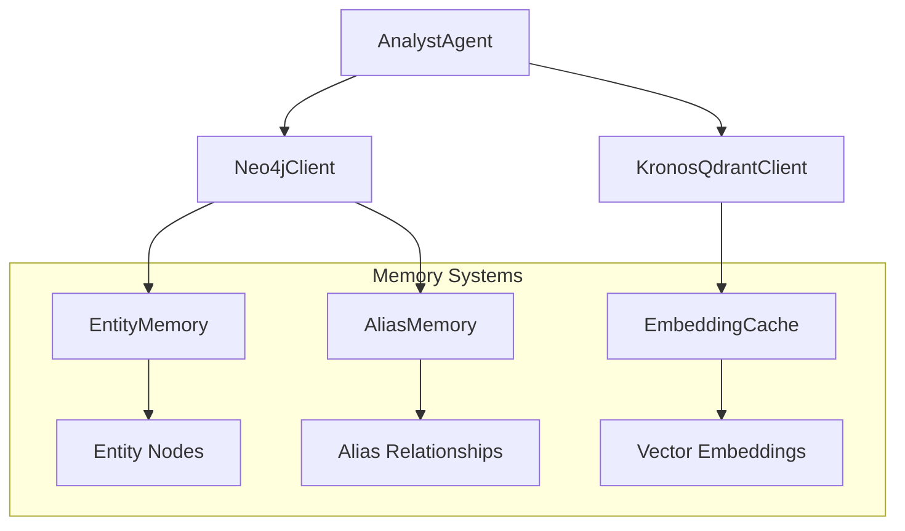
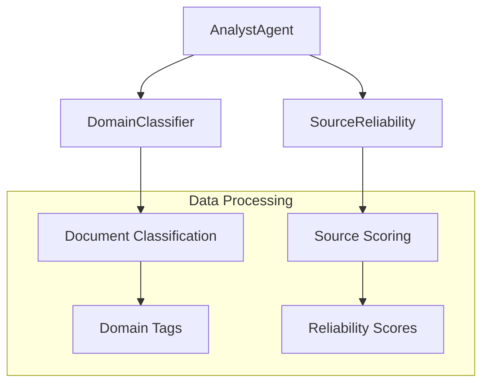
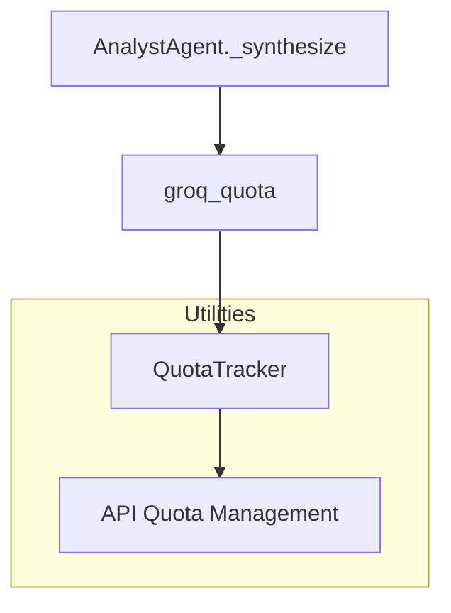

# Analyst Module Documentation

## Overview

The `analyst_module` is a core component of the KRONOS knowledge analysis system, designed to synthesize information from multiple sources (vector search results, knowledge graph entities, and document claims) to provide accurate, well-sourced answers to user queries. This module acts as the primary interface for knowledge retrieval and analysis, leveraging both vector databases and graph databases to provide comprehensive context.

The module is part of the larger `agent_framework` and is built upon several foundational components including `memory_systems`, `data_processing`, and `utilities` modules.

## Module Architecture

The analyst module follows a layered architecture that integrates with several other modules in the KRONOS system:

```mermaid
%% Analyst Module Architecture
flowchart TD
    A[User Query] --> B[AnalystAgent.query()]
    B --> C[Vector Search - Qdrant]
    B --> D[Graph Search - Neo4j]
    B --> E[Conflict Detection]
    C --> F[Relevant Chunks & Claims]
    D --> G[Entity Relationships]
    E --> H[Conflict List]
    F --> I[Context Builder]
    G --> I
    H --> I
    I --> J[Groq LLM Synthesis]
    J --> K[Structured Answer]
    
    subgraph External Dependencies
        C --> L[KronosQdrantClient]
        D --> M[Neo4jClient]
        J --> N[Groq API]
    end
    
    subgraph Internal Components
        B --> O[AnalystAgent]
        I --> P[Context Builder Methods]
        J --> Q[_synthesize Method]
    end
```

## Core Components

### AnalystAgent

The primary class in the analyst module, responsible for orchestrating the knowledge retrieval and synthesis process.

**Location:** `agents/analyst.py::AnalystAgent`

**Responsibilities:**
- Orchestrating the query process
- Integrating results from vector search and graph databases
- Detecting and handling conflicts in the knowledge base
- Synthesizing answers using the Groq LLM
- Managing quota usage for API calls

**Key Methods:**

1. `query(question: str) -> dict`
   - Main entry point for the module
   - Coordinates the entire analysis process
   - Returns a structured response with answer, sources, and metadata

2. `_graph_search(question: str) -> list`
   - Searches the Neo4j knowledge graph for relevant entities
   - Extracts entities and their relationships based on the query

3. `_get_conflicts() -> list`
   - Retrieves all conflicts marked in the knowledge base
   - Identifies entities with contradictory information

4. `_build_context(chunks: list, claims: list, graph_context: list, conflicts: list) -> str`
   - Constructs a comprehensive context for the LLM
   - Organizes information from multiple sources

5. `_synthesize(question: str, context: str) -> str`
   - Uses the Groq LLM to generate a final answer
   - Enforces the system prompt to ensure proper behavior

## Integration with Other Modules

The analyst module relies on several other modules in the KRONOS system:

### Memory Systems Integration



The analyst module uses:
- `Neo4jClient` from `memory_systems` for graph-based entity relationships
- `KronosQdrantClient` from `memory_systems` for vector search operations
- `EmbeddingCache` from `data_processing` for efficient vector operations

### Data Processing Integration



The analyst module indirectly benefits from:
- `DomainClassifier` for categorizing documents by domain
- `SourceReliability` for assessing the trustworthiness of sources

### Utilities Integration



The analyst module uses:
- `QuotaTracker` from `utilities` to manage API usage and prevent quota exhaustion

## Data Flow

The data flow through the analyst module follows this sequence:

```mermaid
%% Analyst Module Data Flow
flowchart TD
    A[User Query] --> B[AnalystAgent.query()]
    B --> C[Vector Search]
    B --> D[Graph Search]
    C --> E[Relevant Chunks]
    C --> F[Relevant Claims]
    D --> G[Entity Relationships]
    B --> H[Conflict Detection]
    H --> I[Conflict List]
    E --> J[Context Builder]
    F --> J
    G --> J
    I --> J
    J --> K[LLM Synthesis]
    K --> L[Structured Answer]
    
    subgraph External Systems
        C --> M[Qdrant Vector DB]
        D --> N[Neo4j Graph DB]
        K --> O[Groq LLM API]
    end
```

## Key Features

### 1. Multi-Source Information Retrieval

The analyst module combines information from three primary sources:
- **Vector Search Results**: Relevant text passages and claims from documents
- **Graph Context**: Entities and relationships from the knowledge graph
- **Conflict Detection**: Explicit handling of contradictory information

### 2. Source Attribution and Transparency

Every answer includes:
- **SOURCES**: List of documents and pages used to generate the answer
- **CONFIDENCE**: Assessment of the answer's reliability (HIGH/MEDIUM/LOW)
- **CONFLICTS**: Any contradictions found in the knowledge base

### 3. Conflict Resolution

The module explicitly surfaces conflicts in the knowledge base, allowing users to:
- Identify contradictory information
- Understand the nature of the conflict
- Make informed decisions based on incomplete or conflicting data

### 4. Quota Management

The module integrates with the `QuotaTracker` utility to:
- Prevent API quota exhaustion
- Track usage by agent
- Ensure fair usage across the system

## Usage Examples

### Basic Query

```python
from agents.analyst import AnalystAgent

agent = AnalystAgent()
result = agent.query("What are the main causes of climate change?")

print(f"Answer: {result['answer']}")
print(f"Sources: {result['sources']}")
print(f"Confidence: {result['confidence']}")
```

### Handling Conflicts

```python
result = agent.query("What is the recommended daily water intake?")

if result['conflicts']:
    print("Warning: Conflicting information found:")
    for conflict in result['conflicts']:
        print(f"- {conflict['entity']}: {conflict['doc1']} vs {conflict['doc2']}")
```

## Configuration

The analyst module relies on the following configuration parameters (defined in `core/config.py`):

- `GROQ_API_KEY`: API key for the Groq LLM service
- `RECONCILER_MODEL`: Model name to use for synthesis

## Error Handling

The analyst module includes several error handling mechanisms:

1. **Insufficient Information**: If the answer is not in the context, it returns "I don't have enough information about this in the knowledge base"

2. **Quota Management**: Uses `QuotaTracker` to prevent API quota exhaustion

3. **Database Errors**: Wraps database operations in try-catch blocks (implied by the context manager usage)

## Performance Considerations

1. **Vector Search**: Limited to top 5 results to balance relevance and performance

2. **Graph Search**: Only searches for words longer than 4 characters to filter noise

3. **Context Building**: Limits relationship collection to 3 per entity to control context size

4. **LLM Synthesis**: Uses a low temperature (0.2) for more deterministic results

## Testing

The analyst module should be tested with:

1. **Basic Queries**: Simple questions with clear answers in the knowledge base
2. **Complex Queries**: Multi-part questions requiring synthesis from multiple sources
3. **Conflict Scenarios**: Questions that might surface contradictions in the knowledge base
4. **Edge Cases**: Questions with no relevant information in the knowledge base

## Related Modules

For more information on related modules:

- [agent_framework.md](agent_framework.md) - The parent framework containing the analyst module
- [memory_systems.md](memory_systems.md) - Memory systems providing graph and vector storage
- [data_processing.md](data_processing.md) - Data processing utilities and classifiers
- [utilities.md](utilities.md) - General utility functions including quota management

## Future Enhancements

Potential improvements for the analyst module:

1. **Caching**: Implement result caching for frequently asked questions
2. **Federated Search**: Integrate with additional search backends
3. **Explainability**: Provide more detailed explanations of the reasoning process
4. **Multi-Modal Support**: Incorporate image and table data from documents
5. **User Feedback Loop**: Allow users to rate answers and improve the knowledge base