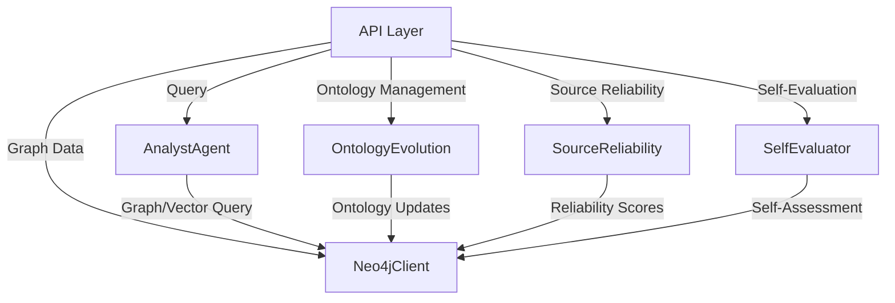

# API Layer Documentation

## Overview

The **API Layer** serves as the primary interface for interacting with the KRONOS knowledge infrastructure. It provides RESTful endpoints to query the knowledge graph, manage ontology evolution, assess source reliability, and perform self-evaluation. This layer integrates with core components such as the `AnalystAgent`, `OntologyEvolution`, `SourceReliability`, and `SelfEvaluator` to deliver a cohesive experience for users and developers.

The API is built using **FastAPI**, ensuring high performance, automatic documentation (via Swagger UI), and ease of integration with other systems.

---

## Table of Contents

1. [Architecture](#architecture)
2. [Core Components](#core-components)
3. [Endpoints](#endpoints)
4. [Data Flow](#data-flow)
5. [Dependencies](#dependencies)
6. [Error Handling](#error-handling)
7. [Startup and Shutdown](#startup-and-shutdown)
8. [References](#references)

---

## Architecture

The API Layer is designed to be modular and extensible. It interacts with multiple subsystems, including:

- **Agent Framework**: For querying and processing knowledge.
- **Ontology Management**: For managing evolving ontologies.
- **Data Processing**: For assessing source reliability.
- **Learning System**: For self-evaluation.
- **Database Clients**: For interacting with the Neo4j graph database.

### High-Level Architecture Diagram



---

## Core Components

### 1. `QueryRequest`

A **Pydantic model** representing the request body for querying the knowledge graph.

**Fields:**
- `question` (str): The question to ask KRONOS.

**Usage:**
- Used in the `/query` endpoint to validate and process incoming queries.

---

### 2. `ApprovalRequest`

A **Pydantic model** representing the request body for approving or rejecting ontology proposals.

**Fields:**
- `key` (str): The key of the pending ontology proposal.
- `canonical` (str, optional): The canonical form of the relation type.
- `category` (str, optional): The category of the relation type.

**Usage:**
- Used in the `/ontology/approve` and `/ontology/reject` endpoints.

---

### 3. `AnalystAgent`

A core agent responsible for processing queries and retrieving answers from the knowledge graph.

**Dependencies:**
- `Neo4jClient`: For executing graph queries.
- `OntologyResolver`: For resolving ontology terms.

**Reference:**
See [agent_framework.md](agent_framework.md) for more details.

---

### 4. `OntologyEvolution`

Manages the evolution of the ontology by tracking pending proposals and handling approvals/rejections.

**Dependencies:**
- `Neo4jClient`: For storing and retrieving ontology proposals.

**Reference:**
See [ontology_management.md](ontology_management.md) for more details.

---

### 5. `SourceReliability`

Tracks the reliability of source documents based on how often they win or lose contradictions.

**Dependencies:**
- `Neo4jClient`: For retrieving contradiction data.

**Reference:**
See [data_processing.md](data_processing.md) for more details.

---

### 6. `SelfEvaluator`

Performs self-assessment of KRONOS's knowledge quality for recently processed documents.

**Dependencies:**
- `Neo4jClient`: For retrieving document processing history.

**Reference:**
See [learning_system.md](learning_system.md) for more details.

---

### 7. `Neo4jClient`

A client for interacting with the Neo4j graph database.

**Reference:**
See [database_clients.md](database_clients.md) for more details.

---

## Endpoints

### `/query`

**Method:** `POST`

**Description:**
Ask KRONOS a question and receive a hybrid graph + vector answer with sources and conflicts.

**Request Body:**
```json
{
  "question": "What are the latest developments in AI?"
}
```

**Response:**
- Returns the result from `AnalystAgent.query()`.

**Error Handling:**
- Returns `400 Bad Request` if the `question` is empty.

---

### `/status`

**Method:** `GET`

**Description:**
Get a snapshot of the current graph health.

**Response:**
```json
{
  "total_entities": 1234,
  "total_relationships": 5678,
  "avg_confidence": 0.923
}
```

---

### `/digest/latest`

**Method:** `GET`

**Description:**
Returns the most recent Curator digest.

**Response:**
```json
{
  "filename": "digest_20231201.md",
  "content": "..."
}
```

**Error Handling:**
- Returns `404 Not Found` if no digests are available.

---

### `/ontology/pending`

**Method:** `GET`

**Description:**
Get a list of relation types awaiting human approval.

**Response:**
```json
[
  {
    "key": "DEVELOPED_BY",
    "proposed_canonical": "DEVELOPED_BY",
    "category": "RELATION"
  }
]
```

**Reference:**
See [scripts/review_ontology.py](scripts/review_ontology.py) for the CLI review flow.

---

### `/ontology/approve`

**Method:** `POST`

**Description:**
Approve a pending ontology proposal.

**Request Body:**
```json
{
  "key": "DEVELOPED_BY",
  "canonical": "DEVELOPED_BY",
  "category": "RELATION"
}
```

**Response:**
```json
{
  "status": "approved",
  "key": "DEVELOPED_BY"
}
```

**Error Handling:**
- Returns `404 Not Found` if no pending proposal is found for the given `key`.

---

### `/ontology/reject`

**Method:** `POST`

**Description:**
Reject a pending ontology proposal.

**Request Body:**
```json
{
  "key": "DEVELOPED_BY"
}
```

**Response:**
```json
{
  "status": "rejected",
  "key": "DEVELOPED_BY"
}
```

**Error Handling:**
- Returns `404 Not Found` if no pending proposal is found for the given `key`.

---

### `/conflicts`

**Method:** `GET`

**Description:**
Get all active `CONFLICTS_WITH` edges in the graph.

**Response:**
```json
[
  {
    "entity": "AI",
    "type": "TECHNOLOGY",
    "doc1": "source1.pdf",
    "doc2": "source2.pdf"
  }
]
```

---

### `/sources/reliability`

**Method:** `GET`

**Description:**
Get reliability scores for all source documents.

**Response:**
```json
{
  "source1.pdf": 0.95,
  "source2.pdf": 0.87
}
```

---

### `/self-evaluation/recent`

**Method:** `GET`

**Description:**
Get the most recent self-assessments by KRONOS.

**Query Parameters:**
- `limit` (int, optional): Number of recent assessments to return. Default: `10`.

**Response:**
```json
[
  {
    "document": "source1.pdf",
    "score": 0.92,
    "timestamp": "2023-12-01T12:00:00Z"
  }
]
```

---

## Data Flow

1. **Query Processing:**
   - A user sends a `POST /query` request with a question.
   - The `QueryRequest` model validates the input.
   - The `AnalystAgent` processes the query using the `Neo4jClient` to retrieve answers from the knowledge graph.
   - The result is returned to the user.

2. **Ontology Management:**
   - A user requests pending ontology proposals via `GET /ontology/pending`.
   - The `OntologyEvolution` component retrieves pending proposals from the `Neo4jClient`.
   - The user approves or rejects a proposal via `POST /ontology/approve` or `POST /ontology/reject`.
   - The `OntologyEvolution` component updates the ontology in the `Neo4jClient`.

3. **Source Reliability:**
   - The `SourceReliability` component tracks contradictions in the graph via the `Neo4jClient`.
   - Users can retrieve reliability scores via `GET /sources/reliability`.

4. **Self-Evaluation:**
   - The `SelfEvaluator` component assesses the quality of recently processed documents using the `Neo4jClient`.
   - Users can retrieve recent self-assessments via `GET /self-evaluation/recent`.

---

## Dependencies

| Component | Description | Reference |
|-----------|-------------|-----------|
| `AnalystAgent` | Processes queries and retrieves answers. | [agent_framework.md](agent_framework.md) |
| `OntologyEvolution` | Manages ontology evolution. | [ontology_management.md](ontology_management.md) |
| `SourceReliability` | Tracks source reliability. | [data_processing.md](data_processing.md) |
| `SelfEvaluator` | Performs self-assessment. | [learning_system.md](learning_system.md) |
| `Neo4jClient` | Interacts with the Neo4j graph database. | [database_clients.md](database_clients.md) |
| `Config` | Provides configuration settings. | [configuration.md](configuration.md) |

---

## Error Handling

The API Layer uses **FastAPI's built-in error handling** to return meaningful HTTP status codes and error messages:

- **400 Bad Request**: Invalid input (e.g., empty question).
- **404 Not Found**: Resource not found (e.g., no pending ontology proposal).
- **500 Internal Server Error**: Unexpected errors (logged for debugging).

---

## Startup and Shutdown

### Startup

On startup, the API initializes the following components:

- `AnalystAgent`
- `Neo4jClient`
- `OntologyEvolution`
- `SourceReliability`
- `SelfEvaluator`

**Logging:**
- A log message is emitted to indicate successful startup.

### Shutdown

On shutdown, the API ensures that all components are properly closed:

- `AnalystAgent.close()`
- `Neo4jClient.close()`

**Logging:**
- A log message is emitted to indicate successful shutdown.

---

## References

- [FastAPI Documentation](https://fastapi.tiangolo.com/)
- [Pydantic Documentation](https://docs.pydantic.dev/)
- [Neo4j Python Driver](https://neo4j.com/docs/api/python-driver/current/)
- [Agent Framework Documentation](agent_framework.md)
- [Ontology Management Documentation](ontology_management.md)
- [Data Processing Documentation](data_processing.md)
- [Learning System Documentation](learning_system.md)
- [Database Clients Documentation](database_clients.md)
- [Configuration Documentation](configuration.md)