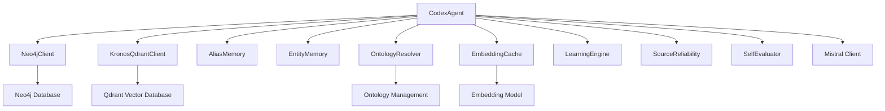

# Codex Module Documentation

## Overview

The **Codex Module** is a core component of the memory systems in the Kronos knowledge management framework. It serves as the primary ingestion engine for processing and integrating extracted knowledge from various sources into the system's knowledge graph. The module handles entity resolution, relationship mapping, and cross-domain knowledge integration.

### Purpose

The Codex Agent is responsible for:
- Processing extracted entities and relationships from documents
- Resolving entity aliases and duplicates
- Managing cross-domain knowledge integration
- Maintaining the knowledge graph through Neo4j and Qdrant
- Handling entity memory and learning patterns
- Providing self-evaluation of the ingestion process

### Core Functionality

1. **Entity Ingestion**: Processes extracted entities with validation and resolution
2. **Relationship Mapping**: Maps and validates relationships between entities
3. **Cross-Domain Integration**: Handles entities that span different knowledge domains
4. **Knowledge Graph Maintenance**: Updates both Neo4j and Qdrant with processed data
5. **Quality Assurance**: Self-evaluation of the ingestion process

## Architecture

The Codex Module follows a layered architecture with clear separation of concerns:



### Component Relationships

The Codex Agent integrates with several other modules:

1. **Memory Systems**: Uses `AliasMemory` and `EntityMemory` for tracking entity relationships
2. **Agent Framework**: Part of the agent framework hierarchy, specifically the `codex_module`
3. **Data Processing**: Utilizes `EmbeddingCache` and `SourceReliability`
4. **Utilities**: Leverages `QuotaTracker` and `DailyQuotaExceeded` for rate limiting
5. **Ontology Management**: Uses `OntologyResolver` for relationship type resolution
6. **Learning System**: Integrates with `LearningEngine` and `SelfEvaluator`
7. **Database Clients**: Connects to `Neo4jClient` and `KronosQdrantClient`

## Core Components

### CodexAgent Class

The primary class in the module, responsible for the main ingestion pipeline.

```python
class CodexAgent:
    def __init__(self):
        # Initialize all dependencies
        self.neo4j = Neo4jClient()
        self.qdrant = KronosQdrantClient()
        self.alias_memory = AliasMemory()
        self.embedding_cache = EmbeddingCache(...)
        self.entity_memory = EntityMemory(...)
        self.learning_engine = LearningEngine()
        self.source_reliability = SourceReliability()
        self.self_evaluator = SelfEvaluator()
        self.mistral_client = Mistral(...)
        self.ontology = OntologyResolver(...)
```

#### Key Methods

1. **`ingest(extracted: dict) -> dict`**
   - Main method for processing extracted knowledge
   - Handles entities, relationships, chunks, and claims
   - Returns ingestion statistics and processing results

2. **`_llm_referee(name1, desc1, name2, desc2) -> dict`**
   - Uses Mistral AI to resolve ambiguous entity matches
   - Returns canonical name and confidence score

3. **`close()`**
   - Cleans up resources and flushes caches

### Supporting Components

#### Entity Resolution Functions

The module includes several utility functions for entity resolution:

- `normalize_entity_name(name: str) -> tuple[str, str]`: Normalizes entity names for comparison
- `fuzzy_match_ratio(a: str, b: str) -> float`: Calculates similarity ratio between strings
- `is_safe_fuzzy_match(new_name, candidate_name) -> bool`: Determines if fuzzy match is acceptable
- `is_typo_candidate(new_name, candidate_name) -> bool`: Identifies potential typos
- `levenshtein_distance(a: str, b: str) -> int`: Calculates edit distance between strings
- `combine_confidence(*scores: float) -> float`: Combines multiple confidence scores
- `validate_entity(entity: dict) -> str`: Validates entity structure
- `validate_relationship(rel: dict) -> str`: Validates relationship structure

#### Cross-Domain Handling

The module includes specialized logic for handling entities that span different domains:

- `is_cross_domain_mismatch(domain_a, domain_b) -> bool`: Checks if domains are incompatible
- `is_disqualified_match(a, b, domain_a, domain_b) -> str`: Determines if a match should be rejected
- `_pending_cross_domain_links: list[dict]`: Tracks cross-domain relationships for later processing

## Data Flow

The ingestion pipeline follows this data flow:

```mermaid
dataflow
    extracted_data[Extracted Knowledge] --> codex_agent[CodexAgent.ingest()]
    codex_agent --> entity_processing[Entity Processing]
    entity_processing --> alias_resolution[Alias Resolution]
    alias_resolution --> embedding_match[Embedding Matching]
    embedding_match --> neo4j_lookup[Neo4j Lookup]
    neo4j_lookup --> typo_check[Typo Check]
    typo_check --> llm_referee[LLM Referee]
    llm_referee --> entity_creation[Entity Creation]
    
    entity_creation --> relationship_processing[Relationship Processing]
    relationship_processing --> ontology_resolution[Ontology Resolution]
    ontology_resolution --> relationship_creation[Relationship Creation]
    
    entity_creation --> vector_storage[Vector Storage]
    relationship_creation --> vector_storage
    
    vector_storage --> learning_engine[Learning Engine]
    vector_storage --> self_evaluation[Self Evaluation]
```

### Detailed Data Flow

1. **Input Processing**
   - Validates input structure
   - Registers source reliability
   - Cleans up existing vectors if document already exists

2. **Entity Resolution**
   - Normalizes entity names
   - Checks for aliases in memory
   - Uses embedding similarity to find potential matches
   - Falls back to Neo4j lookup for exact matches
   - Uses LLM referee for ambiguous cases
   - Handles cross-domain conflicts

3. **Relationship Processing**
   - Validates relationship structure
   - Resolves relationship types using ontology
   - Handles new relationship types via LLM
   - Falls back to generic "RELATED_TO" if unresolved

4. **Knowledge Graph Update**
   - Updates Neo4j with entities and relationships
   - Stores vectors in Qdrant
   - Records evidence for provenance
   - Tracks domain information

5. **Post-Processing**
   - Records chunk entities for learning
   - Creates cross-domain links
   - Flushes caches
   - Runs self-evaluation

## Integration with Other Modules

### Agent Framework Integration

The Codex Module is part of the agent framework hierarchy:

```mermaid
hierarchy
    agent_framework
        ├── analyst_module
        ├── codex_module [Current Module]
        ├── curator_module
        ├── extractor_module
        ├── reconciler_module
        └── watcher_module
```

The CodexAgent inherits from and integrates with the agent framework's base components.

### Dependencies on Other Modules

#### Memory Systems
- **AliasMemory**: Tracks entity aliases and their canonical forms
- **EntityMemory**: Maintains entity embeddings and relationships

#### Data Processing
- **EmbeddingCache**: Caches entity embeddings for performance
- **SourceReliability**: Tracks source quality for confidence scoring

#### Utilities
- **QuotaTracker**: Manages API rate limits
- **DailyQuotaExceeded**: Handles quota exceptions

#### Ontology Management
- **OntologyResolver**: Resolves relationship types and validates new types

#### Learning System
- **LearningEngine**: Records patterns in entity co-occurrence
- **SelfEvaluator**: Assesses ingestion quality and system performance

#### Database Clients
- **Neo4jClient**: Graph database for structured knowledge
- **KronosQdrantClient**: Vector database for semantic search

## Configuration

The Codex Module uses the following configuration parameters (defined in `core/config.py`):

- `MISTRAL_API_KEY`: API key for Mistral AI services
- `EMBEDDING_MODEL`: Name of the embedding model to use
- `ONTOLOGY_MODEL`: Model to use for ontology resolution
- `REFEREE_MODEL`: Model to use for entity resolution referee

## Error Handling and Edge Cases

### Entity Resolution Challenges

1. **Negation Pairs**: Handles opposite meaning entities (e.g., "active" vs "inactive")
2. **Numeric Conflicts**: Rejects matches with different numeric references
3. **Cross-Domain Mismatches**: Creates special relationships for entities in different domains
4. **Typo Detection**: Uses Levenshtein distance to identify potential typos
5. **Ambiguous Matches**: Uses LLM referee for uncertain cases

### Data Quality Issues

1. **Malformed Entities**: Skips invalid entities with warnings
2. **Malformed Relationships**: Rejects invalid relationships
3. **Rate Limiting**: Implements retry logic for LLM API calls
4. **Database Errors**: Handles failures in Neo4j and Qdrant operations

## Performance Considerations

### Caching

- **EmbeddingCache**: Caches entity embeddings to avoid recomputation
- **EntityMemory**: Maintains in-memory entity representations
- **Batch Processing**: Groups operations by chunk ID for efficiency

### Parallelism

- **Vector Operations**: Qdrant operations are batched
- **Cache Flushing**: Operations are batched before flushing to databases
- **LLM Calls**: Retry logic with exponential backoff for rate limiting

### Memory Management

- **Flush Operations**: Regularly flushes caches to prevent memory bloat
- **Batch Processing**: Processes entities in groups to manage memory usage
- **Cleanup**: Properly closes database connections

## Testing and Validation

The module includes self-evaluation through the `SelfEvaluator` component, which tracks:

- Processing time
- Entity and relationship counts
- Alias memory growth
- Ontology memory growth
- Source reliability changes

## API Reference

### Main Methods

#### `ingest(extracted: dict) -> dict`

Processes extracted knowledge and updates the knowledge graph.

**Parameters:**
- `extracted`: Dictionary containing:
  - `filename`: Source document filename
  - `entities`: List of extracted entities
  - `relationships`: List of extracted relationships
  - `chunks`: List of text chunks (optional)
  - `claims`: List of claims (optional)
  - `quality_score`: Source quality score (optional)
  - `domain`: Knowledge domain (optional)

**Returns:**
- Dictionary with ingestion statistics:
  - `filename`: Processed filename
  - `entities_written`: Number of entities added/updated
  - `entities_skipped`: Number of invalid entities skipped
  - `relationships_written`: Number of relationships added
  - `relationships_rejected`: Number of invalid relationships rejected
  - `chunks_written`: Number of chunks stored
  - `claims_written`: Number of claims stored
  - `domain`: Processed domain

#### `_llm_referee(name1, desc1, name2, desc2) -> dict`

Uses Mistral AI to resolve ambiguous entity matches.

**Parameters:**
- `name1`: First entity name
- `desc1`: First entity description
- `name2`: Second entity name
- `desc2`: Second entity description

**Returns:**
- Dictionary with:
  - `canonical_name`: Resolved canonical name or null
  - `confidence`: Confidence score (0.0-1.0)
  - `reason`: Resolution method

### Configuration Parameters

- `MIN_FUZZY_MATCH_LENGTH = 4`: Minimum length for fuzzy matching
- `FUZZY_MATCH_THRESHOLD = 0.87`: Minimum similarity ratio for fuzzy match
- `NEW_ENTITY_RESOLUTION_CONFIDENCE = 1.0`: Confidence for new entities
- `REJECTED_REFEREE_RESOLUTION_CONFIDENCE = 0.75`: Confidence for rejected referee matches
- `TYPO_MAX_EDIT_DISTANCE = 2`: Maximum edit distance for typo detection
- `NEGATION_PREFIXES`: List of prefixes indicating negation

## Best Practices

1. **Batch Processing**: Process documents in batches for efficiency
2. **Error Handling**: Implement robust error handling for database operations
3. **Monitoring**: Monitor self-evaluation metrics for quality assessment
4. **Rate Limiting**: Respect API rate limits with retry logic
5. **Domain Tagging**: Properly tag entities and relationships with domains
6. **Evidence Tracking**: Maintain evidence for all knowledge claims

## Troubleshooting

### Common Issues

1. **Entity Resolution Failures**:
   - Check for negation pairs or cross-domain conflicts
   - Verify domain tags are consistent
   - Review LLM referee responses for ambiguous cases

2. **Performance Problems**:
   - Monitor embedding cache hit rates
   - Check for memory leaks in entity memory
   - Review batch sizes for vector operations

3. **Data Quality Issues**:
   - Validate input data structure
   - Check source reliability scores
   - Review self-evaluation metrics

### Debugging Tools

- Enable debug logging for detailed processing information
- Use the `SelfEvaluator` metrics to identify problematic documents
- Check database logs for operation failures

## Future Enhancements

1. **Improved Cross-Domain Integration**: Better handling of entities spanning multiple domains
2. **Advanced Typo Detection**: More sophisticated typo detection algorithms
3. **Performance Optimization**: Further optimization of embedding and vector operations
4. **Enhanced Self-Evaluation**: More detailed quality metrics and recommendations
5. **Batch Processing**: Support for parallel document processing

## References

- [Agent Framework Documentation](agent_framework.md)
- [Data Processing Documentation](data_processing.md)
- [Utilities Documentation](utilities.md)
- [Ontology Management Documentation](ontology_management.md)
- [Learning System Documentation](learning_system.md)
- [Database Clients Documentation](database_clients.md)
- [Memory Systems Documentation](memory_systems.md)

## Changelog

### v1.0.0
- Initial release of the Codex Module
- Core ingestion pipeline with entity resolution
- Relationship mapping and ontology integration
- Cross-domain knowledge handling
- Self-evaluation and quality assurance