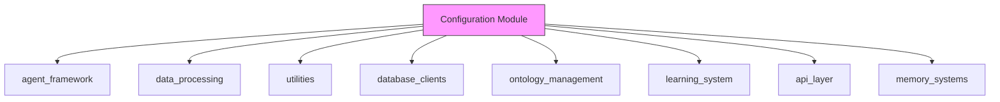
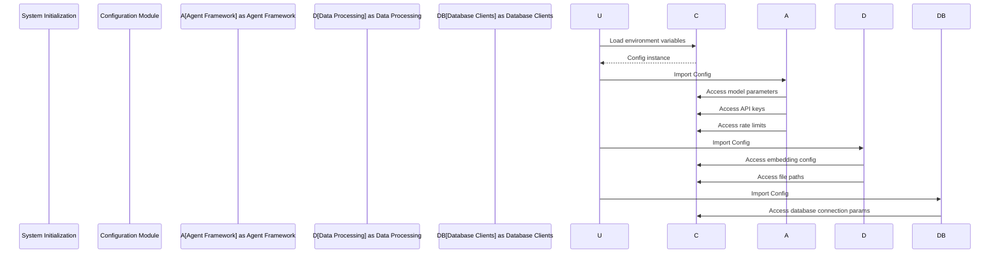

# Configuration Module Documentation

## Overview

The **Configuration Module** serves as the central hub for managing application settings, API keys, and system parameters. It provides a unified interface for accessing configuration values across the entire system, ensuring consistency and maintainability. This module is critical for:

- Centralizing environment-specific configurations
- Managing API keys and service endpoints
- Defining system-wide parameters and thresholds
- Supporting smart routing between different AI backends
- Enforcing rate limiting and quota controls

The module follows a **singleton pattern** with a single `Config` class instance that is imported and used throughout the system.

---

## Core Components

### `Config` Class (`core/config.py`)

The primary component of the configuration module is the `Config` class, which encapsulates all system configurations. It loads environment variables using `python-dotenv` and provides default values for all configuration parameters.

#### Key Configuration Categories:

1. **API Keys**
   - `GEMINI_API_KEY`: API key for Google's Gemini models
   - `GROQ_API_KEY`: API key for Groq's LLM services
   - `MISTRAL_API_KEY`: API key for Mistral AI services
   - `OPENROUTER_API_KEY`: API key for OpenRouter's model aggregation service

2. **Database Connections**
   - `NEO4J_URI`, `NEO4J_USER`, `NEO4J_PASSWORD`: Connection parameters for Neo4j graph database
   - `QDRANT_HOST`, `QDRANT_PORT`: Connection parameters for Qdrant vector database

3. **Model Configurations**
   - Local model: `LOCAL_MODEL_URL`, `LOCAL_MODEL_NAME`
   - Various model-specific configurations for different agents (Extractor, Reconciler, etc.)

4. **File System Paths**
   - `INBOX_PATH`: Directory for incoming files
   - `PROCESSED_PATH`: Directory for processed files

5. **Smart Routing Parameters**
   - Backend selection for different operations (e.g., `EXTRACTOR_BACKEND`)
   - Model selection for different tasks (e.g., `EXTRACTOR_GROQ_MODEL`)
   - Fallback mechanisms (e.g., `EXTRACTOR_FALLBACK_MODEL`)

6. **Rate Limiting and Quotas**
   - Delay between API calls (`GEMINI_RATE_LIMIT_DELAY`, etc.)
   - Requests per minute/day limits (e.g., `GROQ_RPM`)

7. **Embedding Configuration**
   - `EMBEDDING_MODEL`: Model used for text embeddings
   - `EMBEDDING_DIM`: Dimensionality of embeddings

8. **Graph Processing Parameters**
   - `CONFIDENCE_DECAY_RATE`: Rate at which confidence scores decay
   - `MIN_CONFIDENCE_THRESHOLD`: Minimum confidence threshold for accepting data

---

## Architecture

### Module Dependencies



The configuration module is a **foundational dependency** for all other modules in the system. It provides the necessary parameters for:

- **Agent Framework**: Model selection, API keys, and rate limits
- **Data Processing**: Embedding configurations and file paths
- **Utilities**: Quota tracking and retry mechanisms
- **Database Clients**: Connection parameters
- **Ontology Management**: Model configurations
- **Learning System**: Model parameters
- **API Layer**: Configuration for request handling
- **Memory Systems**: Path configurations and backend selection

### Data Flow



---

## Integration with Other Modules

### Agent Framework Integration

The configuration module provides critical parameters for agent operations:

- **Model Selection**: Each agent (Analyst, Codex, Curator, etc.) uses models configured in the `Config` class
- **API Keys**: Agents use API keys for external LLM services
- **Rate Limiting**: Agents respect the configured rate limits for API calls
- **Backend Selection**: Smart routing between different backends is configured here

For more details, see the [agent_framework.md](agent_framework.md) documentation.

### Data Processing Integration

The data processing module relies on:

- **Embedding Configuration**: `EMBEDDING_MODEL` and `EMBEDDING_DIM` parameters
- **File Paths**: `INBOX_PATH` and `PROCESSED_PATH` for file handling
- **Model Parameters**: Used by components like `DomainClassifier` and `EmbeddingCache`

For more details, see the [data_processing.md](data_processing.md) documentation.

### Utilities Integration

The utilities module uses:

- **Quota Tracking**: Relies on rate limiting parameters from the config
- **Retry Mechanisms**: Uses API keys and rate limits for retry logic

For more details, see the [utilities.md](utilities.md) documentation.

### Database Clients Integration

Database connections are fully configured through the configuration module:

- **Neo4j**: Connection URI, username, and password
- **Qdrant**: Host and port settings

For more details, see the [database_clients.md](database_clients.md) documentation.

---

## Configuration Management

### Environment Variables

The `Config` class loads all configuration from environment variables, with sensible defaults provided for all parameters. This approach allows for:

- **Environment-specific configurations** (development, staging, production)
- **Sensitive data management** (API keys stored in environment variables)
- **Flexibility** in deployment configurations

### Default Values

All configuration parameters have default values, ensuring the system can run even if some environment variables are not set. Defaults are chosen to work with local development environments.

### Smart Routing Configuration

The configuration module implements sophisticated smart routing between different AI backends:

```python
# Example from core/config.py
EXTRACTOR_BACKEND = os.getenv("EXTRACTOR_BACKEND", "groq")
EXTRACTOR_GEMINI_MODEL = os.getenv("EXTRACTOR_GEMINI_MODEL", "gemini-2.0-flash")
EXTRACTOR_GROQ_MODEL = "llama-3.3-70b-versatile"
EXTRACTOR_GROQ_MODEL_FAST = "llama-3.1-8b-instant"
EXTRACTOR_FALLBACK_MODEL = os.getenv("EXTRACTOR_FALLBACK_MODEL", "mistral-small-2506")
EXTRACTOR_LARGE_DOC_BACKEND = os.getenv("EXTRACTOR_LARGE_DOC_BACKEND", "mistral")
```

This allows the system to:

1. Route small documents to Groq for fast processing
2. Use Mistral as a fallback when Groq's quota is exhausted
3. Use Gemini for specific tasks where its capabilities are preferred
4. Dynamically switch between backends based on availability and quotas

---

## Rate Limiting and Quotas

The configuration module implements comprehensive rate limiting:

```python
# Rate limiting delays
GEMINI_RATE_LIMIT_DELAY = float(os.getenv("GEMINI_RATE_LIMIT_DELAY", "1.0"))
MISTRAL_RATE_LIMIT_DELAY = float(os.getenv("MISTRAL_RATE_LIMIT_DELAY", "0.2"))
GROQ_RATE_LIMIT_DELAY = float(os.getenv("GROQ_RATE_LIMIT_DELAY", "0.0"))

# Groq-specific quotas
GROQ_RPM = 30
GROQ_RPM_LARGE = 10
GROQ_RPD = 14400
```

This ensures:

- **Fair usage** of API services
- **Prevention of rate limit errors** from external services
- **Dynamic adjustment** based on service-specific quotas

---

## Best Practices

1. **Environment Management**: Use separate `.env` files for different environments (development, staging, production)

2. **Secret Management**: Never commit API keys or sensitive configuration to version control

3. **Configuration Validation**: Implement validation for critical configuration parameters

4. **Fallback Mechanisms**: Ensure all critical configurations have sensible defaults

5. **Documentation**: Keep configuration documentation up-to-date with all available parameters

---

## Troubleshooting

### Common Issues

1. **Missing API Keys**: Ensure all required API keys are set in the environment
2. **Connection Failures**: Verify database connection parameters
3. **Rate Limit Exceeded**: Check rate limiting parameters and adjust quotas as needed
4. **Model Not Available**: Verify model names and backend configurations

### Debugging Configuration

To debug configuration issues:

1. Print the `Config` instance to verify all parameters are loaded correctly
2. Check environment variables are properly set
3. Verify file paths exist and are accessible

---

## Future Enhancements

1. **Dynamic Configuration Reloading**: Implement hot-reloading of configuration changes
2. **Configuration Validation**: Add schema validation for configuration parameters
3. **Configuration UI**: Develop a web interface for managing configurations
4. **Configuration History**: Track changes to configuration over time
5. **A/B Testing**: Support for multiple configuration sets for experimentation

---

## References

- [Agent Framework Documentation](agent_framework.md)
- [Data Processing Documentation](data_processing.md)
- [Utilities Documentation](utilities.md)
- [Database Clients Documentation](database_clients.md)
- [Ontology Management Documentation](ontology_management.md)
- [Learning System Documentation](learning_system.md)
- [API Layer Documentation](api_layer.md)
- [Memory Systems Documentation](memory_systems.md)

---

## Appendix: Configuration Parameters

| Parameter | Description | Default Value |
|-----------|-------------|---------------|
| `GEMINI_API_KEY` | API key for Google's Gemini models | None (required) |
| `GROQ_API_KEY` | API key for Groq's LLM services | None (required) |
| `MISTRAL_API_KEY` | API key for Mistral AI services | None (required) |
| `OPENROUTER_API_KEY` | API key for OpenRouter | None (optional) |
| `NEO4J_URI` | Neo4j connection URI | `bolt://localhost:7687` |
| `NEO4J_USER` | Neo4j username | `neo4j` |
| `NEO4J_PASSWORD` | Neo4j password | `kronos_password` |
| `QDRANT_HOST` | Qdrant host | `localhost` |
| `QDRANT_PORT` | Qdrant port | `6333` |
| `LOCAL_MODEL_URL` | Local model URL | `http://localhost:1234/v1` |
| `LOCAL_MODEL_NAME` | Local model name | `qwen2.5-coder-14b-instruct` |
| `INBOX_PATH` | Inbox directory path | `data/inbox` |
| `PROCESSED_PATH` | Processed directory path | `data/processed` |
| `EXTRACTOR_BACKEND` | Default extractor backend | `groq` |
| `EXTRACTOR_GEMINI_MODEL` | Gemini model for extraction | `gemini-2.0-flash` |
| `EXTRACTOR_GROQ_MODEL` | Groq model for extraction | `llama-3.3-70b-versatile` |
| `EXTRACTOR_FALLBACK_MODEL` | Fallback model | `mistral-small-2506` |
| `RECONCILER_BACKEND` | Reconciler backend | `mistral` |
| `LIBRARIAN_MODEL` | Librarian model | `llama-3.1-8b-instant` |
| `CURATOR_MODEL` | Curator model | `mistral-large-latest` |
| `ANALYST_MODEL` | Analyst model | `gemini-2.0-flash` |
| `GROQ_MAX_CHUNKS` | Max chunks for Groq | `250` |
| `EXTRACTOR_BATCH_SIZE` | Extraction batch size | `3` |
| `ESTIMATED_TOKENS_PER_CHUNK` | Tokens per chunk estimate | `1300` |
| `GEMINI_RATE_LIMIT_DELAY` | Delay between Gemini calls | `1.0` |
| `MISTRAL_RATE_LIMIT_DELAY` | Delay between Mistral calls | `0.2` |
| `GROQ_RATE_LIMIT_DELAY` | Delay between Groq calls | `0.0` |
| `GROQ_RPM` | Groq requests per minute | `30` |
| `GROQ_RPM_LARGE` | Groq RPM for large docs | `10` |
| `GROQ_RPD` | Groq requests per day | `14400` |
| `EMBEDDING_MODEL` | Embedding model | `all-MiniLM-L6-v2` |
| `EMBEDDING_DIM` | Embedding dimension | `384` |
| `CONFIDENCE_DECAY_RATE` | Confidence decay rate | `0.05` |
| `MIN_CONFIDENCE_THRESHOLD` | Minimum confidence threshold | `0.3` |