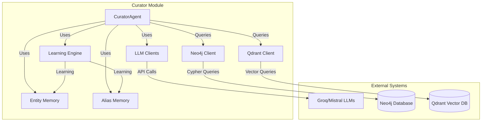
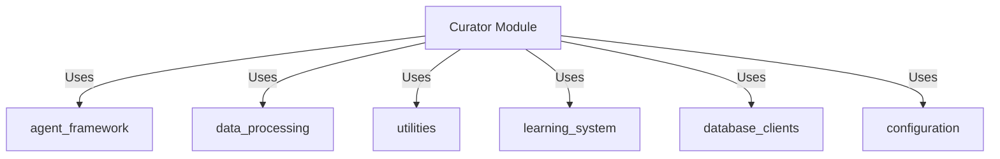
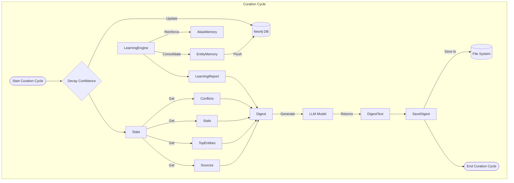

# Curator Module Documentation

## Overview

The **Curator Module** is a critical component of the KRONOS system responsible for maintaining the health and quality of the knowledge graph. It performs nightly curation cycles to assess the state of the knowledge base, identify issues, and generate actionable insights for system administrators.

The module acts as a "system doctor" that:
- Monitors entity confidence levels and relationships
- Identifies stale or conflicting information
- Reinforces learned aliases and entity relationships
- Generates comprehensive knowledge digests for human review

This module is part of the broader `memory_systems` hierarchy and specifically falls under `memory_systems_agent_framework` as the `curator_module`.

## Architecture

The Curator Module follows a layered architecture that integrates with multiple system components:



### Core Components

1. **CuratorAgent** (`agents/curator.py`)
   - Main orchestrator of the curation cycle
   - Coordinates with other agents and memory systems
   - Generates and saves knowledge digests

2. **Learning Engine** (`agents/learning_engine.py`)
   - Reinforces aliases and identifies unlinked entity pairs
   - Provides consolidation reports to the curator

3. **Memory Systems**
   - **EntityMemory**: Tracks entity relationships and confidence
   - **AliasMemory**: Manages entity aliases and name variations

### Dependencies

The Curator Module depends on several other modules:



For detailed information about these dependencies, see:
- [agent_framework.md](agent_framework.md)
- [data_processing.md](data_processing.md)
- [utilities.md](utilities.md)
- [learning_system.md](learning_system.md)
- [database_clients.md](database_clients.md)
- [configuration.md](configuration.md)

## Data Flow

The curation cycle follows this data flow:



## Key Processes

### 1. Curation Cycle

The main `run()` method executes the full curation cycle:

```python
def run(self) -> dict:
    """Full curation cycle — runs nightly."""
    logger.info("Starting curation cycle...")
    timestamp = datetime.now().strftime("%Y-%m-%d %H:%M:%S")

    decayed = self._decay_confidence()
    stale = self.neo4j.get_stale_entities(config.MIN_CONFIDENCE_THRESHOLD)
    stats = self.neo4j.get_graph_stats()
    conflicts = self._get_conflicts()
    top_entities = self._get_top_entities()
    sources = self._get_sources()

    # Learning Engine consolidation pass
    entity_memory = EntityMemory()
    alias_memory = AliasMemory()
    learning_report = self.learning_engine.run_consolidation(
        entity_memory, alias_memory, self.neo4j
    )
    entity_memory.flush()

    digest = self._generate_digest(
        stats, conflicts, stale, top_entities, sources, learning_report, timestamp
    )

    digest_path = self._save_digest(digest, timestamp)

    result = {
        "timestamp": timestamp,
        "stats": stats,
        "decayed_nodes": decayed,
        "stale_entities": len(stale),
        "active_conflicts": len(conflicts),
        "aliases_reinforced": learning_report["aliases_reinforced"],
        "unlinked_candidates": learning_report["total_unlinked_candidates"],
        "digest_path": digest_path
    }

    logger.info(f"Curation complete: {result}")
    return result
```

### 2. Confidence Decay

The `_decay_confidence()` method reduces confidence scores for entities that haven't been updated recently:

```python
def _decay_confidence(self) -> int:
    with self.neo4j.driver.session() as session:
        result = session.run("""
            MATCH (e:Entity)
            WHERE e.last_updated < timestamp() - 86400000
            AND e.confidence > $threshold
            SET e.confidence = e.confidence * (1 - $decay_rate)
            RETURN count(e) AS decayed
        """, threshold=config.MIN_CONFIDENCE_THRESHOLD,
            decay_rate=config.CONFIDENCE_DECAY_RATE)
        record = result.single()
        count = record["decayed"] if record else 0
        logger.info(f"  Decayed confidence on {count} nodes")
        return count
```

### 3. Conflict Detection

The `_get_conflicts()` method identifies entities with conflicting information:

```python
def _get_conflicts(self) -> list:
    with self.neo4j.driver.session() as session:
        result = session.run("""
            MATCH (a:Entity)-[r:CONFLICTS_WITH]->(b:Entity)
            RETURN a.name AS entity, a.type AS type,
                   a.source_doc AS doc1, b.source_doc AS doc2,
                   a.confidence AS conf1, b.confidence AS conf2
        """)
        return [dict(record) for record in result]
```

### 4. Digest Generation

The `_generate_digest()` method creates a human-readable report using an LLM:

```python
def _generate_digest(self, stats: dict, conflicts: list,
                      stale: list, top_entities: list,
                      sources: list, learning_report: dict, timestamp: str) -> str:
    # ... prepare context ...
    
    try:
        response = self.mistral_client.chat.complete(
            model=config.CURATOR_MODEL,
            messages=[
                {"role": "system", "content": CURATOR_PROMPT},
                {"role": "user", "content": context}
            ]
        )
        return response.choices[0].message.content
    except Exception as e:
        logger.warning(f"Mistral digest generation failed: {e}, using Groq fallback")
        # ... fallback to Groq ...
```

## Configuration

The Curator Module relies on several configuration parameters from the central `config` module:

- `GROQ_API_KEY`: API key for Groq LLM
- `MISTRAL_API_KEY`: API key for Mistral LLM
- `CURATOR_MODEL`: Model to use for digest generation
- `MIN_CONFIDENCE_THRESHOLD`: Minimum confidence score for entities
- `CONFIDENCE_DECAY_RATE`: Rate at which confidence decays over time

For detailed configuration information, see [configuration.md](configuration.md).

## Integration with Other Modules

### Learning System

The Curator Module works closely with the Learning Engine to:
- Reinforce aliases identified through co-occurrence patterns
- Identify unlinked entity pairs that frequently appear together
- Generate type-specific confidence statistics

See [learning_system.md](learning_system.md) for more details.

### Memory Systems

The Curator Module uses both EntityMemory and AliasMemory:
- **EntityMemory**: Tracks entity relationships and confidence scores
- **AliasMemory**: Manages entity aliases and name variations

These memory systems are part of the broader `memory_systems` hierarchy. For more details, see:
- [memory_systems.md](memory_systems.md)

### Database Clients

The Curator Module interacts with two database systems:
- **Neo4jClient**: For graph database operations and entity relationships
- **KronosQdrantClient**: For vector database operations (though currently not heavily used in curation)

For more details, see [database_clients.md](database_clients.md).

## Error Handling and Fallbacks

The Curator Module implements robust error handling:

1. **LLM Fallback**: If Mistral fails to generate a digest, it automatically falls back to Groq
2. **Quota Management**: Uses the `QuotaTracker` from utilities to manage API quotas
3. **Logging**: Comprehensive logging at all major steps

```python
try:
    response = self.mistral_client.chat.complete(...)
    return response.choices[0].message.content
except Exception as e:
    logger.warning(f"Mistral digest generation failed: {e}, using Groq fallback")
    from utils.quota import groq_quota
    groq_quota.acquire(agent_name="Curator")
    response = self.groq_client.chat.completions.create(...)
    return response.choices[0].message.content
```

## Performance Considerations

1. **Batch Processing**: The Learning Engine processes entities in batches
2. **Memory Management**: EntityMemory batches writes and flushes periodically
3. **Database Efficiency**: Uses session-based database access for better performance

## Future Enhancements

Potential improvements for the Curator Module:

1. **Automated Resolution**: Automatically resolve simple conflicts without human intervention
2. **Priority Scoring**: Implement a priority scoring system for conflicts based on impact
3. **Adaptive Decay**: Adjust decay rates based on entity type and domain
4. **Visualization**: Generate visual representations of the knowledge graph health
5. **Alerting**: Implement automated alerting for critical issues

## API Reference

The Curator Module doesn't expose a public API but provides these key methods:

- `run()`: Execute a full curation cycle
- `close()`: Clean up resources

For information about the underlying agents and their APIs, see:
- [agent_framework.md](agent_framework.md)

## Example Output

A typical knowledge digest includes:

```markdown
# KRONOS Knowledge Digest
**Generated:** 2023-11-15 02:30:45

KRONOS Knowledge Base Snapshot — 2023-11-15 02:30:45

=== GRAPH STATISTICS ===
Total Entities: 12478
Total Relationships: 45231
Average Confidence: 0.78

=== SOURCE DOCUMENTS ===
- document1.pdf (1245 entities)
- document2.pdf (872 entities)
- document3.pdf (654 entities)

=== ACTIVE CONFLICTS (42) ===
- [PERSON] John Doe: document1.pdf vs document4.pdf
- [ORGANIZATION] Acme Corp: document2.pdf vs document5.pdf

=== STALE/LOW-CONFIDENCE ENTITIES (156) ===
- [LOCATION] Springfield (confidence:0.32)
- [PERSON] Jane Smith (confidence:0.28)

... (additional sections) ...
```

## Troubleshooting

Common issues and solutions:

1. **Digest Generation Fails**
   - Check LLM API keys in configuration
   - Verify quota availability using `QuotaTracker`
   - Check network connectivity to LLM providers

2. **Database Queries Slow**
   - Ensure Neo4j indexes are properly configured
   - Check for large stale entity sets that need pruning
   - Consider adding query timeouts

3. **Memory Issues**
   - Monitor EntityMemory batch sizes
   - Check for memory leaks in long-running processes
   - Consider implementing a memory cleanup routine

## References

For more information about related components:

- [agent_framework.md](agent_framework.md)
- [data_processing.md](data_processing.md)
- [utilities.md](utilities.md)
- [learning_system.md](learning_system.md)
- [database_clients.md](database_clients.md)
- [configuration.md](configuration.md)
- [memory_systems.md](memory_systems.md)