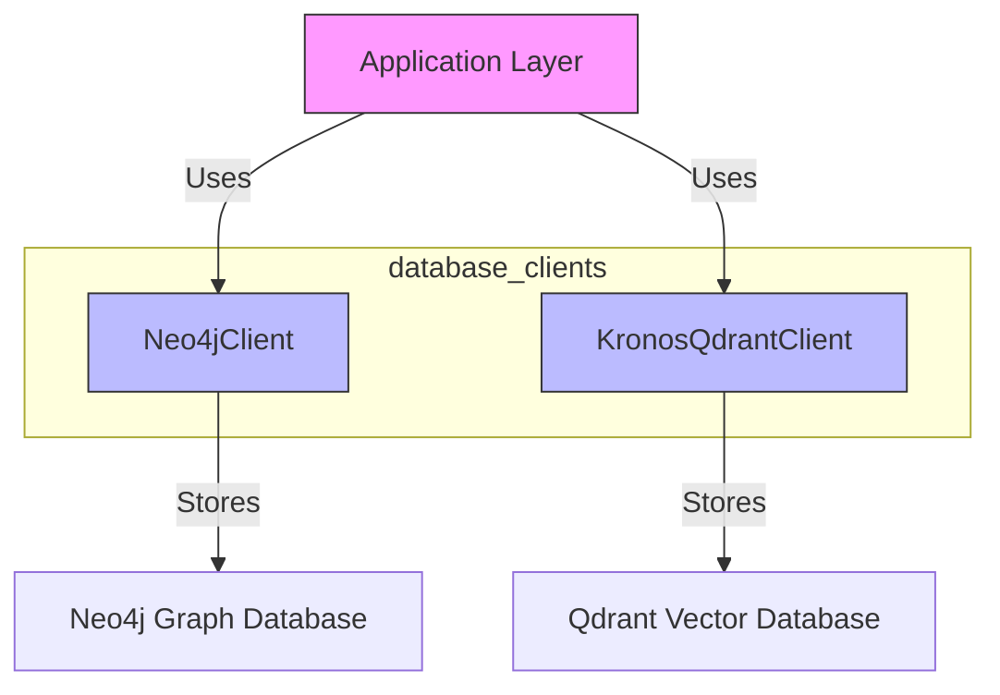
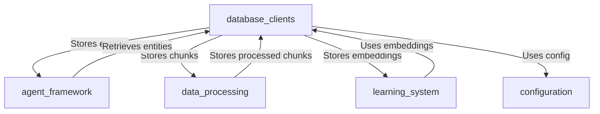
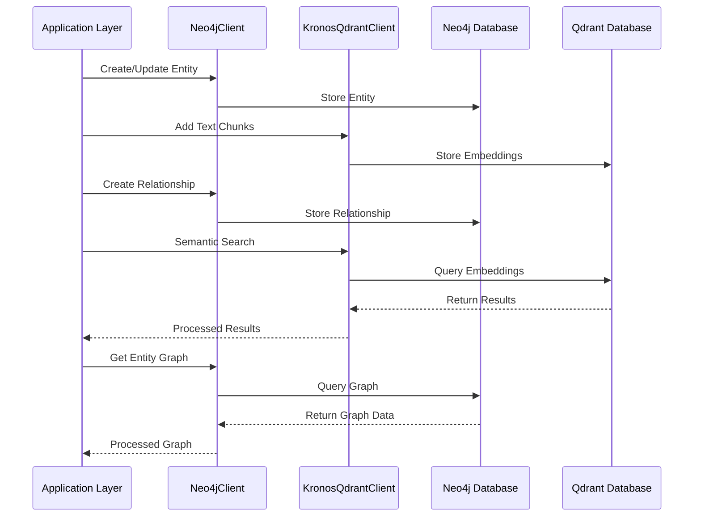

# Database Clients Module Documentation

## Overview

The `database_clients` module provides database connectivity and interaction capabilities for the Kronos system. It serves as a bridge between the application layer and two specialized database systems:

1. **Neo4jClient**: A graph database client for managing entities and their relationships
2. **KronosQdrantClient**: A vector database client for semantic search and embeddings

These clients enable persistent storage, retrieval, and analysis of both structured data (entities and relationships) and unstructured data (text chunks and embeddings).

## Architecture Overview

## Module Components

### 1. Neo4jClient

**File**: `db/neo4j_client.py`

**Purpose**: Provides graph database functionality for storing and querying entities and their relationships.

**Core Responsibilities**:
- Entity management (creation, updating, retrieval)
- Relationship management between entities
- Domain-specific tagging and indexing
- Conflict detection and resolution
- Graph statistics and analytics

**Key Features**:
- Schema management and validation
- Confidence-based entity ranking
- Evidence merging and reinforcement
- Domain-specific indexing and querying
- Stale entity detection

**Dependencies**:
- `core.config`: For database connection configuration
- `agents.evidence_engine`: For evidence merging and reinforcement logic

**Documentation**: This is a core component with detailed functionality. See [Neo4j Client Detailed Documentation](database_clients_neo4j.md) for comprehensive information.

### 2. KronosQdrantClient

**File**: `db/qdrant_client.py`

**Purpose**: Provides vector database functionality for semantic search and embeddings storage.

**Core Responsibilities**:
- Text chunk and claim storage with embeddings
- Semantic search across document chunks
- Entity embedding storage and similarity search
- Domain-specific filtering and indexing

**Key Features**:
- Two specialized collections: `kronos_chunks` and `kronos_entities`
- Domain-aware semantic search
- Entity similarity detection
- Source document management
- Collection statistics and analytics

**Dependencies**:
- `qdrant_client`: The Qdrant Python client library
- `sentence_transformers`: For generating text embeddings
- `core.config`: For database connection and model configuration

**Documentation**: This is a core component with detailed functionality. See [Qdrant Client Detailed Documentation](database_clients_qdrant.md) for comprehensive information.

## Integration with Other Modules

The `database_clients` module integrates with several other modules in the Kronos system:

### Integration Points:

1. **With agent_framework**:
   - Stores and retrieves entities used by various agents
   - Maintains entity relationships for knowledge graph operations
   - See [agent_framework.md](agent_framework.md) for more details

2. **With data_processing**:
   - Stores processed text chunks with embeddings
   - Maintains source document tracking
   - See [data_processing.md](data_processing.md) for more details

3. **With learning_system**:
   - Stores entity embeddings for similarity search
   - Provides semantic search capabilities for learning operations
   - See [learning_system.md](learning_system.md) for more details

4. **With configuration**:
   - Uses centralized configuration for database connections
   - See [configuration.md](configuration.md) for more details

## Data Flow

## Configuration

The `database_clients` module relies on the centralized configuration system for database connection parameters. See [configuration.md](configuration.md) for details on configuration parameters.

## Error Handling and Best Practices

1. **Connection Management**:
   - Both clients implement proper connection handling
   - Resources are properly closed when clients are destroyed
   - Connection verification methods are available

2. **Data Consistency**:
   - MERGE operations ensure idempotent writes
   - Evidence merging prevents data loss
   - Domain-specific indexing improves query performance

3. **Performance Considerations**:
   - Indexes are created for frequently queried fields
   - Batch operations are supported where available
   - Query limits prevent resource exhaustion

## Future Enhancements

1. **Multi-tenancy Support**: Add tenant isolation for shared database instances
2. **Caching Layer**: Implement caching for frequent queries
3. **Migration Tools**: Add schema migration utilities
4. **Monitoring**: Add performance metrics and monitoring hooks
5. **Backup/Restore**: Implement database backup and restore functionality

## See Also

- [Neo4j Client Detailed Documentation](database_clients_neo4j.md)
- [Qdrant Client Detailed Documentation](database_clients_qdrant.md)
- [Agent Framework Module Documentation](agent_framework.md)
- [Data Processing Module Documentation](data_processing.md)
- [Learning System Module Documentation](learning_system.md)
- [Configuration Module Documentation](configuration.md)