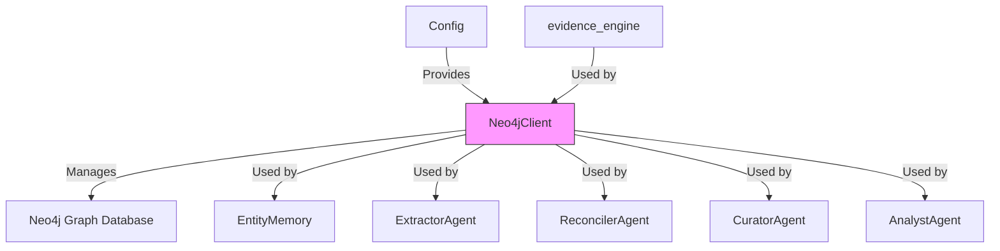
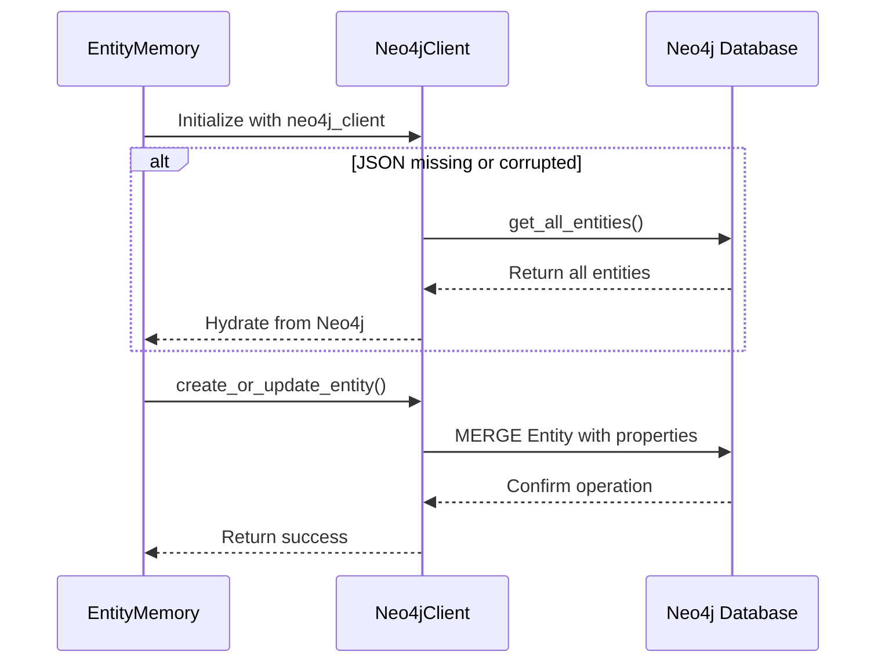
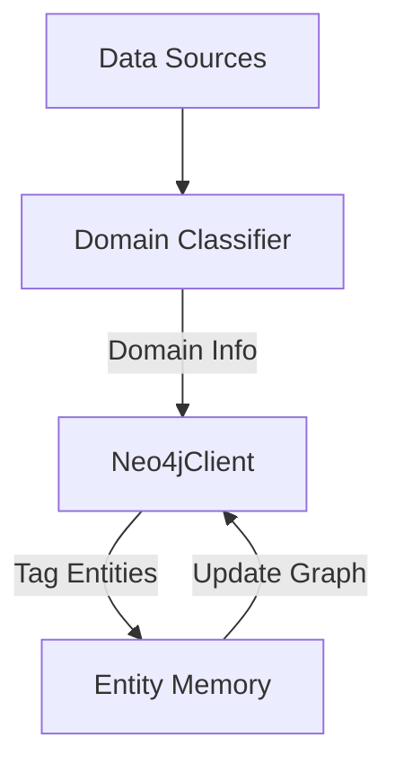

# Neo4j Database Client Module

## Overview

The `database_clients_neo4j` module provides a dedicated client for interacting with a Neo4j graph database, serving as the primary persistence layer for the Kronos system's knowledge graph. This module is part of the broader `database_clients` package, which also includes a Qdrant client for vector storage.

The Neo4j client is responsible for:
- Storing and retrieving entities and their relationships
- Managing the knowledge graph schema
- Providing graph analytics and statistics
- Handling entity deduplication and conflict resolution
- Supporting domain-specific entity tagging

## Architecture



## Core Components

### Neo4jClient Class

The primary class in this module is the `Neo4jClient`, which provides a high-level interface to the Neo4j graph database.

#### Key Features

1. **Connection Management**:
   - Establishes connection to Neo4j using configuration from `core.config`
   - Provides connection verification
   - Properly closes connections when done

2. **Schema Management**:
   - Sets up required indexes for performance
   - Creates constraints for data integrity
   - Prepares the database for entity storage

3. **Entity Operations**:
   - Create/update entities with properties and evidence
   - Find similar entities using fuzzy matching
   - Retrieve all entities for system initialization
   - Identify stale entities based on confidence thresholds
   - Tag entities with domain-specific labels

4. **Relationship Operations**:
   - Create and manage relationships between entities
   - Handle relationship evidence and confidence scoring
   - Support domain-specific relationship queries

5. **Analytics and Statistics**:
   - Retrieve graph statistics (entity count, relationship count, average confidence)
   - Get domain-specific statistics

#### Dependencies

The `Neo4jClient` class has several dependencies:

1. **Configuration**:
   - Uses `core.config` to get Neo4j connection parameters (URI, username, password)
   - See [configuration.md](configuration.md) for details on configuration options

2. **Evidence Engine**:
   - Uses `agents.evidence_engine` for evidence merging and confidence reinforcement
   - See [agent_framework.md](agent_framework.md) for details on the evidence engine

3. **Entity Memory**:
   - Used by `EntityMemory` class for persistent storage of entities
   - See [memory_systems.md](memory_systems.md) for details on entity memory

## Data Model

The Neo4j client implements a graph data model with the following key components:

### Entity Nodes

- **Label**: `Entity`
- **Properties**:
  - `name`: The canonical name of the entity
  - `type`: The type/category of the entity (Person, Organization, Location, etc.)
  - `domain`: Optional domain classification
  - `confidence`: Confidence score (0.0-1.0)
  - `source_doc`: Source document reference
  - `last_updated`: Timestamp of last update
  - `properties`: Serialized dictionary of additional properties
  - `evidence`: JSON string containing evidence records

### Relationships

- **Types**: Dynamic based on domain needs (e.g., `WORKS_AT`, `LOCATED_IN`, `RELATED_TO`)
- **Properties**:
  - `source_doc`: Source document reference
  - `confidence`: Confidence score (0.0-1.0)
  - `evidence`: JSON string containing evidence records
  - `last_updated`: Timestamp of last update
  - `created_at`: Timestamp of creation

### Indexes

The client creates the following indexes for performance:

1. `entity_confidence`: For efficient querying by confidence scores
2. `entity_timestamp`: For finding recently updated entities
3. `entity_domain`: For domain-specific queries

## Integration with Other Modules

### Memory Systems

The Neo4j client is tightly integrated with the memory systems:



### Agent Framework

Multiple agents in the agent framework use the Neo4j client:

1. **ExtractorAgent**:
   - Creates entities and relationships from extracted information
   - Uses evidence tracking for confidence scoring
   - See [agent_framework.md](agent_framework.md) for details

2. **ReconcilerAgent**:
   - Resolves entity conflicts and merges duplicate entities
   - Updates confidence scores based on evidence
   - See [agent_framework.md](agent_framework.md) for details

3. **CuratorAgent**:
   - Manages entity relationships and domain tagging
   - Uses graph statistics for curation decisions
   - See [agent_framework.md](agent_framework.md) for details

4. **AnalystAgent**:
   - Queries the graph for analytical insights
   - Uses domain-specific statistics
   - See [agent_framework.md](agent_framework.md) for details

### Data Processing

The Neo4j client works with the data processing pipeline:



## Usage Examples

### Basic Usage

```python
from db.neo4j_client import Neo4jClient

# Initialize the client
neo4j_client = Neo4jClient()

# Verify connection
if neo4j_client.verify_connection():
    print("Successfully connected to Neo4j")

# Setup schema
neo4j_client.setup_schema()

# Create an entity
neo4j_client.create_or_update_entity(
    name="John Doe",
    type="Person",
    source_doc="document1.pdf",
    confidence=0.95,
    properties={"age": 35, "occupation": "Engineer"},
    evidence={"source": "document1.pdf", "page": 1, "excerpt": "John Doe is an engineer"}
)

# Create a relationship
neo4j_client.create_relationship(
    from_name="John Doe",
    from_type="Person",
    to_name="Acme Corp",
    to_type="Organization",
    rel_type="WORKS_AT",
    source_doc="document1.pdf",
    confidence=0.85,
    evidence={"source": "document1.pdf", "page": 2, "excerpt": "John works at Acme Corp"}
)

# Close connection
neo4j_client.close()
```

### Entity Retrieval

```python
# Get all entities
entities = neo4j_client.get_all_entities(limit=1000)

# Find similar entities
similar = neo4j_client.find_similar_entity("Dr. John Doe", "Person")

# Get stale entities
stale = neo4j_client.get_stale_entities(min_confidence=0.5)

# Get graph statistics
stats = neo4j_client.get_graph_stats()
print(f"Total entities: {stats['total_entities']}")
print(f"Total relationships: {stats['total_relationships']}")
```

## Configuration

The Neo4j client is configured through environment variables or the `core.config` module:

| Environment Variable | Default Value | Description |
|----------------------|---------------|-------------|
| `NEO4J_URI` | `bolt://localhost:7687` | Neo4j server URI |
| `NEO4J_USER` | `neo4j` | Neo4j username |
| `NEO4J_PASSWORD` | `kronos_password` | Neo4j password |

For more details on configuration, see [configuration.md](configuration.md).

## Performance Considerations

1. **Batch Operations**: The client uses session-based operations for better performance.
2. **Indexing**: Proper indexes are created to optimize common queries.
3. **Evidence Management**: Evidence is capped at 50 records per entity to prevent unbounded growth.
4. **Connection Pooling**: Neo4j's Python driver handles connection pooling automatically.

## Error Handling

The client includes basic error handling for:
- Connection failures
- Query execution errors
- Data corruption in evidence records

For advanced error handling, wrap client operations in try-catch blocks.

## Testing

The module should be tested with:
- Connection verification tests
- Schema setup tests
- Entity creation and retrieval tests
- Relationship creation and traversal tests
- Performance tests with large datasets

## Future Enhancements

Potential improvements to the module:
1. Add support for transactions and batch operations
2. Implement more sophisticated conflict resolution algorithms
3. Add graph traversal utilities for common patterns
4. Support for graph algorithms (e.g., PageRank, community detection)
5. Integration with Neo4j's full-text search capabilities

## References

- [Core Configuration Module](configuration.md)
- [Agent Framework Documentation](agent_framework.md)
- [Memory Systems Documentation](memory_systems.md)
- [Data Processing Module](data_processing.md)
- [Neo4j Python Driver Documentation](https://neo4j.com/docs/api/python-driver/current/)
- [Neo4j Cypher Manual](https://neo4j.com/docs/cypher-manual/current/)