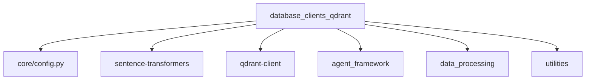
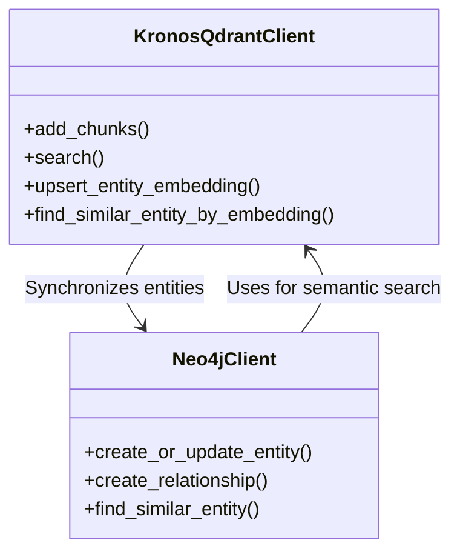

# Kronos Qdrant Client Module Documentation

## Overview

The `database_clients_qdrant` module provides a specialized client for interacting with Qdrant, a vector similarity search engine, as part of the Kronos knowledge management system. This module is responsible for storing and retrieving vector embeddings of document chunks and entities, enabling semantic search capabilities across the knowledge base.

The module is part of the broader `database_clients` package, which also includes a Neo4j client for graph database operations. Together, these clients form the persistence layer for the Kronos system, supporting both vector-based similarity search and graph-based relationship management.

## Purpose and Core Functionality

The primary purpose of the `KronosQdrantClient` class is to:

1. **Store and manage vector embeddings** of document chunks and entities
2. **Enable semantic search** across document content with optional domain filtering
3. **Support entity resolution** through similarity search for canonical entity identification
4. **Maintain domain-aware indexing** to scope searches to specific knowledge domains

### Key Features

- **Dual Collection Architecture**: Uses two Qdrant collections:
  - `kronos_chunks`: Stores embeddings of document chunks and claims
  - `kronos_entities`: Stores embeddings of canonical entities for similarity matching

- **Domain-Aware Operations**: All operations support optional domain filtering to scope searches to specific knowledge domains

- **Semantic Search Capabilities**: Provides vector similarity search with configurable similarity thresholds

- **Entity Resolution**: Implements similarity-based entity matching for canonical entity identification

- **Collection Management**: Automatically creates and indexes collections on initialization

## Architecture and Component Relationships

### Module Dependencies

The Qdrant client module has dependencies on several other modules in the Kronos system:



### Integration with Other Modules

1. **Configuration Module (`core/config.py`)**
   - Provides Qdrant connection parameters (host, port)
   - Supplies embedding model configuration
   - Defines collection naming and indexing parameters

2. **Agent Framework (`agent_framework`)**
   - Extractors use the Qdrant client to store extracted chunks and entities
   - Curators use semantic search to find relevant information
   - Analysts use the client for evidence retrieval and knowledge synthesis

3. **Data Processing (`data_processing`)**
   - DomainClassifier determines the domain of documents, which is used as a filter in Qdrant queries
   - EmbeddingCache could potentially interact with the Qdrant client for efficient embedding storage

4. **Utilities (`utilities`)**
   - Retry mechanisms ensure robust operation in the face of transient failures
   - Quota tracking prevents overuse of external services

### Data Flow

```mermaid
dataflow
    ExtractorAgent -->|add_chunks| KronosQdrantClient
    ExtractorAgent -->|upsert_entity_embedding| KronosQdrantClient
    CuratorAgent -->|search| KronosQdrantClient
    AnalystAgent -->|search_by_domain| KronosQdrantClient
    Neo4jClient <--|synchronize| KronosQdrantClient
```

## Core Components

### KronosQdrantClient Class

The main class in this module, providing all Qdrant operations.

#### Attributes

- `client`: QdrantClient instance for direct Qdrant operations
- `encoder`: SentenceTransformer instance for generating text embeddings
- `COLLECTION_NAME`: Constant for the chunks collection name ("kronos_chunks")

#### Methods

**Collection Management**
- `_setup_collection()`: Initializes collections and creates indexes

**Chunk Operations**
- `add_chunks(chunks: list[dict])`: Upserts document chunks with their embeddings
- `delete_by_source(source_doc: str)`: Removes all chunks from a specific source document
- `source_exists(source_doc: str) -> bool`: Checks if a source document exists in the collection
- `get_collection_stats() -> dict`: Returns statistics about the chunks collection

**Semantic Search**
- `search(query: str, top_k: int = 5, source_doc: str = None, type_filter: str = None, domain_filter: str = None) -> list[dict]`: Performs semantic search with optional filters
- `search_by_domain(query: str, domain: str, top_k: int = 5, type_filter: str = None) -> list[dict]`: Convenience method for domain-scoped search

**Entity Operations**
- `upsert_entity_embedding(name: str, entity_type: str, embedding: list[float], domain: str | None = None)`: Stores or updates an entity's embedding
- `find_similar_entity_by_embedding(embedding: list[float], entity_type: str, domain: str | None = None, threshold: float = 0.85) -> dict | None`: Finds similar entities with similarity threshold
- `find_nearest_entity_candidate(embedding: list[float], entity_type: str, domain: str | None = None) -> dict | None`: Finds the nearest entity regardless of similarity threshold

## Usage Examples

### Initialization

```python
from database_clients_qdrant import KronosQdrantClient

# Initialize the client
qdrant_client = KronosQdrantClient()
```

### Adding Chunks

```python
chunks = [
    {
        "text": "The quick brown fox jumps over the lazy dog",
        "source_doc": "example.pdf",
        "page": 1,
        "confidence": 0.95,
        "type": "chunk",
        "domain": "General"
    }
]

qdrant_client.add_chunks(chunks)
```

### Semantic Search

```python
results = qdrant_client.search(
    query="What animals are mentioned in the document?",
    top_k=5,
    domain_filter="General"
)

for result in results:
    print(f"Text: {result['text']}")
    print(f"Source: {result['source_doc']}")
    print(f"Score: {result['score']}")
```

### Entity Storage and Retrieval

```python
# Store an entity embedding
entity_embedding = [...]  # Generated by SentenceTransformer
qdrant_client.upsert_entity_embedding(
    name="Albert Einstein",
    entity_type="PERSON",
    embedding=entity_embedding,
    domain="Physics"
)

# Find similar entities
similar_entity = qdrant_client.find_similar_entity_by_embedding(
    embedding=query_embedding,
    entity_type="PERSON",
    domain="Physics",
    threshold=0.85
)
```

## Integration with Other Systems

### Relationship with Neo4j Client

The Qdrant client and Neo4j client work together to provide a complete knowledge management solution:



- **Entity Synchronization**: When new entities are discovered, they can be stored in both Qdrant (for semantic search) and Neo4j (for relationship management)
- **Cross-Reference Lookups**: The Analyst agent can use Qdrant for semantic search and then retrieve relationship information from Neo4j

### Integration with Agent Framework

The Qdrant client is used by various agents in the system:

1. **ExtractorAgent**: Stores extracted chunks and entities
2. **CuratorAgent**: Retrieves relevant information for curation tasks
3. **AnalystAgent**: Performs evidence retrieval and knowledge synthesis

## Configuration

The Qdrant client is configured through the `core/config.py` module:

```python
# Qdrant configuration
QDRANT_HOST = os.getenv("QDRANT_HOST", "localhost")
QDRANT_PORT = int(os.getenv("QDRANT_PORT", 6333))

# Embedding configuration
EMBEDDING_MODEL = "all-MiniLM-L6-v2"
EMBEDDING_DIM = 384
```

## Performance Considerations

1. **Batch Operations**: The `add_chunks` method supports batch operations for efficient bulk inserts
2. **Indexing**: Automatic indexing of payload fields (source_doc, type, domain) improves query performance
3. **Embedding Generation**: Uses SentenceTransformer for efficient embedding generation
4. **Similarity Thresholds**: Configurable thresholds for entity similarity matching

## Error Handling and Resilience

The module includes robust error handling:

1. **Collection Existence Checks**: Gracefully handles cases where collections already exist
2. **Index Creation**: Silently skips index creation if indexes already exist
3. **Retry Mechanisms**: Can be wrapped with retry decorators from the utilities module

## Best Practices

1. **Domain Tagging**: Always tag chunks and entities with appropriate domains when possible
2. **Batch Processing**: Use batch operations for bulk inserts to improve performance
3. **Similarity Thresholds**: Adjust similarity thresholds based on your specific requirements
4. **Collection Management**: Monitor collection sizes and consider archiving old data

## Future Enhancements

Potential improvements for future versions:

1. **Hybrid Search**: Implement hybrid search combining vector similarity with keyword matching
2. **Sharding**: Support for sharded collections for horizontal scaling
3. **Replication**: Configuration options for collection replication
4. **Monitoring**: Integration with monitoring systems for performance tracking
5. **Backup/Restore**: Tools for backing up and restoring Qdrant collections

## References

- [Qdrant Documentation](https://qdrant.tech/documentation/)
- [Sentence Transformers Documentation](https://www.sbert.net/)
- [Kronos Configuration Module](configuration.md)
- [Kronos Agent Framework](agent_framework.md)
- [Kronos Data Processing](data_processing.md)
- [Kronos Utilities](utilities.md)
- [Kronos Neo4j Client](database_clients_neo4j.md)