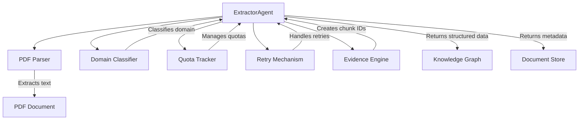
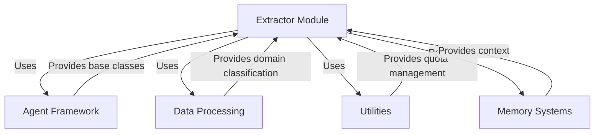
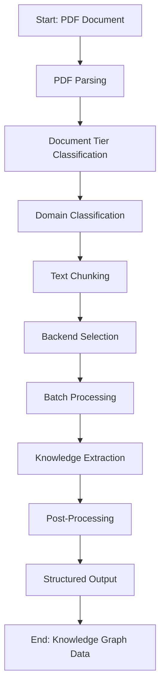
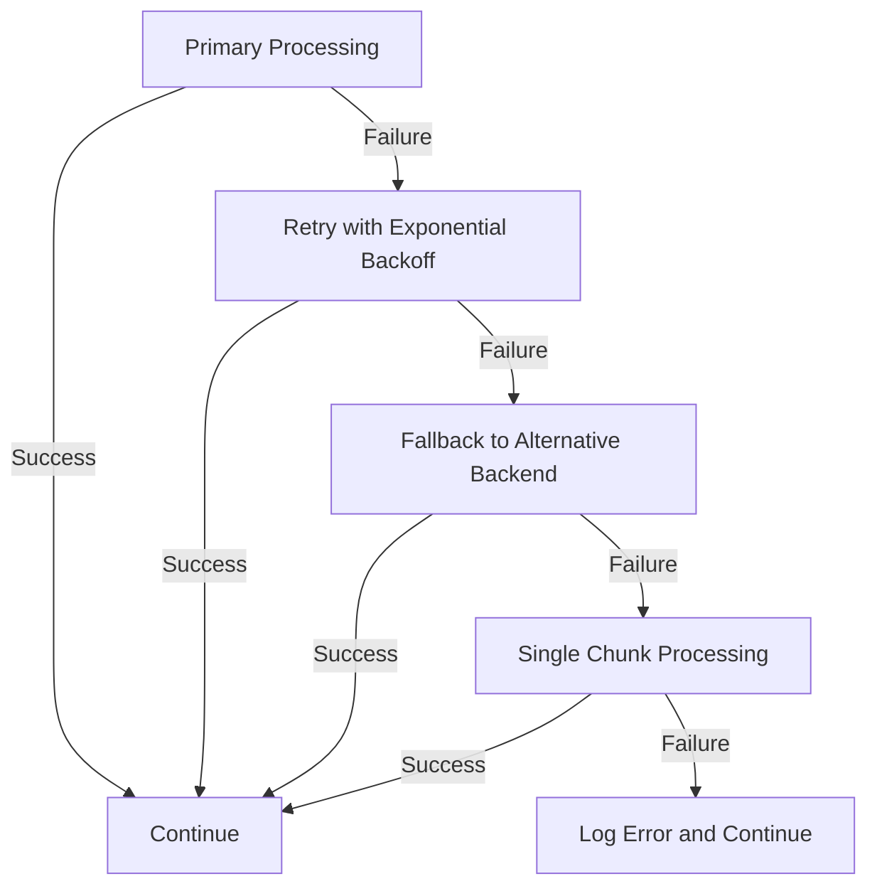

# Extractor Module Documentation

## Overview

The **Extractor Module** is a core component of the memory systems architecture, responsible for extracting structured knowledge from unstructured documents (primarily PDFs). It serves as the primary interface for document processing within the agent framework, converting raw text into a structured format containing entities, relationships, claims, and summaries.

This module is part of the `memory_systems` hierarchy and specifically falls under the `memory_systems_agent_framework` category. It plays a crucial role in the knowledge extraction pipeline by processing documents through various AI backends with smart routing based on document characteristics.

## Purpose and Core Functionality

The Extractor Module's primary purpose is to:

1. **Process Documents**: Extract text from PDF files using OCR and text extraction techniques
2. **Classify Content**: Determine the domain of the document (e.g., technology, science, business)
3. **Intelligent Chunking**: Break documents into manageable segments based on complexity tier
4. **Knowledge Extraction**: Use AI models to extract entities, relationships, claims, and summaries
5. **Confidence Scoring**: Calculate confidence scores for extracted information based on various factors
6. **Fallback Mechanisms**: Implement robust fallback strategies when primary processing fails

### Key Features

- **Smart Backend Routing**: Automatically selects the most appropriate AI backend based on document characteristics
- **Tier-based Processing**: Different processing strategies for different document tiers (1-3)
- **Domain Classification**: Identifies the domain of the document to inform extraction parameters
- **Batch Processing**: Processes multiple text segments in a single API call when possible
- **Fallback Mechanisms**: Gracefully degrades to alternative processing paths when primary methods fail
- **Quota Management**: Respects API quota limits with intelligent retry logic
- **Error Handling**: Robust error handling and recovery mechanisms

## Architecture and Component Relationships

The Extractor Module is built on several key components and interacts with multiple subsystems:



### Core Components

1. **ExtractorAgent** (`agents/extractor.py`)
   - Main class that orchestrates the extraction process
   - Implements smart routing between different AI backends
   - Manages the extraction pipeline and fallback mechanisms

2. **DomainClassifier** (`agents/domain_classifier.py`)
   - Classifies documents into domains (technology, science, business, etc.)
   - Provides domain-specific extraction parameters
   - Used to inform the extraction process about document context

3. **QuotaTracker** (`utils/quota.py`)
   - Manages API quota limits for different AI backends
   - Implements rate limiting and quota tracking
   - Ensures compliance with API usage limits

4. **DailyQuotaExceeded** (`utils/retry.py`)
   - Custom exception for quota-related failures
   - Triggers fallback mechanisms when quotas are exhausted

5. **make_chunk_id** (`agents/evidence_engine.py`)
   - Generates unique identifiers for text chunks
   - Used for tracking and referencing extracted information

### Integration with Other Modules

The Extractor Module integrates with several other modules in the system:



## Data Flow and Processing Pipeline

The extraction process follows a well-defined pipeline with multiple stages:



### Detailed Processing Steps

1. **PDF Parsing**
   - Extract text and tables from PDF documents
   - Perform OCR on scanned documents if needed
   - Generate quality scores based on parsing success

2. **Document Tier Classification**
   - Classify documents into tiers (1-3) based on complexity
   - Tier 1: Simple documents with clear structure
   - Tier 2: Moderately complex documents
   - Tier 3: Complex documents requiring special handling

3. **Domain Classification**
   - Analyze document content to determine domain
   - Domains include technology, science, business, etc.
   - Used to inform extraction parameters and validation rules

4. **Text Chunking**
   - Break documents into manageable text segments
   - Chunk size varies based on document tier
   - Preserve document structure and context

5. **Backend Selection**
   - Smart routing between different AI backends
   - Groq for standard processing (with quota limits)
   - Mistral for large documents (no daily quota)
   - Local models for specialized processing
   - Fallback mechanisms for error handling

6. **Batch Processing**
   - Process multiple text segments in a single API call
   - Optimize API usage and reduce processing time
   - Handle batch failures with individual chunk processing

7. **Knowledge Extraction**
   - Extract entities, relationships, claims, and summaries
   - Apply domain-specific extraction rules
   - Calculate confidence scores for extracted information

8. **Post-Processing**
   - Entity reconciliation and deduplication
   - Relationship validation and canonicalization
   - Confidence score calculation
   - Error handling and recovery

## API Documentation

### ExtractorAgent Class

The main class for document extraction operations.

#### Constructor

```python
ExtractorAgent()
```

Initializes the extractor with configured backends and models.

**Parameters:**
- None (configuration loaded from system settings)

**Attributes:**
- `backend_preference`: Preferred AI backend (default: "groq")
- `large_doc_backend`: Backend for large documents (default: "mistral")
- `current_tier`: Current document tier being processed
- `groq_client`: Groq API client (if configured)
- `gemini_llm`: Gemini LLM client (if configured)
- `local_llm`: Local LLM client (if configured)
- `mistral_client`: Mistral API client
- `domain_classifier`: Domain classification instance

#### Methods

##### extract_knowledge

```python
def extract_knowledge(self, filepath: str) -> dict
```

Extracts structured knowledge from a PDF document.

**Parameters:**
- `filepath` (str): Path to the PDF document to process

**Returns:**
- dict: Structured knowledge containing entities, relationships, claims, and metadata

**Example Output:**
```json
{
  "filename": "example.pdf",
  "filepath": "/path/to/example.pdf",
  "metadata": {...},
  "entities": [...],
  "relationships": [...],
  "claims": [...],
  "chunks": [...],
  "summary": "...",
  "tables": [...],
  "tier": 2,
  "quality_score": 0.95,
  "domain": "technology"
}
```

##### _select_backend

```python
def _select_backend(self, chunk_count: int) -> str
```

Selects the appropriate AI backend based on document characteristics.

**Parameters:**
- `chunk_count` (int): Number of text chunks to process

**Returns:**
- str: Name of the selected backend ("groq", "mistral", "gemini", or "local")

##### _extract_batch

```python
def _extract_batch(self, batch: list[dict], doc_title: str) -> tuple[list[dict], bool]
```

Processes a batch of text chunks.

**Parameters:**
- `batch` (list[dict]): List of text chunks to process
- `doc_title` (str): Title of the source document

**Returns:**
- tuple: (list of extraction results, used_fallback flag)

## Configuration

The Extractor Module is configured through system settings. Key configuration parameters include:

### Backend Configuration

- `EXTRACTOR_BACKEND`: Preferred AI backend (default: "groq")
- `EXTRACTOR_LARGE_DOC_BACKEND`: Backend for large documents (default: "mistral")
- `EXTRACTOR_GROQ_MODEL`: Groq model to use (default: "llama-3.3-70b-versatile")
- `EXTRACTOR_GROQ_MODEL_FAST`: Fast Groq model for tier 3 documents (default: "llama-3.1-8b-instant")
- `EXTRACTOR_MODEL`: Gemini model to use (default: "gemini-1.5-flash")
- `EXTRACTOR_FALLBACK_MODEL`: Fallback model for Mistral (default: "mistral-small-2506")

### API Keys

- `GROQ_API_KEY`: API key for Groq backend
- `GEMINI_API_KEY`: API key for Gemini backend
- `MISTRAL_API_KEY`: API key for Mistral backend
- `LOCAL_MODEL_URL`: URL for local LLM (if using local backend)
- `LOCAL_MODEL_NAME`: Name of local LLM model

### Processing Configuration

- `DOMAIN_MODEL`: Model to use for domain classification (default: "mistral-small-2506")
- `MISTRAL_RATE_LIMIT_DELAY`: Delay between Mistral API calls (default: 0.2 seconds)

### Quota Configuration

- `EXTRACTOR_QUOTA_LIMIT`: Daily quota limit for extractor operations
- `GROQ_QUOTA_LIMIT`: Daily quota limit for Groq operations
- `MISTRAL_QUOTA_LIMIT`: Daily quota limit for Mistral operations

## Error Handling and Fallback Mechanisms

The Extractor Module implements robust error handling and fallback mechanisms:



### Error Scenarios and Responses

1. **API Quota Exceeded**
   - Detects quota exhaustion through `DailyQuotaExceeded` exception
   - Falls back to alternative backend (typically Mistral)
   - Continues processing with reduced throughput

2. **Rate Limiting**
   - Implements rate limiting delays between API calls
   - Uses exponential backoff for retries
   - Dynamically adjusts processing speed based on API responses

3. **Model Failures**
   - Handles model-specific errors gracefully
   - Falls back to simpler models for complex documents
   - Implements single-chunk processing as ultimate fallback

4. **Data Validation**
   - Validates extracted data structure
   - Discards malformed entities and relationships
   - Logs validation errors for debugging

5. **Timeout Handling**
   - Implements timeout handling for API calls
   - Uses configurable timeout values
   - Implements retry logic with increasing delays

## Performance Considerations

### Processing Time

The extraction process can be time-consuming depending on:
- Document size and complexity
- Selected AI backend
- Current system load
- API rate limits

### Memory Usage

The module processes documents in chunks to manage memory usage:
- Large documents are broken into smaller segments
- Batch processing reduces memory overhead
- Intermediate results are stored efficiently

### Scalability

The module is designed to scale through:
- Batch processing of text chunks
- Parallel processing of multiple documents
- Smart backend routing to optimize performance
- Efficient memory management

## Best Practices

### Document Preparation

- Ensure PDFs are properly formatted and text-searchable
- For scanned documents, ensure OCR quality is high
- Consider document complexity when estimating processing time

### Configuration

- Configure appropriate backends based on your API access
- Set realistic quota limits to avoid unexpected interruptions
- Adjust processing parameters based on your hardware capabilities

### Error Handling

- Monitor extraction logs for errors and warnings
- Implement retry logic for transient failures
- Consider implementing circuit breakers for persistent failures

### Performance Optimization

- Process documents in batches when possible
- Consider document tiering to optimize processing
- Monitor API usage and adjust quotas as needed

## Testing and Validation

The Extractor Module should be tested with:

1. **Unit Tests**
   - Test individual components (backend selection, chunking, etc.)
   - Test error handling and fallback mechanisms
   - Test data validation and post-processing

2. **Integration Tests**
   - Test end-to-end extraction pipeline
   - Test integration with other modules
   - Test performance with various document types

3. **Performance Tests**
   - Measure processing time for different document sizes
   - Test memory usage with large documents
   - Test scalability with multiple concurrent documents

## Related Modules

For more information on related modules, see:

- **[agent_framework.md](agent_framework.md)**: Base agent framework and architecture
- **[data_processing.md](data_processing.md)**: Data processing utilities and components
- **[utilities.md](utilities.md)**: Utility functions and classes used throughout the system
- **[memory_systems.md](memory_systems.md)**: Memory systems architecture and components

## Future Enhancements

Potential areas for future development:

1. **Multi-modal Processing**: Support for images, diagrams, and other non-text content
2. **Custom Extraction Rules**: Domain-specific extraction rules and validation
3. **Improved Chunking**: More sophisticated text segmentation algorithms
4. **Parallel Processing**: True parallel processing of document chunks
5. **Model Fine-tuning**: Fine-tuned models for specific domains
6. **Quality Metrics**: More sophisticated quality scoring and validation
7. **User Feedback Integration**: Incorporate user feedback to improve extraction quality

## References

- [Agent Framework Documentation](agent_framework.md)
- [Data Processing Documentation](data_processing.md)
- [Utilities Documentation](utilities.md)
- [Memory Systems Documentation](memory_systems.md)

## License

This module is part of the Kronos system and is licensed under the same terms as the overall system.