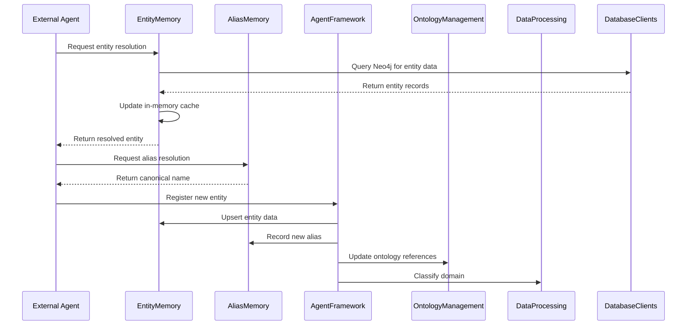

# Memory Systems Module Documentation

## Table of Contents
1. [Introduction](#introduction)
2. [Architecture Overview](#architecture-overview)
   - [Core Components](#core-components)
   - [Sub-Modules](#sub-modules)
3. [Component Interactions](#component-interactions)
4. [Detailed Sub-Module Documentation](#detailed-sub-module-documentation)
5. [Integration with Other Modules](#integration-with-other-modules)
6. [Data Flow](#data-flow)
7. [Configuration](#configuration)

---

## Introduction

The `memory_systems` module is a core component of the overall system architecture, responsible for managing and maintaining persistent memory structures that enable entity recognition, alias resolution, and contextual understanding across the system. This module provides the foundational memory capabilities that other agents and components rely on for consistent entity handling and knowledge retention.

### Key Responsibilities:
- Entity memory management with persistence
- Alias resolution and learning
- Entity relationship tracking
- Integration with knowledge graphs (Neo4j)
- Vector embeddings for semantic similarity

---

## Architecture Overview

The memory systems module follows a layered architecture with clear separation of concerns between different memory components. The architecture is designed to support both short-term and long-term memory needs while maintaining data consistency and providing efficient lookup capabilities.

```mermaid
flowchart TD
    A[Memory Systems Module] --> B[Entity Memory]
    A --> C[Alias Memory]
    A --> D[Agent Framework Integration]
    A --> E[Ontology Management]
    A --> F[Data Processing]
    A --> G[Learning System]
    A --> H[API Layer]
    A --> I[Configuration]
    A --> J[Database Clients]
    A --> K[Utilities]

    B --> B1[Entity Persistence]
    B --> B2[Relationship Tracking]
    B --> B3[Semantic Search]

    C --> C1[Alias Learning]
    C --> C2[Confidence Thresholds]
    C --> C3[Conflict Resolution]

    D --> D1[Agent Integration]
    D --> D2[Module Coordination]

    E --> E1[Ontology Evolution]
    E --> E2[Ontology Resolution]

    F --> F1[Domain Classification]
    F --> F2[Embedding Cache]
    F --> F3[Source Reliability]

    G --> G1[Learning Engine]
    G --> G2[Self Evaluation]

    H --> H1[Query Interface]
    H --> H2[Approval System]

    I --> I1[System Configuration]

    J --> J1[Neo4j Client]
    J --> J2[Qdrant Client]

    K --> K1[Quota Management]
    K --> K2[Retry Mechanisms]
```

---

## Core Components

### EntityMemory (`agents/entity_memory.py`)
The `EntityMemory` class is responsible for maintaining a persistent store of entity information including:
- Canonical entity names and types
- Descriptions and aliases
- Occurrence counts and confidence scores
- Relationship tracking
- Domain-specific categorization

Key features:
- Persistence to JSON files with atomic writes
- Optional hydration from Neo4j knowledge graph
- Semantic similarity search using vector embeddings
- Relationship tracking between entities

### AliasMemory (`agents/alias_memory.py`)
The `AliasMemory` class manages a continuously learned alias table that:
- Maps alternative names to canonical entity names
- Learns from various sources (embeddings, fuzzy matching, LLM referee)
- Implements confidence thresholds for permanent storage
- Handles alias conflicts with confidence-based resolution

Key features:
- Persistent storage of alias mappings
- Confidence-based learning with thresholds
- Reinforcement learning through repeated usage
- Manual correction capability

---

## Sub-Modules

The memory systems module is organized into several sub-modules that handle specific aspects of memory management:

1. **Agent Framework Integration** (`agent_framework`)
   - Coordinates with various agents that interact with memory
   - See [memory_systems_agent_framework.md](memory_systems_agent_framework.md) for detailed documentation

2. **Ontology Management** (`ontology_management`)
   - Handles ontology evolution and resolution
   - See [ontology_management.md](ontology_management.md) for detailed documentation

3. **Data Processing** (`data_processing`)
   - Provides domain classification, embedding caching, and source reliability assessment
   - See [memory_systems_data_processing.md](memory_systems_data_processing.md) for detailed documentation

4. **Learning System** (`learning_system`)
   - Implements learning engine and self-evaluation capabilities
   - See [learning_system.md](learning_system.md) for detailed documentation

5. **API Layer** (`api_layer`)
   - Provides query and approval interfaces
   - See [api_layer.md](api_layer.md) for detailed documentation

6. **Configuration** (`configuration`)
   - Manages system configuration
   - See [configuration.md](configuration.md) for detailed documentation

7. **Database Clients** (`database_clients`)
   - Provides Neo4j and Qdrant client implementations
   - See [database_clients.md](database_clients.md) for detailed documentation

8. **Utilities** (`utilities`)
   - Provides quota tracking and retry mechanisms
   - See [memory_systems_utilities.md](memory_systems_utilities.md) for detailed documentation

---

## Component Interactions

The memory systems module interacts with other parts of the system through well-defined interfaces:

---

## Detailed Sub-Module Documentation

For detailed documentation of each sub-module, see the following files:

- [Agent Framework Integration](memory_systems_agent_framework.md) - Agent framework integration
- [Ontology Management](ontology_management.md) - Ontology management
- [Data Processing](memory_systems_data_processing.md) - Data processing components
- [Learning System](learning_system.md) - Learning system components
- [API Layer](api_layer.md) - API layer components
- [Configuration](configuration.md) - Configuration management
- [Database Clients](database_clients.md) - Database client implementations
- [Utilities](memory_systems_utilities.md) - Utility components

---

## Integration with Other Modules

The memory systems module integrates with several other modules in the system:

1. **Agent Framework**: Provides memory capabilities to various agents
2. **Ontology Management**: Maintains ontology references in entity memory
3. **Data Processing**: Uses domain classification and embedding caching
4. **Learning System**: Provides data for learning and self-evaluation
5. **API Layer**: Exposes memory-related endpoints
6. **Database Clients**: Uses Neo4j and Qdrant for persistent storage
7. **Utilities**: Uses quota tracking and retry mechanisms

For more details on these integrations, refer to the respective module documentation.

---

## Data Flow

The memory systems module handles several key data flows:

1. **Entity Resolution Flow**:
   - External request → EntityMemory → Database → Response
   - Optional: AliasMemory lookup for alternative names

2. **Entity Learning Flow**:
   - New entity detected → AgentFramework → EntityMemory upsert
   - Optional: AliasMemory record for alternative names
   - Optional: OntologyManagement update for ontology references

3. **Relationship Tracking Flow**:
   - Entity interaction detected → EntityMemory record_relationship
   - Optional: Update in Neo4j knowledge graph

4. **Semantic Search Flow**:
   - Query embedding → EntityMemory find_similar
   - Returns most similar entities based on vector similarity

---

## Configuration

The memory systems module is configured through the central configuration system. Key configuration parameters include:

- Memory file paths for persistent storage
- Confidence thresholds for alias learning
- Neo4j connection parameters
- Embedding cache settings
- Domain classification thresholds

For detailed configuration options, see [configuration.md](configuration.md).