# Memory Systems Agent Framework Documentation

## Table of Contents
1. [Introduction](#introduction)
2. [Module Architecture](#module-architecture)
3. [Core Components](#core-components)
4. [Agent Interactions](#agent-interactions)
5. [Data Flow](#data-flow)
6. [Integration with Other Modules](#integration-with-other-modules)
7. [Configuration](#configuration)
8. [Error Handling](#error-handling)
9. [Performance Considerations](#performance-considerations)
10. [Future Enhancements](#future-enhancements)

---

## Introduction

The `memory_systems_agent_framework` module is a specialized component within the broader Memory Systems architecture, designed to manage and coordinate multiple AI agents that process, analyze, and reconcile information from various sources. This framework serves as the orchestration layer that connects different agent types with memory systems and data processing pipelines.

### Purpose

The primary purpose of this framework is to:
- Coordinate interactions between specialized agents
- Manage memory operations through AliasMemory and EntityMemory
- Facilitate information extraction, analysis, and reconciliation
- Provide a unified interface for memory system operations

### Key Features

- Multi-agent orchestration
- Memory management integration
- Data processing pipeline coordination
- Error handling and retry mechanisms
- Configuration management

---

## Module Architecture

The following diagram illustrates the high-level architecture of the memory systems agent framework:

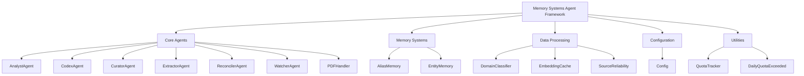

---

## Core Components

### Agent Framework Structure

The agent framework is organized into specialized agent modules, each responsible for specific tasks within the memory system:

```mermaid
%% Agent framework component structure
flowchart TD
    AgentFramework[Memory Systems Agent Framework] --> Analyst[AnalystAgent]
    AgentFramework --> Codex[CodexAgent]
    AgentFramework --> Curator[CuratorAgent]
    AgentFramework --> Extractor[ExtractorAgent]
    AgentFramework --> Reconciler[ReconcilerAgent]
    AgentFramework --> Watcher[WatcherAgent & PDFHandler]
    
    subgraph AnalystModule[Analyst Module]
        Analyst --> AnalystCore[AnalystAgent Core]
        Analyst --> AnalystUtils[Analyst Utilities]
    end
    
    subgraph CodexModule[Codex Module]
        Codex --> CodexCore[CodexAgent Core]
        Codex --> CodexUtils[Codex Utilities]
    end
    
    subgraph CuratorModule[Curator Module]
        Curator --> CuratorCore[CuratorAgent Core]
        Curator --> CuratorUtils[Curator Utilities]
    end
    
    subgraph ExtractorModule[Extractor Module]
        Extractor --> ExtractorCore[ExtractorAgent Core]
        Extractor --> ExtractorUtils[Extractor Utilities]
    end
    
    subgraph ReconcilerModule[Reconciler Module]
        Reconciler --> ReconcilerCore[ReconcilerAgent Core]
        Reconciler --> ReconcilerUtils[Reconciler Utilities]
    end
    
    subgraph WatcherModule[Watcher Module]
        Watcher --> WatcherCore[WatcherAgent Core]
        Watcher --> PDFHandlerCore[PDFHandler Core]
        Watcher --> WatcherUtils[Watcher Utilities]
    end
```

### Agent Descriptions

#### AnalystAgent
- **Purpose**: Analyzes and interprets information from various sources
- **Responsibilities**:
  - Data analysis and pattern recognition
  - Information synthesis
  - Report generation
- **Dependencies**:
  - `data_processing` module for domain classification
  - `utilities` module for quota tracking

#### CodexAgent
- **Purpose**: Manages and organizes knowledge within the system
- **Responsibilities**:
  - Knowledge base maintenance
  - Information categorization
  - Cross-referencing information
- **Dependencies**:
  - `ontology_management` module for ontology operations
  - `database_clients` for persistent storage

#### CuratorAgent
- **Purpose**: Maintains and curates the information repository
- **Responsibilities**:
  - Information validation
  - Quality assurance
  - Content organization
- **Dependencies**:
  - `data_processing` module for source reliability assessment
  - `memory_systems` for memory operations

#### ExtractorAgent
- **Purpose**: Extracts relevant information from various data sources
- **Responsibilities**:
  - Data extraction from documents
  - Information parsing
  - Entity recognition
- **Dependencies**:
  - `data_processing` module for embedding operations
  - `utilities` module for retry mechanisms

#### ReconcilerAgent
- **Purpose**: Resolves conflicts and inconsistencies in information
- **Responsibilities**:
  - Conflict detection
  - Information reconciliation
  - Consistency enforcement
- **Dependencies**:
  - `ontology_management` module for ontology resolution
  - `memory_systems` for memory operations

#### WatcherAgent & PDFHandler
- **Purpose**: Monitors and processes document-based information
- **Responsibilities**:
  - Document monitoring
  - PDF processing
  - Change detection
- **Dependencies**:
  - `data_processing` module for domain classification
  - `utilities` module for quota tracking

---

## Memory Systems Integration

The agent framework integrates with two primary memory systems:

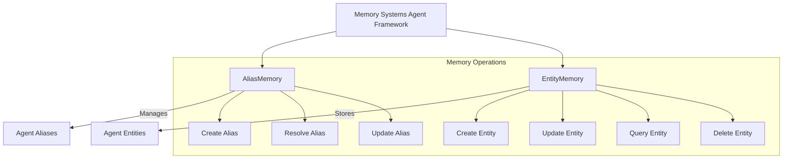

### AliasMemory
- **Purpose**: Manages aliases for entities and concepts
- **Operations**:
  - Create, read, update, delete aliases
  - Alias resolution
  - Alias conflict detection

### EntityMemory
- **Purpose**: Stores and retrieves entity information
- **Operations**:
  - Entity creation and management
  - Entity relationship mapping
  - Entity query and retrieval

---

## Data Flow

The following diagram illustrates the typical data flow through the agent framework:

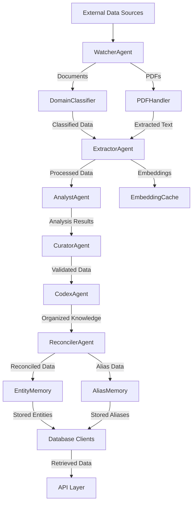

### Detailed Data Flow

1. **Input Phase**:
   - Data enters through WatcherAgent which monitors various sources
   - PDFHandler processes PDF documents
   - DomainClassifier classifies incoming documents

2. **Extraction Phase**:
   - ExtractorAgent processes and extracts relevant information
   - EmbeddingCache stores generated embeddings for efficient retrieval

3. **Analysis Phase**:
   - AnalystAgent analyzes the extracted information
   - Generates insights and patterns from the data

4. **Curating Phase**:
   - CuratorAgent validates and organizes the analyzed information
   - Ensures data quality and consistency

5. **Knowledge Organization Phase**:
   - CodexAgent organizes information into a structured knowledge base
   - Maintains relationships between entities

6. **Reconciliation Phase**:
   - ReconcilerAgent resolves any conflicts or inconsistencies
   - Creates aliases for entities and concepts

7. **Storage Phase**:
   - Processed data is stored in EntityMemory and AliasMemory
   - Database clients handle persistent storage

8. **Access Phase**:
   - API layer provides access to the stored information

---

## Agent Interactions

The agent framework coordinates interactions between various agents through a message-passing system:

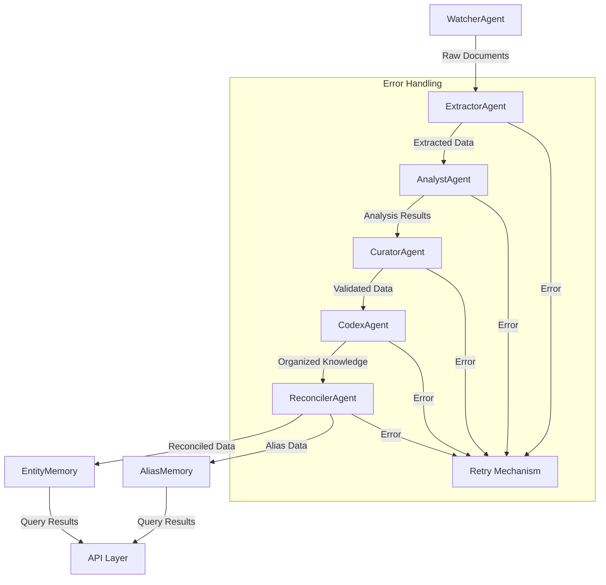

### Interaction Patterns

1. **Sequential Processing**:
   - Data flows sequentially through agents (Watcher → Extractor → Analyst → Curator → Codex → Reconciler)
   - Each agent performs its specialized task before passing data to the next

2. **Parallel Processing**:
   - Some agents can operate in parallel (e.g., multiple ExtractorAgents processing different documents)
   - WatcherAgent can monitor multiple sources simultaneously

3. **Feedback Loops**:
   - ReconcilerAgent may send feedback to CuratorAgent for data validation
   - CodexAgent may request additional analysis from AnalystAgent

4. **Error Recovery**:
   - Integrated retry mechanisms handle transient failures
   - Quota tracking prevents system overload

---

## Integration with Other Modules

The memory systems agent framework integrates with several other modules in the system:

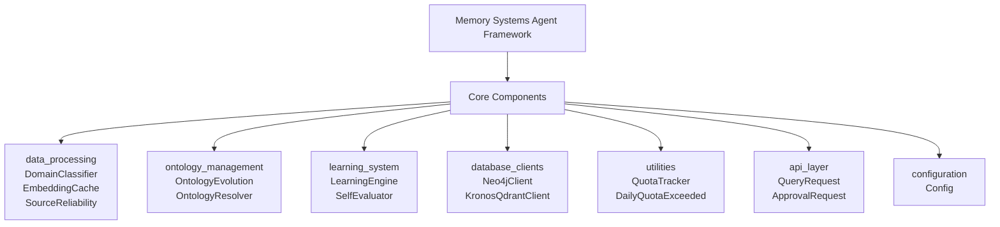

### Detailed Integration Points

#### Data Processing Module
- **DomainClassifier**: Used by WatcherAgent to classify incoming documents
- **EmbeddingCache**: Used by ExtractorAgent to store and retrieve embeddings
- **SourceReliability**: Used by CuratorAgent to assess source credibility

**Reference**: See [data_processing.md](data_processing.md) for detailed documentation.

#### Ontology Management Module
- **OntologyEvolution**: Used by CodexAgent to maintain and evolve the ontology
- **OntologyResolver**: Used by ReconcilerAgent to resolve entity relationships

**Reference**: See [ontology_management.md](ontology_management.md) for detailed documentation.

#### Learning System Module
- **LearningEngine**: Used by AnalystAgent to improve analysis over time
- **SelfEvaluator**: Used by CuratorAgent to assess data quality

**Reference**: See [learning_system.md](learning_system.md) for detailed documentation.

#### Database Clients Module
- **Neo4jClient**: Used by EntityMemory for graph-based storage
- **KronosQdrantClient**: Used by AliasMemory for vector storage

**Reference**: See [database_clients.md](database_clients.md) for detailed documentation.

#### Utilities Module
- **QuotaTracker**: Used by all agents to manage API quotas
- **DailyQuotaExceeded**: Used for error handling and retry mechanisms

**Reference**: See [utilities.md](utilities.md) for detailed documentation.

#### API Layer Module
- **QueryRequest**: Used to expose agent framework capabilities
- **ApprovalRequest**: Used for authorization and access control

**Reference**: See [api_layer.md](api_layer.md) for detailed documentation.

#### Configuration Module
- **Config**: Provides centralized configuration for all agents

**Reference**: See [configuration.md](configuration.md) for detailed documentation.

---

## Configuration

The agent framework is configured through the central configuration system:

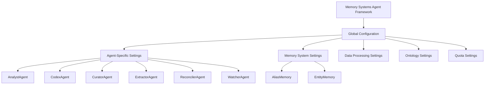

### Configuration Parameters

#### Global Configuration
- `agent_framework.enabled`: Enable/disable the entire framework
- `agent_framework.log_level`: Logging verbosity
- `agent_framework.max_concurrent_agents`: Maximum parallel agent operations

#### Agent-Specific Configuration
Each agent type has its own configuration section:

```yaml
analyst_agent:
  enabled: true
  analysis_timeout: 300
  max_concurrent_analyses: 5
  
codex_agent:
  enabled: true
  ontology_sync_interval: 3600
  max_knowledge_base_size: 100000
  
curator_agent:
  enabled: true
  validation_strictness: "high"
  max_validation_retries: 3
  
watcher_agent:
  enabled: true
  document_poll_interval: 60
  max_documents_per_batch: 100
```

#### Memory System Configuration
```yaml
memory_systems:
  alias_memory:
    max_aliases: 1000000
    cache_size: 10000
    ttl: 86400
    
  entity_memory:
    max_entities: 1000000
    cache_size: 10000
    ttl: 86400
```

#### Data Processing Configuration
```yaml
data_processing:
  domain_classifier:
    model: "bert-base-uncased"
    batch_size: 32
    
  embedding_cache:
    max_size: 100000
    ttl: 3600
    
  source_reliability:
    scoring_model: "reliability_v1"
    update_interval: 86400
```

**Reference**: See [configuration.md](configuration.md) for detailed configuration documentation.

---

## Error Handling

The agent framework includes comprehensive error handling mechanisms:

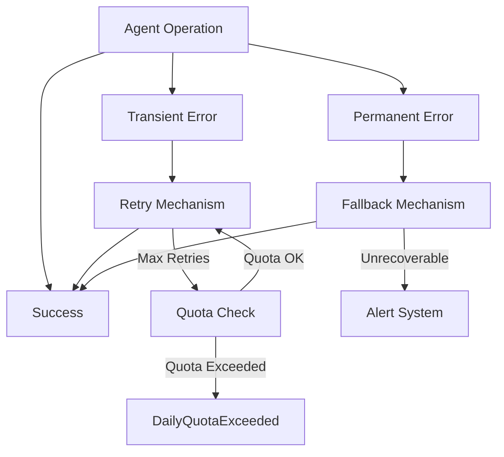

### Error Categories

1. **Transient Errors**:
   - Network timeouts
   - Temporary service unavailability
   - Rate limiting
   - **Handling**: Automatic retry with exponential backoff

2. **Permanent Errors**:
   - Invalid input data
   - Configuration errors
   - **Handling**: Fallback mechanisms or alerting

3. **Quota Errors**:
   - API quota exceeded
   - Rate limit exceeded
   - **Handling**: Quota tracking and enforcement

### Error Recovery Strategies

1. **Retry Mechanism**:
   - Implemented in `utilities/retry.py`
   - Exponential backoff with jitter
   - Maximum retry count enforcement

2. **Fallback Mechanisms**:
   - Graceful degradation when primary methods fail
   - Alternative data sources or processing paths

3. **Alerting System**:
   - Critical errors trigger alerts
   - Error metrics and monitoring

**Reference**: See [utilities.md](utilities.md) for detailed error handling documentation.

---

## Performance Considerations

### Performance Optimization Techniques

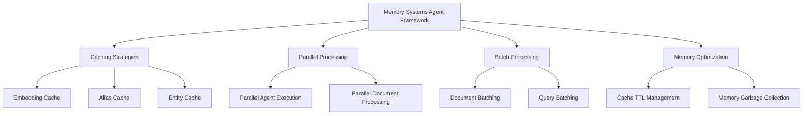

### Key Performance Factors

1. **Caching Strategies**:
   - EmbeddingCache for vector embeddings
   - AliasMemory and EntityMemory for quick lookups
   - Configurable TTL for cache entries

2. **Parallel Processing**:
   - Concurrent agent execution
   - Parallel document processing
   - Asynchronous I/O operations

3. **Batch Processing**:
   - Document batching for efficient processing
   - Query batching for database operations
   - Configurable batch sizes

4. **Memory Optimization**:
   - Efficient memory management
   - Garbage collection strategies
   - Memory pooling for frequent operations

### Performance Metrics

- **Agent Processing Time**: Time taken by each agent to process data
- **Memory Usage**: Memory consumption by caches and memory systems
- **Throughput**: Documents processed per unit time
- **Error Rate**: Frequency of errors and retries
- **Latency**: Response time for queries and operations

---

## Future Enhancements

### Planned Features

1. **Enhanced Learning Capabilities**:
   - Improved machine learning models for analysis
   - Adaptive learning based on user feedback
   - Automated ontology evolution

2. **Advanced Memory Systems**:
   - Long-term memory with decay mechanisms
   - Context-aware memory retrieval
   - Memory consolidation and pruning

3. **Performance Improvements**:
   - Distributed processing for large-scale operations
   - GPU acceleration for embedding generation
   - Optimized database queries

4. **New Agent Types**:
   - Specialized agents for specific domains
   - Multi-modal processing agents
   - Collaborative agents for team-based analysis

5. **Improved Error Handling**:
   - Predictive error detection
   - Automated recovery procedures
   - Enhanced alerting and monitoring

### Roadmap

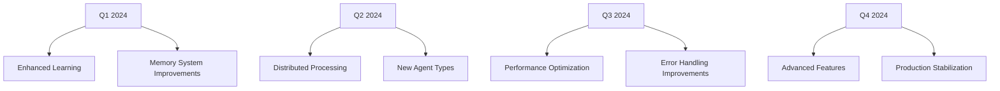

---

## API Reference

The agent framework provides a RESTful API for interacting with its capabilities:

### Endpoints

#### Agent Operations
- `POST /agents/analyst/analyze` - Analyze data using AnalystAgent
- `POST /agents/codex/organize` - Organize knowledge using CodexAgent
- `POST /agents/curator/validate` - Validate data using CuratorAgent
- `POST /agents/extractor/process` - Process documents using ExtractorAgent
- `POST /agents/reconciler/resolve` - Resolve conflicts using ReconcilerAgent
- `POST /agents/watcher/monitor` - Monitor sources using WatcherAgent

#### Memory Operations
- `GET /memory/alias/{alias_id}` - Retrieve an alias
- `POST /memory/alias/create` - Create a new alias
- `GET /memory/entity/{entity_id}` - Retrieve an entity
- `POST /memory/entity/create` - Create a new entity

#### Query Operations
- `POST /query` - Execute a complex query across agents
- `GET /query/status/{query_id}` - Check query status

**Reference**: See [api_layer.md](api_layer.md) for detailed API documentation.

---

## Monitoring and Maintenance

### Monitoring Metrics

The agent framework exposes metrics for monitoring:

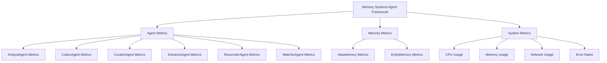

### Key Metrics to Monitor

1. **Agent Performance**:
   - Processing time per agent
   - Success/failure rates
   - Queue lengths and processing rates

2. **Memory System Performance**:
   - Cache hit/miss ratios
   - Memory usage patterns
   - Query response times

3. **System Health**:
   - CPU and memory utilization
   - Network throughput
   - Error rates and types

4. **Data Flow**:
   - Documents processed per time period
   - Data volume trends
   - Processing latency

### Maintenance Procedures

1. **Regular Maintenance**:
   - Cache clearing and optimization
   - Database maintenance (indexing, vacuuming)
   - Log rotation and archiving

2. **Performance Tuning**:
   - Configuration adjustments based on metrics
   - Cache size and TTL optimization
   - Parallelism settings adjustment

3. **Error Handling**:
   - Review of error logs
   - Analysis of recurring issues
   - Implementation of fixes or workarounds

---

## Troubleshooting

### Common Issues and Solutions

#### Issue 1: Agent Processing Failures
**Symptoms**:
- Frequent agent failures
- High error rates
- Processing delays

**Possible Causes**:
- Resource constraints (CPU, memory)
- Network connectivity issues
- Configuration errors
- External service unavailability

**Solutions**:
1. Check system resources and scale if needed
2. Verify network connectivity to external services
3. Review agent configuration for errors
4. Check external service status and dependencies

#### Issue 2: Memory System Performance Degradation
**Symptoms**:
- Slow memory operations
- High cache miss rates
- Memory exhaustion errors

**Possible Causes**:
- Insufficient cache sizes
- Inefficient queries
- Memory leaks
- High memory pressure from other processes

**Solutions**:
1. Adjust cache sizes and TTL values
2. Optimize memory system queries
3. Monitor for memory leaks
4. Allocate more system resources if needed

#### Issue 3: Data Processing Bottlenecks
**Symptoms**:
- Slow document processing
- High queue lengths
- Processing backlogs

**Possible Causes**:
- Insufficient parallelism
- Inefficient document parsing
- External service rate limiting
- Inadequate batch sizes

**Solutions**:
1. Adjust parallel processing settings
2. Optimize document parsing algorithms
3. Review external service rate limits
4. Adjust batch sizes based on performance testing

---

## Conclusion

The `memory_systems_agent_framework` module serves as the orchestration layer for the Memory Systems architecture, coordinating interactions between specialized agents, memory systems, and data processing pipelines. By providing a unified interface for complex operations and integrating with other system components, this framework enables efficient information processing, analysis, and reconciliation.

With its comprehensive error handling, performance optimization techniques, and extensible architecture, the agent framework is designed to scale with the growing demands of the Memory Systems platform while maintaining high reliability and performance.

For developers looking to extend or modify the agent framework, the modular design and clear separation of concerns make it straightforward to add new agent types or integrate additional system components.