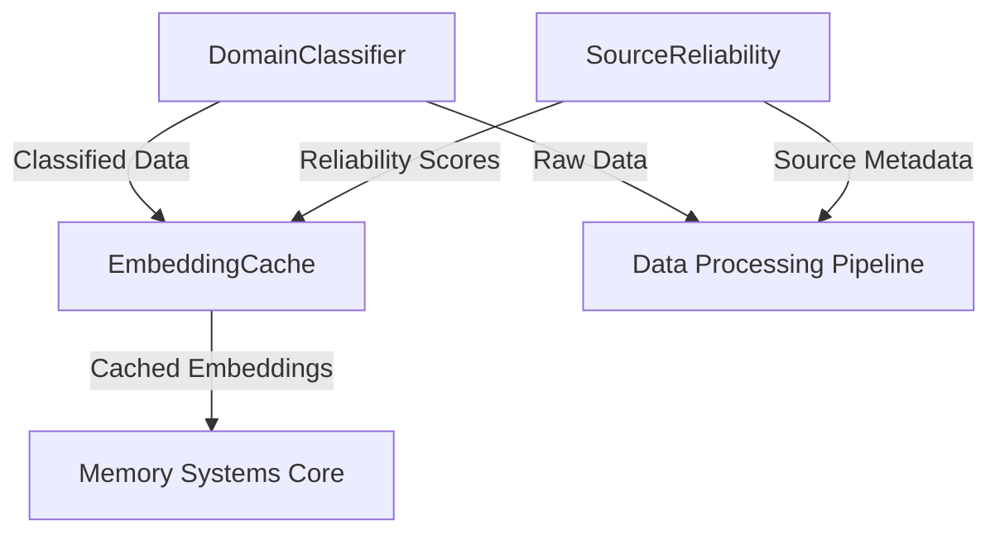
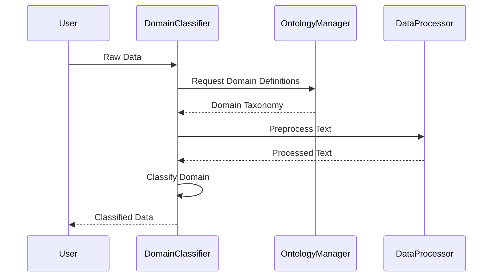
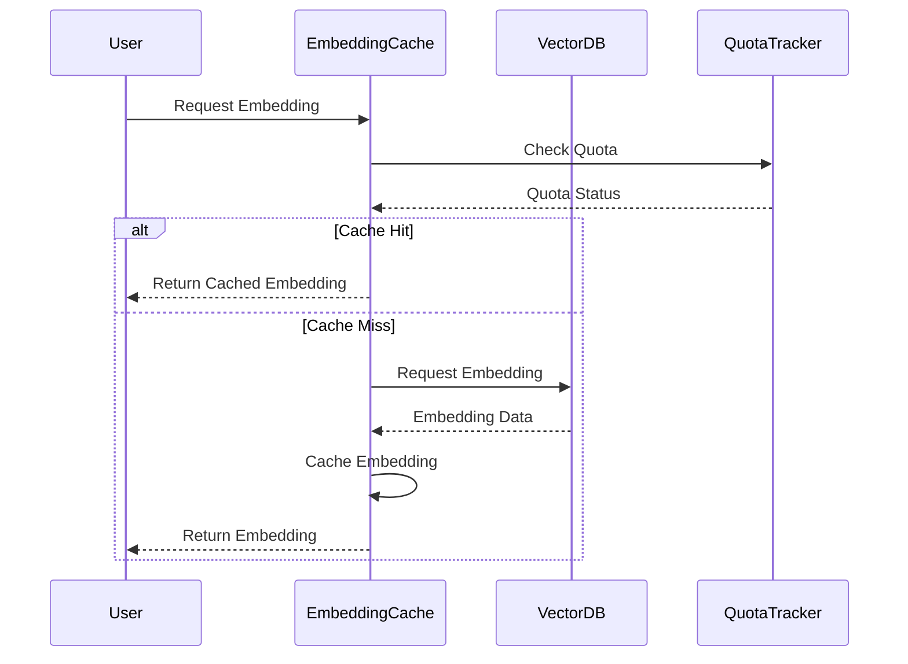
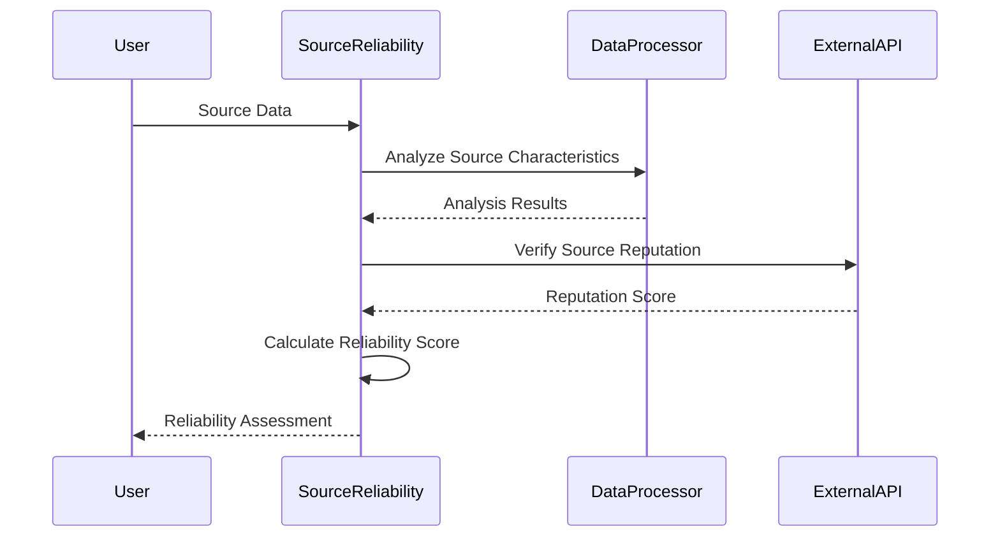
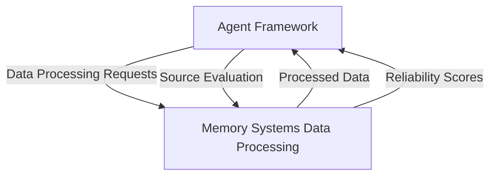
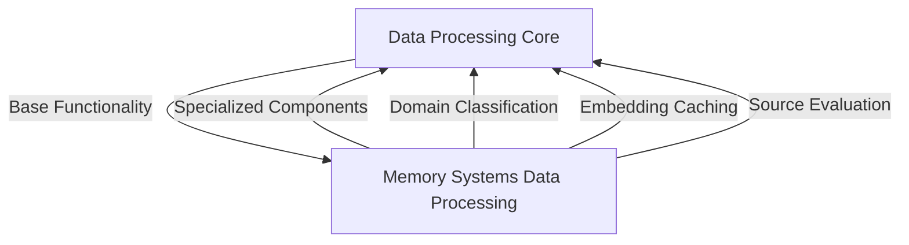
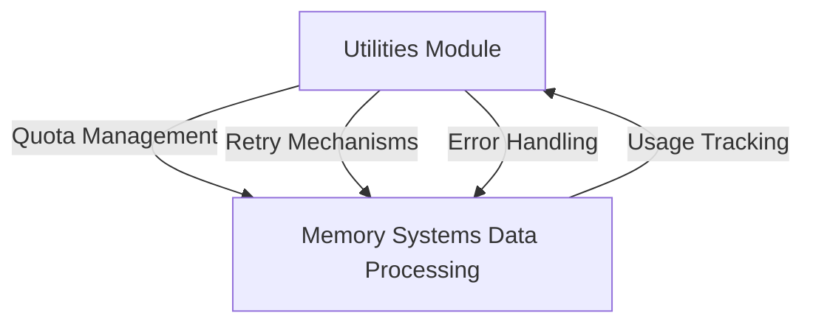
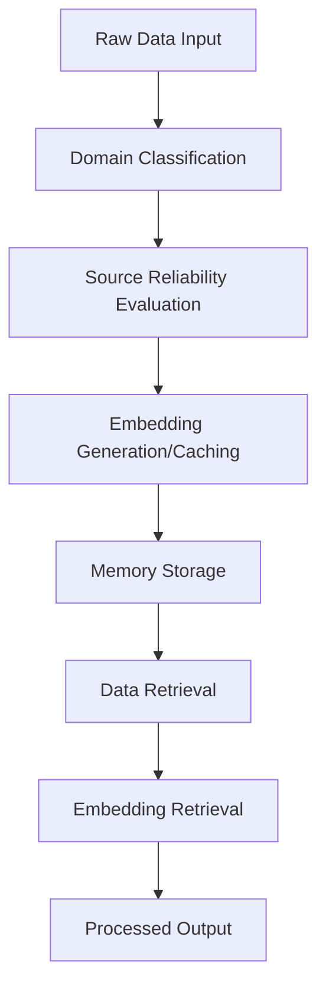

# Memory Systems Data Processing Module

## Overview

The `memory_systems_data_processing` module is a critical component of the larger memory systems architecture within the Kronos system. This module focuses on processing, classifying, and managing data to ensure efficient storage and retrieval in the memory systems. It works closely with the `agent_framework`, `data_processing`, and `utilities` modules to provide robust data handling capabilities.

## Purpose

The primary purpose of this module is to:
1. Classify incoming data into relevant domains
2. Cache embeddings for efficient processing
3. Evaluate source reliability for trustworthiness
4. Provide data preprocessing capabilities for the memory systems

## Architecture

The module follows a component-based architecture with three main components that interact with each other and external systems:

## Core Components

### 1. DomainClassifier

**File:** `agents/domain_classifier.py`

**Purpose:** Classifies incoming data into relevant domains for better organization and retrieval.

**Key Features:**
- Natural language processing for domain classification
- Integration with ontology management for domain definitions
- Support for custom domain taxonomies

**Dependencies:**
- `ontology_management` module for domain definitions
- `data_processing` utilities for text processing

**Interaction Diagram:**

### 2. EmbeddingCache

**File:** `agents/embedding_cache.py`

**Purpose:** Caches embeddings to improve performance and reduce redundant computations.

**Key Features:**
- In-memory caching of frequently used embeddings
- Persistent storage for long-term caching
- Cache invalidation strategies
- Integration with vector databases

**Dependencies:**
- `database_clients` for vector database access
- `utilities` for quota management

**Interaction Diagram:**

### 3. SourceReliability

**File:** `agents/source_reliability.py`

**Purpose:** Evaluates the reliability of data sources to ensure trustworthy information processing.

**Key Features:**
- Source reputation scoring
- Cross-referencing with known reliable sources
- Dynamic reliability adjustments based on recent performance
- Integration with fact-checking services

**Dependencies:**
- `data_processing` utilities for data analysis
- External APIs for source verification

**Interaction Diagram:**

## Integration with Other Modules

### Relationship with Agent Framework

The `memory_systems_data_processing` module works closely with the `agent_framework` module, particularly with agents that need to process and classify data:

Key interactions:
- The `AnalystAgent` uses the `DomainClassifier` to categorize analyzed data
- The `CuratorAgent` leverages the `EmbeddingCache` for efficient document processing
- The `WatcherAgent` utilizes the `SourceReliability` component to evaluate information sources

### Relationship with Data Processing Module

The `memory_systems_data_processing` module extends the capabilities of the core `data_processing` module by providing specialized components for memory systems:

### Relationship with Utilities Module

The module relies on several utility components for proper operation:

## Data Flow

The following diagram illustrates the typical data flow through the memory systems data processing module:

## Configuration

The module can be configured through the central configuration system. Key configuration parameters include:

- `domain_classifier_model`: The ML model to use for domain classification
- `embedding_cache_size`: Maximum size of the embedding cache
- `source_reliability_threshold`: Minimum reliability score for data acceptance
- `cache_ttl`: Time-to-live for cached embeddings

## Error Handling

The module implements comprehensive error handling through:

1. **Retry Mechanisms:** Automatic retries for transient failures (via `utilities.retry`)
2. **Quota Management:** Prevention of resource exhaustion (via `utilities.quota`)
3. **Fallback Strategies:** Graceful degradation when primary components fail
4. **Validation Checks:** Input validation for all components

## Performance Considerations

1. **Caching:** The `EmbeddingCache` component significantly improves performance by reducing redundant computations
2. **Parallel Processing:** Components are designed to work asynchronously where possible
3. **Memory Management:** Careful memory management in the caching layer
4. **Batch Processing:** Support for batch operations where applicable

## Security Considerations

1. **Source Verification:** All sources are evaluated for reliability before processing
2. **Data Validation:** Input data is validated before classification and caching
3. **Access Control:** Integration with the system's authentication mechanisms
4. **Audit Logging:** Comprehensive logging of all data processing operations

## API Reference

While this module doesn't expose a direct API, its components are used by other modules through internal interfaces. For API documentation, refer to:

- [api_layer.md](api_layer.md) - For general API structure
- [agent_framework.md](agent_framework.md) - For agent-specific interfaces

## Monitoring and Metrics

The module provides the following metrics for monitoring:

1. **Cache Hit/Miss Ratio:** Performance of the embedding cache
2. **Classification Accuracy:** Effectiveness of the domain classifier
3. **Source Reliability Scores:** Distribution of source evaluations
4. **Processing Latency:** Time taken for each processing stage

## Deployment Considerations

1. **Scalability:** Components can be scaled independently based on load
2. **Resource Requirements:** Embedding cache requires significant memory
3. **Dependencies:** Requires access to vector databases and external APIs
4. **Configuration:** Environment-specific configuration may be required

## Troubleshooting

### Common Issues

1. **Cache Misses:** Increase cache size or adjust TTL
2. **Classification Errors:** Retrain domain classifier model
3. **Source Evaluation Failures:** Check external API availability
4. **Performance Bottlenecks:** Monitor resource usage and scale as needed

### Debugging Tools

1. **Logging:** Comprehensive logging at DEBUG level
2. **Metrics:** Prometheus metrics endpoint for performance monitoring
3. **Tracing:** Distributed tracing for complex operations

## Future Enhancements

1. **Adaptive Caching:** Machine learning-based cache management
2. **Automated Model Retraining:** Continuous improvement of classifiers
3. **Advanced Source Analysis:** Integration with more external verification services
4. **Distributed Processing:** Support for distributed embedding generation

## References

- [agent_framework.md](agent_framework.md) - Core agent framework documentation
- [data_processing.md](data_processing.md) - Base data processing capabilities
- [ontology_management.md](ontology_management.md) - Domain and ontology management
- [utilities.md](utilities.md) - Utility functions and classes
- [database_clients.md](database_clients.md) - Database client documentation