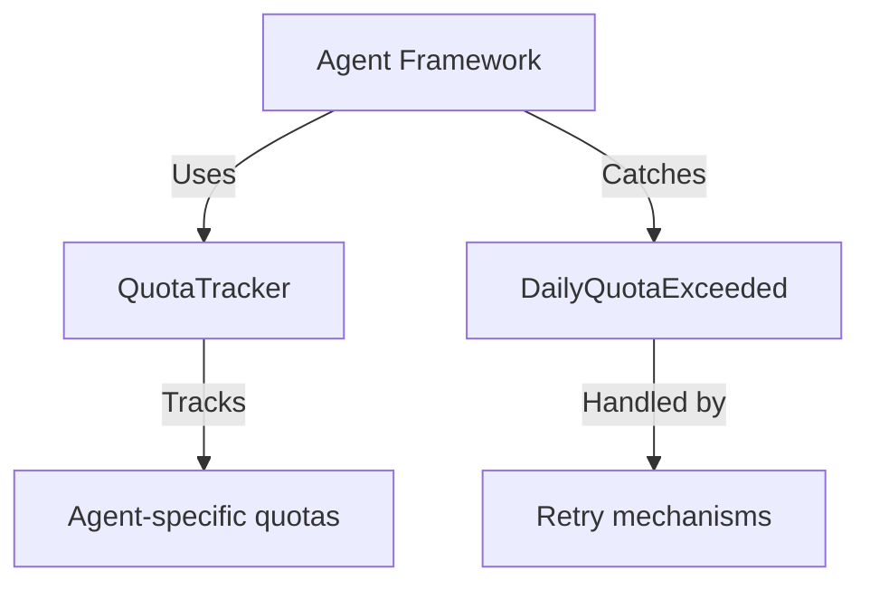
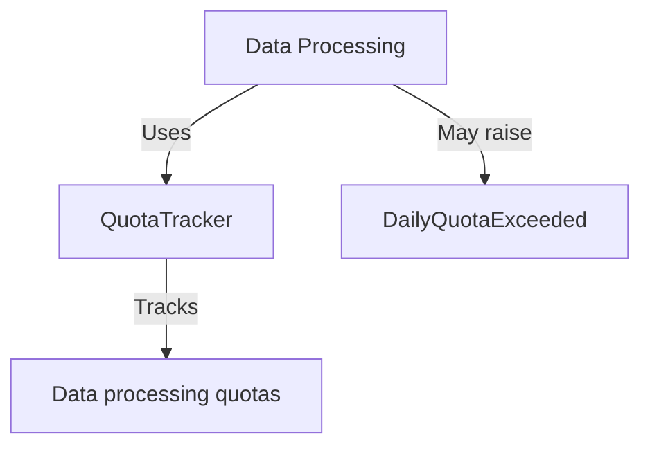
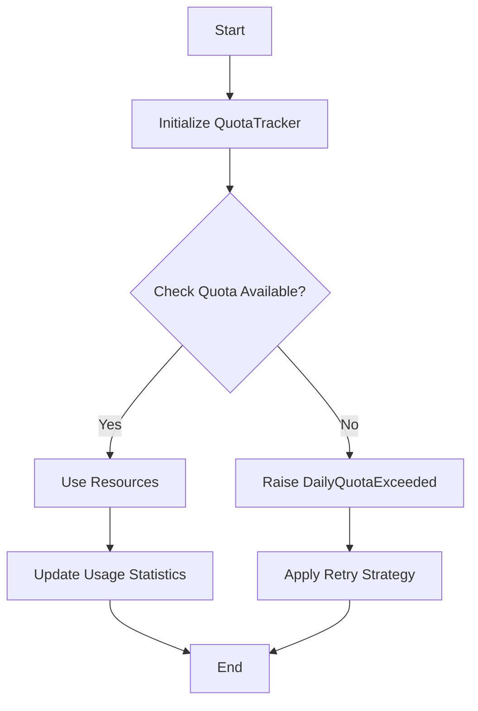
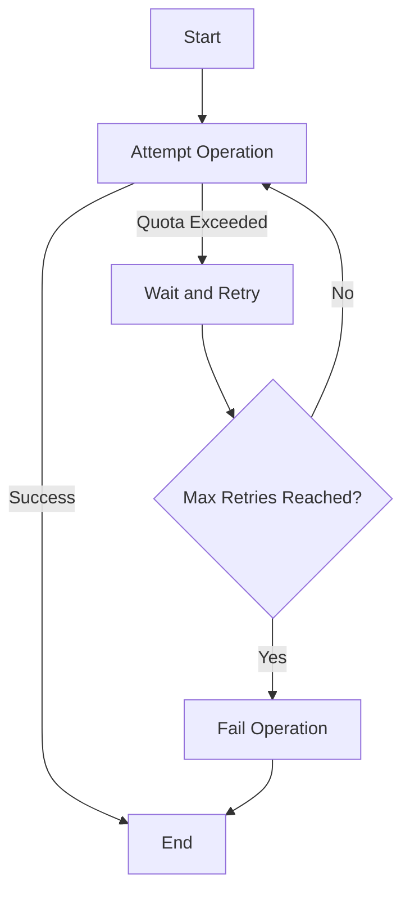

# Memory Systems Utilities Module Documentation

## Overview

The `memory_systems_utilities` module provides essential utility functions and classes for managing quotas and retry mechanisms within the memory systems framework. This module is a critical component of the broader memory systems architecture, supporting the agent framework and data processing modules with essential resource management capabilities.

## Purpose

The primary purpose of this module is to:
1. Implement quota tracking and management for system resources
2. Provide retry mechanisms with exponential backoff for handling rate limits
3. Support the memory systems framework with utility functions that ensure system stability and resource allocation fairness

## Architecture

The `memory_systems_utilities` module is structured as follows:

```
memory_systems_utilities/
├── utils/
│   ├── quota.py          # Quota tracking and management
│   └── retry.py          # Retry mechanisms with rate limit handling
```

## Core Components

### 1. QuotaTracker (`utils/quota.py`)

The `QuotaTracker` class provides functionality for tracking and managing system quotas. It ensures that agents and processes within the memory systems framework do not exceed their allocated resource limits.

#### Key Features:
- Daily quota tracking and enforcement
- Resource usage monitoring
- Quota reset mechanisms
- Integration with the agent framework for per-agent quota management

#### Dependencies:
- Relies on the configuration system for quota limits
- Interacts with the agent framework for agent-specific quota tracking

#### Usage Example:
```python
from utils.quota import QuotaTracker

# Initialize quota tracker
quota_tracker = QuotaTracker(daily_limit=1000)

# Check if quota is available
if quota_tracker.check_quota():
    # Proceed with resource-intensive operation
    quota_tracker.use_quota(1)
else:
    # Handle quota exceeded scenario
    raise Exception("Daily quota exceeded")
```

### 2. DailyQuotaExceeded (`utils/retry.py`)

The `DailyQuotaExceeded` exception is raised when a process attempts to exceed its daily quota. This exception is used in conjunction with retry mechanisms to handle rate-limited operations gracefully.

#### Key Features:
- Custom exception for quota violations
- Integration with retry mechanisms
- Clear error messaging for debugging

#### Dependencies:
- Used by retry mechanisms in the utilities module
- Caught by retry logic in agent framework components

#### Usage Example:
```python
from utils.retry import DailyQuotaExceeded

try:
    # Attempt operation that may exceed quota
    perform_quota_heavy_operation()
except DailyQuotaExceeded:
    # Handle quota exceeded scenario with retry logic
    apply_retry_strategy()
```

## Integration with Other Modules

### Agent Framework Integration

The memory systems utilities module integrates closely with the agent framework:



- **QuotaTracker** is used by agents to manage their resource consumption
- **DailyQuotaExceeded** exceptions are caught by retry mechanisms in the agent framework
- Quota limits are configured through the central configuration system

### Data Processing Integration

The utilities module also supports the data processing components:



- Data processing agents use the QuotaTracker to manage their resource usage
- Batch processing operations may trigger DailyQuotaExceeded exceptions

## Data Flow

The following diagram illustrates the data flow within the memory systems utilities module:

```mermaid
dataflow TD
    A[Configuration] -->|Sets quotas| B[QuotaTracker]
    B -->|Tracks usage| C[Agent Operations]
    C -->|May exceed| D[Quota Limits]
    D -->|Raises| E[DailyQuotaExceeded]
    E -->|Handled by| F[Retry Mechanisms]
    F -->|May retry| C
```

## Process Flows

### Quota Management Process



### Retry Mechanism Process



## Configuration

The memory systems utilities module is configured through the central configuration system. Key configuration parameters include:

- `daily_quota_limit`: Maximum allowed operations per day
- `quota_reset_time`: Time of day when quotas reset
- `retry_delay`: Base delay for retry operations
- `max_retries`: Maximum number of retry attempts

See [configuration.md](configuration.md) for detailed configuration options.

## Error Handling

The module implements the following error handling strategies:

1. **Quota Exceeded**: Raises `DailyQuotaExceeded` exception
2. **Retry Logic**: Implements exponential backoff for retry operations
3. **Graceful Degradation**: Allows system to continue operating within quota limits

## Performance Considerations

- Quota tracking is implemented with O(1) complexity for check and update operations
- Retry mechanisms include jitter to prevent thundering herd problems
- Memory usage is optimized for high-frequency quota checks

## Testing

The module includes comprehensive test coverage:

- Unit tests for QuotaTracker functionality
- Integration tests with agent framework components
- Stress tests for high-frequency quota operations
- Retry mechanism validation tests

## Dependencies

The memory systems utilities module depends on:

1. **Configuration System**: For quota limits and reset times
   - See [configuration.md](configuration.md)

2. **Agent Framework**: For agent-specific quota tracking
   - See [agent_framework.md](agent_framework.md)

3. **Logging System**: For audit trails and debugging
   - See [utilities.md](utilities.md)

## API Reference

### QuotaTracker Class

```python
class QuotaTracker:
    def __init__(self, daily_limit: int, reset_time: str = "00:00")
    
    def check_quota(self) -> bool:
        """Check if quota is available"""
        
    def use_quota(self, amount: int = 1) -> bool:
        """Use quota amount"""
        
    def get_remaining_quota(self) -> int:
        """Get remaining quota"""
        
    def reset_quota(self) -> None:
        """Reset quota to daily limit"""
```

### DailyQuotaExceeded Exception

```python
class DailyQuotaExceeded(Exception):
    """Exception raised when daily quota is exceeded"""
    
    def __init__(self, message: str = "Daily quota exceeded"):
        self.message = message
        super().__init__(self.message)
```

## Best Practices

1. Always check quota availability before performing resource-intensive operations
2. Implement proper error handling for DailyQuotaExceeded exceptions
3. Use the retry mechanisms for operations that may hit rate limits
4. Monitor quota usage to prevent unexpected interruptions
5. Configure appropriate quota limits based on system capacity

## Troubleshooting

### Common Issues

1. **Quota Exceeded Errors**: 
   - Check configuration for appropriate quota limits
   - Verify quota reset time is correctly configured
   - Review agent operations for excessive resource usage

2. **Retry Failures**:
   - Check retry configuration (delay, max retries)
   - Verify operation can succeed within quota limits
   - Review error handling in retry logic

3. **Performance Issues**:
   - Monitor quota check performance
   - Review memory usage for high-frequency operations
   - Consider batching operations to reduce quota usage

## Future Enhancements

1. Dynamic quota adjustment based on system load
2. Per-user quota tracking
3. Quota borrowing/overdraft mechanisms
4. Advanced reporting and monitoring
5. Integration with billing systems for resource accounting

## References

- [Agent Framework Documentation](agent_framework.md)
- [Data Processing Documentation](data_processing.md)
- [Configuration Documentation](configuration.md)
- [Utilities Documentation](utilities.md)
- [Memory Systems Documentation](memory_systems.md)