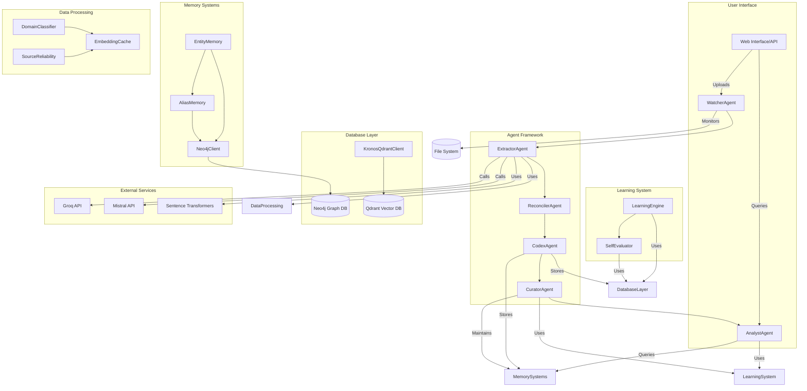
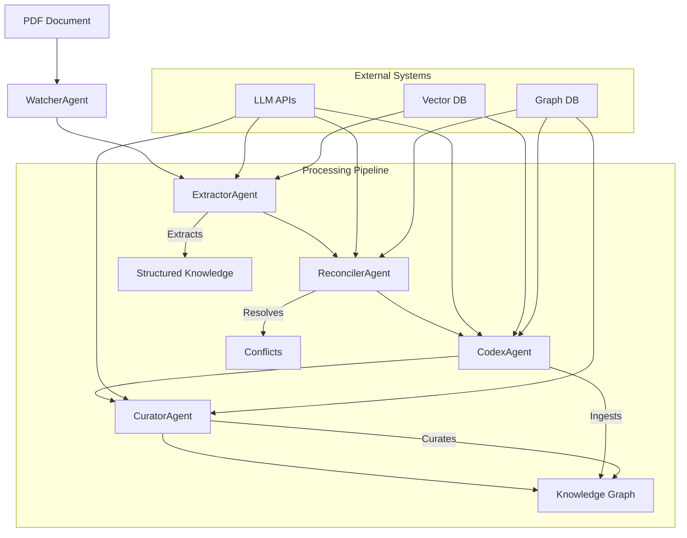
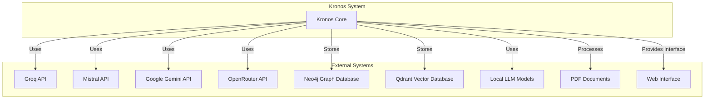

```markdown
# Kronos Repository Overview

## Purpose

The **Kronos** repository is a comprehensive knowledge management system designed to extract, reconcile, analyze, and maintain structured knowledge from unstructured documents. It serves as a sophisticated AI-powered knowledge infrastructure that processes PDF documents, resolves entity relationships, answers complex queries, and maintains a persistent knowledge graph.

Kronos is built around a modular architecture with specialized agents working together to handle the entire knowledge lifecycle:

- **Document Processing**: Extracting entities, relationships, and claims from PDF documents
- **Conflict Resolution**: Reconciling information from multiple sources
- **Knowledge Synthesis**: Answering complex queries using multiple knowledge sources
- **Knowledge Ingestion**: Maintaining a persistent knowledge graph
- **Knowledge Curation**: Ensuring the health and quality of the knowledge base
- **Document Monitoring**: Automatically processing new documents as they arrive

## End-to-End Architecture

The Kronos system follows a layered architecture with clear separation of concerns and well-defined interfaces between components. The architecture is designed for scalability, reliability, and maintainability.



### Data Flow Architecture



## Core Modules Documentation

The Kronos repository is organized into several core modules, each with specialized responsibilities:

### 1. Memory Systems Module
**Path**: `agents/`
**Purpose**: Manages persistent memory structures for entity recognition, alias resolution, and contextual understanding
**Key Components**:
- `EntityMemory`: Maintains persistent store of entity information
- `AliasMemory`: Manages continuously learned alias table
- Agent Framework Integration: Coordinates with various agents
- Data Processing: Domain classification, embedding caching
- Utilities: Quota tracking and retry mechanisms

**Documentation**: [Memory Systems Module Documentation](memory_systems.md)

### 2. Agent Framework Module
**Path**: `agents/`
**Purpose**: Core intelligence layer providing knowledge processing, analysis, and synthesis through specialized AI agents
**Key Components**:
- `ExtractorAgent`: Processes PDF documents to extract structured knowledge
- `ReconcilerAgent`: Resolves conflicts between different sources of information
- `AnalystAgent`: Synthesizes information to answer complex queries
- `CodexAgent`: Ingests extracted knowledge into the knowledge graph
- `CuratorAgent`: Maintains the health and quality of the knowledge base
- `WatcherAgent`: Monitors directory for new PDF files and orchestrates processing

**Documentation**: [Agent Framework Module Documentation](agent_framework.md)

### 3. Ontology Management Module
**Path**: `agents/`
**Purpose**: Handles ontology evolution and resolution for the knowledge graph
**Key Components**:
- `OntologyEvolution`: Manages ontology evolution by tracking proposals
- `OntologyResolver`: Resolves ontology terms and relationships

**Documentation**: [Ontology Management Documentation](ontology_management.md)

### 4. Data Processing Module
**Path**: `agents/`
**Purpose**: Provides classification, caching, and reliability assessment capabilities
**Key Components**:
- `DomainClassifier`: Document categorization by domain
- `EmbeddingCache`: Performance optimization for vector operations
- `SourceReliability`: Source credibility tracking and scoring

**Documentation**: [Data Processing Module Documentation](data_processing.md)

### 5. Learning System Module
**Path**: `agents/`
**Purpose**: Implements learning engine and self-evaluation capabilities
**Key Components**:
- `LearningEngine`: Pattern recognition in entity co-occurrence
- `SelfEvaluator`: Quality assessment and system performance monitoring

**Documentation**: [Learning System Module Documentation](learning_system.md)

### 6. API Layer Module
**Path**: `api/`
**Purpose**: Provides RESTful endpoints for interacting with the knowledge infrastructure
**Key Components**:
- `QueryRequest`: Request model for knowledge queries
- `ApprovalRequest`: Request model for ontology approvals
- Endpoints for querying, ontology management, conflict detection, and self-evaluation

**Documentation**: [API Layer Documentation](api_layer.md)

### 7. Configuration Module
**Path**: `core/`
**Purpose**: Central hub for managing application settings, API keys, and system parameters
**Key Components**:
- `Config`: Singleton class providing centralized configuration

**Documentation**: [Configuration Module Documentation](configuration.md)

### 8. Database Clients Module
**Path**: `db/`
**Purpose**: Provides database connectivity for graph and vector databases
**Key Components**:
- `Neo4jClient`: Graph database client for entities and relationships
- `KronosQdrantClient`: Vector database client for semantic search

**Documentation**: [Database Clients Module Documentation](database_clients.md)

### 9. Utilities Module
**Path**: `utils/`
**Purpose**: Provides general utility functions and classes
**Key Components**:
- `QuotaTracker`: API usage management and rate limiting
- `DailyQuotaExceeded`: Exception handling for quota limits

**Documentation**: [Utilities Module Documentation](utilities.md)

## Key Features

### 1. Multi-Backend AI Processing
- Supports multiple AI backends (Groq, Mistral, local models)
- Smart routing based on document characteristics and API availability
- Fallback mechanisms for robust operation

### 2. Comprehensive Error Handling
- Robust error handling with retry logic
- Fallback mechanisms for API failures
- Quarantine system for problematic documents

### 3. Source Credibility Tracking
- Tracks credibility of different sources based on reconciliation outcomes
- Enables better decision making during conflict resolution

### 4. Cross-Domain Knowledge Integration
- Handles entities spanning multiple domains (technology, science, business, etc.)
- Appropriate validation and resolution strategies for each domain

### 5. Knowledge Graph Maintenance
- Maintains both graph and vector representations of knowledge
- Enables efficient querying and analysis
- Supports semantic search capabilities

### 6. API Quota Management
- Comprehensive quota tracking prevents API exhaustion
- Ensures fair usage across all agents
- Graceful degradation when quotas are exhausted

### 7. Self-Evaluation and Quality Assurance
- Provides quality metrics and recommendations for system improvement
- Enables continuous improvement of knowledge extraction quality

## Integration Points

The Kronos system integrates with several external systems and services:



## Performance Considerations

### Processing Efficiency
- Batch processing of text chunks reduces API calls
- Embedding caching minimizes redundant computations
- Vector operations are optimized for performance
- Memory management prevents resource exhaustion

### Scalability
- Modular architecture allows horizontal scaling
- Parallel processing capabilities for document ingestion
- Efficient database operations through batching

### Reliability
- Comprehensive error handling and recovery
- Retry logic with exponential backoff
- Quota management prevents service interruptions
- Validation at each processing stage

## Usage Examples

### Document Ingestion Pipeline
```python
from agents.watcher import WatcherAgent

# Start the document monitoring system
watcher = WatcherAgent()
watcher.start()  # Monitors inbox directory and processes new PDFs
```

### Direct Agent Usage
```python
from agents.extractor import ExtractorAgent
from agents.analyst import AnalystAgent

# Extract knowledge from a document
extractor = ExtractorAgent()
extracted = extractor.extract_knowledge("document.pdf")

# Analyze information from the knowledge base
analyst = AnalystAgent()
result = analyst.query("What are the main causes of climate change?")
```

### Knowledge Synthesis
```python
from agents.analyst import AnalystAgent

agent = AnalystAgent()
result = agent.query("What is the recommended daily water intake?")

print(f"Answer: {result['answer']}")
print(f"Sources: {result['sources']}")
print(f"Confidence: {result['confidence']}")
if result['conflicts']:
    print("Warning: Conflicting information found")
```

## Configuration

The Kronos system is configured through the central `Config` class with parameters for:

- AI backend selection and model configuration
- API keys and authentication
- Processing parameters (chunk sizes, batch sizes)
- Quota limits and rate limiting
- Database connection settings
- File system paths

## Error Handling and Recovery

The framework implements comprehensive error handling:

1. **API Failures**: Retry logic with exponential backoff
2. **Data Validation**: Quality gates at each processing stage
3. **Quota Management**: Graceful degradation when quotas are exhausted
4. **File Processing**: Quarantine system for problematic documents
5. **Database Operations**: Transaction management and error recovery

## Future Enhancements

1. **Enhanced Cross-Domain Integration**: Better handling of entities spanning multiple domains
2. **Advanced Conflict Resolution**: Machine learning-based conflict detection and resolution
3. **Performance Optimization**: Further optimization of embedding and vector operations
4. **User Feedback Integration**: Incorporate user feedback to improve extraction quality
5. **Multi-Modal Support**: Support for images, diagrams, and other non-text content
6. **Automated Curation**: More sophisticated automated curation capabilities

## Related Documentation

For detailed documentation of each module, see the following files:

- **[Memory Systems](memory_systems.md)** - Entity and alias memory management
- **[Agent Framework](agent_framework.md)** - Core intelligence layer with specialized agents
- **[Ontology Management](ontology_management.md)** - Ontology evolution and resolution
- **[Data Processing](data_processing.md)** - Classification and processing utilities
- **[Learning System](learning_system.md)** - Learning engine and self-evaluation
- **[API Layer](api_layer.md)** - RESTful endpoints for system interaction
- **[Configuration](configuration.md)** - Centralized configuration management
- **[Database Clients](database_clients.md)** - Graph and vector database interfaces
- **[Utilities](utilities.md)** - General utility functions and classes
```