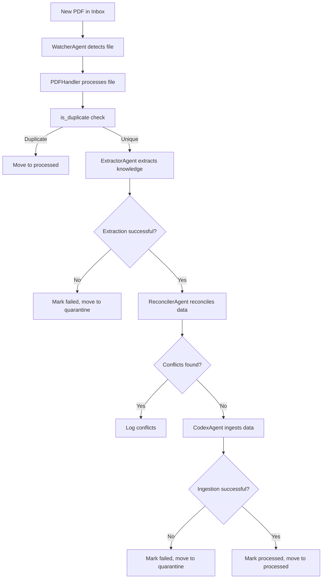

# Watcher Module Documentation

## Overview

The **Watcher Module** is a critical component of the `memory_systems` subsystem, designed to monitor a designated inbox directory for new PDF files, process them through a multi-stage pipeline, and ensure their structured ingestion into the knowledge base. It acts as the primary interface for document ingestion, leveraging agents from the `agent_framework` and utilities from the `utilities` module to handle extraction, reconciliation, and ingestion tasks.

This module is part of the broader **memory_systems** architecture, which manages the lifecycle of knowledge within the system, including storage, processing, and retrieval. The Watcher Module specifically focuses on the **ingestion pipeline**, ensuring that new documents are validated, processed, and integrated without duplication or corruption.

---

## Purpose and Core Functionality

### Primary Responsibilities

1. **File Monitoring**:
   - Actively watches a specified directory (`INBOX_PATH`) for new PDF files using the `watchdog` library.
   - Triggers processing when a new file is detected.

2. **Deduplication and Validation**:
   - Checks for duplicate files using the `is_duplicate` utility to avoid reprocessing.
   - Validates the extracted content to ensure it contains meaningful data (e.g., non-zero page or chunk count).

3. **Multi-Stage Processing Pipeline**:
   - **Extraction**: Uses the `ExtractorAgent` to parse PDFs and extract structured knowledge.
   - **Reconciliation**: Uses the `ReconcilerAgent` to resolve conflicts or inconsistencies in the extracted data.
   - **Ingestion**: Uses the `CodexAgent` to ingest the processed data into the knowledge base.

4. **Error Handling and Quarantine**:
   - Implements retry logic for transient failures using `call_with_retry`.
   - Moves corrupted or problematic files to a quarantine directory for further analysis.

5. **Backlog Processing**:
   - Processes any existing PDFs in the inbox directory when the module starts.

6. **Lifecycle Management**:
   - Gracefully handles interruptions (e.g., `KeyboardInterrupt`) and ensures resources are properly released.

---

## Architecture and Component Relationships

### High-Level Architecture

The Watcher Module is composed of two main classes:

1. **`WatcherAgent`**:
   - The orchestrator that initializes the file monitoring system and manages the processing pipeline.
   - Uses the `Observer` from the `watchdog` library to monitor the inbox directory.
   - Coordinates the processing of new files and backlog items.

2. **`PDFHandler`**:
   - A `FileSystemEventHandler` subclass that handles file system events (e.g., new file creation).
   - Implements the core logic for processing PDFs, including extraction, reconciliation, and ingestion.
   - Manages state (e.g., tracking currently processing files) and interacts with other agents.

### Component Dependencies

The Watcher Module relies on the following components:

| **Component**               | **Purpose**                                                                                     | **Module**               |
|-----------------------------|-------------------------------------------------------------------------------------------------|--------------------------|
| `ExtractorAgent`            | Extracts structured knowledge from PDFs.                                                       | `agent_framework`        |
| `ReconcilerAgent`           | Resolves conflicts in extracted data.                                                          | `agent_framework`        |
| `CodexAgent`                | Ingests processed data into the knowledge base.                                                | `agent_framework`        |
| `is_duplicate`              | Checks for duplicate files to avoid reprocessing.                                              | `utilities`              |
| `mark_processed`            | Marks files as successfully processed.                                                         | `utilities`              |
| `mark_failed`               | Marks files as failed and logs the failure stage.                                              | `utilities`              |
| `call_with_retry`           | Implements retry logic for transient failures.                                                 | `utilities`              |
| `config`                    | Provides configuration settings (e.g., paths for inbox, processed files, and quarantine).      | `configuration`          |

### Data Flow



---

## Module Integration

### Integration with Other Modules

1. **`agent_framework`**:
   - The Watcher Module directly depends on the `ExtractorAgent`, `ReconcilerAgent`, and `CodexAgent` for processing PDFs. These agents are part of the `agent_framework` module, which provides the core logic for knowledge extraction, reconciliation, and ingestion.
   - For more details, see the [agent_framework module documentation](agent_framework.md).

2. **`utilities`**:
   - The Watcher Module uses utilities like `is_duplicate`, `mark_processed`, `mark_failed`, and `call_with_retry` to handle deduplication, state management, and error recovery.
   - For more details, see the [utilities module documentation](utilities.md).

3. **`configuration`**:
   - The module relies on the `config` object for paths and settings, which is provided by the `configuration` module.
   - For more details, see the [configuration module documentation](configuration.md).

### Dependencies on External Systems

- **File System**: The Watcher Module monitors and processes files from the local file system.
- **Knowledge Base**: The `CodexAgent` ingests data into the knowledge base, which is managed by the `memory_systems` subsystem.

---

## Detailed Component Documentation

### `WatcherAgent`

#### Purpose
The `WatcherAgent` is the main orchestrator of the Watcher Module. It initializes the file monitoring system, processes backlog items, and manages the lifecycle of the module.

#### Key Methods

| **Method**       | **Description**                                                                                     |
|------------------|-----------------------------------------------------------------------------------------------------|
| `__init__`       | Initializes the `WatcherAgent`, setting up the inbox path, `PDFHandler`, and `Observer`.           |
| `start`          | Starts the file monitoring system, processes any backlog items, and enters the main loop.           |
| `stop`           | Stops the file monitoring system and releases resources.                                           |

#### Example Usage
```python
watcher = WatcherAgent()
watcher.start()  # Starts monitoring the inbox directory
```

---

### `PDFHandler`

#### Purpose
The `PDFHandler` is responsible for processing PDF files detected by the `WatcherAgent`. It implements the core logic for extraction, reconciliation, and ingestion, as well as error handling and state management.

#### Key Methods

| **Method**            | **Description**                                                                                     |
|-----------------------|-----------------------------------------------------------------------------------------------------|
| `__init__`            | Initializes the `PDFHandler`, setting up the agents for extraction, reconciliation, and ingestion. |
| `on_created`          | Handles file system events (e.g., new file creation) and triggers processing.                       |
| `_process`            | Processes a single PDF file through the extraction, reconciliation, and ingestion pipeline.         |
| `process_backlog`     | Processes any existing PDFs in the inbox directory when the module starts.                          |
| `close`               | Releases resources (e.g., closes agents).                                                          |

#### Example Usage
```python
handler = PDFHandler()
handler._process("path/to/file.pdf")  # Processes a single PDF file
handler.process_backlog("path/to/inbox")  # Processes all PDFs in the inbox
```

---

## Configuration

The Watcher Module relies on the following configuration settings, which are provided by the `configuration` module:

| **Setting**            | **Description**                                                                                     | **Default Value**       |
|------------------------|-----------------------------------------------------------------------------------------------------|-------------------------|
| `INBOX_PATH`           | Path to the directory where new PDFs are monitored.                                                 | `data/inbox`            |
| `PROCESSED_PATH`       | Path to the directory where successfully processed files are moved.                                 | `data/processed`        |
| `QUARANTINE_PATH`      | Path to the directory where failed files are moved for further analysis.                           | `data/quarantine`       |

For more details, see the [configuration module documentation](configuration.md).

---

## Error Handling and Recovery

The Watcher Module implements robust error handling to ensure reliability:

1. **Retry Logic**:
   - Uses `call_with_retry` to handle transient failures during extraction, reconciliation, and ingestion.
   - Retries up to 3 times with an exponential backoff strategy.

2. **Quality Gates**:
   - Validates extracted content to ensure it contains meaningful data (e.g., non-zero page or chunk count).
   - Rejects empty extractions and moves them to quarantine.

3. **Quarantine**:
   - Moves corrupted or problematic files to a quarantine directory for further analysis.

4. **State Management**:
   - Tracks currently processing files to avoid duplicate processing.
   - Marks files as processed or failed to maintain state.

---

## Performance Considerations

1. **File Monitoring**:
   - The `watchdog` library is used for efficient file monitoring, minimizing resource usage.

2. **Concurrency**:
   - The module processes files sequentially to avoid conflicts, but the design allows for future parallelization if needed.

3. **Resource Management**:
   - Agents are properly closed when the module stops to release resources.

---

## Future Enhancements

1. **Parallel Processing**:
   - Extend the module to process multiple files in parallel, improving throughput.

2. **Dynamic Configuration**:
   - Allow dynamic adjustment of retry logic and quality gates based on system load or file characteristics.

3. **Integration with Workflow Engines**:
   - Integrate with a workflow engine (e.g., Apache Airflow) to manage complex processing pipelines.

---

## References

- [agent_framework Module Documentation](agent_framework.md)
- [utilities Module Documentation](utilities.md)
- [configuration Module Documentation](configuration.md)
- [memory_systems Subsystem Documentation](memory_systems.md)

---

## Appendix: Code Snippets

### Example: Starting the Watcher Module
```python
from agents.watcher import WatcherAgent

if __name__ == "__main__":
    watcher = WatcherAgent()
    watcher.start()
```

### Example: Processing a Single File
```python
from agents.watcher import PDFHandler

handler = PDFHandler()
handler._process("path/to/file.pdf")
```

---

## Conclusion

The Watcher Module is a critical component of the `memory_systems` subsystem, providing a robust and reliable mechanism for ingesting PDF documents into the knowledge base. By leveraging agents from the `agent_framework` and utilities from the `utilities` module, it ensures that documents are processed efficiently, with minimal duplication and maximal data integrity. Its integration with the broader system architecture makes it a key enabler of knowledge management within the platform.